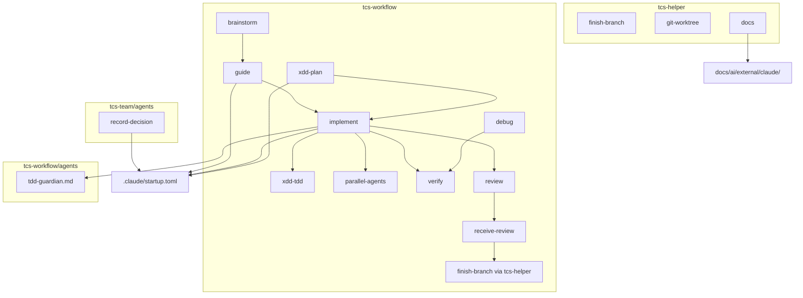
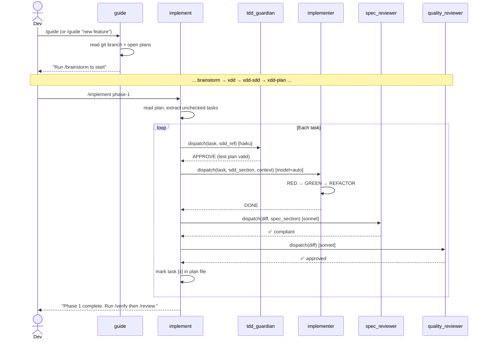
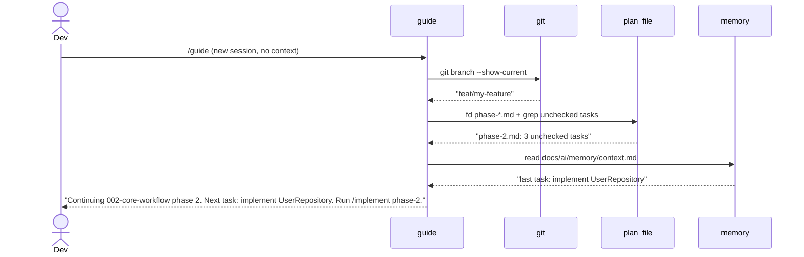

# Solution Design Document

## Validation Checklist

### CRITICAL GATES (Must Pass)

- [x] All required sections are complete
- [x] No [NEEDS CLARIFICATION] markers remain
- [x] Architecture pattern is clearly stated with rationale
- [x] **All architecture decisions confirmed by user**
- [x] Every interface has specification

### QUALITY CHECKS (Should Pass)

- [x] All context sources are listed with relevance ratings
- [x] Constraints → Strategy → Design → Implementation path is logical
- [x] Every component in diagram has directory mapping
- [x] Error handling covers all error types
- [x] Component names consistent across diagrams
- [x] A developer could implement from this design

---

## Constraints

CON-1 **Plain markdown only.** Skills and agents are SKILL.md / agent.md files. No compiled code, no runtime deps beyond Claude Code built-ins. bash 3.2 compatible (no `declare -A`).

CON-2 **Skill size limit.** Each SKILL.md ≤ 25 KB. Overflow goes into `reference/` subdirs loaded on demand.

CON-3 **Modern CLI tools.** `rg`, `fd`, `fzf` required. Skills that search must use these, not grep/find. Skills must fail gracefully with install hint if tools are absent.

CON-4 **skill-author and agent-creator mandatory.** Every new/modified skill must be authored via `/tcs-helper:skill-author`. Every new/modified agent must be authored via `/plugin-dev:agent-creator`. No hand-crafting outside these workflows.

CON-5 **YOLO mode — M2 pattern.** `YOLO=true` env var detection follows the exact same approach established in M2 (`tcs-helper:memory-add`): check `[ "${YOLO:-false}" = "true" ]`; in YOLO mode write side-effect output to `docs/ai/memory/yolo-review.md` as checkbox items for deferred user review (not to `context.md`). Do not block or prompt — log and proceed.

CON-6 **Python venv.** Any Python scripts use a virtualenv — never `--break-system-packages`.

CON-7 **Plugin coexistence.** superpowers, tcs-helper, legacy tcs-start may coexist. tcs-workflow skill names must not conflict.

CON-8 **No implementation in SDD.** This document specifies contracts and design only.

---

## Implementation Context

### Required Context Sources

```yaml
# Plugin architecture
- file: plugins/tcs-start/.claude-plugin/plugin.json
  relevance: HIGH
  why: "Source manifest — will be renamed and updated"

- file: plugins/tcs-helper/.claude-plugin/plugin.json
  relevance: HIGH
  why: "Receiving 3 new skills"

- file: plugins/tcs-team/.claude-plugin/plugin.json
  relevance: MEDIUM
  why: "Receiving 1 new agent"

# Existing skill conventions
- file: plugins/tcs-start/skills/brainstorm/SKILL.md
  relevance: HIGH
  why: "Reference skill structure: PICS format, frontmatter, $ARGUMENTS pattern"

- file: plugins/tcs-start/skills/implement/SKILL.md
  relevance: HIGH
  why: "Will be significantly enhanced — must understand current flow before modifying"

- file: plugins/tcs-start/skills/xdd-meta/SKILL.md
  relevance: HIGH
  why: "Handles spec directory resolution; must update for docs/XDD/ and startup.toml"

# Memory system (M2 output)
- file: plugins/tcs-helper/skills/memory-add/SKILL.md
  relevance: MEDIUM
  why: "docs/ai/memory/ conventions established in M2 — docs cache follows same pattern"

# Spec structure
- file: .start/specs/002-core-workflow/requirements.md
  relevance: CRITICAL
  why: "PRD — all design must trace to its requirements"
```

### Implementation Boundaries

- **Must Preserve:** All existing tcs-start skills (brainstorm, xdd, implement, etc.) — enhanced or renamed, not replaced. M2 memory system unchanged. tcs-team agent structure unchanged except new addition.
- **Can Modify:** plugin.json for all three plugins. xdd-meta path resolution logic. implement flow. brainstorm conclusion step.
- **Must Not Touch:** M2 hooks and scripts in `plugins/tcs-helper/scripts/`. Memory file structure at `docs/ai/memory/`.

### Project Commands

```bash
# Plugin testing (after rename)
Install: ./install.sh
Uninstall: ./uninstall.sh

# Python tests (tcs-helper scripts)
Test: source venv/bin/activate && python3 -m pytest tests/tcs-helper/ -q

# Skill authoring
New skill: /tcs-helper:skill-author
```

---

## Solution Strategy

**Architecture Pattern:** Modular plugin + skill file system. Each skill is a self-contained markdown file (`SKILL.md`) with PICS frontmatter. Agents are markdown files with system-prompt-style instructions. Plugins are directories with `plugin.json` manifests.

**Integration Approach:**
- tcs-start → tcs-workflow: in-place rename (`git mv` directory, update plugin.json `name` field)
- All new skills authored via `skill-author` workflow, placed in correct plugin directory
- Config file `.claude/startup.toml` introduced; `xdd-meta` updated to read it
- `docs/XDD/` directory structure created; `.start/specs/` content migrated once

**Key Design Principle:** Skills orchestrate; agents execute. The implement skill acts as coordinator — it reads the plan, selects models, and dispatches agents. Agents (tdd-guardian, reviewer subagents) are stateless per-invocation.

**Justification:** This matches the existing TCS architecture exactly. No new infrastructure, no new file formats, no new runtimes. Every change is a markdown edit or a file rename.

---

## Building Block View

### Component Diagram



### Directory Map

#### tcs-workflow (renamed from tcs-start)

```
plugins/tcs-workflow/                           RENAME from tcs-start/
  .claude-plugin/
    plugin.json                                 MODIFY: name, agents key
  agents/                                       NEW directory
    tdd-guardian.md                             NEW
  output-styles/                                no change
  skills/
    analyze/SKILL.md                            MODIFY: CoD default-on
    brainstorm/SKILL.md                         MODIFY: spec-review loop at conclusion
    constitution/                               no change
    debug/SKILL.md                              MODIFY: iron-law anti-shortcut section
    document/                                   no change
    guide/                                      NEW
      SKILL.md
    implement/SKILL.md                          MODIFY: fresh-subagent + tdd-guardian dispatch
    parallel-agents/                            NEW
      SKILL.md
      reference/conflict-detection.md
    receive-review/                             NEW
      SKILL.md
    refactor/                                   no change
    review/SKILL.md                             MODIFY: BASE_SHA/HEAD_SHA dispatch
    test/                                       no change
    validate/                                   no change
    verify/                                     NEW
      SKILL.md
    writing-skills/                             REMOVED (was never implemented; skill-author reference is in tcs-helper)
    xdd/                                        RENAME from specify/
      SKILL.md                                  MODIFY: orchestrates xdd-prd → xdd-sdd → xdd-plan
    xdd-meta/                                   RENAME from xdd-meta/
      SKILL.md                                  MODIFY: startup.toml resolution, docs/XDD/ default
    xdd-prd/                                    RENAME from specify-requirements/
      SKILL.md                                  MODIFY: docs/XDD/specs/ paths
    xdd-sdd/                                    RENAME from specify-solution/
      SKILL.md                                  MODIFY: docs/XDD/specs/ paths
    xdd-plan/                                   RENAME from specify-plan/
      SKILL.md                                  MODIFY: RED/GREEN/REFACTOR task structure
    xdd-tdd/                                    RENAME from (new tdd/)
      SKILL.md
      reference/iron-law.md
```

#### tcs-helper (additions)

```
plugins/tcs-helper/
  skills/
    docs/                                       NEW
      SKILL.md
    finish-branch/                              NEW
      SKILL.md
    git-worktree/                               NEW
      SKILL.md
    [existing M2 skills unchanged]
```

#### tcs-team (addition)

```
plugins/tcs-team/
  agents/
    the-architect/
      record-decision.md                        NEW
    [existing agents unchanged]
```

#### Config and artifact directories

```
.claude/
  startup.toml                                  NEW

docs/XDD/                                       NEW — default docs_base
  specs/                                        NEW (migrate from .start/specs/)
  adr/                                          NEW
  ideas/                                        NEW

docs/ai/external/                               NEW (gitignored)
  claude/                                       docs cache

.gitignore                                      MODIFY: add docs/ai/external/
```

---

## Interface Specifications

### startup.toml Schema

```toml
# .claude/startup.toml
[tcs]
docs_base = "docs/XDD"    # base directory for all TCS-managed artifacts
                           # subdirs: specs/, adr/, ideas/ are derived automatically
                           # override: docs_base = "docs/custom" → docs/custom/specs/ etc.
```

**Resolution logic (xdd-meta update):**
```
Priority 1: .claude/startup.toml [tcs] docs_base
Priority 2: default "docs/XDD"

specs_dir  = {docs_base}/specs
adr_dir    = {docs_base}/adr
ideas_dir  = {docs_base}/ideas
```

### Skill Frontmatter Contracts

All skills follow the PICS pattern. Key contracts per skill:

#### tcs-workflow:guide

```yaml
name: guide
description: "Orientation and session-recovery skill. Invoke at session start or after context loss — reads current git branch and open plan to announce where you are and what to do next. Works without any session history."
user-invocable: true
argument-hint: "[intent: 'new feature' | 'fix bug' | 'code review' | 'continue' | leave blank for auto-detect]"
allowed-tools: Read, Bash, Glob, Grep, AskUserQuestion
```

**Context recovery algorithm:**
```
1. bash: git branch --show-current  → current branch name
2. fd: fd -t f "phase-*.md" {docs_base}/specs/ → find open plan phases
3. grep: check each phase file for unchecked tasks: grep -c "^- \[ \]"
4. Read: docs/ai/memory/context.md (last-known session state, from M2)
5. Resolve state:
   - If open tasks found → "Continuing {spec} phase {N}. Next task: {task}."
   - If no open tasks → "No open plan. What would you like to do?" → intent menu
6. Present decision tree based on intent
7. Announce exact next skill invocation
```

#### tcs-workflow:xdd-tdd

```yaml
name: xdd-tdd
description: "Enforce RED-GREEN-REFACTOR iron law before any implementation code is written. Invoke at the start of each implementation task. No production code without a failing test first."
user-invocable: true
argument-hint: "[task description] [--sdd-ref SDD/Section-X.Y]"
allowed-tools: Read, Bash, AskUserQuestion
```

**Enforcement contract:**
```
Input:  task description + optional SDD section reference
Output: APPROVED (test file created, tests fail as expected)
        | BLOCKED (reason: no test plan | tests pass before impl | impl before tests)

Steps:
1. Read SDD section if ref provided → extract interface contracts
2. Generate test list from contracts (test names, expected inputs/outputs)
3. Confirm test file path with user
4. Wait for confirmation that tests FAIL (RED confirmed)
5. Approve GREEN phase
6. After GREEN: confirm all tests PASS
7. Trigger REFACTOR checkpoint
```

#### tdd-guardian agent

```yaml
# agents/tdd-guardian.md
name: tdd-guardian
description: "Lightweight enforcement agent. Checks that a code-writing subagent has a valid test plan before implementation begins. Dispatched by implement alongside each implementer subagent. Use haiku model."
user-invocable: false
```

**Contract:**
```
Input (from implement coordinator):
  - task_description: string
  - sdd_ref: string (optional)
  - proposed_approach: string (from implementer pre-work)

Output:
  APPROVE: { test_file: string, test_names: string[], reason: "test plan valid" }
  BLOCK:   { reason: "no test plan" | "tests not written first" | "no SDD ref for non-trivial task" }

YOLO=true: Log violation to docs/ai/memory/yolo-review.md, return APPROVE with warning flag
```

#### tcs-workflow:verify

```yaml
name: verify
description: "Evidence-before-completion gate. Requires actual command output before any task or feature is marked done. No success claims without evidence."
user-invocable: true
argument-hint: "[task name or description]"
allowed-tools: Bash, Read, AskUserQuestion
```

**Evidence contract:**
```
Input:  task name
Output: evidence_summary block (suitable for commit message / PR description)
        | BLOCKED (evidence missing or shows failures)

Acceptable evidence types:
  - test_output: output of pytest/jest/go test
  - build_output: output of build command
  - lint_output: output of linter
  - manual_record: explicit statement of what was manually verified

YOLO=true:
  - Execute test/lint/build commands automatically
  - Write evidence summary to docs/ai/memory/context.md
  - Return summary without interactive confirmation
```

#### tcs-workflow:receive-review

```yaml
name: receive-review
description: "Structured code review response workflow. Process each review item with technical rigor — classify as Accept/Push Back/Defer/Question before acting."
user-invocable: true
argument-hint: "[paste review comments or provide PR URL]"
allowed-tools: Read, Bash, AskUserQuestion, WebFetch
```

**Item processing contract:**
```
For each review item:
  1. Parse: extract line reference, concern, reviewer's proposed fix
  2. Classify: Accept | Push Back | Defer | Question
  3. Accept: apply fix → invoke verify → mark resolved
  4. Push Back: write technical counterargument (must reference code/spec, not preference)
  5. Defer: record in docs/ai/memory/context.md with reason
  6. Question: formulate clarifying question for reviewer

Output: structured summary table:
  | Item | Classification | Action Taken | Status |
```

#### tcs-workflow:parallel-agents

```yaml
name: parallel-agents
description: "Safe parallel agent dispatch. Validates task independence, detects file conflicts, dispatches agents with curated context. Incorporates centminmod batch-operations conflict-grouping patterns."
user-invocable: true
argument-hint: "describe the parallel tasks, or pass --tasks-file path/to/tasks.md"
allowed-tools: Read, Bash, Agent, AskUserQuestion, Glob
```

**Independence validation contract:**
```
Input:  N task descriptions
Steps:
  1. Extract file write targets from each task (via rg/fd)
  2. Check pairwise overlap:
     - Same file write → conflict risk: HIGH → suggest worktree isolation
     - Same directory, different files → conflict risk: MEDIUM → note and proceed
     - Disjoint → conflict risk: NONE
  3. For HIGH risk: offer options: isolate in worktrees | serialize tasks | proceed anyway
  4. Dispatch approved tasks as parallel Agent tool calls
  5. Collect results, present structured merge/discard decision per output
```

#### tcs-workflow:guide — Decision Tree

```
Intent: "new feature" or "build something"
  → brainstorm → xdd → xdd-sdd → xdd-plan → implement

Intent: "fix a bug"
  → debug → verify → test → (review if on branch)

Intent: "code review" or "got a PR review"
  → receive-review

Intent: "continue" or [blank] + open plan found
  → implement phase-N (auto-detected)

Intent: "write tests" or "TDD"
  → xdd-tdd

Intent: "review my code"
  → review

Intent: "record a decision"
  → record-decision (tcs-team)

Intent: "finish this branch"
  → finish-branch (tcs-helper)

Intent: "check docs"
  → docs (tcs-helper)
```

#### tcs-workflow:implement — Enhanced Flow

```
Input: phase identifier (e.g., "phase-1") or spec ID
Steps:
  1. Read plan file: {docs_base}/specs/{spec-id}/plan/phase-N.md
  2. Extract all tasks: grep "^- \[ \]" (unchecked tasks only)
  3. Create TaskCreate entries for all tasks
  4. For each unchecked task:
     a. Validate: task has [ref: SDD/...] and RED/GREEN/REFACTOR steps
        → If missing: prompt to add before dispatching (or --fast skips this)
     b. Select model:
        - 1-2 files, full spec → haiku
        - multi-file integration → sonnet
        - design judgment required → opus
     c. Dispatch tdd-guardian (haiku) with task + SDD ref
        → BLOCKED: halt, prompt user; do not dispatch implementer
        → APPROVED: proceed
     d. Dispatch fresh implementer subagent with:
        - exact task text (from plan file)
        - relevant SDD section (from ref)
        - scene-setting: spec name, current phase, repo structure summary
        - NOT session history
     e. Implementer status:
        - DONE: → spec compliance review
        - DONE_WITH_CONCERNS: read concerns before reviewing
        - NEEDS_CONTEXT: provide context, re-dispatch same subagent
        - BLOCKED: assess, escalate or re-dispatch with upgraded model
     f. Spec compliance review (sonnet):
        - All PRD/SDD requirements met? Nothing extra added?
        - Issues found → implementer fixes → re-review
     g. Code quality review (sonnet):
        - Correctness, naming, simplicity, test coverage
        - Issues found → implementer fixes → re-review
     h. Mark task [x] in plan file
     i. TaskUpdate to completed
  5. All tasks done → dispatch final full-implementation reviewer
  6. Announce: "Phase N complete. Run /verify then /review."
```

#### tcs-workflow:xdd-plan — Enhanced Task Format

Each task in a plan file must follow this structure:
```markdown
- [ ] Task: [Short name] [ref: SDD/Section-X.Y]
  **RED:** Write tests for [interface/contract]:
    - `test_[name]_[scenario]()` → expects [outcome]
    - `test_[name]_[edge_case]()` → expects [error/null/etc]
    Run: confirm tests FAIL before proceeding
  **GREEN:** Implement [minimal path]:
    - [1-2 sentence description of minimal implementation]
    Run: confirm all RED tests pass, no regressions
  **REFACTOR:** [cleanup criteria]:
    - [rename, extract, simplify, add edge cases]
    Run: confirm still green after cleanup
```

#### tcs-helper:docs

```yaml
name: docs
description: "Fetch and cache current Claude Code documentation on demand. Primary consumer is Claude itself — use to refresh knowledge on hooks, MCP, tools, permissions, or any Claude Code API. Checks for MCP docs server before fetching directly."
user-invocable: true
argument-hint: "[topic: hooks | mcp | tools | permissions | settings | agents | skills | all]"
allowed-tools: Bash, WebFetch, Read, Write
```

**Cache contract:**
```
Cache location:  docs/ai/external/claude/{topic}.md
Cache TTL:       7 days (compare mtime)
Refresh flag:    --refresh bypasses cache
MCP check:       bash: claude mcp list 2>/dev/null | grep -i "docs\|claude"
                 If MCP docs server found → delegate to it
                 Else → WebFetch directly

Known topics index:
  hooks         → docs.claude.ai/.../hooks
  mcp           → docs.claude.ai/.../mcp
  tools         → docs.claude.ai/.../tools
  permissions   → docs.claude.ai/.../permissions
  settings      → docs.claude.ai/.../settings
  agents        → docs.claude.ai/.../agents
  skills        → docs.claude.ai/.../skills
  all           → fetch all topics sequentially, update cache

Gitignore entry: docs/ai/external/
```

#### tcs-helper:git-worktree

```yaml
name: git-worktree
description: "Create and manage isolated git worktrees for parallel feature work. Each worktree gets its own working directory without branch switching."
user-invocable: true
argument-hint: "[branch-name] [--path custom/path] [--cleanup branch-name]"
allowed-tools: Bash, AskUserQuestion
```

**Contract:**
```
Create: git worktree add ../worktrees/{branch-name} {branch-name}
Path convention: ../worktrees/{repo-name}-{branch-name}
Existing worktree: detect via git worktree list, offer reuse or new
Cleanup: git worktree remove {path} [--force] [--delete-branch]
List: git worktree list (with status: clean/dirty)
```

#### tcs-helper:finish-branch

```yaml
name: finish-branch
description: "Branch completion workflow. Verify tests, then choose: merge locally | push and create PR | keep as-is | discard. Handles worktree cleanup."
user-invocable: true
argument-hint: "[--option 1|2|3|4] (skip interactive if known)"
allowed-tools: Bash, AskUserQuestion
```

**Contract:**
```
Step 1: Detect test command:
  - startup.toml [tcs] test_cmd (if set)
  - pyproject.toml/setup.py → "source venv/bin/activate && pytest"
  - package.json scripts.test → "npm test"
  - go.mod → "go test ./..."
  - fallback: prompt user

Step 2: Run tests; block options 1 and 2 if failing

Step 3: Present 4 options:
  1. Merge locally   → checkout base, pull, merge, run tests, delete branch
  2. Push + PR       → push -u origin, gh pr create
  3. Keep as-is      → report branch name, no action
  4. Discard         → require typed "discard", delete branch + worktree

Step 4: Cleanup worktree for options 1 and 4 only
```

#### tcs-team:the-architect/record-decision

```yaml
# Agent file location: plugins/tcs-team/agents/the-architect/record-decision.md
name: record-decision
description: "Architecture Decision Record agent. Produces a well-structured ADR and places it in the configured docs_base/adr/ directory. Supersedes old ADRs when decisions change."
```

**Contract:**
```
Input: decision description (free text)
Reads: .claude/startup.toml → adr_dir = {docs_base}/adr

ADR format:
  # ADR-NNN: [Title]
  Status: [Proposed | Accepted | Deprecated | Superseded by ADR-NNN]
  Date: YYYY-MM-DD
  ## Context
  ## Decision
  ## Consequences
  ## Alternatives Considered

Numbering: fd -t f "ADR-*.md" {adr_dir} | tail -1 | sed extract number → increment
Superseding: update old ADR Status field → "Superseded by ADR-NNN"
Output path: {adr_dir}/ADR-{NNN}-{kebab-title}.md
```

### plugin.json Changes

#### tcs-workflow (renamed from tcs-start)

```json
{
  "name": "tcs-workflow",
  "version": "3.2.2",
  "description": "Core workflow plugin for spec-driven, test-verified software development",
  "author": { "name": "Rudolf S., Marcus Breiden" },
  "homepage": "https://github.com/MMoMM-org/the-custom-startup",
  "repository": "https://github.com/MMoMM-org/the-custom-startup",
  "license": "MIT",
  "keywords": ["workflow", "specification", "tdd", "sdd", "implementation", "review"],
  "agents": "agents/",
  "outputStyles": "./output-styles/"
}
```

**Note:** No explicit `skills` key — auto-discovery from `skills/` directory (matches existing convention).

---

## Runtime View

### Primary Flow: Feature Implementation (Happy Path)



### Session Recovery Flow



### Error Handling

| Condition | Behavior |
|-----------|----------|
| tdd-guardian BLOCKS (no test plan) | implement halts task, prompts: "Add RED steps to task before proceeding." |
| Implementer NEEDS_CONTEXT | Coordinator provides missing context, re-dispatches same subagent |
| Implementer BLOCKED | Coordinator assesses: wrong model? Too large? Escalates to user. |
| Spec reviewer finds issues | Implementer fixes, reviewer re-reviews (max 3 loops before user escalation) |
| guide — no open plan, no intent | Present 6-item intent menu |
| docs — topic not in index | List known topics, suggest `--all` to fetch everything |
| finish-branch — tests fail | Block merge/PR options, show failure summary |
| rg/fd/fzf not installed | Print install instructions (`brew install ripgrep fd fzf`), exit gracefully |

---

## Deployment View

**No deployment infrastructure.** This is a Claude Code plugin — "deployment" is installation via `./install.sh` or the marketplace.

**Install sequence for M1 changes:**
1. Rename `plugins/tcs-start/` → `plugins/tcs-workflow/` (git mv)
2. Update `plugin.json` name and add `agents` key
3. Migrate `.start/specs/` → `docs/XDD/specs/` (one-time migration script)
4. Create `.claude/startup.toml` with default `docs_base = "docs/XDD"`
5. Add `docs/ai/external/` to `.gitignore`
6. Run `./install.sh` to re-install under new name

**No rollback concerns** — plugin changes are isolated to the `plugins/` directory. Uninstalling tcs-workflow and re-installing tcs-start restores the previous state.

---

## Cross-Cutting Concepts

### Pattern Documentation

```yaml
- pattern: PICS skill structure (existing in tcs-helper:skill-author)
  relevance: CRITICAL
  why: "All 17 features must be authored via skill-author following this pattern"

- pattern: Fresh-subagent-per-task (from superpowers:subagent-driven-development)
  relevance: HIGH
  why: "implement enhanced flow follows this pattern exactly"

- pattern: Guardian agent (from citypaul tdd-guardian)
  relevance: HIGH
  why: "tdd-guardian is a direct translation of this pattern"

- pattern: Session-recovery via file state (M2 context.md)
  relevance: HIGH
  why: "guide reads context.md + live plan files for recovery"
```

### System-Wide Patterns

- **YOLO mode:** `YOLO=true` env var checked at every interactive confirmation point. Skills that write must support unattended mode. Violations and bypass side effects logged to `docs/ai/memory/yolo-review.md` as checkbox items for deferred user review. (Verify evidence summaries are an exception — written to `context.md` as session state for guide recovery.)
- **CoD mode:** `/analyze` and `/debug` use Chain-of-Draft notation by default (abbreviated intermediate reasoning). Disabled via `--no-cod`.
- **Handover announcements:** Every skill's final step announces the next action using the exact invocation string. No ambiguity about what to do next.
- **Tool availability check:** Skills using `rg`/`fd`/`fzf` check for presence first: `command -v rg || (echo "Install: brew install ripgrep" && exit 1)`.

---

## Architecture Decisions

### ADR-1: Plugin Directory Rename Approach

- **Decision:** In-place rename via `git mv plugins/tcs-start plugins/tcs-workflow`
- **Alternatives:** (A) New directory + copy + delete (loses git history). (B) Keep `tcs-start` name (rejected — see PRD).
- **Rationale:** `git mv` preserves full file history. Simpler than copy-migrate-delete. One-step operation.
- **Trade-offs:** All open PRs or bookmarks to `plugins/tcs-start/` paths break. Acceptable given single user.
- **User confirmed:** _Confirmed_

### ADR-2: Config File Location and Scope

- **Decision:** G/R scope model — repo (R) `.claude/startup.toml` overrides global (G) `~/.claude/startup.toml`. Effective config is R, falling back to G, then to built-in defaults.
- **Alternatives:** (A) Root `startup.toml` only (pollutes root, no global default). (B) `.start/startup.toml` (inconsistent with moving away from .start/). (C) plugin.json extension (wrong file for user config).
- **Rationale:** Follows the same G/P/R scope chain used throughout Claude Code (settings.json, hooks). Global default allows a user-wide `docs_base` preference; repo override allows per-project customization. xdd-meta already references `.claude/startup.toml` in its description.
- **Scope chain:**
  ```
  ~/.claude/startup.toml      ← G: user-wide defaults
  .claude/startup.toml        ← R: repo-specific overrides (takes precedence)
  built-in defaults            ← docs_base = "docs/XDD"
  ```
- **Trade-offs:** Requires `.claude/` directory to exist (it does in all TCS repos after tcs-helper:setup runs). Global file is optional — if absent, repo or defaults apply.
- **User confirmed:** _Confirmed_

### ADR-3: tdd-guardian Agent Placement

- **Decision:** `plugins/tcs-workflow/agents/tdd-guardian.md` (new `agents/` dir in tcs-workflow)
- **Alternatives:** (A) `tcs-team/agents/the-tester/tdd-guardian.md` — conceptually correct team placement, but tdd-guardian is a workflow-internal enforcement mechanism, not a standalone team agent. (B) `tcs-helper/` — helper is for tooling, not workflow enforcement.
- **Rationale:** tdd-guardian is exclusively used by tcs-workflow:implement. Co-locating it in tcs-workflow minimizes cross-plugin dependencies and makes the relationship explicit.
- **Trade-offs:** tcs-workflow gains an `agents/` directory it doesn't currently have. Requires adding `"agents": "agents/"` to plugin.json.
- **User confirmed:** _Confirmed_

### ADR-4: Guide Context Recovery Source

- **Decision:** Bash-first (live git state + plan file grep) with memory as secondary hint
- **Alternatives:** (A) Memory-only (stale after file changes). (B) Bash-only (no session context, just file state).
- **Rationale:** Plan files are the source of truth for task status ([ ] vs [x]). Memory provides session context that git/files don't capture. Combining both gives maximum accuracy.
- **Trade-offs:** guide makes several bash calls at startup (git, fd, grep). Adds ~1s latency but ensures live state.
- **User confirmed:** _Confirmed_

### ADR-5: .start/specs/ Migration

- **Decision:** One-time migration script as part of M1 implementation. No legacy fallback.
- **Alternatives:** (A) Transparent legacy detection (adds complexity to xdd-meta permanently). (B) Manual migration (error-prone for multi-spec repos).
- **Rationale:** Single user, single active spec dir. Migration script is trivial (`fd -t d . .start/specs/ | xargs mv -t docs/XDD/specs/`). PRD explicitly says no legacy fallback.
- **Trade-offs:** Any `.start/specs/` references in git history are not rewritten (acceptable).
- **User confirmed:** _Confirmed_

---

## Quality Requirements

- **Skill invocation latency:** Skills must be responsive within 2s of invocation start (first output token).
- **Context efficiency:** No SKILL.md over 25 KB. guide, tdd, verify must be under 8 KB (core-path skills).
- **YOLO coverage:** 100% of interactive prompts in all 17 features must support `YOLO=true` bypass.
- **Tool compatibility:** All bash in skills must run on macOS bash 3.2. Verified via `bash --version | head -1` in CI.
- **rg/fd/fzf graceful failure:** Skills that depend on these must print install instructions and exit 1 if absent — no silent fallback to grep/find (would mask misconfigured environment).

---

## Acceptance Criteria

**Plugin rename:**
- [ ] WHEN tcs-workflow is installed, THE SYSTEM SHALL respond to `/tcs-workflow:brainstorm`
- [ ] THE SYSTEM SHALL have no `tcs-start` in any plugin manifest or skill frontmatter

**Guide:**
- [ ] WHEN `/guide` is invoked with no arguments and an open plan exists, THE SYSTEM SHALL announce the current phase and next task without requiring user input
- [ ] WHEN `/guide` is invoked, THE SYSTEM SHALL complete orientation in ≤1 clarifying question

**TDD enforcement:**
- [ ] WHEN tdd-guardian receives a task with no test plan, THE SYSTEM SHALL block and return reason
- [ ] WHILE YOLO=true, THE SYSTEM SHALL log violations to yolo-review.md and proceed (not block)

**implement:**
- [ ] WHEN a plan task has no SDD reference, THE SYSTEM SHALL warn before dispatching implementer
- [ ] WHEN spec compliance review fails, THE SYSTEM SHALL not proceed to code quality review

**docs cache:**
- [ ] WHEN docs cache is present and < 7 days old, THE SYSTEM SHALL return cached content without fetching
- [ ] WHERE MCP docs server is available, THE SYSTEM SHALL delegate to it rather than WebFetch

**startup.toml:**
- [ ] WHEN .claude/startup.toml is absent, THE SYSTEM SHALL use docs_base = "docs/XDD" as default
- [ ] WHEN docs_base is overridden, THE SYSTEM SHALL derive all artifact paths from the override

**ADR agent:**
- [ ] WHEN record-decision is invoked, THE SYSTEM SHALL write to {docs_base}/adr/ using sequential numbering
- [ ] WHEN an ADR supersedes an existing one, THE SYSTEM SHALL update the old ADR's Status field

---

## Risks and Technical Debt

### Known Technical Issues

- `xdd-meta` currently resolves specs to `.start/specs/` (hardcoded fallback). This must be updated in M1 or the migration creates broken relative references.
- `install.sh` and `uninstall.sh` reference `tcs-start` by name — must be updated as part of the rename.

### Implementation Gotchas

- **plugin.json `name` field drives skill namespacing.** Rename `name: tcs-start` → `name: tcs-workflow` and all `/tcs-start:*` invocations become `/tcs-workflow:*`. No partial rename possible.
- **tdd-guardian must be dispatched before implementer, not in parallel.** If dispatched in parallel, implementer may start writing before guardian approves.
- **git worktree paths.** `git worktree add` requires the path to NOT already exist. Skills must check with `git worktree list` first.
- **fd searches from cwd.** Skills using `fd` must ensure cwd is the repo root, or pass absolute paths.
- **CoD output format.** CoD notation must be defined concretely in `reference/cod-notation.md` within the analyze/debug skills — otherwise implementers will invent their own abbreviations.

---

## Glossary

### Domain Terms

| Term | Definition | Context |
|------|------------|---------|
| XDD | Cross-Driven Development — the TCS methodology combining SDD contracts with TDD verification | Default docs_base suffix; artifact directory |
| PICS | Purpose, Invocation, Constraints, Steps — the TCS skill structure pattern | All SKILL.md files must follow this |
| RED/GREEN/REFACTOR | The TDD cycle: failing test → passing implementation → cleanup | Embedded in every plan task |
| SDD contract | An interface definition, data model, or behavior contract in solution.md that becomes a TDD target | Referenced in plan task `[ref: SDD/Section-X.Y]` |
| docs_base | The configurable root directory for all TCS-managed artifacts | From .claude/startup.toml |

### Technical Terms

| Term | Definition | Context |
|------|------------|---------|
| tdd-guardian | Lightweight enforcement agent (haiku model) that gates code-writing subagents on test plan presence | Dispatched by implement per task |
| CoD | Chain of Draft — token-efficient intermediate reasoning notation | Default-on in analyze/debug |
| YOLO mode | `YOLO=true` env var — Claude Code `--bypass-permissions` unattended mode; skips all interactive confirmations, logs violations/bypasses to `yolo-review.md` for deferred user review | Cross-cutting constraint |
| fresh subagent | A subagent dispatch with zero session history, receiving only curated task context | implement dispatches one per task |
| git worktree | A secondary working directory linked to the same git repo, on a different branch | Created by tcs-helper:git-worktree |
