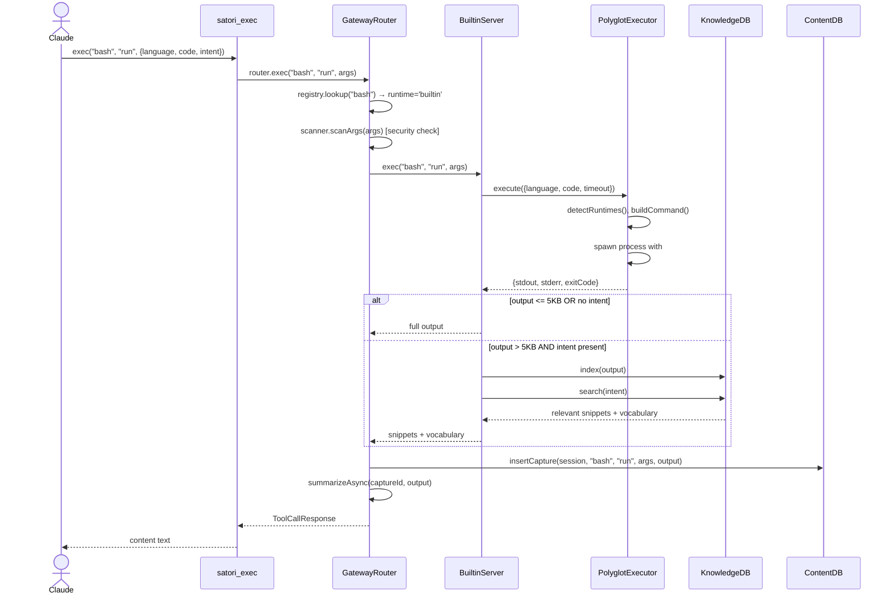
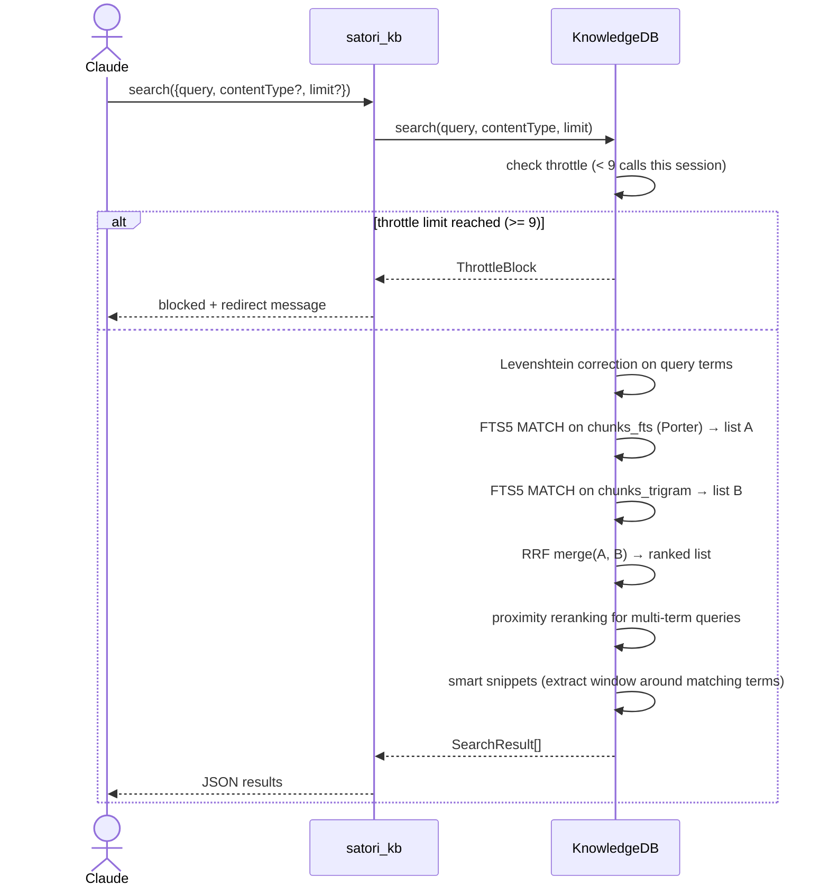

# Solution Design Document
## Memory + MCP Integration (M5)

## Validation Checklist

### CRITICAL GATES (Must Pass)

- [x] All required sections are complete
- [x] No [NEEDS CLARIFICATION] markers remain
- [x] Architecture pattern is clearly stated with rationale
- [x] **All architecture decisions confirmed by user**
- [x] Every interface has specification

### QUALITY CHECKS (Should Pass)

- [x] All context sources are listed with relevance ratings
- [x] Project commands are discovered from actual project files
- [x] Constraints → Strategy → Design → Implementation path is logical
- [x] Every component in diagram has directory mapping
- [x] Error handling covers all error types
- [x] Quality requirements are specific and measurable
- [x] Component names consistent across diagrams
- [x] A developer could implement from this design

---

## Constraints

CON-1 **Language/runtime**: TypeScript, Node.js, ESM modules. Same stack as existing Satori (`modules/satori/`).

CON-2 **Repository boundary**: Everything Satori-related ships inside `miyo-satori` (`modules/satori/`) — BuiltinRuntime, `satori_kb`, hooks, and hook registration. TCS has zero dependency on Satori internals. TCS's only change is the `install.sh` opt-in prompt that invokes Satori's own install mechanism.

CON-3 **No skill changes**: Architecture is transparent — zero changes to any `plugins/tcs-workflow/skills/` or `plugins/tcs-team/` files.

CON-4 **Graceful degradation**: All Satori-dependent behaviour must be skippable at runtime when Satori is absent. Hook scripts check `.satori/` dir; skills check tool list.

CON-5 **Dependency**: `better-sqlite3` already in Satori; `node-fetch` or built-in `fetch` for URL fetching. No new external dependencies unless unavoidable.

CON-6 **SQLite WAL + FTS5**: Both existing DBs use WAL mode + `better-sqlite3`. New `kb.sqlite` follows the same `SQLiteBase` abstract class pattern.

CON-7 **macOS dev environment**: Shell scripts must run on bash 3.2 (macOS default). No `declare -A`.

---

## Implementation Context

### Required Context Sources

#### Code Context

```yaml
- file: modules/satori/src/index.ts
  relevance: HIGH
  why: Startup flow — where new components (KnowledgeDB, BuiltinServer, satori_kb tool) must be registered

- file: modules/satori/src/db-base.ts
  relevance: HIGH
  why: SQLiteBase abstract class — KnowledgeDB extends this

- file: modules/satori/src/context/content-db.ts
  relevance: HIGH
  why: Pattern for FTS5 table + capture insert + search — KnowledgeDB follows same pattern

- file: modules/satori/src/context/session-db.ts
  relevance: HIGH
  why: Session snapshot and event patterns — hook wiring reads from this DB

- file: modules/satori/src/gateway/router.ts
  relevance: HIGH
  why: Pipeline that must short-circuit to BuiltinServer for runtime='builtin'

- file: modules/satori/src/lifecycle/runtimes/npx.ts
  relevance: MEDIUM
  why: Existing runtime pattern — BuiltinRuntime does NOT extend this but is registered similarly

- file: modules/satori/src/config/schema.ts
  relevance: HIGH
  why: Add 'builtin' to ServerConfig.runtime union; add 'backend' to ContextConfig

- file: modules/satori/src/tools/satori-exec.ts
  relevance: HIGH
  why: Minimal change needed — builtin dispatch is in the router, not this file

- file: modules/satori/src/tools/satori-context.ts
  relevance: MEDIUM
  why: Pattern for sub_command enum tool — satori_kb follows same structure

- file: modules/satori/src/security/scanner.ts
  relevance: HIGH
  why: SecurityScanner.scanConfig() must handle runtime='builtin'; scanOut() applies to execution output

- file: modules/satori/scripts/install-hooks.sh (NEW)
  relevance: MEDIUM
  why: Satori's own hook installer — TCS install.sh calls this; no TCS-side hooks.json modification

- file: modules/satori/src/context/snapshot.ts
  relevance: MEDIUM
  why: buildResumeSnapshot() — PreCompact hook calls this before compaction
```

#### External Reference

```yaml
- repo: github.com/mksglu/context-mode
  relevance: HIGH
  why: Source implementation for PolyglotExecutor, detectRuntimes, buildCommand, smartTruncate,
       #buildSafeEnv, FTS5 schema, BM25+RRF search stack, progressive throttling, intent-driven mode
  key_files:
    - src/executor.ts  — PolyglotExecutor class
    - src/runtime.ts   — detectRuntimes(), buildCommand(), Language type
    - src/truncate.ts  — smartTruncate(), capBytes()
    - src/server.ts    — tool param signatures, throttling logic, intent-driven mode threshold (5KB)
```

### Implementation Boundaries

- **Must Preserve**: All existing Satori tool interfaces (`satori_exec`, `satori_context`, `satori_manage`, `satori_find`, `satori_schema`). The `SQLiteBase` abstract class. The router pipeline order. The `ServerConfig` runtime enum (add `'builtin'`, never remove existing values).
- **Can Modify**: `index.ts` (add new registrations), `schema.ts` (add fields), `router.ts` (add builtin dispatch branch), `security/scanner.ts` (handle builtin runtime in `scanConfig`).
- **Must Not Touch**: Any file under `plugins/tcs-workflow/skills/`, `plugins/tcs-team/`, `plugins/tcs-helper/` except `install.sh` and hook wiring additions. Existing test files (only add new ones).

### Project Commands

```bash
# Satori (modules/satori/)
Install:   npm install
Test:      npm run test          # vitest
Typecheck: npm run typecheck     # tsc --noEmit
Build:     npm run build         # tsc → dist/
Dev:       npm run dev           # ts-node src/index.ts

# TCS root
Test:      (per plugin)
```

---

## Solution Strategy

- **Architecture Pattern**: Plugin extension of existing Satori gateway. New capabilities added as new components (BuiltinServer, KnowledgeDB) that slot into the existing pipeline without replacing it.
- **Integration Approach**: BuiltinRuntime short-circuits the router at the lifecycle/client step. `satori_kb` is a new top-level MCP tool alongside the existing five. Hook wiring adds Satori-aware behaviour to existing TCS hook scripts (PostToolUse, PreCompact, SessionStart).
- **Justification**: Transparent architecture — hooks and new Satori components do the work. Skills remain unchanged. New components follow every existing pattern in the codebase (SQLiteBase, sub_command enum tool, RuntimeInterface) so implementation friction is minimal.
- **Key Decisions**: See ADRs below.

---

## Building Block View

### Components

```mermaid
graph TB
    subgraph TCS
        INSTALL[install.sh<br/>opt-in prompt]
        HOOKS[PostToolUse hook<br/>PreCompact hook<br/>SessionStart hook]
    end

    subgraph miyo-satori
        INDEX[index.ts<br/>startup]

        subgraph Gateway
            ROUTER[GatewayRouter]
            REGISTRY[ServerRegistry]
        end

        subgraph Execution
            BUILTIN[BuiltinServer<br/>bash pseudo-server]
            EXECUTOR[PolyglotExecutor<br/>11 languages]
            TRUNCATE[smartTruncate]
            RUNTIMES[detectRuntimes<br/>buildCommand]
        end

        subgraph Knowledge
            KB_TOOL[satori_kb tool]
            KB_DB[(kb.sqlite<br/>FTS5 + BM25 + RRF)]
        end

        subgraph Context
            CTX_TOOL[satori_context tool]
            SESSION_DB[(db.sqlite<br/>session + content)]
        end

        subgraph Config
            SCHEMA[schema.ts<br/>+builtin +backend]
            LOADER[loader.ts]
        end
    end

    INSTALL -->|writes satori.toml [context]| LOADER
    HOOKS -->|PostToolUse: insert event| SESSION_DB
    HOOKS -->|PreCompact: buildResumeSnapshot| SESSION_DB

    INDEX --> REGISTRY
    INDEX --> KB_DB
    INDEX --> KB_TOOL
    INDEX --> BUILTIN

    ROUTER -->|runtime='builtin'| BUILTIN
    ROUTER -->|runtime=npx/docker/external| REGISTRY

    BUILTIN --> EXECUTOR
    EXECUTOR --> TRUNCATE
    EXECUTOR --> RUNTIMES
    EXECUTOR -->|intent + size > 5KB| KB_DB

    KB_TOOL --> KB_DB
```

### Directory Map

**Component: modules/satori/**

```
modules/satori/src/
├── execution/                          NEW directory
│   ├── executor.ts                     NEW: PolyglotExecutor class (port from context-mode)
│   ├── runtime.ts                      NEW: Language type, detectRuntimes(), buildCommand()
│   ├── truncate.ts                     NEW: smartTruncate(), capBytes()
│   └── builtin-server.ts              NEW: BuiltinServer — dispatches run/run_file/batch
│
├── knowledge/                          NEW directory
│   └── knowledge-db.ts                NEW: KnowledgeDB extends SQLiteBase
│                                           FTS5 (Porter + trigram), BM25+RRF search,
│                                           progressive throttle state, index/search/fetch_and_index
│
├── tools/
│   ├── satori-kb.ts                   NEW: satori_kb MCP tool (sub_command enum pattern)
│   ├── satori-exec.ts                 UNCHANGED (router handles builtin dispatch)
│   ├── satori-context.ts              UNCHANGED
│   ├── satori-manage.ts               UNCHANGED
│   ├── satori-find.ts                 UNCHANGED
│   └── satori-schema.ts               UNCHANGED
│
├── config/
│   ├── schema.ts                      MODIFY: add 'builtin' to ServerConfig.runtime;
│   │                                          add backend?: 'satori' | 'kairn' to ContextConfig
│   └── loader.ts                      UNCHANGED
│
├── gateway/
│   └── router.ts                      MODIFY: add builtin dispatch branch before lifecycle check
│
├── security/
│   └── scanner.ts                     MODIFY: scanConfig() — skip shell injection check for
│                                              runtime='builtin' (no command/image to scan)
│
├── index.ts                           MODIFY: init KnowledgeDB, register BuiltinServer,
│                                              register satori_kb tool, check context.backend
│
└── __tests__/
    ├── execution-executor.test.ts     NEW: PolyglotExecutor unit tests
    ├── execution-truncate.test.ts     NEW: smartTruncate unit tests
    ├── knowledge-db.test.ts           NEW: KnowledgeDB index/search unit tests
    └── satori-kb.test.ts             NEW: satori_kb tool integration tests
```

**Component: modules/satori/ — hooks**

```
modules/satori/
├── hooks/scripts/                      NEW directory (TypeScript, compiled to dist/)
│   ├── post-tool-use.ts               NEW: capture really-short-lived state to session DB
│   ├── pre-compact.ts                 NEW: flush session guide before compaction
│   └── session-start.ts              NEW: inject session restore reminder on start
└── scripts/
    └── install-hooks.sh               NEW: Satori's own hook registration script
                                            called by Satori install; registers hooks into
                                            the host Claude Code settings (hooks.json)
                                            with .satori/ existence guard on each hook
```

**Component: TCS root**

```
install.sh                             MODIFY: add context-mode opt-in prompt that calls
                                               Satori's install mechanism (install-hooks.sh)
                                               No direct hooks.json modification by TCS.
```

### Interface Specifications

#### Schema Changes (schema.ts)

```yaml
ServerConfig.runtime:
  BEFORE: 'npx' | 'docker' | 'external'
  AFTER:  'npx' | 'docker' | 'external' | 'builtin'
  NOTE: 'builtin' servers are auto-registered; never written to satori.toml by user

ContextConfig:
  ADD FIELD: backend?: 'satori' | 'kairn'
  DEFAULT: 'satori' (when absent)
  NOTE: 'kairn' logs warning + falls back in M5; functional in post-MVP
```

#### KnowledgeDB Schema (kb.sqlite)

```sql
-- Content chunks (source of truth)
CREATE TABLE IF NOT EXISTS chunks (
  id          INTEGER PRIMARY KEY AUTOINCREMENT,
  title       TEXT    NOT NULL DEFAULT '',
  heading     TEXT    NOT NULL DEFAULT '',
  content     TEXT    NOT NULL,
  type        TEXT    NOT NULL DEFAULT 'prose',  -- 'prose' | 'code'
  source_url  TEXT,
  indexed_at  INTEGER NOT NULL DEFAULT (strftime('%s', 'now'))
);

-- FTS5 virtual table: Porter stemming (BM25 ranking)
CREATE VIRTUAL TABLE IF NOT EXISTS chunks_fts USING fts5(
  title,
  heading,
  content,
  content='chunks',
  content_rowid='id',
  tokenize='porter unicode61'
);

-- FTS5 virtual table: trigram tokenizer (substring matching)
CREATE VIRTUAL TABLE IF NOT EXISTS chunks_trigram USING fts5(
  title,
  heading,
  content,
  content='chunks',
  content_rowid='id',
  tokenize='trigram'
);

-- Triggers to keep FTS tables in sync with chunks
CREATE TRIGGER IF NOT EXISTS chunks_ai AFTER INSERT ON chunks BEGIN
  INSERT INTO chunks_fts(rowid, title, heading, content) VALUES (new.id, new.title, new.heading, new.content);
  INSERT INTO chunks_trigram(rowid, title, heading, content) VALUES (new.id, new.title, new.heading, new.content);
END;

CREATE TRIGGER IF NOT EXISTS chunks_ad AFTER DELETE ON chunks BEGIN
  INSERT INTO chunks_fts(chunks_fts, rowid, title, heading, content) VALUES ('delete', old.id, old.title, old.heading, old.content);
  INSERT INTO chunks_trigram(chunks_trigram, rowid, title, heading, content) VALUES ('delete', old.id, old.title, old.heading, old.content);
END;
```

**BM25 heading weight**: Applied at query time via `bm25(chunks_fts, 5.0, 3.0, 1.0)` — title weight 5×, heading 3×, content 1×.

#### satori_kb Tool Interface

```yaml
Tool: satori_kb
Description: "Knowledge base: index markdown content or URLs, search with BM25+RRF, retrieve smart snippets"

Input Schema:
  sub_command: enum('index' | 'search' | 'fetch_and_index')
  content:     string (optional) — markdown for index
  title:       string (optional) — document title
  type:        enum('prose' | 'code') (optional, default: 'prose')
  query:       string (optional) — search query
  contentType: enum('prose' | 'code') (optional) — filter search results
  limit:       number (optional, default: 5) — max results
  url:         string (optional) — URL for fetch_and_index

Response (search):
  [
    {
      "chunk_id": number,
      "title": string,
      "heading": string,
      "snippet": string,    // smart snippet centred on query terms
      "type": "prose" | "code",
      "score": number       // RRF score
    }
  ]

Response (index / fetch_and_index):
  { "indexed": number }     // chunk count stored

Response (throttle block):
  {
    "blocked": true,
    "message": "Search throttled (9+ calls this session). Use satori_exec(\"bash\", \"batch\", ...) for bulk queries.",
    "redirect": "satori_exec"
  }
```

#### BuiltinServer Internal Interface

```typescript
interface BuiltinServerRequest {
  server: 'bash';
  tool:   'run' | 'run_file' | 'batch';
  args:   RunArgs | RunFileArgs | BatchArgs;
}

interface RunArgs {
  language:   Language;          // 11-value union (see runtime.ts)
  code:       string;
  timeout?:   number;            // ms, default 30_000
  background?: boolean;          // default false
  intent?:    string;            // triggers intent-driven mode if output > 5KB
}

interface RunFileArgs {
  path:      string;
  language:  Language;
  code?:     string;             // injected as variables
  timeout?:  number;
}

interface BatchArgs {
  commands:  { label: string; command: string }[];
  queries:   string[];
  timeout?:  number;             // ms, default 60_000
}

interface BuiltinServerResponse {
  content: string;               // execution output or search results
  truncated?: boolean;
  intent_search_results?: SearchResult[];
}
```

#### Router Modification (router.ts)

The single change: before the lifecycle check (current line 52), add a branch:

```typescript
// After registry lookup (line 50), before lifecycle check (line 52):
if (config.runtime === 'builtin') {
  // Security scan on args
  const scanResult = this.scanner.scanArgs(args);
  if (scanResult.blocked) { /* ... */ }

  // Dispatch to BuiltinServer
  const result = await this.builtinServer.exec(config.name, tool, args);

  // Capture + summarize (same as normal flow)
  const captureId = await this.contentDb.insertCapture({ ... });
  this.summarizeAsync(captureId, result);

  return result;
}
// ... existing lifecycle flow continues for npx/docker/external
```

#### Hook Registration

Satori owns its hooks entirely. `modules/satori/scripts/install-hooks.sh` registers the three hooks into the host Claude Code settings using Satori's own install mechanism. TCS `install.sh` only calls this script when the user opts in — it does not write any hook entries itself.

Each hook entry written by Satori's `install-hooks.sh`:

```json
"hooks": {
  "PostToolUse":  [{"matcher": "", "hooks": [{"type": "command", "command": "node /abs/path/dist/hooks/scripts/post-tool-use.js"}]}],
  "PreCompact":   [{"matcher": "", "hooks": [{"type": "command", "command": "node /abs/path/dist/hooks/scripts/pre-compact.js"}]}],
  "SessionStart": [{"matcher": "", "hooks": [{"type": "command", "command": "node /abs/path/dist/hooks/scripts/session-start.js"}]}]
}
```

Absolute paths are written at install time by `install-hooks.sh`. Hook scripts access `SessionDB` and `ContentDB` directly (same classes used by the MCP server).

#### install.sh Changes

New section added after existing optional features, before final confirmation:

```bash
# Context-mode opt-in (requires Satori submodule)
if [ -d "modules/satori" ]; then
  echo ""
  echo "[optional] Enable context-mode? (capture tool outputs, cross-session search)"
  echo "  Requires: miyo-satori MCP server running"
  read -r -p "  Enable? [y/N]: " ENABLE_CONTEXT
  if [[ "${ENABLE_CONTEXT,,}" == "y" ]]; then
    # Append [context] block to satori.toml if not present
    # Add session_start_reminder entry
  fi
fi
```

---

## Runtime View

### Primary Flow: satori_exec (run)



### Primary Flow: satori_kb search



### Error Handling

| Error Type | Source | Handling |
|---|---|---|
| Runtime not installed | PolyglotExecutor | Return error: "Runtime 'X' not found. Install X to use this language." |
| Execution timeout (30s) | PolyglotExecutor | Kill process group (-pid); return partial output + "execution timed out" |
| Output exceeds 100MB hard cap | PolyglotExecutor | Kill immediately; return "output exceeded 100MB limit" |
| `kb.sqlite` not found | KnowledgeDB constructor | Create schema automatically on first use |
| `kb.sqlite` corrupted | KnowledgeDB | Log + attempt DROP+recreate; if fails, surface error |
| URL fetch non-200 | KnowledgeDB.fetchAndIndex | Return error: "Failed to fetch URL: HTTP {status}" |
| URL content type unsupported | KnowledgeDB.fetchAndIndex | Return error: "Unsupported content type: {mime}" |
| Empty content / query | satori_kb tool | Return error before DB call |
| context.backend = 'kairn' | index.ts startup | Log warning, set backend = 'satori' in runtime config |
| Satori absent (hook fires) | Hook scripts | `test -d .satori` guard; silent skip |

### Complex Logic: RRF + Proximity Search

```
ALGORITHM: KnowledgeDB.search(query, contentType, limit)
INPUT: query string, optional type filter, limit N

1. PARSE: split query into terms
2. CORRECT: for each term, check Levenshtein distance <= 2 against indexed vocabulary
             if corrected, substitute in query before FTS call
3. PORTER SEARCH:
     SELECT c.*, bm25(chunks_fts, 5.0, 3.0, 1.0) AS score
     FROM chunks c JOIN chunks_fts ON c.id = chunks_fts.rowid
     WHERE chunks_fts MATCH ? [AND c.type = ?]
     ORDER BY score LIMIT N*3
   → Result list A with (rowid, rank_in_A)

4. TRIGRAM SEARCH:
     SELECT c.*, rank AS score FROM chunks c
     JOIN chunks_trigram ON c.id = chunks_trigram.rowid
     WHERE chunks_trigram MATCH ? [AND c.type = ?]
     ORDER BY score LIMIT N*3
   → Result list B with (rowid, rank_in_B)

5. RRF MERGE (k=60):
     for each unique rowid in A ∪ B:
       rrf_score = (1 / (60 + rank_in_A) if in A else 0)
                 + (1 / (60 + rank_in_B) if in B else 0)
     sort by rrf_score DESC → merged list

6. PROXIMITY RERANKING (multi-term only):
     for each chunk in merged list:
       find positions of all query terms in content
       boost score if min distance between any two term positions < 50 chars
     re-sort

7. SMART SNIPPETS:
     for each result in top N:
       find first term match position in content
       extract window: [pos-150 chars, pos+300 chars], snapped to word boundaries
       highlight matching terms (wrap in **)

8. RETURN top N results with snippet, title, heading, type, score
```

### Complex Logic: Intent-Driven Mode

```
TRIGGER: BuiltinServer.handleRun(args)
CONDITION: output.byteLength > 5_000 AND args.intent is non-empty

1. Index full output: knowledgeDb.index(output, title='execution-output', type='prose')
2. Search by intent: knowledgeDb.search(args.intent, limit=5)
3. Extract vocabulary: top 20 unique terms from BM25 scoring (for follow-up queries)
4. Return: {
     intent_results: SearchResult[],
     vocabulary: string[],
     total_output_bytes: number,
     message: "Output too large to inline. Showing intent-matched sections. Use satori_kb(search) for follow-ups."
   }
```

---

## Deployment View

### Single Component: modules/satori/

- **Environment**: Node.js process, same as existing Satori startup. No new services.
- **New files on disk**: `.satori/kb.sqlite` (created on first `satori_kb` call)
- **Configuration**: `satori.toml [context]` block — written by `install.sh` opt-in. No manual config required for the "bash" builtin server.
- **Startup impact**: `index.ts` initialises `KnowledgeDB` and registers `BuiltinServer` — both are synchronous, no network calls.

### Hook Deployment

Hook scripts (`modules/satori/hooks/*.js`) are registered by Satori's own `install-hooks.sh`. TCS `install.sh` invokes that script when the user opts in to context-mode. Absolute paths are written by the Satori installer — TCS does not touch hook configuration directly.

---

## Cross-Cutting Concepts

### Pattern Documentation

```yaml
- pattern: SQLiteBase abstract class (db-base.ts)
  relevance: CRITICAL
  why: KnowledgeDB must extend SQLiteBase — same WAL mode, same close/cleanup, same prepareStatements lifecycle

- pattern: Sub-command enum tool (satori-context.ts, satori-manage.ts)
  relevance: HIGH
  why: satori_kb follows identical pattern — Zod enum sub_command, switch dispatch, isError responses

- pattern: Factory function for runtimes (lifecycle/runtimes/npx.ts)
  relevance: MEDIUM
  why: BuiltinServer uses same registration call but is not a RuntimeInterface implementation — it bypasses lifecycle entirely

- pattern: Non-blocking async summarize (router.ts line 123-127)
  relevance: HIGH
  why: KnowledgeDB intent indexing in BuiltinServer should also be non-blocking (fire and forget for the capture part)
```

### System-Wide Patterns

- **Security**: BuiltinServer applies `#buildSafeEnv` before every execution (strip DENIED env vars). SecurityScanner.scanArgs() runs on all args before dispatch. `scanConfig()` skips shell-injection check for `runtime='builtin'` (no command field to scan).
- **Error Handling**: All errors return `{ content: [{type: 'text', text: '...'}], isError: true }` — same pattern as all existing tools.
- **Performance**: `kb.sqlite` FTS5 query with `LIMIT N*3` before RRF to avoid full-table scans. Throttle state is in-memory (Map<sessionId, callCount>) — resets on process restart. Smart snippet extraction is O(content.length) — acceptable for typical chunk sizes (< 10KB).
- **Logging**: Execution errors logged to `.satori/scanner.log` via AuditLog (same path as existing security audit). Intent-driven mode indexing errors logged but not surfaced to caller.

---

## Architecture Decisions

### ADR-1: BuiltinRuntime dispatch in router (not as RuntimeInterface)

**Choice**: Special-case branch in `GatewayRouter.exec()` for `runtime='builtin'`. BuiltinServer is injected into the router, not registered with LifecycleManager.

**Rationale**: Builtin servers have no lifecycle (no start/stop, no process, no MCP client). Forcing them through LifecycleManager would require a fake "always running" state and a client adapter. The router branch is 5 lines and zero abstraction leakage.

**Trade-offs**: Router has one new conditional branch. BuiltinServer is not a drop-in replacement for npx/docker runtimes (intentionally).

**User confirmed**: ✅ Confirmed

---

### ADR-2: KnowledgeDB in separate kb.sqlite (not merged with db.sqlite)

**Choice**: New `KnowledgeDB extends SQLiteBase` backed by `.satori/kb.sqlite`.

**Rationale**: Knowledge base is independently purgeable without affecting session history. FTS5 + chunked content schema is unrelated to session events and captures. Cleaner boundaries.

**Trade-offs**: Two SQLite files in `.satori/` instead of one. Both use WAL mode — safe for concurrent access from hooks.

**User confirmed**: ✅ Confirmed

---

### ADR-3: Progressive throttle state is in-memory per process

**Choice**: `Map<sessionId, number>` in KnowledgeDB instance. Resets on process restart (i.e., each Satori startup).

**Rationale**: Throttling is a session-local concern. Context-mode uses the same approach. Persisting it to DB adds write overhead on every search call with minimal benefit — a developer who restarts Satori can search again.

**Trade-offs**: After a crash/restart, throttle counter resets. Acceptable — the goal is to throttle runaway search loops within a session, not across process lifetimes.

**User confirmed**: ✅ Confirmed

---

### ADR-4: Execution output source files live in src/execution/

**Choice**: New `src/execution/` directory for `executor.ts`, `runtime.ts`, `truncate.ts`, `builtin-server.ts`.

**Rationale**: Clean separation from `src/tools/` (MCP tool registration) and `src/lifecycle/` (process management). `src/execution/` owns the code-running concern.

**Trade-offs**: One more top-level directory. Consistent with how `src/context/`, `src/security/`, `src/knowledge/` each own a distinct concern.

**User confirmed**: ✅ Confirmed

---

### ADR-5: Satori owns its hooks entirely — TCS has zero dependency on Satori internals

**Choice**: Hook scripts ship in `modules/satori/hooks/`. Hook registration is handled by Satori's own `scripts/install-hooks.sh`. TCS `install.sh` calls that script when the user opts in to context-mode. TCS writes nothing to hooks.json itself.

**Rationale**: Clean boundary — everything Satori-related is Satori's responsibility. TCS treats Satori as an opaque install target. This means Satori can evolve its hook strategy independently without any TCS changes.

**Trade-offs**: TCS `install.sh` must invoke Satori's installer correctly. If Satori's install API changes, only Satori and the single `install.sh` call site need updating.

**User confirmed**: ✅ Confirmed

---

### ADR-6: Session guide format follows existing buildResumeSnapshot()

**Choice**: The PreCompact hook calls `buildResumeSnapshot()` (already in `snapshot.ts`) — no new format.

**Rationale**: The format is already implemented and tested. The hook just triggers it at the right time.

**Trade-offs**: None. This resolves PRD Open Question #1.

**User confirmed**: ✅ Confirmed

---

### ADR-7: URL fetching uses built-in fetch (Node.js 18+) with max 5 redirect hops

**Choice**: `globalThis.fetch` with `redirect: 'follow'`, capped at 5 hops via manual tracking. No new npm dependency.

**Rationale**: Node.js 18+ includes `fetch` natively. Satori already targets Node.js 18+ (ESM). Avoiding a new dep keeps the package lean.

**Trade-offs**: Built-in fetch lacks some advanced features (custom timeout per redirect hop). Simple `AbortController` timeout covers the use case.

**User confirmed**: ✅ Confirmed

---

## Quality Requirements

- **Performance**: `satori_kb("search")` returns in < 200ms for a corpus of 10,000 chunks on a developer machine. `satori_exec("bash", "run")` adds < 50ms overhead vs direct shell execution (excluding process spawn time).
- **Reliability**: `kb.sqlite` corruption triggers automatic schema recreation; if recreation fails, the tool returns an error rather than crashing the Satori process.
- **Security**: `#buildSafeEnv` DENIED list covers all vars from context-mode reference. Process group kill (`-pid`) ensures no orphaned child processes. Hard 100MB output cap.
- **Graceful degradation**: All hook scripts exit 0 when `.satori/` is absent. Skills that check the tool list proceed with file-based fallback when `satori_context` is not in the list.

---

## Acceptance Criteria (EARS Format)

**F1 — Install opt-in:**
- [ ] WHERE context-mode is enabled via install.sh, THE SYSTEM SHALL write a `[context]` block to `satori.toml` with `db_path`, `session_guide_max_bytes`, and `retain_days`
- [ ] WHEN a session starts and context-mode is enabled, THE SYSTEM SHALL include a context-mode reminder in session_start output

**F3 — BuiltinRuntime:**
- [ ] WHEN `satori_exec("bash", "run", {language, code})` is called, THE SYSTEM SHALL execute the code in a process with dangerous env vars stripped
- [ ] IF output exceeds 5KB AND intent is provided, THEN THE SYSTEM SHALL index the full output and return only intent-matched snippets
- [ ] WHEN execution exceeds the timeout, THE SYSTEM SHALL kill the process group and return partial output with a timeout message
- [ ] THE SYSTEM SHALL support all 11 languages: javascript, typescript, python, shell, ruby, go, rust, php, perl, r, elixir

**F4 — satori_kb:**
- [ ] WHEN `satori_kb("index", {content})` is called, THE SYSTEM SHALL split the content by markdown headings and store each chunk in `kb.sqlite`
- [ ] WHEN `satori_kb("search", {query})` is called, THE SYSTEM SHALL apply RRF merge of Porter-stem and trigram results
- [ ] WHEN 9 or more search calls occur in a session, THE SYSTEM SHALL block subsequent searches and return a redirect message
- [ ] WHEN `satori_kb("fetch_and_index", {url})` is called, THE SYSTEM SHALL fetch, convert to markdown, and index without returning raw HTML

**F5 — Memory routing:**
- [ ] WHEN a PostToolUse hook fires and `.satori/` exists, THE SYSTEM SHALL insert session state as a really-short-lived event into `db.sqlite`
- [ ] WHEN a PreCompact hook fires and `.satori/` exists, THE SYSTEM SHALL call `buildResumeSnapshot()` and upsert the result to `session_resume`

**F7 — Kairn prep:**
- [ ] WHEN `context.backend = "kairn"` is set in `satori.toml`, THE SYSTEM SHALL log a warning at startup and fall back to the satori backend

---

## Risks and Technical Debt

### Known Technical Issues

- FTS5 trigram tokenizer requires SQLite 3.38+ (released 2022-02-22). Most macOS systems running Node.js 18+ via Homebrew will have SQLite 3.39+. If `better-sqlite3` bundles an older SQLite, trigram will fail silently — the search degrades to Porter-only (still functional, just no substring matching). Detect and log at startup.

### Technical Debt

- The `smartTruncate` implementation must be a direct port of context-mode's version (60%/40% split, line-boundary, separator). Do not simplify — the exact ratios were tuned. Mark with `// port: context-mode/src/truncate.ts` comment.
- If `satori_kb("fetch_and_index")` is used heavily, `kb.sqlite` can grow large with no auto-prune in M5. The `retain_days` field in `[context]` should eventually apply to KB chunks too — deferred to M5.1.

### Implementation Gotchas

- **Process group kill**: Use `process.kill(-pid, 'SIGTERM')` not `process.kill(pid)`. The `-pid` sends signal to the entire group. This requires `detached: true` in the spawn options. If `detached` is false, child processes can outlive the parent.
- **FTS5 content table triggers**: The `chunks_ai` and `chunks_ad` triggers must be created after the `chunks` table. If `better-sqlite3` executes multi-statement strings, split the CREATE statements. The `UPDATE` trigger is not needed for read-only FTS (chunks are never updated, only inserted or deleted).
- **Bun detection**: If `detectRuntimes()` finds `bun` available, context-mode prefers it for JS/TS execution and uses `bun:sqlite` instead of `better-sqlite3`. In Satori, the KnowledgeDB always uses `better-sqlite3` (already a dependency) regardless of Bun availability — only the execution runtimes use `detectRuntimes()`.
- **satori_exec args type**: The existing `satori-exec.ts` accepts `args: z.record(z.string(), z.unknown())`. The "bash" server's `run`, `run_file`, `batch` structures are richer objects. The router casts `args` to `unknown` before passing to `BuiltinServer.exec()` — type the inner dispatch with explicit `as RunArgs` etc. after a discriminated check on `tool`.

---

## Glossary

### Domain Terms

| Term | Definition | Context |
|------|------------|---------|
| really-short-lived | State that only matters within one session (task progress, recent errors) | Routing table — captured to Satori DB, not to files |
| session guide | ≤2KB snapshot of critical session state flushed before compaction | Built by `buildResumeSnapshot()`, stored in `session_resume` table |
| context-mode | Optional feature set that activates automatic capture + cross-session search | Enabled via install.sh opt-in |
| intent-driven mode | Output handling strategy for large execution results: index + search instead of inline | Triggered by output > 5KB + intent parameter |

### Technical Terms

| Term | Definition | Context |
|------|------------|---------|
| BM25 | Probabilistic ranking function (Best Match 25) — term frequency + IDF + document length normalisation | Used by FTS5 for `search` ranking |
| RRF | Reciprocal Rank Fusion — score = Σ 1/(k + rank_i) across ranked lists | Merges Porter-stem and trigram result lists |
| Porter stemming | Algorithm reducing words to their root form ("running" → "run") | FTS5 tokenizer option — improves recall |
| Trigram | FTS5 tokenizer that indexes all 3-character substrings — enables partial/substring matching | Second FTS5 table for `chunks_trigram` |
| smart snippet | Excerpt from indexed content centred around where query terms appear | vs. naive first-N-chars truncation |
| progressive throttling | Session-level rate limiting on `satori_kb("search")` — degrades results then blocks | Redirects to `satori_exec("bash", "batch")` at limit |
| BuiltinRuntime | Runtime type ('builtin') that bypasses LifecycleManager — server handled inline by router | "bash" is the only builtin in M5 |
| PolyglotExecutor | Class that executes code in any of 11 languages via spawned subprocess | Ported from context-mode |
| #buildSafeEnv | Private method that strips dangerous env vars (BASH_ENV, LD_PRELOAD, etc.) before execution | Security measure in PolyglotExecutor |
| WAL | Write-Ahead Logging — SQLite journal mode that enables concurrent reads | Applied to both db.sqlite and kb.sqlite |
