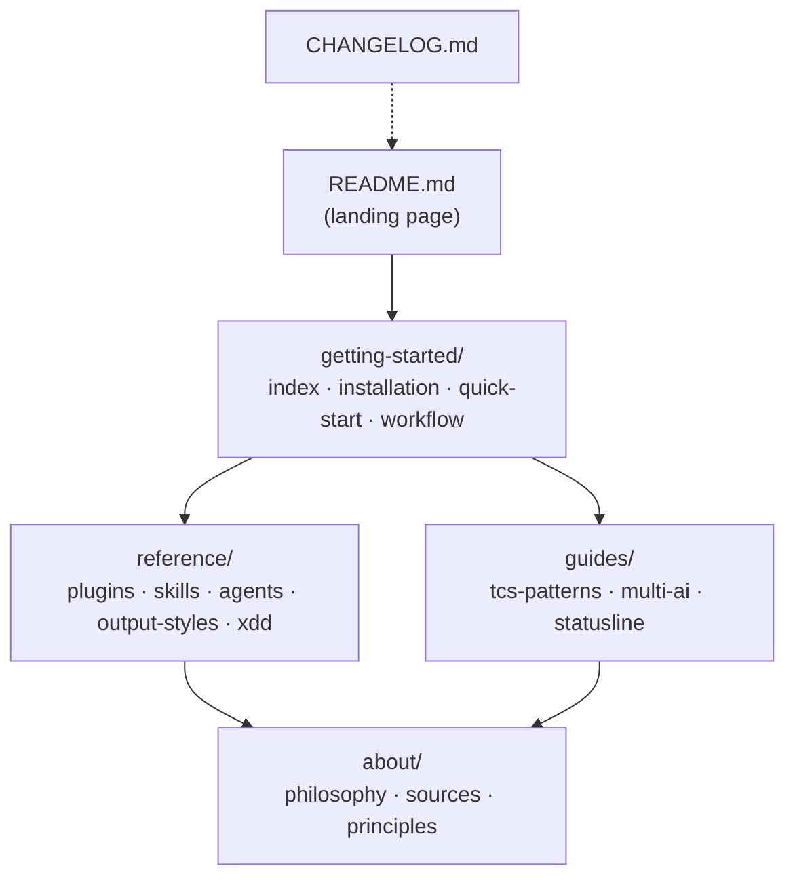

# Solution Design Document

## Validation Checklist

### CRITICAL GATES (Must Pass)

- [x] All required sections are complete
- [x] No [NEEDS CLARIFICATION] markers remain
- [x] Architecture pattern is clearly stated with rationale
- [x] All architecture decisions confirmed by user
- [x] Every interface has specification

### QUALITY CHECKS (Should Pass)

- [x] All context sources are listed with relevance ratings
- [x] Project commands are discovered from actual project files
- [x] Constraints → Strategy → Design → Implementation path is logical
- [x] Every component in diagram has directory mapping
- [x] Quality requirements are specific and measurable
- [x] Component names consistent across diagrams
- [x] A developer could implement from this design

---

## Constraints

CON-1: All content is Markdown. No build system, no static site generator, no templating — plain `.md` files read directly in GitHub or Claude Code.

CON-2: `docs/XDD/`, `docs/ai/`, `docs/templates/` are **out of scope** — these are spec artifacts, not user-facing docs.

CON-3: `README.md` must retain the ASCII art header and the "What's different" fork attribution section.

CON-4: No versioned docs — single-version, always-current.

CON-5: Skill invocation examples must use `tcs-workflow:` namespace throughout (never `tcs-start:`).

CON-6: Source of truth for skill descriptions is the actual `SKILL.md` files — content must be read from source, never recalled from memory.

---

## Implementation Context

### Required Context Sources

```yaml
# Source of truth for skill descriptions
- file: plugins/tcs-workflow/skills/*/SKILL.md
  relevance: HIGH
  why: "Authoritative skill descriptions for reference/skills.md and reference/xdd.md"

- file: plugins/tcs-patterns/skills/*/SKILL.md
  relevance: HIGH
  why: "Authoritative pattern skill descriptions for guides/tcs-patterns.md"

- file: plugins/tcs-team/agents/**/*.md
  relevance: HIGH
  why: "Authoritative agent descriptions for reference/agents.md"

# Existing docs being replaced
- file: docs/workflow.md
  relevance: HIGH
  why: "Content to migrate/update for getting-started/workflow.md"

- file: docs/plugins.md
  relevance: HIGH
  why: "Content to migrate/update for reference/plugins.md"

- file: docs/skills.md
  relevance: HIGH
  why: "Content to migrate/update for reference/skills.md"

- file: docs/agents.md
  relevance: MEDIUM
  why: "Content to migrate/update for reference/agents.md — mostly intact"

- file: docs/the-custom-philosophy.md
  relevance: HIGH
  why: "Becomes about/the-custom-philosophy.md — preserve and update"

# Internal design notes to promote
- file: docs/concept/
  relevance: MEDIUM
  why: "Valuable insights to extract into about/the-custom-philosophy.md and reference/xdd.md"

- file: docs/concept/v2/
  relevance: MEDIUM
  why: "v2 rationale and XDD design notes for reference/xdd.md"

# Attribution reference
- file: docs/XDD/ideas/2026-03-28-docs-rewrite.md
  relevance: HIGH
  why: "Brainstorm design decisions and attribution counts"
```

### Implementation Boundaries

- **Must Preserve**: ASCII art header and "What's different" section in `README.md`; all content in `docs/XDD/`, `docs/ai/`, `docs/templates/`; `about/sources.md` attribution accuracy
- **Can Modify**: All files in `docs/` (workflow.md, skills.md, plugins.md, agents.md, etc.)
- **Must Not Touch**: `docs/XDD/`, `docs/ai/`, `docs/templates/`, `install.sh`, `uninstall.sh`, plugin files

### External Interfaces

No external services. This is a static documentation project — the only "interface" is the rendered Markdown viewed in GitHub, Claude Code, or a browser.

### Project Commands

```bash
# Verify no stale plugin references remain
grep -r "tcs-start" docs/ --include="*.md"

# Verify skill count
grep -c "^###\|^#### \`/" docs/reference/skills.md

# Check for dead internal links (manual review — no link checker installed)
grep -r "\](docs/" docs/ README.md

# Verify attribution doc exists
test -f docs/about/sources.md && echo "OK"
```

---

## Solution Strategy

- **Architecture Pattern**: Content migration with IA restructure — existing content is reviewed, updated, and written to a new directory hierarchy. Old files are deleted after migration.
- **Integration Approach**: Read-then-write. Each new file reads its authoritative source(s) first (SKILL.md files, existing docs, concept/ notes), then writes the new version.
- **Justification**: A documentation project has no runtime, no database, no API. The "architecture" is the information architecture: what lives where and how files link to each other.
- **Key Decisions**: See ADRs below.

---

## Building Block View

### Components

```
docs/
├── getting-started/    ← Onboarding path (new users land here)
├── reference/          ← Authoritative reference (bookmark these)
├── guides/             ← Deep dives and optional setup
├── about/              ← Philosophy, attribution, principles
└── [XDD/, ai/, templates/ — UNTOUCHED]

README.md               ← Repository landing page (links into getting-started/)
CHANGELOG.md            ← Repository root (version history)
```



### Directory Map

**New structure** (replaces current flat `docs/`):

```
docs/
├── getting-started/
│   ├── index.md              # NEW: TCS overview, value prop, 4-plugin map
│   ├── installation.md       # REWRITE: from docs/installation.md
│   ├── quick-start.md        # NEW: first project walkthrough
│   └── workflow.md           # REWRITE: from docs/workflow.md
│
├── reference/
│   ├── plugins.md            # REWRITE: from docs/plugins.md
│   ├── skills.md             # REWRITE: from docs/skills.md (10→20 skills)
│   ├── agents.md             # MINOR UPDATE: from docs/agents.md
│   ├── output-styles.md      # MINOR UPDATE: from docs/output-styles.md
│   └── xdd.md                # NEW: XDD workflow deep dive
│
├── guides/
│   ├── tcs-patterns.md       # NEW: all 17 pattern skills
│   ├── multi-ai-workflow.md  # MOVE: from docs/multi-ai-workflow.md
│   └── statusline.md         # MERGE: 3 statusline files → 1
│
├── about/
│   ├── the-custom-philosophy.md  # UPDATE+MOVE: from docs/the-custom-philosophy.md
│   ├── sources.md                # NEW: attribution document
│   └── principles.md             # MOVE: from docs/PRINCIPLES.md
│
└── [XDD/, ai/, templates/ — unchanged]

README.md                     # REWRITE: root (stays at repo root)
CHANGELOG.md                  # NEW or UPDATE: repo root
```

**Files to delete** (after content migrated):

```
docs/index.md
docs/concepts.md
docs/workflow.md          ← replaced by getting-started/workflow.md
docs/skills.md            ← replaced by reference/skills.md
docs/plugins.md           ← replaced by reference/plugins.md
docs/agents.md            ← replaced by reference/agents.md
docs/output-styles.md     ← replaced by reference/output-styles.md
docs/installation.md      ← replaced by getting-started/installation.md
docs/multi-ai-workflow.md ← moved to guides/
docs/statusline.md        ← merged into guides/statusline.md
docs/statusline-starship.md       ← merged into guides/statusline.md
docs/statusline-starship-reddit.md ← merged into guides/statusline.md
docs/PHILOSOPHY.md        ← superseded by about/the-custom-philosophy.md
docs/the-custom-philosophy.md     ← moved to about/
docs/PRINCIPLES.md        ← moved to about/
docs/concept/             ← internal notes, delete after extracting insights
docs/concept/v2/          ← internal notes, delete after extracting insights
```

### Interface Specifications

**No external APIs or databases.** Internal interfaces are cross-document links.

#### Cross-Document Link Map

| From | Links to | Purpose |
|------|----------|---------|
| `README.md` | `docs/getting-started/index.md` | Primary entry point |
| `README.md` | `docs/getting-started/installation.md` | Installation |
| `README.md` | `CHANGELOG.md` | Version history |
| `getting-started/index.md` | `docs/reference/plugins.md` | Plugin detail |
| `getting-started/workflow.md` | `docs/reference/xdd.md` | XDD deep dive |
| `getting-started/workflow.md` | `docs/reference/skills.md` | Skill reference |
| `reference/plugins.md` | `docs/guides/tcs-patterns.md` | Patterns guide |
| `reference/plugins.md` | `docs/getting-started/installation.md` | Install commands |
| `reference/agents.md` | `docs/PHILOSOPHY.md` (→ `docs/about/the-custom-philosophy.md`) | Philosophy |
| `about/the-custom-philosophy.md` | `docs/about/sources.md` | Attribution detail |

#### Data Storage Changes

Not applicable — no database.

#### Internal API Changes

Not applicable — no API endpoints.

#### `about/sources.md` Content Model

```
sources.md contains:
  - Base fork: name, URL, author, what was derived
  - tcs-patterns skill categories:
      - citypaul-derived: count (10), skill names listed
      - TCS-native: count (5), skill names listed
      - Integration: count (2), skill names listed
  - Output styles: origin
  - Agent architecture: origin (activity-based pattern)
```

---

## Runtime View

### Primary Flow: New User Getting Started

1. User lands on `README.md` — reads what TCS is, sees install command
2. User runs install script or follows `getting-started/installation.md`
3. User reads `getting-started/index.md` — understands 4-plugin map
4. User reads `getting-started/workflow.md` — understands BUILD loop
5. User runs `/specify` — follows XDD flow; reads `reference/xdd.md` for details
6. User discovers tcs-patterns — reads `guides/tcs-patterns.md`, installs relevant skills

### Error Handling

| Scenario | How docs handle it |
|----------|-------------------|
| User runs old `tcs-start:` command | Will fail; `CHANGELOG.md` explains the rename |
| User can't find a skill | `reference/skills.md` lists all 20 with descriptions |
| User doesn't know which plugin to install | `getting-started/index.md` has 4-plugin decision guide |
| Internal link is broken | Caught by post-migration link scan (see Project Commands) |

---

## Deployment View

No deployment infrastructure — docs are Markdown files in a git repository. "Deployment" is a commit to `main`.

---

## Cross-Cutting Concepts

### Pattern Documentation

```yaml
- pattern: Content migration pattern
  why: "Each new file reads its source(s) first, then writes — never from memory"

- pattern: Single source of truth
  why: "All skill descriptions read from SKILL.md files, not recalled"

- pattern: Progressive disclosure
  why: "getting-started/ is minimal; reference/ is comprehensive; guides/ is deep"
```

### User Interface & UX

**Information Architecture:**
- Navigation: `getting-started/` for linear onboarding; `reference/` for lookup; `guides/` for deep dives; `about/` for context
- Content Organization: No duplication — each topic lives in exactly one place
- User Flows: New user → getting-started/ → reference/ → guides/ as needed

---

## Architecture Decisions

- [x] **ADR-1: New IA — 4 subdirectories (getting-started/, reference/, guides/, about/)**
  - Choice: Restructured hierarchy (not flat files)
  - Rationale: Flat structure conflates onboarding, reference, and philosophy. v2 has too many files to navigate flat. Subdirectories enforce clear intent.
  - Trade-offs: Old bookmarks/links to `docs/workflow.md` etc. break. Acceptable — this is a local docs folder, not a published site.
  - User confirmed: ✅ (brainstorm session 2026-03-28)

- [x] **ADR-2: Clean delete (no symlinks or redirects for old paths)**
  - Choice: Delete old files after migration; no compatibility shims
  - Rationale: This is Markdown in a git repo, not a web server. Symlinks add maintenance overhead with no user benefit. GitHub's file browser resolves from current tree.
  - Trade-offs: Any external links pointing at old file paths will 404. Low impact — TCS docs are self-contained and not widely linked externally.
  - User confirmed: ✅ (implied by "full rewrite" decision, 2026-03-28)

- [x] **ADR-3: CHANGELOG.md at repo root**
  - Choice: Create/update `CHANGELOG.md` at the repository root (not inside `docs/`)
  - Rationale: `CHANGELOG.md` is a repository convention (Keep a Changelog standard). Root placement makes it visible in GitHub's file listing without navigating into docs/.
  - Trade-offs: Not linked from the docs/ IA directly — only from README.md.
  - User confirmed: ✅ (brainstorm session 2026-03-28)

- [x] **ADR-4: SKILL.md as source of truth (never recalled content)**
  - Choice: Every skill description written to docs must be read from the actual `SKILL.md` frontmatter/description — never paraphrased from memory
  - Rationale: Skill descriptions drift between sessions. Reading from source prevents stale content. Also validates that the file actually exists.
  - Trade-offs: Slightly more file reads during implementation. Acceptable.
  - User confirmed: ✅ (explicit constraint CON-6)

---

## Quality Requirements

- **Accuracy**: 0 occurrences of `tcs-start` (plugin name) in any file under `docs/` or `README.md` after migration
- **Completeness**: `reference/skills.md` lists exactly 20 tcs-workflow skills; `guides/tcs-patterns.md` lists exactly 17 tcs-patterns skills
- **Attribution**: `about/sources.md` correctly names rsmdt/the-startup (base fork), lists 10 citypaul-derived skills, 5 TCS-native, 2 integration
- **Link integrity**: All internal `](docs/...)` and `](../...)` links resolve after migration
- **Structure**: `docs/` contains exactly 4 subdirectories + `XDD/`, `ai/`, `templates/` — no loose `.md` files at `docs/` root

---

## Acceptance Criteria

**Plugin name accuracy:**
- [ ] THE SYSTEM SHALL contain zero occurrences of `tcs-start` as a plugin identifier across all files in `docs/` and `README.md`
- [ ] WHEN a user reads any install command, THE SYSTEM SHALL show `tcs-workflow@the-custom-startup` for the core plugin

**Completeness:**
- [ ] WHEN a user reads `reference/skills.md`, THE SYSTEM SHALL list all 20 tcs-workflow skills by name with a description
- [ ] WHEN a user reads `guides/tcs-patterns.md`, THE SYSTEM SHALL list all 17 tcs-patterns skills with when/why guidance
- [ ] WHEN a user reads `reference/xdd.md`, THE SYSTEM SHALL describe each of the 6 XDD skills (xdd, xdd-meta, xdd-prd, xdd-sdd, xdd-plan, xdd-tdd)

**Structure:**
- [ ] THE SYSTEM SHALL NOT contain any `.md` files at the `docs/` root level (except `XDD/`, `ai/`, `templates/` subdirectories)
- [ ] THE SYSTEM SHALL contain `CHANGELOG.md` at the repository root with a v2.0 entry

**Attribution:**
- [ ] WHEN a user reads `about/sources.md`, THE SYSTEM SHALL name rsmdt/the-startup as the base fork with a link
- [ ] WHEN a user reads `about/sources.md`, THE SYSTEM SHALL list skill origin categories with correct counts

**Link integrity:**
- [ ] THE SYSTEM SHALL contain no broken internal cross-document links in `docs/` or `README.md`

---

## Risks and Technical Debt

### Known Technical Issues

- The concept/ files have no consistent format — extraction requires judgment on which content to promote vs. discard

### Technical Debt

- `docs/the-custom-philosophy.md` and `docs/PHILOSOPHY.md` are duplicates with different content — this needs careful merge before deletion
- `docs/agents.md` contains a link to `PHILOSOPHY.md` (old path) — must be updated to `about/the-custom-philosophy.md`

### Implementation Gotchas

- `reference/agents.md` references `PHILOSOPHY.md` inline — update this link during the minor update pass
- `getting-started/installation.md` install wizard description should match the actual `install.sh` prompts — read `install.sh` before writing
- `guides/statusline.md` merges 3 files — read all 3 first to avoid losing the Starship Reddit-specific content (it has unique setup notes not in the main statusline doc)
- tcs-patterns SKILL.md files are in `plugins/tcs-patterns/skills/` — glob to get accurate skill names before writing `guides/tcs-patterns.md`

---

## Glossary

### Domain Terms

| Term | Definition | Context |
|------|------------|---------|
| TCS | The Custom Startup — this framework | Used throughout |
| XDD | Experience-Driven Development — the spec workflow (PRD → SDD → PLAN → implement) | reference/xdd.md |
| tcs-workflow | The core plugin (renamed from tcs-start in v2) | All install/invocation examples |
| tcs-patterns | Optional pattern skills plugin (17 skills) | guides/tcs-patterns.md |
| PICS | Persona, Interface, Constraints, Workflow — skill file format | about/the-custom-philosophy.md |
| IA | Information Architecture — the structure of docs/ | This SDD |

### Technical Terms

| Term | Definition | Context |
|------|------------|---------|
| SKILL.md | Markdown file defining a skill's persona, interface, constraints, and workflow | Source of truth for skill descriptions |
| ADR | Architecture Decision Record | docs/XDD/adr/ |
| PRD | Product Requirements Document | XDD phase 1 |
| SDD | Solution Design Document | XDD phase 2 |
