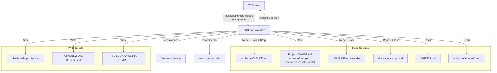
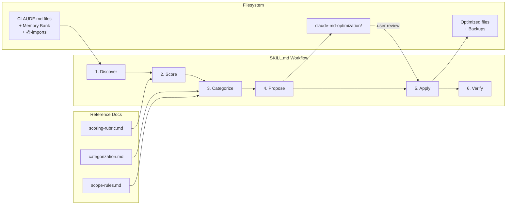
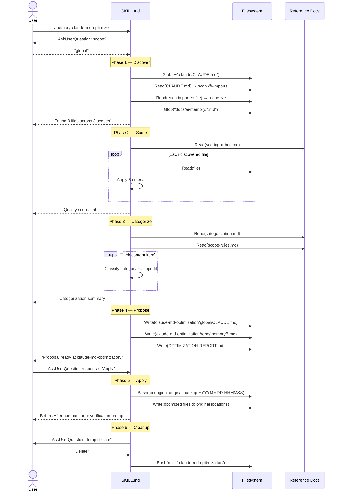

# Solution Design Document

## Validation Checklist

### CRITICAL GATES (Must Pass)

- [x] All required sections are complete
- [x] No [NEEDS CLARIFICATION] markers remain
- [x] Architecture pattern is clearly stated with rationale
- [x] **All architecture decisions confirmed by user**
- [x] Every interface has specification

### QUALITY CHECKS (Should Pass)

- [x] All context sources are listed with relevance ratings
- [x] Project commands are discovered from actual project files
- [x] Constraints → Strategy → Design → Implementation path is logical
- [x] Every component in diagram has directory mapping
- [x] Error handling covers all error types
- [x] Quality requirements are specific and measurable
- [x] Component names consistent across diagrams
- [x] A developer could implement from this design
- [x] Implementation examples use actual schema column names (not pseudocode), verified against migration files
- [x] Complex queries include traced walkthroughs with example data showing how the logic evaluates

---

## Constraints

CON-1 **Bash 3.2 compatibility**: macOS default shell. No associative arrays, no `declare -A`. Use `case`-based lookup functions.
CON-2 **Pure skill architecture**: Single SKILL.md + reference docs. No Python helpers. Claude uses Read/Write/Glob/Grep/Bash directly.
CON-3 **Non-destructive by default**: All changes are proposed in a temp directory first. Originals are backed up before any modification. User confirms every phase transition.
CON-4 **Cross-scope file access**: Skill reads from `~/.claude/` (global), user-defined project directory (discovered via @-imports), and repo root (repo). Writes only happen after explicit user approval.
CON-5 **Context window efficiency**: The skill itself should be concise. Reference docs contain the rubrics and rules, loaded only when the workflow reaches that phase.
CON-6 **tcs-helper plugin conventions**: Must follow existing skill patterns: SKILL.md frontmatter, Persona/Interface/Constraints/Workflow structure, `<!-- YYYY-MM-DD -->` date format for entries.

## Implementation Context

### Required Context Sources

#### Documentation Context
```yaml
- doc: plugins/tcs-helper/templates/routing-reference.md
  relevance: CRITICAL
  why: "Defines Memory Bank category routing rules — the target structure for migration"

- doc: plugins/tcs-helper/templates/memory-index.md
  relevance: HIGH
  why: "Template for docs/ai/memory/memory.md — skill creates this if missing"

- doc: plugins/tcs-helper/templates/claude-root.md
  relevance: HIGH
  why: "Template for optimized CLAUDE.md — skill uses this as target format"

- doc: plugins/tcs-helper/skills/memory-add/SKILL.md
  relevance: MEDIUM
  why: "Categorization keyword signals — reuse for content classification"

- doc: plugins/tcs-helper/skills/memory-cleanup/SKILL.md
  relevance: MEDIUM
  why: "Archive patterns, deduplication logic — delegate ongoing maintenance"

- doc: plugins/tcs-helper/skills/memory-sync/SKILL.md
  relevance: MEDIUM
  why: "@-import audit patterns — verify structural integrity after apply"

- doc: plugins/tcs-helper/skills/setup/SKILL.md
  relevance: MEDIUM
  why: "Memory Bank provisioning patterns — reuse when creating missing structure"
```

#### Code Context
```yaml
- file: plugins/tcs-helper/templates/memory-general.md
  relevance: HIGH
  why: "Category file template — target format for migrated content"

- file: plugins/tcs-helper/templates/memory-tools.md
  relevance: HIGH
  why: "Category file template"

- file: plugins/tcs-helper/templates/memory-domain.md
  relevance: HIGH
  why: "Category file template"

- file: plugins/tcs-helper/templates/memory-decisions.md
  relevance: HIGH
  why: "Category file template"

- file: plugins/tcs-helper/templates/memory-context.md
  relevance: HIGH
  why: "Category file template"

- file: plugins/tcs-helper/templates/memory-troubleshooting.md
  relevance: HIGH
  why: "Category file template"

- file: plugins/tcs-helper/scripts/lib/reflect_utils.py
  relevance: LOW
  why: "Session path encoding (learnings queue) — NOT project CLAUDE.md path"
```

### Implementation Boundaries

- **Must Preserve**: All existing CLAUDE.md content (backed up before modification). Existing Memory Bank entries (treated as already-categorized). Cross-tool compatibility of AGENTS.md.
- **Can Modify**: CLAUDE.md files (with backup). Memory Bank category files (append only). memory.md index (update entries).
- **Must Not Touch**: `~/.claude/settings.json`, hook scripts, plugin.json, other skill files, `.git/` directory.

### External Interfaces

#### System Context Diagram



#### Interface Specifications

```yaml
# Inbound Interface (user invocation)
inbound:
  - name: "Skill Invocation"
    type: Claude Code Skill
    format: /memory-claude-md-optimize [--dry-run] [--scope global|project|repo]
    authentication: N/A (local CLI)
    data_flow: "User triggers analysis and optimization workflow"

# Outbound Interfaces (filesystem operations)
outbound:
  - name: "File Discovery"
    type: Filesystem (Read-only)
    format: Glob + Read
    data_flow: "Discover and read CLAUDE.md, memory, and include files"
    criticality: HIGH

  - name: "Proposal Generation"
    type: Filesystem (Write)
    format: Write to temp directory
    data_flow: "Create optimized file proposals for user review"
    criticality: MEDIUM

  - name: "Apply Changes"
    type: Filesystem (Write)
    format: Write with backup
    data_flow: "Replace originals with optimized versions after backup"
    criticality: HIGH

# Data Interfaces
data:
  - name: "CLAUDE.md Files"
    type: Markdown
    connection: Read tool
    data_flow: "Source content for analysis and optimization"

  - name: "Memory Bank Files"
    type: Markdown with date-commented entries
    connection: Read/Write tools
    data_flow: "Target structure for categorized content"
```

### Project Commands

```bash
# Core Commands (from tcs-helper plugin)
Install: N/A (skill is a markdown file, no build step)
Dev:     N/A (test by invoking /memory-claude-md-optimize in Claude Code)
Test:    N/A (manual testing via skill invocation; future: spec validation)
Lint:    /skill-author audit (validates skill structure and quality)
Build:   N/A
```

## Solution Strategy

- **Architecture Pattern**: Pipeline skill — a linear workflow of phases (Discover → Score → Categorize → Propose → Apply → Verify), each phase producing output consumed by the next.
- **Integration Approach**: Standalone skill within tcs-helper plugin. Reads from existing file structure, writes proposals to temp directory, delegates ongoing maintenance to existing memory-* skills.
- **Justification**: A pipeline pattern fits because each phase transforms data (files → scores → categories → proposals → applied changes). Pure skill avoids Python dependencies and keeps everything portable. Reference docs externalize the rubrics so the SKILL.md stays within context budget.
- **Key Decisions**: (1) Claude does all analysis — no mechanical scoring scripts. (2) Reference docs loaded per-phase, not upfront. (3) Proposals staged in temp dir before touching originals. (4) Backups in-place with timestamp suffix.

## Building Block View

### Components



### Directory Map

**Component**: Skill (NEW)
```
plugins/tcs-helper/skills/
└── memory-claude-md-optimize/
    ├── SKILL.md                       # NEW: Main skill workflow (~6-8 KB)
    ├── reference/
    │   ├── categorization.md          # NEW: Category definitions, signal keywords, examples
    │   ├── scoring-rubric.md          # NEW: 6 quality criteria with scoring guidance
    │   └── scope-rules.md            # NEW: g/p/r scope decision tree
    └── examples/
        └── output-example.md          # NEW: Sample OPTIMIZATION-REPORT output
```

**Component**: Proposal Output (generated at runtime)
```
<repo-root>/
└── claude-md-optimization/            # GENERATED: Temp directory for proposals
    ├── global/
    │   └── CLAUDE.md                  # Proposed optimized global CLAUDE.md
    ├── project/
    │   └── CLAUDE.md                  # Proposed optimized project CLAUDE.md (if applicable)
    ├── repo/
    │   ├── CLAUDE.md                  # Proposed optimized repo CLAUDE.md
    │   └── memory/
    │       ├── memory.md              # Proposed memory index
    │       ├── general.md             # Proposed general category
    │       ├── tools.md               # Proposed tools category
    │       ├── domain.md              # Proposed domain category
    │       ├── decisions.md           # Proposed decisions category
    │       ├── context.md             # Proposed context category
    │       └── troubleshooting.md     # Proposed troubleshooting category
    └── OPTIMIZATION-REPORT.md         # Summary: scores, moves, before/after, verification
```

### Interface Specifications

#### Skill Invocation Interface

```yaml
Invocation: /memory-claude-md-optimize
  Arguments:
    --dry-run: boolean, optional (default: false)
      "Run discovery + scoring + categorization, print report, skip file generation"
    --scope: enum [global, project, repo], optional (default: prompt user)
      "Starting scope for discovery cascade"
  User Prompts:
    scope_selection:
      question: "Which scopes should I analyze?"
      options: [global (g+p+r), project (p+r), repo (r only)]
    apply_confirmation:
      question: "Apply the proposed changes?"
      options: [Apply, Edit first, Cancel]
    cleanup_choice:
      question: "What should I do with the temp directory?"
      options: [Delete, Archive, Keep as-is]
```

#### Data Models

```pseudocode
ENTITY: DiscoveredFile
  FIELDS:
    path: string          # Absolute path to the file
    scope: enum [global, project, repo]
    type: enum [claude_md, memory_category, memory_index, agents_md, include_file]
    line_count: number
    token_estimate: number  # chars / 4 approximation
    import_chain: string[]  # Which @-import led to this file's discovery
    loading: enum [always, lazy]  # always = @-imported; lazy = referenced

ENTITY: QualityScore
  FIELDS:
    file: DiscoveredFile
    commands_workflows: number (0-20)
    architecture_clarity: number (0-20)
    non_obvious_patterns: number (0-15)
    conciseness: number (0-15)
    currency: number (0-15)
    actionability: number (0-15)
    total: number (0-100)
    grade: enum [A, B, C, D, F]
    issues: string[]        # Specific improvement suggestions
    warnings: string[]      # Line count warnings, etc.

ENTITY: CategorizedItem
  FIELDS:
    content: string         # The actual text (bullet, section, code block)
    source_file: string     # Where it came from
    source_line: number     # Line number in source
    category: enum [general, tools, domain, decisions, context, troubleshooting]
    scope_fit: enum [generic, specific]
    current_scope: enum [global, project, repo]
    recommended_scope: enum [global, project, repo]
    move_reason: string     # Why relocation is recommended (empty if staying)

ENTITY: ImportReplacement
  FIELDS:
    file: string            # File containing the @-import
    line: number            # Line number of the @-import
    original: string        # e.g., "@docs/ai/memory/memory.md"
    replacement: string     # Descriptive reference text
    target_file: string     # The file being imported
    token_savings: number   # Estimated tokens saved by lazy-loading

ENTITY: SecretDetection
  FIELDS:
    file: string
    line: number
    type: string            # "API key", "GitHub token", "Password", etc.
    redacted_preview: string  # Line with secret replaced by [REDACTED]

ENTITY: OptimizationSnapshot
  FIELDS:
    timestamp: string       # ISO8601
    files: SnapshotEntry[]
    total_lines: number
    total_tokens: number
    always_loaded_tokens: number  # Tokens from @-imported files
    lazy_loaded_tokens: number    # Tokens from referenced-only files

ENTITY: SnapshotEntry
  FIELDS:
    path: string
    scope: enum [global, project, repo]
    lines: number
    tokens: number
    loading: enum [always, lazy]
```

#### Integration Points

```yaml
# Cross-Skill Recommendations (output only, not code calls)
- to: /memory-cleanup
  when: "Existing memory files contain stale or duplicate content"
  message: "Run /memory-cleanup for deduplication and pruning"

- to: /memory-sync --fix
  when: "After apply completes"
  message: "Run /memory-sync --fix to verify Memory Bank structural integrity"

- to: /memory-promote
  when: "domain.md grows significantly after migration"
  message: "Run /memory-promote to extract reusable patterns into skills"

- to: /setup
  when: "Memory Bank structure (docs/ai/memory/) does not exist"
  action: "Skill creates the structure itself using templates, does not delegate to setup"
```

### Implementation Examples

#### Example: @-Import Discovery and Chain Following

**Why this example**: The recursive @-import discovery is the most complex discovery logic — it must follow chains across scopes without infinite loops.

```pseudocode
ALGORITHM: Discover @-Imports
INPUT: file_path, visited_set (initially empty)
OUTPUT: list of DiscoveredFile

1. IF file_path IN visited_set: RETURN []  # Break circular imports
2. ADD file_path TO visited_set
3. READ file content via Read tool
4. SCAN each line for pattern: ^@(.+\.md)\s*$
5. FOR each match:
   a. RESOLVE path:
      - If starts with ~: expand to home directory
      - If starts with /: use as absolute
      - Else: resolve relative to directory containing current file
   b. CHECK file exists via Read tool
   c. IF exists:
      - CREATE DiscoveredFile entry
      - RECURSE: Discover @-Imports(resolved_path, visited_set)
   d. IF not exists:
      - LOG warning: "Broken @-import: {original} in {file_path}"
6. RETURN all discovered files
```

**Traced Walkthrough**:

Given `~/.claude/CLAUDE.md` contains:
```markdown
@~/.claude/includes/memory-preferences.md
@docs/ai/memory/memory.md
```

And `docs/ai/memory/memory.md` contains no @-imports.

| Step | File | Action | Result |
|------|------|--------|--------|
| 1 | `~/.claude/CLAUDE.md` | Read, scan for @ | Found 2 imports |
| 2 | `~/.claude/includes/memory-preferences.md` | Resolve ~, read, scan | No further imports. Add to list. |
| 3 | `docs/ai/memory/memory.md` | Resolve relative to repo, read, scan | No further imports. Add to list. |
| Result | — | — | 3 files discovered (root + 2 imports) |

#### Example: Quality Scoring with Rubric

**Why this example**: Shows how Claude applies the scoring rubric from `reference/scoring-rubric.md` to produce consistent grades.

```pseudocode
ALGORITHM: Score File Quality
INPUT: file_content, file_path
OUTPUT: QualityScore

1. READ reference/scoring-rubric.md for criteria definitions
2. FOR each criterion:
   a. commands_workflows (0-20):
      - SCAN for: runnable commands, CLI invocations, workflow steps
      - 20: Rich command reference with context
      - 10: Some commands, missing context
      - 0: No actionable commands
   b. architecture_clarity (0-20):
      - SCAN for: system structure, design rationale, data flow
      - 20: Clear architectural overview with reasoning
      - 10: Some structure, missing rationale
      - 0: No architectural context
   c. non_obvious_patterns (0-15):
      - SCAN for: gotchas, workarounds, "note:", "important:", edge cases
      - 15: Documents surprising behaviors others would miss
      - 7: Some patterns, mostly obvious
      - 0: Only obvious/boilerplate content
   d. conciseness (0-15):
      - MEASURE: line count, redundancy, ratio of actionable to filler content
      - 15: Every line earns its place
      - 7: Some redundancy or verbosity
      - 0: Mostly filler or duplicated content
   e. currency (0-15):
      - SCAN for: stale references, deprecated tools, outdated versions
      - 15: All content reflects current state
      - 7: Mostly current, some stale items
      - 0: Significantly outdated
   f. actionability (0-15):
      - SCAN for: each line drives a decision or action
      - 15: Every statement is actionable
      - 7: Mix of actionable and informational
      - 0: Mostly informational, no clear actions
3. COMPUTE total = sum of all criteria
4. ASSIGN grade:
   - A: 85-100 | B: 70-84 | C: 50-69 | D: 30-49 | F: 0-29
5. IF total < 50: ADD specific improvement suggestions to issues[]
6. IF line_count > 150: ADD warning "File exceeds optimization threshold"
7. RETURN QualityScore
```

#### Example: Content Categorization with Rubric

**Why this example**: Shows how Claude classifies each content item using the rubric-guided approach from `reference/categorization.md`.

```pseudocode
ALGORITHM: Categorize Content
INPUT: file_content, file_scope
OUTPUT: list of CategorizedItem

1. READ reference/categorization.md for category definitions and signals
2. PARSE file_content into discrete items:
   - Bullet points (- or * prefixed lines)
   - Sections (## headings with their content)
   - Code blocks (``` delimited, kept as units with surrounding context)
   - Paragraphs (if no structure, split into sentences)
3. FOR each item:
   a. READ the item content
   b. MATCH against category signals:
      - general: "always", "never", "prefer", naming conventions, code style, git workflow
      - tools: CLI commands, API names, build/CI refs, package names, config snippets
      - domain: business rules, data models, entity names, workflow descriptions
      - decisions: "chose", "decided", "tradeoff", architecture rationale, "why we"
      - context: "sprint", "blocker", "WIP", "currently", "this week", active goals
      - troubleshooting: "bug", "fix", "workaround", "if X fails", "known issue"
   c. IF multiple categories match: prefer the more specific category
   d. ASSESS scope fit:
      - generic: mentions model names (claude-*, gpt-*), universal tools, global patterns
      - specific: mentions file paths, project names, repo-specific tools
   e. COMPARE current_scope vs content specificity:
      - generic content in repo scope → recommend moving to global
      - specific content in global scope → recommend moving to repo
4. RETURN list of CategorizedItem
```

**Traced Walkthrough**:

Given this CLAUDE.md content (repo scope):
```markdown
- Always use English for code comments
- Run `npm run lint` before committing
- The OrderProcessor handles fulfillment via Stripe webhooks
- We chose PostgreSQL over MongoDB for ACID compliance
- Current sprint: migrate auth to OAuth2
- If hot reload breaks, restart with `npm run dev -- --force`
```

| Item | Signals | Category | Scope Fit | Move? |
|------|---------|----------|-----------|-------|
| "Always use English for code comments" | "always" + universal pattern | general | generic | Maybe → global |
| "Run npm run lint before committing" | CLI command, build reference | tools | specific (npm) | No — repo-appropriate |
| "OrderProcessor handles fulfillment via Stripe" | business rule, entity name | domain | specific | No — repo-appropriate |
| "Chose PostgreSQL over MongoDB for ACID" | "chose", architecture rationale | decisions | specific | No — repo-appropriate |
| "Current sprint: migrate auth to OAuth2" | "current sprint", active goal | context | specific | No — repo-appropriate |
| "If hot reload breaks, restart with..." | "if X breaks", workaround | troubleshooting | specific | No — repo-appropriate |

#### Example: Descriptive Reference Replacement

**Why this example**: Shows the transformation from eager @-import to lazy descriptive reference.

```pseudocode
BEFORE (eager loading — consumes context immediately):
  @docs/ai/memory/memory.md

AFTER (lazy reference — Claude decides when to Read):
  Memory routing rules and category index are in docs/ai/memory/memory.md —
  consult when routing learnings to the correct scope/category or auditing
  memory structure. Contains: index of 6 category files (general, tools,
  domain, decisions, context, troubleshooting), archive locations, update dates.

BEFORE:
  @AGENTS.md

AFTER:
  Project structure and agent guidance is in AGENTS.md — consult when working
  on agent definitions, understanding repo layout, or onboarding to the codebase.
```

#### Example: OPTIMIZATION-REPORT.md Output

**Why this example**: Shows the expected report format so the implementation matches user expectations.

```markdown
# OPTIMIZATION REPORT
Generated: 2026-03-29 14:30:22

## Quality Scores

| File | Scope | Lines | Score | Grade | Key Issue |
|------|-------|-------|-------|-------|-----------|
| ~/.claude/CLAUDE.md | global | 187 | 42 | D | Verbose, stale tool refs |
| ./CLAUDE.md | repo | 95 | 71 | B | Good, minor redundancy |
| docs/ai/memory/memory.md | repo | 45 | 85 | A | Clean index |

## Content Migration

| Item | From | To | Category | Reason |
|------|------|-----|----------|--------|
| "Always use fd" | global CLAUDE.md:23 | global memory-tools.md | tools | Tool preference → tools category |
| "OrderProcessor..." | repo CLAUDE.md:45 | repo memory-domain.md | domain | Business rule → domain category |

## @-Import Replacements

| File | Import | Action | Token Savings |
|------|--------|--------|---------------|
| ./CLAUDE.md | @docs/ai/memory/memory.md | → descriptive ref | ~180 tokens |
| ./CLAUDE.md | @AGENTS.md | → descriptive ref | ~420 tokens |

## Sensitive Content Detected

| File | Line | Type |
|------|------|------|
| ~/.claude/CLAUDE.md | 42 | API key (sk-ant-[REDACTED]) |

Recommendation: Remove credentials before applying optimization.

## Before/After Comparison

| Metric | Before | After | Delta |
|--------|--------|-------|-------|
| Total files | 8 | 14 | +6 (memory category files) |
| Total lines | 547 | 412 | -135 (-25%) |
| Always-loaded tokens | 2,450 | 980 | -1,470 (-60%) |
| Lazy-loaded tokens | 0 | 1,200 | +1,200 |
| Net context savings | — | — | **-1,470 tokens (-60% always-loaded)** |

## Verification Prompt

> **Why a new session?** The current session still has old CLAUDE.md files
> cached. Claude Code loads CLAUDE.md and memory files at session start,
> so you need a fresh session to see the new structure in action.
>
> In a new Claude Code session, run:
> 1. `/context` — check total memory token usage
> 2. `/memory` — verify Memory Bank structure is intact
>
> **What to look for:**
> - Always-loaded tokens should be ~980 (was 2,450)
> - Memory files should show 6 category files under docs/ai/memory/
> - CLAUDE.md should contain descriptive references, not @-imports
```

## Runtime View

### Primary Flow

#### Primary Flow: Full Optimization (user invokes `/memory-claude-md-optimize`)

1. User invokes skill
2. Skill asks which scopes to include (global/project/repo)
3. **Discover**: Find all CLAUDE.md files, follow @-import chains, include Memory Bank files
4. **Score**: Apply quality rubric to each discovered file
5. **Categorize**: Classify each content item into Memory Bank category + scope fit
6. **Propose**: Generate temp directory with optimized files + OPTIMIZATION-REPORT.md
7. User reviews temp directory, optionally edits
8. **Apply**: Back up originals, place new files
9. **Verify**: Show before/after comparison, provide verification prompt
10. **Cleanup**: User chooses temp dir fate (delete/archive/keep)



#### Alternative Flow: Dry Run (`--dry-run`)

1. Phases 1-3 execute normally (Discover, Score, Categorize)
2. Report is printed to console
3. No files are created — skip Propose, Apply, Verify, Cleanup

#### Alternative Flow: Existing Memory Bank

1. Discovery finds populated `docs/ai/memory/*.md` files
2. Existing memory content is treated as already-categorized
3. New CLAUDE.md content is proposed as additions to existing category files (append, not overwrite)
4. If stale/duplicate content detected in memory files: recommend `/memory-cleanup`

### Error Handling

| Error Type | Trigger | Handling |
|------------|---------|----------|
| File not found | @-import points to missing file | Log warning "Broken @-import: {path}", continue discovery |
| Permission denied | Cannot read global CLAUDE.md | Log warning, skip scope, inform user |
| Empty file | CLAUDE.md exists but is empty | Report as "empty", suggest populating or removing |
| Circular import | @-import chain forms a loop | Track visited set, skip already-visited files |
| No CLAUDE.md found | Selected scope has no CLAUDE.md | Report "No CLAUDE.md found at {scope}", suggest `/setup` |
| Temp dir exists | `claude-md-optimization/` already present | AskUserQuestion: overwrite / use different name / cancel |
| Backup write fails | Cannot write backup file | ABORT apply, report error, suggest checking permissions |
| Memory Bank missing | `docs/ai/memory/` doesn't exist | Create from templates (same approach as setup skill) |

### Complex Logic: Scope Cascade Discovery

```pseudocode
ALGORITHM: Cascade Discovery
INPUT: starting_scope (global | project | repo)
OUTPUT: list of DiscoveredFile

visited = {}

FUNCTION discover_scope(scope):
  match scope:
    global:
      1. Find ~/.claude/CLAUDE.md → add to list
      2. Follow @-imports (recursive, tracking visited)
         - @-imports pointing outside the repo (e.g., ~/Kouzou/projects/...)
           are classified as PROJECT scope files
         - @-imports pointing to ~/.claude/includes/*.md are GLOBAL scope
      3. Find ~/.claude/includes/*.md → add to list
      4. CALL discover_scope(repo)  # cascade down
      NOTE: The project directory is NOT at a fixed path. It is discovered
            by following @-imports from global CLAUDE.md that point to a
            user-defined project directory (e.g., ~/Kouzou/projects/myproject/).
            ~/.claude/projects/{encoded}/ is Claude Code's SESSION storage
            (learnings queue), not project CLAUDE.md files.

    project:
      1. Project CLAUDE.md path is discovered from @-import chain, not hardcoded
         - Typical pattern: global CLAUDE.md contains @~/Kouzou/projects/{name}/CLAUDE.md
         - The path varies per user — always discover from imports
      2. Find project CLAUDE.md → add to list
      3. Follow @-imports from project CLAUDE.md
      4. CALL discover_scope(repo)  # cascade down

    repo:
      1. Find ./CLAUDE.md → add to list
      2. Glob("**/CLAUDE.md") in src/, test/, docs/ → add to list
      3. Find AGENTS.md if exists → add to list
      4. Glob("docs/ai/memory/*.md") → add to list (always included)
      5. Follow @-imports from all discovered repo files

RETURN all discovered files with scope, type, loading metadata
```

## Deployment View

No change to existing deployment. The skill is a markdown file added to the tcs-helper plugin:
- **Environment**: Local macOS filesystem, Claude Code CLI
- **Configuration**: None required. Skill reads file locations from standard conventions.
- **Dependencies**: tcs-helper plugin installed. No Python, no npm, no external services.
- **Distribution**: Ships with tcs-helper plugin update. No separate installation.

## Cross-Cutting Concepts

### Pattern Documentation

```yaml
# Existing patterns used
- pattern: tcs-helper skill structure (SKILL.md frontmatter + Persona/Interface/Constraints/Workflow)
  relevance: CRITICAL
  why: "Must follow established skill conventions for plugin compatibility"

- pattern: Memory Bank category system (6 categories + index + archive)
  relevance: CRITICAL
  why: "Target structure for content migration"

- pattern: Date-commented entries (<!-- YYYY-MM-DD -->)
  relevance: HIGH
  why: "Must follow entry format for compatibility with memory-add, memory-cleanup"

- pattern: In-place backup with timestamp suffix
  relevance: HIGH
  why: "Backup convention for safe rollback"

# New patterns created
- pattern: Rubric-guided LLM analysis (reference doc + Claude judgment)
  relevance: HIGH
  why: "New pattern for quality scoring and content categorization — could be reused by other audit skills"

- pattern: Descriptive reference (replacing @-imports with prose descriptions)
  relevance: HIGH
  why: "New pattern for context-efficient file loading — applicable beyond this skill"
```

### System-Wide Patterns

- **Security**: Credential detection via pattern matching (API keys, tokens, passwords). Non-blocking — warns in report, does not prevent operations. Path validation: verify resolved @-import paths exist before following.
- **Error Handling**: Warn-and-continue for non-fatal issues (broken imports, permission errors, empty files). Abort-and-report for fatal issues (backup write failure). Never silently skip files.
- **Performance**: Token estimation via `chars / 4` approximation. Line counting via `wc -l` or Read tool. No external API calls — all analysis is local.
- **Logging/Auditing**: OPTIMIZATION-REPORT.md serves as the audit trail. Before/After snapshots provide measurable evidence. Verification prompt enables post-apply validation.

## Architecture Decisions

- [x] ADR-1 **Pure Skill Architecture**: Single SKILL.md with reference docs, no Python helpers
  - Rationale: Simplest approach. No venv dependency. Portable across any machine with Claude Code. Matches existing tcs-helper skill patterns. Claude can use Read/Write/Glob/Grep/Bash directly for all file operations.
  - Trade-offs: Cannot do mechanical operations (regex scoring, token counting) as precisely as Python. Offset by Claude's superior judgment for categorization and quality assessment.
  - User confirmed: Yes

- [x] ADR-2 **Rubric-Guided LLM Categorization**: Reference doc provides category definitions and signal keywords; Claude applies judgment to classify each content item
  - Rationale: Content categorization is inherently a judgment task — keyword matching alone misses context-dependent items (e.g., "always use fd" could be general or tools depending on context). Claude's language understanding produces better classifications than regex patterns.
  - Trade-offs: Less deterministic than keyword matching. Offset by higher accuracy for edge cases and ambiguous content. Reference doc provides guardrails for consistency.
  - User confirmed: Yes

- [x] ADR-3 **In-Place Suffixed Backups**: Original files backed up with `.backup-YYYYMMDD-HHMMSS` suffix in the same directory
  - Rationale: Easy to find (next to original), easy to rollback (rename), matches PRD specification. User can `ls` the directory to see backup history.
  - Trade-offs: Clutters the directory with backup files. Acceptable for a one-time operation — user can delete backups after verification.
  - User confirmed: Yes

- [x] ADR-4 **Non-Blocking Secret Detection**: Scan for credential patterns during analysis, flag in report, continue operation
  - Rationale: Blocking on secret detection would be frustrating for false positives. The report clearly flags issues and recommends removal. User retains control over whether to act.
  - Trade-offs: Secrets could persist if user ignores warnings. Acceptable because the skill doesn't create or expose secrets — it only reads existing files.
  - User confirmed: Yes

## Quality Requirements

| Requirement | Target | Measurement |
|-------------|--------|-------------|
| Context token savings | 30%+ reduction in always-loaded tokens | Before/After snapshot in OPTIMIZATION-REPORT |
| Quality score improvement | 20+ point average increase | Before/After quality scores |
| Discovery completeness | 100% of CLAUDE.md files found within selected scope | Manual verification against `find` command |
| Categorization accuracy | 90%+ items in correct category | User review of proposal before apply |
| Zero data loss | 0 content items lost during migration | Backup exists for every modified file |
| Backup integrity | Every original file has a timestamped backup | Post-apply verification step |
| Skill invocation time | < 60 seconds for repos with < 20 CLAUDE.md/memory files | Manual timing |

## Acceptance Criteria

**Discovery Criteria (PRD Features 1, 11):**
- [x] WHEN the user selects "global" scope, THE SYSTEM SHALL discover `~/.claude/CLAUDE.md`, follow all @-imports recursively, and cascade to project and repo scopes
- [x] WHEN the user selects "repo" scope, THE SYSTEM SHALL discover `./CLAUDE.md`, all subdirectory CLAUDE.md files, AGENTS.md (if present), and all `docs/ai/memory/*.md` files
- [x] WHEN an @-import is encountered, THE SYSTEM SHALL resolve the path (relative, absolute, or ~-prefixed), verify the file exists, and recursively discover further imports
- [x] WHEN discovery completes, THE SYSTEM SHALL display a table of all discovered files with scope, line count, token estimate, and loading type (always/lazy)

**Scoring Criteria (PRD Feature 2):**
- [x] WHEN a file is analyzed, THE SYSTEM SHALL score it on 6 criteria: commands/workflows (20pts), architecture clarity (20pts), non-obvious patterns (15pts), conciseness (15pts), currency (15pts), actionability (15pts)
- [x] IF a file scores below 50, THEN THE SYSTEM SHALL highlight specific issues with concrete improvement suggestions
- [x] WHILE analyzing files over 150 lines, THE SYSTEM SHALL display a warning recommending optimization

**Categorization Criteria (PRD Feature 3):**
- [x] WHEN content is analyzed, THE SYSTEM SHALL assign each item to exactly one Memory Bank category using the rubric-guided approach
- [x] WHEN content is categorized, THE SYSTEM SHALL flag each item as "probably generic" or "probably specific"
- [x] IF generic content is found in repo scope, THEN THE SYSTEM SHALL suggest moving to global scope

**Import Replacement Criteria (PRD Feature 4):**
- [x] WHEN a CLAUDE.md contains `@path/to/file.md`, THE SYSTEM SHALL replace it with a descriptive reference explaining what the file contains and when to consult it
- [x] THE SYSTEM SHALL follow the pattern: "For [topic], see [path] — [description of contents and when to use]"

**Proposal Criteria (PRD Feature 5):**
- [x] WHEN analysis completes, THE SYSTEM SHALL create a temp directory at `<repo>/claude-md-optimization/` mirroring the g/p/r structure
- [x] THE SYSTEM SHALL generate an OPTIMIZATION-REPORT.md with quality scores, content migrations, import replacements, secret warnings, and before/after comparison

**Apply Criteria (PRD Features 6, 7):**
- [x] WHEN the user triggers apply, THE SYSTEM SHALL create a `.backup-YYYYMMDD-HHMMSS` copy of each original file before modification
- [x] IF Memory Bank structure doesn't exist, THEN THE SYSTEM SHALL create `docs/ai/memory/` with category files from templates
- [x] WHEN apply completes, THE SYSTEM SHALL offer: delete temp dir, archive it, or keep as-is

**Verification Criteria (PRD Feature 8):**
- [x] WHEN apply completes, THE SYSTEM SHALL compute and display Before/After snapshots with per-file line counts, token estimates, and total context savings
- [x] THE SYSTEM SHALL include a self-contained verification prompt explaining why a new session is needed and what commands to run (`/context`, `/memory`)

**Dry Run Criteria (PRD Feature 9):**
- [x] WHERE `--dry-run` is passed, THE SYSTEM SHALL perform discovery, scoring, and categorization but only print the report without creating any files

**Re-Optimization Criteria (PRD Feature 10):**
- [x] WHEN Memory Bank already exists, THE SYSTEM SHALL treat existing memory content as already-categorized and propose new CLAUDE.md content as additions
- [x] IF stale or duplicate content is detected in memory files, THEN THE SYSTEM SHALL recommend running `/memory-cleanup`

**Security Criteria (ADR-4):**
- [x] WHEN analyzing file content, THE SYSTEM SHALL scan for credential patterns (API keys, tokens, passwords) and flag them in the OPTIMIZATION-REPORT.md with [REDACTED] previews
- [x] THE SYSTEM SHALL continue operation despite detected secrets (non-blocking)

## Risks and Technical Debt

### Known Technical Issues

- **Token estimation is approximate**: `chars / 4` is a rough heuristic. Actual token counts vary by content (code vs prose, ASCII vs Unicode). Acceptable for relative comparison, not absolute measurement.
- **No automated testing**: Pure skill files cannot be unit-tested. Validation is manual via `/skill-author audit` and test invocations.

### Technical Debt

- **Template duplication**: The skill creates Memory Bank structure from knowledge of the template format rather than importing templates programmatically. If templates change, the skill must be updated manually. Mitigated by referencing template files via Read tool at runtime.
- **Credential patterns are hardcoded in reference doc**: New secret formats require updating `reference/categorization.md`. Acceptable for a first version — patterns cover the most common cases.

### Implementation Gotchas

- **Project path discovery**: Project-level CLAUDE.md lives at a **user-defined path** (e.g., `~/Kouzou/projects/{name}/`), NOT at `~/.claude/projects/{encoded}/` (that's Claude Code's session storage for learnings queue, etc.). The project path is discovered dynamically by following @-imports from global or repo CLAUDE.md. Never hardcode or assume a project directory path.
- **macOS case-insensitivity**: CLAUDE.md and claude.md refer to the same file on macOS but different files on Linux. Always use the canonical `CLAUDE.md` (uppercase).
- **@-import resolution context**: @-imports in `~/.claude/CLAUDE.md` resolve relative to the current repo root (not `~/.claude/`). This matches Claude Code's behavior.
- **Memory Bank @-import convention**: `memory.md` does NOT @-import category files — it's an index only. Category files are loaded on demand when Claude decides to Read them. The skill must not create @-imports in memory.md.
- **Existing content preservation**: When appending to existing memory category files, new entries go BELOW existing entries with a new date comment. Never overwrite existing content.
- **Backup timestamp precision**: Use seconds-level precision (`HHMMSS`) to avoid collisions if the skill is run multiple times in a day.

## Glossary

### Domain Terms

| Term | Definition | Context |
|------|------------|---------|
| Memory Bank | Structured collection of categorized knowledge files at `docs/ai/memory/` | Target structure for content migration |
| Scope (g/p/r) | Three levels of CLAUDE.md: global (~/.claude/), project (user-defined path, discovered via @-imports), repo (./) | Determines where content lives and how broadly it applies |
| @-import | `@path/to/file.md` syntax in CLAUDE.md that eagerly loads the referenced file into context | Primary cause of context bloat — replaced with descriptive references |
| Descriptive reference | Prose description of a file's contents and when to consult it, replacing an @-import | Enables lazy loading — Claude reads the file only when relevant |
| Category file | One of 6 typed memory files: general, tools, domain, decisions, context, troubleshooting | Target containers for categorized CLAUDE.md content |
| Always-loaded | Content that enters Claude's context at session start (via CLAUDE.md + @-imports) | Primary optimization target — reduce this for context savings |
| Lazy-loaded | Content that Claude reads on-demand when a descriptive reference suggests relevance | Optimization strategy — move content from always → lazy |

### Technical Terms

| Term | Definition | Context |
|------|------------|---------|
| Pure skill | A Claude Code skill implemented entirely as SKILL.md + reference docs, no helper scripts | Architecture choice for this skill |
| Rubric-guided LLM | Analysis approach where a reference document provides scoring criteria and Claude applies judgment | Used for quality scoring and content categorization |
| Pipeline pattern | Linear workflow where each phase's output feeds the next phase's input | Skill architecture: Discover → Score → Categorize → Propose → Apply → Verify |
| In-place backup | Backup file stored next to the original with a timestamp suffix | `CLAUDE.md.backup-20260329-143022` |
| Token estimate | Approximate count of LLM tokens, computed as `character_count / 4` | Used in before/after comparison |
