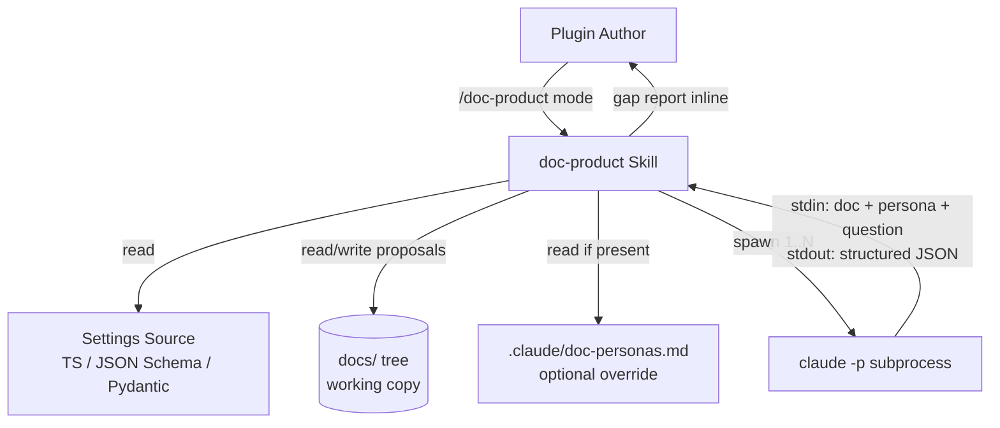
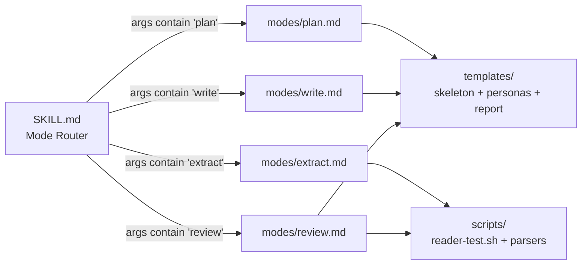
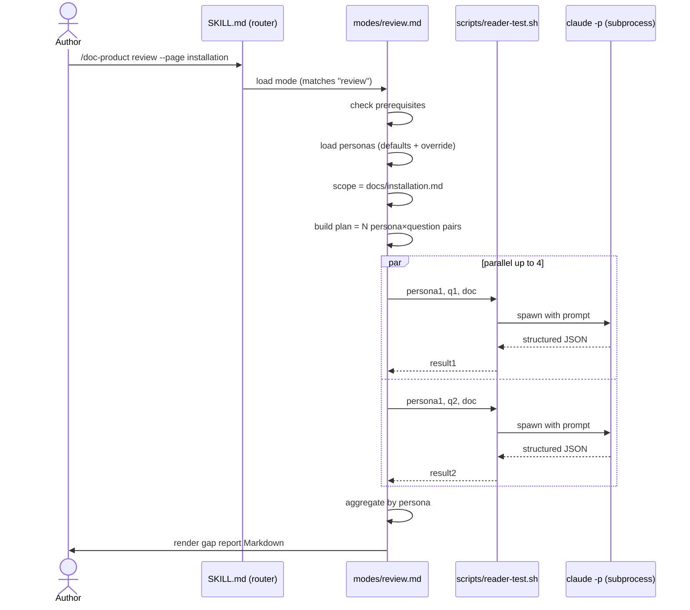

# Solution Design Document

## Validation Checklist

### CRITICAL GATES (Must Pass)

- [ ] All required sections are complete
- [ ] No [NEEDS CLARIFICATION] markers remain
- [ ] Architecture pattern is clearly stated with rationale
- [ ] **All architecture decisions confirmed by user**
- [ ] Every interface has specification

### QUALITY CHECKS (Should Pass)

- [ ] All context sources are listed with relevance ratings
- [ ] Project commands are discovered from actual project files
- [ ] Constraints → Strategy → Design → Implementation path is logical
- [ ] Every component in diagram has directory mapping
- [ ] Error handling covers all error types
- [ ] Quality requirements are specific and measurable
- [ ] Component names consistent across diagrams
- [ ] A developer could implement from this design

---

## Output Schema

### SDD Status Report

| Field | Type | Required | Description |
|-------|------|----------|-------------|
| specId | string | Yes | Spec identifier |
| architecture | ArchitectureSummary | Yes | Architecture overview |
| sections | SectionStatus[] | Yes | Status of each SDD section |
| adrs | ADRStatus[] | Yes | Architecture decision statuses |
| validationPassed | number | Yes | Validation items passed |
| validationPending | number | Yes | Validation items pending |
| nextSteps | string[] | Yes | Recommended next actions |

### ArchitectureSummary

| Field | Type | Required | Description |
|-------|------|----------|-------------|
| pattern | string | Yes | Selected architecture pattern |
| keyComponents | string[] | Yes | Main system components |
| externalIntegrations | string[] | No | External services integrated |

### SectionStatus / ADRStatus
(Same as template — omitted for brevity.)

---

## Constraints

CON-1 **Runtime mechanism = Skill, not Agent.** Per the L2 heuristics in `docs/about/skill-and-agent-design.md` (now wired into `decision-tree.md`): progressive disclosure (>200 LOC across modes), user-invocable, slash-command identity, and modes are sequential not parallel. The "Receptionist Pattern" sits inside `SKILL.md` as a mode-router rather than as a separate front-door agent.

CON-2 **No new agents.** v1 introduces zero subagents. Reader-test isolation is achieved at OS-process level via `claude -p`, which is cheaper, more isolated, and CI-portable compared to Agent-tool dispatch.

CON-3 **No persistence.** Per PRD: stateless reviews, no on-disk audit logs, no `.reader-test/` directory. Output is conversational only.

CON-4 **No telemetry.** No event collection, no aggregation. KPIs verified from artifacts that exist anyway.

CON-5 **TCS plugin conventions.** Skill must follow `plugins/tcs-helper/skills/skill-author/reference/conventions.md` (PICS layout, frontmatter, description format). Description must contain `Use PROACTIVELY` or `MUST BE USED` plus 2–5 trigger phrases per `~/.claude/rules/authoring.md`.

CON-6 **No auto-merge.** Per repo memory: skill must surface drafts and proposals in the working tree; never auto-commit to `main`.

CON-7 **Source-language coverage v1.** Settings extraction supports TypeScript interfaces, JSON Schema, and Pydantic / dataclass models. Other languages out of v1.

CON-8 **`claude` CLI prerequisite.** `review` mode requires the `claude` CLI installed and authenticated. Skill must check this prerequisite before running and exit with a clear error if missing.

CON-9 **Bash 3.2 compatibility.** Per Marcus's global standards (`~/Kouzou/standards/guardrails.md`): all bash scripts must run on macOS's default Bash 3.2 — no associative arrays, no process-substitution-only patterns.

## Implementation Context

**IMPORTANT**: An implementer MUST read every context source below before writing code.

### Required Context Sources

#### Documentation Context

```yaml
- doc: docs/about/skill-and-agent-design.md
  relevance: HIGH
  why: "L2 heuristics for the mode-router-vs-agent decision; the architecture rationale lives here"

- doc: plugins/tcs-helper/skills/skill-author/reference/conventions.md
  relevance: CRITICAL
  why: "PICS structure, frontmatter rules, and skill quality conventions this skill must follow"

- doc: plugins/tcs-helper/skills/skill-author/reference/decision-tree.md
  relevance: HIGH
  why: "Mechanism Check + Granularity Patterns — confirms why this is a skill not an agent"

- doc: plugins/tcs-helper/skills/agent-author/reference/conventions.md
  relevance: MEDIUM
  why: "Reference for any future v2 agent-author conversion if the boundary shifts"

- doc: docs/XDD/specs/010-doc-product-skill/requirements.md
  relevance: CRITICAL
  why: "Source PRD — every Gherkin AC must trace to a runtime behaviour in this design"

- url: https://docs.anthropic.com/en/docs/claude-code/cli-reference (or current location)
  relevance: HIGH
  why: "claude -p (headless mode) flag reference and structured output options"

- doc: https://github.com/anthropics/skills/blob/main/skills/doc-coauthoring/SKILL.md
  relevance: MEDIUM
  why: "Reader-test pattern source; Anthropic's manual version is the inspiration for the automated v1"
```

#### Code Context

```yaml
- file: plugins/tcs-helper/skills/skill-author/SKILL.md
  relevance: HIGH
  why: "Reference SKILL.md structure (PICS + Workflow) to mirror for doc-product"

- file: plugins/tcs-helper/skills/memory-add/SKILL.md
  relevance: MEDIUM
  why: "Lightweight tcs-helper skill example; shows minimal frontmatter and short workflow"

- file: plugins/tcs-helper/skills/finish-branch/SKILL.md
  relevance: MEDIUM
  why: "Bash-orchestrated skill example — shows tool budget and bash invocation patterns"

- file: plugins/tcs-helper/plugin.json
  relevance: HIGH
  why: "Plugin manifest where the new skill must be registered (auto-discovery via skills/ directory)"

- file: ~/.claude/rules/authoring.md
  relevance: HIGH
  why: "User-global authoring rules — description quality, tool minimalism, model choice"
```

#### External APIs

```yaml
- service: claude (CLI, headless mode)
  doc: claude --help; claude -p --help
  relevance: HIGH
  why: "review mode core dependency. Specifically: -p flag for headless prompt, --output-format json for structured output"
```

### Implementation Boundaries

- **Must Preserve**: Existing tcs-helper skills (`skill-author`, `memory-*`, `finish-branch`, etc.) and their frontmatter conventions.
- **Can Modify**: `plugins/tcs-helper/plugin.json` (version bump on adding new skill — per memory `feedback_no-manual-marketplace-sync`); root CLAUDE.md if new design references are needed (already done in wiring branch).
- **Must Not Touch**: `main` branch directly (block-main-edits hook); other plugins (`tcs-team`, `tcs-workflow`, `tcs-patterns`, `plugin-dev`); any `~/.claude/plugins/cache/` or `~/.claude/plugins/marketplaces/` paths (per `feedback_no-manual-marketplace-sync`: bump version + push instead).

### External Interfaces

#### System Context Diagram



#### Interface Specifications

```yaml
inbound:
  - name: "Skill invocation by main conversation"
    type: Skill tool
    format: $ARGUMENTS string (mode + optional flags)
    authentication: N/A — Claude Code internal
    data_flow: "User prompt → mode dispatch → mode body"

outbound:
  - name: "claude -p (headless Claude)"
    type: subprocess (Bash)
    format: stdin: text prompt; stdout: JSON when --output-format json
    authentication: Inherited from author's claude CLI auth (API key / OAuth)
    criticality: HIGH — review mode does not function without it

data:
  - name: "Author's working copy"
    type: filesystem (read + propose-write)
    connection: Read / Write tools
    data_flow: "Read source files (settings, manifest), write or propose docs/<page>.md"

  - name: ".claude/doc-personas.md (optional)"
    type: filesystem (read-only)
    connection: Read tool
    data_flow: "Project-specific persona overrides"
```

### Cross-Component Boundaries

N/A — single-skill, single-process design. No inter-component contracts.

### Project Commands

```bash
# Existing project commands (TCS repo)
Install: npm install -g @anthropic-ai/claude-code  # for claude CLI
Test:    bash plugins/tcs-helper/skills/<skill>/scripts/<test>.sh  # ad-hoc skill tests
Lint:    N/A — Markdown + Bash, no linter pipeline configured
Build:   N/A — skills are installed via plugin marketplace

# Skill-specific commands (introduced by this spec)
Smoke:   ./plugins/tcs-helper/skills/doc-product/scripts/reader-test.sh \
           --doc <path> --persona "<name>" --question "<text>"
```

## Solution Strategy

- **Architecture Pattern**: Single skill with **mode-router (Receptionist) pattern**. `SKILL.md` is the entry point; reads `$ARGUMENTS` to select a mode; defers to one of `modes/{plan,write,extract,review}.md` (progressive-disclosure references). Each mode body is loaded by Claude only when that mode is selected.
- **Integration Approach**: Native Claude Code skill in the `tcs-helper` plugin. Auto-discovered via the plugin's `skills/` directory. User-invocable via `/doc-product <mode>` (slash framing) and auto-trigger via description match.
- **Justification**: All four L1 mechanism criteria (load-bearing question + Q1–Q7) point to Skill. All four L2 extract gates hold (multi-mode → progressive disclosure; user-invocable; slash identity). The L2 consolidation gates do **not** support keeping modes as separate agents — modes are sequential, share domain context (the docs/ tree), and never need parallel dispatch with different output schemas. See ADR-1.
- **Key Decisions**:
  - Mode router lives in `SKILL.md`, not a separate `router.md`, to keep the entry point single-file (matches `skill-author`, `memory-add`, etc.).
  - Reader test is a Bash script in `scripts/`, invoked by `modes/review.md` via the `Bash` tool, not a Claude-tool subagent. See ADR-2.
  - No mode-specific agents, no auxiliary skills, no telemetry hooks. Anything we don't need in v1 stays out.

## Building Block View

### Components



### Directory Map

**Component**: `doc-product` skill

```
plugins/tcs-helper/skills/doc-product/
├── SKILL.md                     # NEW: Mode router + entry point. Frontmatter + PICS sections.
├── modes/
│   ├── plan.md                  # NEW: Repo analysis + skeleton proposal logic
│   ├── write.md                 # NEW: Section-by-section page drafting workflow
│   ├── extract.md               # NEW: Settings parser orchestration + configuration.md output
│   └── review.md                # NEW: Persona load + reader-test orchestration + gap report rendering
├── templates/
│   ├── skeleton-obsidian.md     # NEW: Default docs/ skeleton for Obsidian plugin repos
│   ├── skeleton-python.md       # NEW: Default docs/ skeleton for Python tool repos
│   ├── skeleton-tcs-plugin.md   # NEW: Default docs/ skeleton for TCS plugin repos
│   ├── skeleton-generic.md      # NEW: Repo-agnostic default skeleton
│   ├── personas-default.md      # NEW: Built-in personas (first-time installer, config explorer, troubleshooter, migrator)
│   ├── configuration-template.md# NEW: Output structure for `extract` mode
│   └── gap-report-template.md   # NEW: Markdown structure for `review` output
├── scripts/
│   ├── reader-test.sh           # NEW: Bash 3.2 compatible. Spawns claude -p, parses JSON, aggregates.
│   ├── parse-ts-settings.sh     # NEW: TS interface → settings table extractor
│   ├── parse-jsonschema.sh      # NEW: JSON Schema → settings table extractor
│   └── parse-pydantic.sh        # NEW: Python class → settings table extractor (uses python -c inline)
└── reference/
    ├── conventions.md           # NEW: doc-product-specific conventions (page section structures per page type)
    └── claude-p-contract.md     # NEW: claude -p invocation contract, JSON schema, error handling

# Plugin manifest (must be modified)
plugins/tcs-helper/plugin.json   # MODIFY: bump version (semver minor); skill auto-discovered via directory
```

### Interface Specifications

#### Skill Frontmatter Contract

```yaml
# plugins/tcs-helper/skills/doc-product/SKILL.md frontmatter
---
name: doc-product
description: |
  Use PROACTIVELY when authoring or reviewing user-facing documentation
  (README, configuration, troubleshooting, FAQ pages). MUST BE USED when
  the user asks to plan a docs/ tree, draft a doc page, extract a configuration
  reference from settings code, or run a reader test against existing docs.
  Trigger phrases: "plan docs", "write configuration page", "review my docs",
  "extract settings into doc", "reader-test the README".
allowed-tools: Read, Write, Edit, Glob, Grep, Bash, AskUserQuestion
---
```

Notes:
- No `model:` field — defaults to inherited; complexity is moderate, no Opus rationale, no Haiku scope.
- No `disable-model-invocation` — auto-trigger is desired (description-driven).
- No `user-invocable: false` — explicitly user-invocable; `/doc-product` should appear in the slash menu.
- Tool budget rationale: Read/Glob/Grep for source/doc inspection; Write/Edit for proposing skeletons and configuration pages; Bash for `reader-test.sh` and parser scripts; AskUserQuestion for repo-type ambiguity and persona override choices.

#### Mode Routing Contract

`SKILL.md`'s Workflow section selects a mode by matching $ARGUMENTS:

```text
match ($ARGUMENTS, lowercased) {
  starts with "plan"     => load modes/plan.md, execute its Workflow
  starts with "write"    => load modes/write.md, execute its Workflow
  starts with "extract"  => load modes/extract.md, execute its Workflow
  starts with "review"   => load modes/review.md, execute its Workflow
  empty                  => AskUserQuestion: which mode? (plan / write / extract / review)
  unknown token          => Print supported modes, ask AskUserQuestion to disambiguate
}
```

#### Persona File Schema

**Design principle (per ADR-4 + 2026-05-06 clarification):** Default personas use **generic language** that works regardless of whether the project is an Obsidian plugin, a Python CLI, a TCS plugin, etc. The reader (`claude -p`) is told to extract project-specific framing from the document itself (e.g. it sees "Obsidian Plugin" in the doc title and frames its answer accordingly). Project-local overrides exist for edge cases where the defaults are too vague (e.g. cross-platform tools that need OS-specific reader tests).

**Each question declares its `pages:` context list** (per 2026-05-06 clarification on multi-page docs). The skill concatenates the listed pages and presents them as a single document corpus to `claude -p`. This tests both navigation (does README link correctly?) and content (does the topic page answer?) in one call.

```yaml
# templates/personas-default.md (built-in) and .claude/doc-personas.md (project override)
# YAML frontmatter optional; body is the canonical source.

personas:
  - id: first-time-installer
    required: true
    description: |
      Has never used this software. Wants to install it and verify it
      works. Knows their operating system but is not the project's developer.
    questions:
      - id: install
        required: true
        text: "How do I install this, step by step?"
        pages: [README.md, docs/installation.md]
      - id: verify-install
        required: true
        text: "After installing, how do I verify it is running correctly?"
        pages: [README.md, docs/installation.md]

  - id: config-explorer
    required: true
    description: |
      Has the software installed and is configuring it for their use case.
      Wants to understand a setting before changing it.
    questions:
      - id: setting-purpose
        required: true
        text: "Pick the most prominent configuration option in the document. What does it do, and what is its default?"
        pages: [docs/configuration.md]
      - id: setting-impact
        required: false
        text: "For that same setting, what happens if I leave it at its default?"
        pages: [docs/configuration.md]

  - id: troubleshooter
    required: true
    description: |
      Hit an error. Has the software installed and roughly configured.
      Wants to recover without contacting the author.
    questions:
      - id: common-error
        required: true
        text: "Pick the first error message or failure scenario described in the document. What does it mean and how do I fix it?"
        pages: [docs/troubleshooting.md]

  - id: migrator
    required: false
    description: |
      Coming from a similar tool. Wants to find equivalents.
    questions:
      - id: migration-path
        required: false
        text: "If the document references migrating from another tool, summarise how the migration works. If no migration is described, answer 'no migration documented'."
        pages: [README.md, docs/migration.md]
```

Notes:
- Page paths in `pages:` are resolved relative to the repo root (via `git rev-parse --show-toplevel`). Pages that don't exist are silently skipped (e.g. `docs/migration.md` may not exist for every project).
- Default `pages:` for built-in personas always includes `README.md` for navigation-style questions and the topic page for content-specific questions.
- Authors can override `pages:` per question in `.claude/doc-personas.md` for projects with non-standard layouts.

**Override mechanism**: see ADR-4. Default behaviour: `.claude/doc-personas.md` **replaces** the built-in defaults entirely (clean override); appending requires explicit `extends: defaults` directive in the override file.

#### claude -p Invocation Contract

Each invocation tests **one persona × one question × the question's declared `pages:` set**, concatenated as a single document corpus. This addresses multi-page docs structures (e.g. README.md + docs/installation.md) by feeding both as context — the reader can resolve links naturally because the linked content is in the prompt.

```bash
# Per persona × question invocation. The "DOCUMENT CORPUS" includes every
# page declared in the question's `pages:` list, concatenated with clear
# delimiters so the reader knows where each page begins and ends.

claude -p \
  --output-format json \
  --max-turns 1 \
  "$(cat <<EOF
You are simulating a real user reading documentation. You have NO context
about this project beyond what is in the DOCUMENT CORPUS below. You MUST
answer strictly from those pages. If something is implied but not explicit,
mark it as 'guessed'. If something is missing, mark it as 'unclear'.

PERSONA: ${persona_description}

DOCUMENT CORPUS (contains ${page_count} page(s) the reader has access to):

$(for page in "${pages[@]}"; do
  echo "===== BEGIN PAGE: ${page} ====="
  cat "${repo_root}/${page}" 2>/dev/null || echo "(page not found in repo)"
  echo "===== END PAGE: ${page} ====="
  echo
done)

QUESTION: ${question_text}

OUTPUT (JSON only, no prose):
{
  "found": "yes" | "partial" | "no",
  "answer": "<your best answer from the corpus>",
  "unclear": ["<item the corpus does not clearly explain>"],
  "guessed": ["<assumption you had to make>"],
  "page_used": "<the page where you found the answer, or null>"
}
EOF
)"
```

Required outcomes:
- Exit code 0 on successful completion (regardless of `found` value).
- Exit code non-zero on infrastructure failure (network, auth, timeout) — caller distinguishes.
- Per-call timeout: 60 seconds default; configurable via `READER_TEST_TIMEOUT` env var.
- The `page_used` field helps the gap report point the author at the page that did or didn't answer.

#### Gap Report Schema

Markdown rendered inline in the parent conversation. No file output.

```markdown
# Reader-Test Gap Report

**Run:** <ISO 8601 timestamp>
**Pages tested:** <comma-separated list of page paths>
**Personas active:** <count> (defaults | project override at `.claude/doc-personas.md`)
**Outcome:** PASS | FAIL

## Summary

| Persona | Required | Pass / Total | Status |
|---------|----------|--------------|--------|
| first-time-installer | yes | 2 / 2 | PASS |
| config-explorer      | yes | 1 / 1 | PASS |
| troubleshooter       | yes | 0 / 1 | **FAIL** |
| migrator             | no  | 0 / 1 | (informational) |

## Failing required findings

### troubleshooter — `common-error`
**Page:** `docs/troubleshooting.md`
**Question:** "I see [COMMON_ERROR] — what does that mean and how do I fix it?"
**Found:** `no`
**Reader's answer (verbatim):** "The document does not describe what error message [COMMON_ERROR] means."
**Unclear:** ["how to recover from common errors", "what error codes the plugin produces"]
**Guessed:** []

**Suggested fix (author):** Add a `## Common errors` section to `docs/troubleshooting.md` covering at least: `[COMMON_ERROR_1]`, `[COMMON_ERROR_2]`. Re-run `/doc-product review --page troubleshooting`.

## Optional findings (informational)
[…]

## Infrastructure errors (if any)
[…]
```

#### Data Storage Changes

N/A — this skill is stateless. No database, no on-disk state files, no caches.

#### Internal API Changes

N/A — no application APIs introduced. The "interfaces" of this skill are: the mode dispatch contract, the persona schema, the `claude -p` invocation contract, and the gap report schema (all documented above).

#### Application Data Models

N/A — no application data models. Personas, gap reports, and configuration tables are document schemas defined above.

#### Integration Points

```yaml
# Inter-Component Communication: N/A — single skill, single mode at a time.

# External System Integration
claude_cli_headless:
  - doc: reference/claude-p-contract.md
  - sections: [invocation, output-format-json, exit-codes, timeout-handling]
  - integration: "review mode spawns claude -p subprocesses to simulate readers"
  - critical_data: [doc-page-content, persona-description, question-text, structured-json-response]
```

### Implementation Examples

#### Example: Mode Router (in SKILL.md)

**Why this example**: The mode router is the single most important interface in the skill. Getting this wrong breaks every mode.

```markdown
## Workflow

### 1. Parse Mode

Inspect $ARGUMENTS. Match the leading token (case-insensitive):

match (mode_token) {
  "plan"    => Read modes/plan.md, follow its Workflow.
  "write"   => Read modes/write.md, follow its Workflow.
  "extract" => Read modes/extract.md, follow its Workflow.
  "review"  => Read modes/review.md, follow its Workflow.
  ""        => AskUserQuestion: "Which mode? plan | write | extract | review"
  *         => Print recognised modes; ask via AskUserQuestion.
}

### 2. Hand Off

The selected mode file is the rest of the workflow. Do not re-implement
mode logic in this file — every mode owns its own Workflow.
```

#### Example: Reader-Test Bash Driver (Bash 3.2 compatible)

**Why this example**: This is the highest-risk implementation: subprocess orchestration, JSON parsing, error handling, and Bash 3.2 portability all in one script.

```bash
#!/usr/bin/env bash
# scripts/reader-test.sh — orchestrate one claude -p reader simulation
# Args: <persona-id> <question-id>
# The script resolves persona description, question text, and pages list
# from the active persona file (project override or built-in default).
# Requires: claude CLI (authenticated), jq, bash 3.2+

set -euo pipefail

PERSONA_ID="${1:?usage: $0 <persona-id> <question-id>}"
QUESTION_ID="${2:?}"
TIMEOUT="${READER_TEST_TIMEOUT:-60}"

REPO_ROOT="$(git rev-parse --show-toplevel 2>/dev/null || pwd)"

# Bash 3.2: no associative arrays. Helper functions parse the active
# persona file and emit description / question text / pages list via stdout.
# (Implementation details deferred to PLAN phase.)

PERSONA_DESC="$(parse_persona_block "$PERSONA_ID")"
QUESTION_TEXT="$(parse_question_text "$PERSONA_ID" "$QUESTION_ID")"
PAGES="$(parse_question_pages "$PERSONA_ID" "$QUESTION_ID")"  # newline-separated paths

# Build DOCUMENT CORPUS by concatenating each page with delimiters
CORPUS=""
PAGE_COUNT=0
while IFS= read -r page; do
  [ -z "$page" ] && continue
  PAGE_COUNT=$((PAGE_COUNT + 1))
  CORPUS+="===== BEGIN PAGE: ${page} =====
"
  if [ -f "${REPO_ROOT}/${page}" ]; then
    CORPUS+="$(cat "${REPO_ROOT}/${page}")"
  else
    CORPUS+="(page not found in repo)"
  fi
  CORPUS+="
===== END PAGE: ${page} =====

"
done <<< "$PAGES"

PROMPT=$(cat <<EOF
You are simulating a real user reading documentation. You have NO context
about this project beyond what is in the DOCUMENT CORPUS below. You MUST
answer strictly from those pages. If something is implied but not explicit,
mark it as 'guessed'. If something is missing, mark it as 'unclear'.

PERSONA: $PERSONA_DESC

DOCUMENT CORPUS (contains $PAGE_COUNT page(s) the reader has access to):

$CORPUS

QUESTION: $QUESTION_TEXT

OUTPUT (JSON only, no prose):
{
  "found": "yes" | "partial" | "no",
  "answer": "<your best answer from the corpus>",
  "unclear": ["<item the corpus does not clearly explain>"],
  "guessed": ["<assumption you had to make>"],
  "page_used": "<the page where you found the answer, or null>"
}
EOF
)

# Invoke headless claude with timeout
RESULT="$(timeout "$TIMEOUT" claude -p --output-format json --max-turns 1 "$PROMPT")" \
  || { echo '{"found":"no","answer":null,"unclear":["reader-test infrastructure error"],"guessed":[],"page_used":null,"error":"timeout_or_invocation_failure"}'; exit 0; }

# Validate JSON shape; fall back to infrastructure error on malformed output
echo "$RESULT" | jq -e '.found' >/dev/null 2>&1 \
  || { echo '{"found":"no","answer":null,"unclear":["reader-test malformed response"],"guessed":[],"page_used":null,"error":"unparseable_response"}'; exit 0; }

echo "$RESULT"
```

#### Example: Settings Parser (TypeScript interface → table)

**Why this example**: TS parsing is the v1 highest-value extract source. The shape of the parser informs how fields map to the doc table.

```bash
# scripts/parse-ts-settings.sh — extract Settings interface fields to a structured table
# Strategy: regex-match the interface block, then per-line extract: name, type, optional flag, default (if = literal),
#          and JSDoc comment block immediately preceding the field.
# Output: TSV: <name>\t<type>\t<default>\t<description>

# (Detailed regex strategy TBD in implementation phase — extract simplifies enormously when
#  the source uses a single Settings interface block; multi-interface unions handled via
#  AskUserQuestion to disambiguate which interface is the user-facing settings.)
```

#### Test Examples as Interface Documentation

```bash
# Smoke test: full reader-test on a known-bad doc
$ ./scripts/reader-test.sh docs/installation.md first-time-installer install-macos
{"found":"yes","answer":"Run brew install plugin-x and reload Obsidian.","unclear":[],"guessed":[]}

$ ./scripts/reader-test.sh docs/incomplete.md first-time-installer install-macos
{"found":"no","answer":"The document does not specify macOS installation.","unclear":["macos install command"],"guessed":[]}

$ ./scripts/reader-test.sh /nonexistent.md first-time-installer install-macos
# exits non-zero with clear error
```

## Runtime View

### Primary Flow: `review` mode (the most complex flow)

#### Primary Flow: Run reader test on a docs page

1. User invokes `/doc-product review` (optionally `--page <name>` or `--since <ref>`).
2. `SKILL.md` parses mode, hands off to `modes/review.md`.
3. `modes/review.md` checks prerequisites (claude CLI present, authenticated; jq installed).
4. Loads personas: built-in defaults + `.claude/doc-personas.md` override (replace, per ADR-4).
5. Resolves docs scope: all `docs/*.md` (default), `docs/<name>.md` (`--page`), or git-diff-changed pages (`--since`).
6. Builds work plan: a list of persona × question pairs (each question carries its own `pages:` corpus).
7. Executes plan via `scripts/reader-test.sh` invoked once per tuple. Uses Bash backgrounding (`&`) and `wait` to parallelise within an author-specified concurrency limit (default 4 parallel).
8. Aggregates JSON results into the gap report data structure.
9. Renders gap report Markdown inline in the parent conversation per `templates/gap-report-template.md`.
10. If any required persona fails any required question: returns FAIL summary; in non-interactive context, sets caller-visible exit signal.



### Error Handling

| Error | Detection | Response |
|-------|-----------|----------|
| `claude` CLI missing | `command -v claude` returns nothing | Mode `review` exits before any subprocess call with: "review mode requires the `claude` CLI; install via `npm install -g @anthropic-ai/claude-code` and authenticate with `claude /login`" |
| `claude` not authenticated | Headless invocation returns auth error | Surface stderr to user; suggest `claude /login`; exit cleanly |
| `claude -p` subprocess timeout | `timeout` command kills child after 60s | Record finding as `infrastructure_error: timeout`; continue remaining tuples; surface count in summary |
| `claude -p` returns malformed JSON | `jq` parse fails | Record finding as `infrastructure_error: unparseable_response`; continue remaining tuples |
| Persona file malformed | Required fields missing on parse | Refuse to start; report which persona / which field is broken |
| Persona has zero questions | Empty `questions:` block | Refuse to start (per PRD edge case); identify offending persona |
| Doc page does not exist | `--page <name>` resolves to missing file | Refuse to start; list available pages in `docs/` |
| Parser dependency missing for detected source | Pre-parse `command -v` / `which` check fails | Per ADR-5: refuse to start that parser. Print explicit error: which dep is missing (e.g. `python3`, `jq`, `node`), why it is needed for this source type (e.g. "Pydantic settings extraction requires python3"), and the install command (e.g. `brew install python3` on macOS). Never degrade silently or guess |
| Settings file unparseable in `extract` | Parser script returns non-zero or empty after dependency check passed | Output `[NEEDS REVIEW]` markers; don't fabricate; surface specific TypeScript / Pydantic constructs that failed |
| Network unavailable | `claude -p` returns network error | Same as auth — surface stderr; cleanly fail; do not partial-run |
| Rate limit hit mid-run | Subprocess returns rate-limit error | Record as infrastructure error; suggest reduced concurrency; surface count |

### Complex Logic

#### Algorithm: Aggregate gap report

```text
ALGORITHM: aggregate_findings(findings: List<TupleResult>) -> GapReport
INPUT: list of {persona_id, question_id, page, found, answer, unclear, guessed, error?}
OUTPUT: structured GapReport

1. PARTITION findings by error:
   - infra_errors = findings where error is set
   - clean = findings where error is unset

2. GROUP clean by persona_id

3. FOR each persona group:
   a. required_questions = questions where required=true for this persona
   b. results_for_required = clean entries matching required_questions
   c. pass_count = count where found=="yes"
   d. fail_count = count where found in ("partial", "no")
   e. if persona.required AND fail_count > 0:
        persona_status = "FAIL" (failures contribute to overall FAIL)
      else:
        persona_status = "PASS" or "informational" (not required)

4. overall_outcome = "FAIL" if any required persona has status FAIL, else "PASS"

5. emit GapReport per templates/gap-report-template.md
```

## Deployment View

### Single Application Deployment

- **Environment**: Claude Code skill runtime, host filesystem (macOS/Linux primary). No daemons.
- **Configuration**: Optional environment variables — `READER_TEST_TIMEOUT` (default 60), `READER_TEST_PARALLEL` (default 4).
- **Dependencies**:
  - `claude` CLI authenticated (review mode only)
  - `jq` installed (for JSON parsing in reader-test.sh)
  - Bash 3.2+ (default macOS Bash works)
  - For `extract` mode TS parser: no additional deps (regex-based)
  - For `extract` mode Pydantic parser: `python` 3.x available (uses inline `python -c`)
- **Performance**: Reader test cost dominates. With default 4 personas × ~2 questions per persona, the floor is roughly 8 `claude -p` calls per `review` run regardless of page count (each question declares its own pages corpus). `--page` filter narrows the scope at the question level when the author wants to test only a subset; default behaviour runs all questions whose `pages:` set intersects the touched docs.

### Multi-Component Coordination

N/A — single skill, no multi-component deployment.

### Plugin Manifest Update

- `plugins/tcs-helper/plugin.json` version bumps semver minor (e.g. 3.2.0 → 3.3.0). Per memory `feedback_no-manual-marketplace-sync`: bump and push, do not manually copy to cache.

## Cross-Cutting Concepts

### Pattern Documentation

```yaml
# Existing patterns used
- pattern: docs/about/skill-and-agent-design.md (Receptionist Pattern, mode-router)
  relevance: CRITICAL
  why: "Mode router in SKILL.md is the L2 pattern this design instantiates"

- pattern: plugins/tcs-helper/skills/skill-author/reference/conventions.md (PICS layout)
  relevance: CRITICAL
  why: "All TCS skill SKILL.md files follow Persona/Interface/Constraints/Reference + Workflow"

- pattern: progressive disclosure via reference/ and modes/ files
  relevance: HIGH
  why: "Mode bodies and reference docs load only when needed — keeps SKILL.md compact"

# New patterns introduced
- pattern: claude -p as a primitive for context-isolated reader simulation
  relevance: HIGH
  why: "First TCS skill to orchestrate headless Claude as a subprocess. Sets the precedent for how doc-stats, automated PR review, etc. can use the same primitive in v2."
```

### User Interface & UX

The "UI" of this skill is the conversation. ASCII flows omitted as they would be redundant with the Mermaid diagrams above. Key UX commitments:

- **No surprise file writes.** `plan` always proposes-then-confirms; `extract` always shows a diff; `write` always confirms section structure before drafting.
- **No invocation without prerequisite check.** `review` mode short-circuits with a clear error if `claude` CLI is missing.
- **Consistent slash framing.** `/doc-product <mode>` is the single user entry point. No surprise auto-trigger that mutates files.

### System-Wide Patterns

- **Security:** No credential handling; the `claude -p` subprocess inherits the author's existing CLI auth. Skill must not log or echo any auth-related env vars.
- **Error Handling:** Per error table above. All errors fail loud, never silent. Infrastructure errors are distinguished from genuine doc gaps in the gap report.
- **Performance:** Bounded concurrency (default 4) for `claude -p` parallelism. Timeout-per-call (60s default).
- **Logging:** Errors print to stderr via Bash; the parent conversation surfaces summary. No persistent log files.

### Multi-Component Patterns

N/A.

## Architecture Decisions

- [x] **ADR-1: Mode-router skill (not agent + sibling skills, not four sibling skills)**
  - **Choice:** Single skill `doc-product` with `SKILL.md` as Receptionist routing to `modes/{plan,write,extract,review}.md` via progressive disclosure.
  - **Rationale:** All four L2 extract gates from `skill-and-agent-design.md` hold (multi-mode body >200 LOC; user-invocable; slash-command identity; no parallel dispatch needed). The L2 consolidation gates do **not** support keeping modes as separate agents (modes are sequential, share the docs/ tree, never parallel-dispatched).
  - **Trade-offs:** Single description must cover four mode triggers — risk of being too generic. Mitigated by listing concrete trigger phrases in the description per `~/.claude/rules/authoring.md`. Alternative (one agent + four skills) was rejected because no sibling skill would have a second consumer, failing the multi-consumer extract gate.
  - **User confirmed:** **2026-05-06 (Marcus, batched confirmation).**

- [x] **ADR-2: Reader-test isolation via OS subprocess (`claude -p`), not via Agent tool dispatch**
  - **Choice:** `modes/review.md` invokes `scripts/reader-test.sh` (Bash) which spawns `claude -p` subprocesses per persona × question pair (each question carries its own `pages:` corpus), with bounded parallelism.
  - **Rationale:** `claude -p` provides true context isolation (separate session, separate auth state, separate token budget) at OS-process level — strictly stronger than Agent-tool's in-process subagent context. Also: (a) cheaper (no parent-context-share for token billing), (b) CI-portable (the same script works headless without Claude Code), (c) no Agent-tool round-trip overhead.
  - **Trade-offs:** Adds a hard prerequisite on the `claude` CLI being installed and authenticated. Mitigated by explicit prerequisite check before any subprocess call.
  - **User confirmed:** **2026-05-06 (Marcus, batched confirmation).**

- [x] **ADR-3: Stateless review (no persistence, no `.reader-test/` directory)**
  - **Choice:** Each `review` invocation is independent. Output renders inline in the parent conversation only. No on-disk audit log, no historical reports.
  - **Rationale:** Aligns with PRD scope decision (no telemetry, no persistence). Keeps the skill simple — no file lifecycle, no git-history pollution, no privacy considerations for reader-test prompts. v2 may revisit via a separate `tcs-helper:doc-stats` skill if cross-repo aggregation becomes valuable.
  - **Trade-offs:** No trend tracking. The author cannot easily compare "today's gap report" vs "last week's" without re-running. Acceptable because the doc set itself is the comparable artifact.
  - **User confirmed:** **2026-05-06 (Marcus, batched confirmation).**

- [x] **ADR-4: Persona override semantics — replace by default, opt-in extension**
  - **Choice:** When `.claude/doc-personas.md` exists, it **replaces** the built-in default personas entirely. To extend defaults, the project file declares `extends: defaults` at the top.
  - **Rationale:** Replacement is the simpler, more predictable default — what you see in the project file is exactly what runs. Extension semantics are useful but rare; making them opt-in keeps the no-override and full-override cases trivial.
  - **Trade-offs:** Authors who want to "just add one persona" must include the defaults in their project file (or use `extends:`). Slight friction; the alternative (default-augment) makes the behavior depend on a flag the author may forget.
  - **User confirmed:** **2026-05-06 (Marcus).**

- [x] **ADR-5: Extract-mode parser strategy — separate Bash scripts per source type, with explicit missing-dependency reporting**
  - **Choice:** v1 ships three independent parsers: `parse-ts-settings.sh`, `parse-jsonschema.sh`, `parse-pydantic.sh`. The dispatch in `modes/extract.md` selects based on detected source (file extension + presence checks). Common output format: TSV (name, type, default, description) → rendered to Markdown via a shared template.
  - **Rationale:** Keeps each parser focused and independently testable. v1 source coverage (TS + JSON Schema + Pydantic) is small enough that a unified parser would carry too many conditionals. Separate scripts also let v2 swap one parser (e.g. replace regex-based TS parser with `tsc --emitDeclarationOnly` + AST walk) without touching the others.
  - **Trade-offs:** Some logic duplication across parsers (e.g. emitting the shared TSV format). Mitigated by sharing the output template, not the parsing code. Alternative (one Python-based unified parser) was rejected because it adds a Python dependency for projects that have no Python in their stack.
  - **Constraint added (per Marcus 2026-05-06):** Each parser MUST detect its own runtime dependencies before parsing and surface a clear, actionable error to the author when one is missing. The error must name (a) the missing dependency, (b) why it is needed for this source type, and (c) the install command(s) for the author's platform. The skill MUST NOT silently degrade or guess. See ADR-5 acceptance criteria below.
  - **User confirmed:** **2026-05-06 (Marcus, with dependency-surfacing constraint).**

- [x] **ADR-6: Gap report — Markdown rendered inline, never persisted**
  - **Choice:** `modes/review.md` renders the gap report directly into the conversation Markdown stream per `templates/gap-report-template.md`. No file write.
  - **Rationale:** Consistent with ADR-3 (stateless). Author can copy the Markdown if they want to save it themselves; the skill does not own that lifecycle.
  - **Trade-offs:** Cannot diff between runs. Author who wants archival must copy/paste manually.
  - **User confirmed:** **2026-05-06 (Marcus, batched confirmation).**

- [x] **ADR-7: Mode slash-command granularity — only `/doc-product`, no per-mode shortcuts in v1**
  - **Choice:** Skill registers under a single name (`doc-product`). Modes are dispatched by argument (`/doc-product plan`, `/doc-product review`, …). No `/doc-plan`, `/doc-write`, `/doc-extract`, `/doc-review` aliases in v1.
  - **Rationale:** Keeps the `/` menu uncluttered. Author muscle memory is `/doc-product <verb>`, which mirrors the mode-router design. Per-mode shortcuts (a Could-Have from PRD) can be added in v2 without breaking v1 callers.
  - **Trade-offs:** Slightly more typing for power users. Author cannot tab-complete to `/doc-review` directly.
  - **User confirmed:** **2026-05-06 (Marcus).**

## Quality Requirements

- **Performance:** Reader test for a single page with default 4 personas × 2 questions completes in ≤ 60 seconds wall-clock (4 parallel calls × 60s timeout each, but typical successful calls return in 10–20s).
- **Usability:** Mode invocations either complete with a clear summary or fail with a clear error stating what's missing. No silent partial runs.
- **Security:** No credential or auth-token handling beyond inheriting the author's existing `claude` CLI auth. Skill body must not echo or log env vars matching `*_TOKEN`, `*_KEY`, `ANTHROPIC_*`.
- **Reliability:**
  - `extract` re-runs on unchanged sources produce byte-identical output (deterministic).
  - `review` re-runs on unchanged sources may differ in `claude -p` responses (model non-determinism); pass/fail outcome is stable when the doc clearly answers / clearly omits — only borderline cases drift.
  - Mode dispatch never crashes — unknown mode argument always falls through to AskUserQuestion.

## Acceptance Criteria

Translation of the PRD's 22 Gherkin acceptance criteria into EARS-format system criteria. Each PRD AC maps to one or more SDD criteria.

**Mode dispatch (covers PRD all features):**
- [ ] WHEN the user invokes `/doc-product` with a recognised mode token, THE SYSTEM SHALL load the matching `modes/<mode>.md` body and execute its Workflow.
- [ ] WHEN the user invokes `/doc-product` with no mode or an unrecognised token, THE SYSTEM SHALL list recognised modes via AskUserQuestion before proceeding.

**Plan mode (PRD F1):**
- [ ] WHEN `plan` mode runs against a repo with `manifest.json` (Obsidian), THE SYSTEM SHALL propose a `docs/` skeleton including `installation.md`, `configuration.md`, `usage.md`, `troubleshooting.md`.
- [ ] WHEN `plan` mode runs against a repo with `pyproject.toml` only (Python), THE SYSTEM SHALL propose the same minimum skeleton adapted to Python conventions.
- [ ] WHEN `plan` mode runs against a repo with `plugin.json` (TCS plugin), THE SYSTEM SHALL propose the minimum skeleton plus per-component reference pages.
- [ ] WHEN `plan` mode runs against a repo without a recognised manifest, THE SYSTEM SHALL ask the author for the project type before proposing.
- [ ] WHEN `plan` mode runs against a repo with an existing `docs/` directory, THE SYSTEM SHALL diff proposed-vs-existing and offer Keep / Replace / Merge per page.
- [ ] WHILE `plan` mode is creating files, THE SYSTEM SHALL write only empty placeholders with TODO headers — never fabricate content.

**Write mode (PRD F2):**
- [ ] WHEN `write <page>` is invoked on an empty placeholder, THE SYSTEM SHALL propose a section structure for that page type and confirm before drafting.
- [ ] WHEN drafting a section, THE SYSTEM SHALL ask targeted clarifying questions instead of fabricating details.
- [ ] WHEN the author iterates, THE SYSTEM SHALL preserve prior approved sections and only redraft the section under iteration.
- [ ] IF the author has iterated 3 times on a section without substantive change, THEN THE SYSTEM SHALL ask "can anything be removed?" before continuing.

**Extract mode (PRD F3):**
- [ ] WHEN `extract` runs against a TypeScript settings interface, THE SYSTEM SHALL produce `docs/configuration.md` with name, type, default, JSDoc-derived description, example value per field.
- [ ] WHEN `extract` runs against a JSON Schema, THE SYSTEM SHALL produce equivalent output.
- [ ] WHEN `extract` runs against a Pydantic / dataclass model, THE SYSTEM SHALL produce equivalent output adapted to Python conventions.
- [ ] WHEN `extract` re-runs after settings source changes, THE SYSTEM SHALL diff against existing `configuration.md` and surface changes for review rather than overwriting silently.
- [ ] IF a settings field has no description, THEN THE SYSTEM SHALL emit `[NEEDS DESCRIPTION]` rather than fabricating.
- [ ] WHILE running in v1, THE SYSTEM SHALL ignore manifest files (manifest.json, plugin.json, pyproject.toml metadata) for the purpose of `extract` — manifest-derived metadata is v2.
- [ ] WHEN `extract` detects a source type whose parser has a missing runtime dependency (e.g. Pydantic source detected but `python3` not on PATH), THE SYSTEM SHALL exit before parsing with a message naming (a) the missing dependency, (b) why this source type requires it, and (c) the platform-specific install command. The system SHALL NOT silently degrade, fall back to another parser, or fabricate output.

**Review mode (PRD F4 — most criteria):**
- [ ] WHEN `review` runs, THE SYSTEM SHALL load personas from `templates/personas-default.md` plus optional `.claude/doc-personas.md` per ADR-4.
- [ ] WHEN `review` runs, THE SYSTEM SHALL spawn one `claude -p` subprocess per persona × question (NOT per page — each question declares its own `pages:` list which is concatenated into the corpus for that single call), parallelised up to `READER_TEST_PARALLEL` (default 4).
- [ ] WHEN building the document corpus for a question, THE SYSTEM SHALL concatenate every page in the question's `pages:` list with explicit BEGIN/END delimiters; missing pages are surfaced as `(page not found in repo)` rather than skipping silently.
- [ ] WHEN a `claude -p` subprocess returns valid JSON, THE SYSTEM SHALL record `found`, `answer`, `unclear`, `guessed`, `page_used` in the gap report.
- [ ] THE SYSTEM SHALL use generic language in default personas — no project-type or OS hardcoding. Project-specific framing is the reader's responsibility (extracted from the corpus); project-specific personas live in `.claude/doc-personas.md` per ADR-4.
- [ ] IF any required persona reports `found: partial` or `found: no` on any required question, THEN THE SYSTEM SHALL mark the doc set FAIL.
- [ ] IF `review` runs in non-interactive context AND outcome is FAIL, THEN THE SYSTEM SHALL exit with non-zero status.
- [ ] IF a `claude -p` subprocess fails (timeout / unparseable / network), THEN THE SYSTEM SHALL record as infrastructure error and continue remaining tuples — final summary distinguishes infra failures from genuine gaps.
- [ ] THE SYSTEM SHALL NOT persist gap reports to disk — output is conversation-only per ADR-3 / ADR-6.

**Cross-cutting:**
- [ ] WHEN any mode requires the `claude` CLI but it is missing, THE SYSTEM SHALL exit before any subprocess invocation with a setup-instruction message.
- [ ] WHILE the skill is running on `main` / `master`, THE SYSTEM SHALL respect the project's `block-main-edits.sh` PreToolUse hook (no Write into tracked, ignored-by-default paths is needed).

## Risks and Technical Debt

### Known Technical Issues

- `claude -p` model non-determinism: the same persona × question pair (each question carries its own `pages:` corpus) may produce different `found` outcomes across runs. Borderline pages will show flaky pass/fail. Mitigation: keep persona questions concrete and binary ("how do I install?"), not interpretive ("is this doc good?").
- TS interface parsing via regex is fragile for advanced TypeScript constructs (intersection types, mapped types, conditional types). Mitigation: emit `[NEEDS REVIEW]` for unparseable fields rather than guess. v2 may switch to AST-based parsing.

### Technical Debt

None at v1 entry (greenfield). v2 deferrals catalogued in PRD Open Questions.

### Implementation Gotchas

- **Bash 3.2 quirks (macOS):** no `declare -A`, no `${var,,}` lowercasing, no `mapfile`. Use `tr` and `awk` instead. The `set -e -u -o pipefail` triple is fine but watch for `pipefail` interactions with intentional non-zero exits.
- **`claude -p` JSON output schema:** the `--output-format json` envelope shape may evolve; the script's `jq` selector should target documented top-level fields and degrade gracefully on unknown shape.
- **Concurrency vs rate limit:** at high `READER_TEST_PARALLEL` values, hitting Claude API rate limits is realistic. Default 4 is conservative; surface a warning if any rate-limit error is observed and suggest reducing.
- **Persona override file path resolution:** `.claude/doc-personas.md` must be resolved relative to the repo root, not the CWD where the skill is invoked. Use `git rev-parse --show-toplevel` to anchor.
- **`extract` mode + multi-interface TS source:** if the file declares multiple interfaces (e.g. `Settings` and `InternalState`), prompt via AskUserQuestion which one is user-facing settings.

## Glossary

### Domain Terms

| Term | Definition | Context |
|------|------------|---------|
| Reader test | A simulated reader (run via `claude -p`) reading a doc page and answering persona-tied questions, used as a doc-quality gate | The killer feature of `review` mode |
| Persona | A reader profile (id + description + questions, with required/optional flags) used to drive reader tests | Defined in `templates/personas-default.md` and overridable per project |
| Required persona / question | A persona or question whose `found: yes` is necessary for the doc set to PASS | Strict 100% threshold per PRD ADR |
| Mode router | The pattern where a single SKILL.md receives a mode argument and dispatches to a mode-specific body file via progressive disclosure | Architecture decided in ADR-1 |
| Receptionist Pattern | TCS architectural pattern: a single front-door routes incoming work to the right specialist | From `docs/about/skill-and-agent-design.md`; mode router is one instantiation |

### Technical Terms

| Term | Definition | Context |
|------|------------|---------|
| `claude -p` | Headless invocation of Claude CLI with a prompt; supports `--output-format json` for structured output | The primitive enabling reader-test automation |
| Progressive disclosure | Skill design pattern: SKILL.md stays compact; deep content lives in `reference/`, `modes/`, etc., loaded only when needed | Used here for mode bodies |
| PICS | Persona / Interface / Constraints / Reference Materials structure used in TCS skills | Conventions in `skill-author/reference/conventions.md` |
| Bash 3.2 | macOS default Bash version. Lacks associative arrays and several modern features | Constraint CON-9 |

### API/Interface Terms

| Term | Definition | Context |
|------|------------|---------|
| Mode argument | The first token of `$ARGUMENTS`, used by SKILL.md to dispatch | `/doc-product plan`, `/doc-product review`, etc. |
| Override file | `.claude/doc-personas.md` at repo root, replacing default personas per ADR-4 | Resolution via `git rev-parse --show-toplevel` |
| Gap report | The Markdown structure rendered by `review` mode summarising reader-test findings | Schema in template; rendered inline never persisted |
