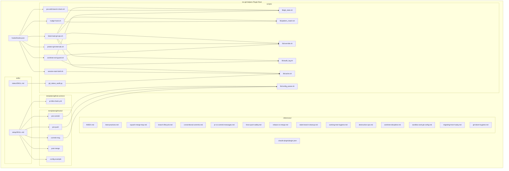
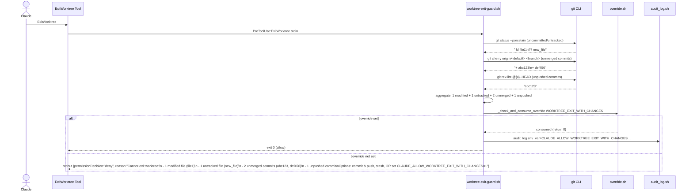
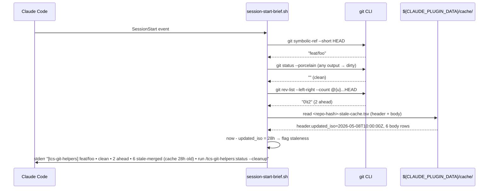

# Solution Design Document

## Validation Checklist

### CRITICAL GATES (Must Pass)

- [x] All required sections are complete
- [x] No [NEEDS CLARIFICATION] markers remain
- [x] Architecture pattern is clearly stated with rationale
- [x] **All architecture decisions confirmed by user** (12/12 ADRs confirmed)
- [x] Every interface has specification

### QUALITY CHECKS (Should Pass)

- [x] All context sources listed with relevance ratings
- [x] Project commands discovered from actual project files
- [x] Constraints → Strategy → Design → Implementation path is logical
- [x] Every component in diagram has directory mapping
- [x] Error handling covers all error types
- [x] Quality requirements are specific and measurable (per Performance research)
- [x] Component names consistent across diagrams
- [x] A developer could implement from this design
- [x] Implementation examples use bash 3.2 idioms verified against guardrails
- [x] Complex queries (squash-merge detection, override consumption) include traced walkthroughs

---

## Output Schema

### SDD Status Report

| Field | Value |
|-------|-------|
| specId | 011-tcs-git-helpers |
| architecture | Plugin-distributed event-driven hook system + repo-side defense-in-depth |
| sections | 11 sections, all COMPLETE |
| adrs | 12 ADRs total, all CONFIRMED |
| validationPassed | 15 / 15 critical+quality gates |
| validationPending | 0 |
| nextSteps | Proceed to PLAN phase |

---

## Constraints

CON-1 **macOS-first deployment.** Bash 3.2.57 is the macOS default `/bin/bash`. All hook scripts MUST be bash 3.2 compatible: no `${var,,}`, no `mapfile`/`readarray`, no associative arrays (`declare -A`), no `\b`/`\s` in `[[ =~ ]]` (use `[[:<:]]`/`[[:>:]]` and `[[:space:]]+`). `printf -v` IS available (bash 3.1+). See CON-9 for full regex constraints.

CON-2 **SessionStart hook hard limit: 300ms p99.** Empirical baseline 58ms; ~5× headroom. Mandate: pure bash, local-git-only, NO `gh` calls, cache-read-only.

CON-3 **No `coreutils timeout` dependency.** All timeout-needing sites use pure-bash `(cmd) & sleep 5; kill $!` pattern unconditionally (locked per PRD OQ1). Zero-install UX.

CON-4 **`gh` calls fail-open.** Hooks NEVER block on network or rate-limit failures. Truth table in §External Interfaces enforces "allow with stderr warning" when state cannot be determined.

CON-5 **No Boucle source vendoring.** Patterns from `Boucle-framework/{git-safe,branch-guard,worktree-guard}` are absorbed via re-implementation; references cite Boucle URLs.

CON-6 **Plugin lifecycle = trust signal.** Disabling the plugin waives Claude-side protection. `.githooks/` defense-in-depth keeps repo-side protection active. Documented as an explicit affordance, not a bug.

CON-7 **No `.git/config` writes from hooks.** Sandbox blocks them. Setup skill calls `git config core.hooksPath .githooks` ONCE (under user permission prompt). Subsequent operations use `git_safe()` helper to filter known-harmless `could not write config file .git/config` warnings.

CON-8 **Single-coder workflow.** No multi-contributor PR-review enforcement (locked per PRD OQ2). Branch-protection preset omits `required_pull_request_reviews`.

CON-9 **Bash 3.2 regex `[[:space:]]+` mandate.** All command-matching patterns MUST use `[[:space:]]+` — NEVER the PCRE-style `\s+` and NEVER literal space. Empirically verified on macOS bash 3.2.57: `\s` does not match in `[[ =~ ]]` (POSIX ERE; `\s` is a PCRE/Perl extension only). Word boundaries: use `[[:<:]]` / `[[:>:]]` (BSD POSIX) or anchor-based alternatives — NEVER `\b` (also a PCRE extension). Regression-prone; enforced via test corpus in T1.5/T2.1.

CON-10 **No filesystem state outside repo or `${CLAUDE_PLUGIN_DATA}`.** All caches and audit logs live in `${CLAUDE_PLUGIN_DATA}` (survives plugin updates). Repo `.git/info/exclude` may be touched once at setup but no per-operation writes.

## Implementation Context

### Required Context Sources

#### Documentation Context

```yaml
- doc: docs/XDD/ideas/2026-05-08-tcs-git-safety.md
  relevance: CRITICAL
  why: "Brainstorm artifact — original design rationale and gap-review decisions"

- doc: docs/XDD/specs/011-tcs-git-helpers/requirements.md
  relevance: CRITICAL
  why: "PRD with 13 features, 38+ Gherkin AC, 5 resolved OQs"

- doc: docs/XDD/specs/011-tcs-git-helpers/research/_synthesis.md
  relevance: CRITICAL
  why: "5-lens research synthesis with 3 conflicts resolved (C1-C3) and 10 design decisions locked (D1-D10)"

- doc: docs/XDD/specs/011-tcs-git-helpers/research/{requirements,technical,security,performance,integration}.md
  relevance: HIGH
  why: "Full per-lens research findings; performance baselines (58ms SessionStart), parser sketch, gh truth table"

- doc: docs/ai/external/claude/hooks.md
  relevance: HIGH
  why: "Cached Claude Code hooks reference: event names, matcher syntax, plugin-vs-user-global differences, ${CLAUDE_PLUGIN_ROOT}/${CLAUDE_PLUGIN_DATA}"

- doc: ~/Kouzou/standards/general.md
  relevance: HIGH
  why: "Branch-before-edit rule, push-every-10-commits, single-feature-per-change"

- doc: ~/Kouzou/standards/git-conventions.md
  relevance: MEDIUM
  why: "Conventional Commits format basis (M5)"

- doc: ~/Kouzou/standards/guardrails.md
  relevance: MEDIUM
  why: "Bash 3.2 quirks, hook gotchas"
```

#### Code Context

```yaml
- file: ~/.claude/hooks/block-main-edits.sh
  relevance: CRITICAL
  why: "Reference implementation for PreToolUse Edit/Write hook with ${CLAUDE_PLUGIN_ROOT}-style env-var escape and gitignore exemption; pre-edit-branch-check.sh inherits this shape and runs alongside (does not replace)"

- file: /Volumes/Moon/Coding/MiYo/Kado/.githooks/pre-commit
  relevance: HIGH
  why: "Baseline pre-commit with main-block + secret-detection; generalize via .githooks/.config exclusion list and shared lib/git_state.sh"

- file: /Volumes/Moon/Coding/MiYo/Kado/.githooks/commit-msg
  relevance: HIGH
  why: "Existing length validation; M5 extends with Conventional Commits regex"

- file: plugins/tcs-helper/hooks/hooks.json
  relevance: CRITICAL
  why: "Reference plugin hook registration pattern: three-level nested JSON, ${CLAUDE_PLUGIN_ROOT} usage, multi-event registration"

- file: plugins/tcs-helper/.claude-plugin/plugin.json
  relevance: HIGH
  why: "Plugin manifest schema precedent (name, version, description, author, keywords)"

- file: plugins/tcs-helper/scripts/
  relevance: MEDIUM
  why: "Python-based plugin scripts pattern; we follow for git_status_audit.py only"

- file: plugins/tcs-helper/CHANGELOG.md
  relevance: LOW
  why: "Versioning style precedent for plugin updates"

- file: scripts/get-startup-val.sh
  relevance: MEDIUM
  why: "TCS startup.toml resolution pattern; we follow for any plugin-side config reads"
```

#### External APIs

```yaml
- service: GitHub REST API (via gh CLI 2.88.1+)
  doc: https://docs.github.com/rest/branches/branch-protection
  relevance: HIGH
  why: "S1 --with-branch-protection: PUT /repos/{owner}/{repo}/branches/{branch}/protection and PATCH /repos/{owner}/{repo} delete_branch_on_merge"

- service: gh CLI (PR queries)
  doc: https://cli.github.com/manual/gh_pr_list
  relevance: CRITICAL
  why: "M1 push-to-closed-PR detection; M3 squash-merge resume detection; truth table in §External Interfaces"

- service: Claude Code Hooks API
  doc: https://code.claude.com/docs/en/hooks (cached docs/ai/external/claude/hooks.md)
  relevance: CRITICAL
  why: "Hook event lifecycle, matcher syntax, hookSpecificOutput.permissionDecision contract, ${CLAUDE_PLUGIN_ROOT} & ${CLAUDE_PLUGIN_DATA} env vars"

- service: Boucle-framework (prior art, not vendored)
  doc: https://github.com/Bande-a-Bonnot/Boucle-framework
  relevance: HIGH
  why: "Pattern source for git-safe (M7), branch-guard (M11), worktree-guard (M8); we re-implement per CON-5"
```

### Implementation Boundaries

- **Must Preserve**:
  - Existing `~/.claude/hooks/block-main-edits.sh` (runs alongside plugin hook; both deny)
  - Existing `MiYo/Kado/.githooks/{pre-commit,commit-msg}` baseline behavior — Phase 2 migration overlays our generalized templates
  - `tcs-helper` plugin (no shared state with new plugin)
  - `~/.claude/settings.json` user-global hook registrations (untouched)

- **Can Modify**:
  - `MiYo/Kado/.githooks/*` during Phase 2 migration (conflict detection per M10 acceptance criteria; `_outbox/` exception → `TCS_HOOK_EXCLUDE_PATHS_FILE`)
  - Other MiYo repos' `.githooks/` (Phase 3, fresh installs expected)
  - Per-repo `.git/config` `core.hooksPath` (set to `.githooks` once during setup)

- **Must Not Touch**:
  - `~/.claude/hooks/` (plugin lives in `${CLAUDE_PLUGIN_ROOT}`)
  - User's `.gitconfig` global aliases
  - Any non-targeted git internals
  - Other plugins' caches or data dirs

### External Interfaces

#### System Context Diagram

```mermaid
graph TB
    subgraph "Claude Code Session"
        Claude[Claude Agent]
        Tools[Bash / Edit / Write / NotebookEdit / ExitWorktree]
    end

    subgraph "tcs-git-helpers Plugin"
        Hooks[hooks/hooks.json]
        Scripts[scripts/*.sh + git_status_audit.py]
        Templates[templates/githooks/*]
        Refs[references/*.md]
        Skills[skills/{setup,status}/SKILL.md]
        PluginData[(${CLAUDE_PLUGIN_DATA}/cache + audit)]
    end

    subgraph "Repo (per-repo)"
        Githooks[.githooks/* + .config + exclude-paths]
        GitConfig[.git/config: core.hooksPath]
        WorkingTree[(working tree, refs)]
    end

    subgraph "External"
        GHAPI[GitHub REST API]
        GHCli[gh CLI 2.x]
    end

    Claude --> Tools
    Tools --> Hooks
    Hooks --> Scripts
    Scripts --> Refs
    Scripts --> PluginData
    Scripts --> GHCli
    GHCli --> GHAPI
    Scripts -.deny.-> Tools

    Skills --> Templates
    Templates --> Githooks
    Skills --> GitConfig

    Claude --> Tools
    Tools --> WorkingTree
    Githooks --> WorkingTree
    Githooks --> GHCli

    UserGlobalHook[~/.claude/hooks/block-main-edits.sh] --> Tools
```

#### Interface Specifications

```yaml
inbound:
  - name: "PreToolUse:Bash"
    type: Claude Code Hook (event)
    format: JSON via stdin (tool_input.command, etc.)
    authentication: n/a
    doc: docs/ai/external/claude/hooks.md
    data_flow: "Claude's Bash invocations intercepted before execution"

  - name: "PreToolUse:Edit|Write|NotebookEdit"
    type: Claude Code Hook
    format: JSON via stdin (tool_input.file_path, etc.)
    authentication: n/a
    doc: docs/ai/external/claude/hooks.md
    data_flow: "File-modification tool invocations intercepted"

  - name: "PreToolUse:ExitWorktree"
    type: Claude Code Hook (resolved per ADR-1)
    format: JSON via stdin
    authentication: n/a
    doc: docs/ai/external/claude/hooks.md
    data_flow: "Worktree exit attempts (blockable native tool)"

  - name: "SessionStart"
    type: Claude Code Hook
    format: JSON via stdin (no relevant fields for our use)
    authentication: n/a
    doc: docs/ai/external/claude/hooks.md
    data_flow: "Session start event with matchers startup|resume|clear|compact"

  - name: "PostToolUse:Bash"
    type: Claude Code Hook
    format: JSON via stdin (includes command + exit status — confirmed in PRD OQ10 runtime probe)
    authentication: n/a
    doc: docs/ai/external/claude/hooks.md
    data_flow: "After successful Bash command for nudge emission"

  - name: "Slash Commands"
    type: User invocation
    format: /tcs-git-helpers:setup [--update|--with-gha|--with-branch-protection]
    authentication: n/a
    doc: skills/setup/SKILL.md, skills/status/SKILL.md
    data_flow: "Marcus or Claude invokes; skill orchestrates"

outbound:
  - name: "git CLI"
    type: subprocess
    format: stdout/stderr
    authentication: n/a
    doc: standard git docs
    data_flow: "All branch/state queries, ref reads, cache writes via git plumbing"
    criticality: HIGH

  - name: "gh CLI"
    type: subprocess (with `timeout 5` bash-fallback)
    format: stdout JSON, exit codes 0/1/4
    authentication: gh auth (OAuth token, 'repo' scope minimum)
    doc: gh CLI manual + cached docs
    data_flow: "PR state queries (M1, M3, M6); branch protection (S1)"
    criticality: HIGH (fail-open per CON-4)

  - name: "Claude Code stdout (permissionDecision JSON)"
    type: JSON output to hook stdout
    format: {"hookSpecificOutput":{"hookEventName":"PreToolUse","permissionDecision":"deny","permissionDecisionReason":"…"}}
    authentication: n/a
    doc: docs/ai/external/claude/hooks.md
    data_flow: "Hook decisions returned to Claude Code for enforcement"
    criticality: CRITICAL

data:
  - name: "Plugin cache directory"
    type: Filesystem (${CLAUDE_PLUGIN_DATA}/cache/)
    connection: direct file IO (atomic mv writes; PID-file locks)
    doc: ADR-4
    data_flow: "stale-cache.tsv|.json (M4, M6); pr-state.json (60s TTL, M1)"

  - name: "Plugin audit directory"
    type: Filesystem (${CLAUDE_PLUGIN_DATA}/audit/)
    connection: append-only file IO with size-based rotation
    doc: ADR-7
    data_flow: "overrides.jsonl + .1/.2 rotations (M12)"

  - name: "Repo .githooks directory"
    type: Filesystem (<repo>/.githooks/)
    connection: managed by setup skill; read by git
    doc: M11 + ADR-10
    data_flow: "Hook scripts + .config + exclude-paths file"

  - name: "gh CLI cache"
    type: Filesystem (~/.config/gh, opaque to plugin)
    connection: gh CLI internal
    doc: gh CLI manual
    data_flow: "OAuth tokens (read-only by plugin)"
```

### Cross-Component Boundaries

- **API Contracts**:
  - `hookSpecificOutput.permissionDecision` JSON → contract with Claude Code (versioned by Claude Code)
  - `.githooks/*` hook scripts → contract with git (POSIX hooks)
  - `${CLAUDE_PLUGIN_DATA}/cache/*.json` schema → internal contract; v1.0 may evolve
  - `${CLAUDE_PLUGIN_DATA}/audit/overrides.jsonl` JSONL fields → frozen post-v1.0 (used by `/tcs-git-helpers:status --overrides`)

- **Team Ownership**: Marcus (single contributor); v1.0 has no other component owners

- **Shared Resources**:
  - `${CLAUDE_PLUGIN_DATA}` is plugin-scoped (per Claude Code architecture); not shared with other plugins
  - `gh` CLI auth state is global to user (shared with other tools using `gh`)

- **Breaking Change Policy**:
  - `.githooks/.config` schema: additive-only in minor versions; key removals require major version
  - Audit JSONL format: append-only fields; never break existing
  - Plugin manifest version follows semver; minor bump for new hooks, patch for fixes

### Project Commands

Discovered from `package.json` (none — TCS is markdown+bash+python repo), Makefile (none), and TCS conventions:

```bash
# Core Commands (TCS-style; bash + python)
Install:       n/a — plugin distributed via TCS marketplace; no install step in this repo
Dev (test plugin locally): claude --plugin-dir plugins/tcs-git-helpers
Reload:        /reload-plugins (within Claude Code session)
Test (bash):   bats tests/*.bats     (bats-core; ADR-8)
Test (python): python3 -m pytest tests/python/  (for git_status_audit.py)
Lint (bash):   shellcheck plugins/tcs-git-helpers/scripts/**/*.sh plugins/tcs-git-helpers/templates/githooks/*
Lint (py):     ruff check plugins/tcs-git-helpers/scripts/git_status_audit.py
Build:         n/a — no build step (interpreted scripts)

# Plugin-specific
Setup target repo:  /tcs-git-helpers:setup
Repo status:        /tcs-git-helpers:status [--brief|--cleanup|--json|--overrides]
Update repo:        /tcs-git-helpers:setup --update
```

## Solution Strategy

**Architecture Pattern: Plugin-distributed event-driven hook system + repo-side defense-in-depth.**

Three concentric protection layers:

1. **Inner ring — Plugin-internal Claude Code hooks** (`hooks/hooks.json` registrations): fire only when plugin is enabled. PreToolUse intercepts Bash/Edit/Write/NotebookEdit/ExitWorktree commands; SessionStart emits brief; PostToolUse emits nudges. Scripts referenced via `${CLAUDE_PLUGIN_ROOT}/scripts/*.sh`.
2. **Middle ring — Repo-local `.githooks/`** (installed per-repo by setup skill): fire git-side regardless of plugin state. Files committed to repo so Docker, CI, and other contributors are also protected. Templates copied with version markers; updates via `setup --update`.
3. **Outer ring — User-global `~/.claude/hooks/block-main-edits.sh`**: pre-existing baseline; continues to protect main edits universally even when plugin disabled in a repo.

**Integration Approach:**
- New TCS plugin `tcs-git-helpers` published to TCS marketplace (alongside `tcs-helper`, `tcs-workflow`, `tcs-team`, `tcs-patterns`)
- Per-repo install via `/tcs-git-helpers:setup` (idempotent, version-tracked)
- Optional GHA template (`--with-gha`) and branch-protection (`--with-branch-protection`) opt-ins

**Justification:**
- **Defense in depth** addresses CON-6 (plugin lifecycle = trust signal): disabling plugin gracefully degrades to git-side + user-global; no abrupt unprotected state
- **Bash hot-path / Python only for status backend** addresses CON-2 (300ms SessionStart): bash startup ~5ms vs python ~30ms cold; measured 58ms baseline gives 5× headroom
- **Plugin-internal hooks (not user-global)** per Marcus's revised architecture (SDD §Distribution & Lifecycle): plugin lifecycle IS the trust signal, decoupling hooks from plugin would surprise users
- **Single dispatcher per event/matcher** simplifies registration: one `block-bad-git-ops.sh` for Bash PreToolUse handles all 14 destructive patterns; one `pre-edit-branch-check.sh` handles Edit/Write/NotebookEdit
- **`.githooks/` committed in repo** addresses CON-6 + integration with non-Claude consumers

**Key Decisions** (all documented as ADRs in §Architecture Decisions):
- ADR-1: PreToolUse:ExitWorktree (resolved C1)
- ADR-2: Bash hot-path / Python cold-path split
- ADR-3: `.config` strict-allowlist parser using `printf -v` (no eval/source)
- ADR-4: Hybrid TSV+comment-header cache for SessionStart, JSON for skill consumption
- ADR-5: Override single-shot via env-var consumption + 5s sentinel file
- ADR-6: 60s push-state cache deduplicating Claude-side and `.githooks/pre-push` gh calls
- ADR-7: Audit log JSONL append-only at `${CLAUDE_PLUGIN_DATA}/audit/overrides.jsonl` with 1MB rotation
- ADR-8: bats-core for bash tests, pytest for git_status_audit.py
- ADR-9: `git cherry` primary squash-merge detection, `git rev-list --parents` cross-check (resolved C2)
- ADR-10: Setup-conflict abort policy (Husky/lefthook/pre-commit/simple-git-hooks)
- ADR-11: Block edits to `.githooks/*` and `.git/config` via `TCS_GIT_HELPERS_SETUP_ACTIVE` env-var sentinel
- ADR-12: Single-coder branch-protection preset (no PR-review-required)

## Building Block View

### Components



**Component Responsibilities:**

| Component | Responsibility | Single-Responsibility Test |
|---|---|---|
| `hooks/hooks.json` | Register hooks with Claude Code at plugin load | Only declarative; no logic |
| `scripts/lib/git_state.sh` | All branch/PR/working-tree state queries | Used by 4 hooks; no side effects beyond stderr logging |
| `scripts/lib/config_parser.sh` | Parse `.githooks/.config` strictly | No eval; only `printf -v` assignment to allowlisted keys |
| `scripts/lib/pattern_match.sh` | Bash regex helpers for command matching | POSIX ERE; no lookahead; tab+space tolerant |
| `scripts/lib/override.sh` | Detect, consume, sentinel-track override env-vars | Single-shot semantics centralized |
| `scripts/lib/cache.sh` | Read/write `${CLAUDE_PLUGIN_DATA}/cache/*` with PID-file locking | Atomic mv writes; never blocks reads |
| `scripts/lib/audit_log.sh` | Append-only JSONL writes with rotation | Failure does not block hook (CON-error-handling) |
| `scripts/block-bad-git-ops.sh` | PreToolUse:Bash dispatcher for 14+ destructive patterns | Regex match → call libs → return permissionDecision |
| `scripts/pre-edit-branch-check.sh` | PreToolUse:Edit/Write/NotebookEdit augment of block-main-edits | Adds squash-merge orphan warning beyond user-global hook |
| `scripts/protect-git-internals.sh` | PreToolUse:Edit/Write/NotebookEdit guard for `.githooks/*`, `.git/config`, `.git/hooks/*` | Allow if `TCS_GIT_HELPERS_SETUP_ACTIVE=1` else deny |
| `scripts/nudge-hook.sh` | PostToolUse:Bash success-only soft nudges | Pure bash, NO git/gh; per ADR — 60s same-nudge dedup |
| `scripts/session-start-brief.sh` | One-line session brief | Cache-read-only, no `gh`, ≤300ms |
| `scripts/worktree-exit-guard.sh` | PreToolUse:ExitWorktree four-check guard | uncommitted/untracked/unmerged/unpushed via `git cherry` |
| `scripts/git_status_audit.py` | Backend for `/tcs-git-helpers:status` | gh-aware mode; writes both TSV and JSON cache siblings |
| `templates/githooks/*` | Repo-local git hooks installed by setup | Each carries `# tcs-git-helpers: vX.Y.Z` marker on line 1 |
| `references/*.md` | Knowledge base cited from denial messages | Plugin-internal only (PRD OQ3); never installed in repos |
| `skills/setup/SKILL.md` | Idempotent per-repo install with conflict detection | Lock-file serialized; does NOT auto-commit |
| `skills/status/SKILL.md` | Repo state, stale-branch cleanup, override audit viewer | Uses git_status_audit.py backend |

### Directory Map

**Component**: `tcs-git-helpers` (the plugin itself, in this repo)

```
plugins/tcs-git-helpers/
├── .claude-plugin/
│   └── plugin.json                          # NEW: manifest (name, version 1.0.0, description, keywords)
├── README.md                                 # NEW: plugin overview, installation, basic usage
├── CHANGELOG.md                              # NEW: version history (1.0.0)
├── hooks/
│   └── hooks.json                            # NEW: PreToolUse:Bash, PreToolUse:Edit|Write|NotebookEdit,
│                                             #      PreToolUse:ExitWorktree, SessionStart, PostToolUse:Bash
├── scripts/
│   ├── lib/
│   │   ├── git_state.sh                      # NEW: branch state, PR query, working-tree state, base-branch detection
│   │   ├── config_parser.sh                  # NEW: strict KV parser with printf -v
│   │   ├── pattern_match.sh                  # NEW: bash regex helpers (POSIX ERE; no lookahead)
│   │   ├── override.sh                       # NEW: env-var detection + single-shot sentinel + audit
│   │   ├── cache.sh                          # NEW: cache read/write + PID-file locking
│   │   └── audit_log.sh                      # NEW: JSONL append + size-based rotation
│   ├── block-bad-git-ops.sh                  # NEW: Bash PreToolUse dispatcher (14+ patterns)
│   ├── pre-edit-branch-check.sh              # NEW: Edit/Write/NotebookEdit augment
│   ├── protect-git-internals.sh              # NEW: Edit/Write/NotebookEdit guard for .githooks/* and .git/*
│   ├── nudge-hook.sh                         # NEW: PostToolUse:Bash success-only nudges
│   ├── session-start-brief.sh                # NEW: SessionStart one-liner
│   ├── worktree-exit-guard.sh                # NEW: PreToolUse:ExitWorktree four-check
│   └── git_status_audit.py                   # NEW: skill backend (Python, gh-aware, JSON+TSV writer)
├── templates/
│   ├── githooks/
│   │   ├── pre-commit                        # NEW: protected-branch + secrets + .config exclusions
│   │   ├── pre-push                          # NEW: gh-checked PR-state with bash-fallback timeout
│   │   ├── commit-msg                        # NEW: Conventional Commits + length check
│   │   ├── post-merge                        # NEW: stale-branch suggestion + brief re-emit + cache update
│   │   └── .config.example                   # NEW: empty template with comment hints
│   └── github-actions/
│       └── pr-title-check.yml                # NEW: optional GHA (S2)
├── references/
│   ├── INDEX.md                              # NEW: topical index
│   ├── best-practices.md                     # NEW: landing page (per Marcus's brainstorm note)
│   ├── squash-merge-trap.md                  # NEW: Marcus's existing finding, formalized
│   ├── branch-lifecycle.md                   # NEW
│   ├── conventional-commits.md               # NEW
│   ├── pr-vs-commit-messages.md              # NEW
│   ├── force-push-safety.md                  # NEW
│   ├── rebase-vs-merge.md                    # NEW
│   ├── stale-branch-cleanup.md               # NEW
│   ├── working-tree-hygiene.md               # NEW
│   ├── destructive-ops.md                    # NEW: cites Boucle URLs
│   ├── worktree-discipline.md                # NEW: cites Boucle worktree-guard
│   ├── sandbox-and-git-config.md             # NEW: known sandbox interactions
│   ├── migrating-from-husky.md               # NEW: setup-conflict migration doc
│   └── gh-token-hygiene.md                   # NEW: token scope warnings before --with-branch-protection
├── skills/
│   ├── setup/
│   │   └── SKILL.md                          # NEW: /tcs-git-helpers:setup
│   └── status/
│       └── SKILL.md                          # NEW: /tcs-git-helpers:status
└── tests/
    ├── bats/
    │   ├── block-bad-git-ops.bats            # NEW
    │   ├── pre-edit-branch-check.bats        # NEW
    │   ├── protect-git-internals.bats        # NEW
    │   ├── nudge-hook.bats                   # NEW
    │   ├── session-start-brief.bats          # NEW
    │   ├── worktree-exit-guard.bats          # NEW
    │   ├── lib_config_parser.bats            # NEW: strict-parser security corpus
    │   ├── lib_git_state.bats                # NEW
    │   ├── lib_override.bats                 # NEW: single-shot semantics
    │   ├── lib_cache.bats                    # NEW: lock contention
    │   ├── lib_audit_log.bats                # NEW: rotation + write-failure
    │   ├── githooks_pre_commit.bats          # NEW: template tests
    │   ├── githooks_pre_push.bats            # NEW
    │   ├── githooks_commit_msg.bats          # NEW
    │   └── githooks_post_merge.bats          # NEW
    ├── python/
    │   └── test_git_status_audit.py          # NEW: pytest for backend
    └── fixtures/
        ├── repos/                            # NEW: synthetic test repos with known states
        ├── commands/destructive_corpus.txt   # NEW: regex evasion test corpus
        └── configs/{good,bad,malicious}.config # NEW: parser test cases
```

**Component**: per-repo `.githooks/` (installed by setup skill into MiYo repos and others)

```
<repo>/
└── .githooks/
    ├── pre-commit                            # COPIED from templates with version marker
    ├── pre-push                              # COPIED
    ├── commit-msg                            # COPIED
    ├── post-merge                            # COPIED
    ├── .config.example                       # COPIED (template; user may rename to .config)
    ├── .config                               # USER-CREATED: per-repo overrides
    ├── exclude-paths                         # USER-MAINTAINED: one path glob per line
    └── .setup.lock                           # TRANSIENT: PID-file during setup; removed on completion
```

### Interface Specifications

#### Interface Documentation References

```yaml
interfaces:
  - name: "Claude Code Hook permissionDecision"
    doc: docs/ai/external/claude/hooks.md
    relevance: CRITICAL
    sections: [PreToolUse_response_format, hookSpecificOutput]
    why: "All Claude-side denial responses use this contract"

  - name: ".githooks/.config schema"
    doc: §.githooks/.config Schema below (NEW)
    relevance: CRITICAL
    sections: [allowlist_keys, value_validation_per_key]
    why: "Defines repo-local configuration surface; security-critical (parser-injection avoidance)"

  - name: "${CLAUDE_PLUGIN_DATA}/audit/overrides.jsonl format"
    doc: §Audit Log Schema below (NEW)
    relevance: HIGH
    sections: [jsonl_fields, rotation_strategy]
    why: "Frozen post-v1.0; consumed by /tcs-git-helpers:status --overrides"

  - name: "${CLAUDE_PLUGIN_DATA}/cache/*.tsv|.json format"
    doc: §Cache Schemas below (NEW)
    relevance: HIGH
    sections: [stale_cache_format, pr_state_cache_format]
    why: "Hot-path read by SessionStart; format chosen for parse-without-jq"

  - name: "gh CLI exit code truth table"
    doc: research/integration.md §2 + research/_synthesis.md C2
    relevance: CRITICAL
    sections: [pr_list_exit_codes, fail_open_logic]
    why: "M1, M3, S1 all depend on this contract"
```

#### Data Storage Changes

**No database schema changes.** All persistent state is filesystem (JSONL audit + TSV/JSON caches in `${CLAUDE_PLUGIN_DATA}`, hook scripts in `.githooks/`).

Schema documents inline below.

##### `.githooks/.config` Schema

Strict KV format. Allowlisted keys only. Parsed by `lib/config_parser.sh` using `printf -v` (NO eval/source).

```sh
# Recognized keys (parser rejects unknown KEYs with a stderr warning)
TCS_PROTECTED_BRANCHES         # |-separated; default "main|master|production|release"
TCS_HOOK_EXCLUDE_PATHS_FILE    # path; default ".githooks/exclude-paths"
TCS_ALLOWED_COMMIT_TYPES       # space-separated; default "feat fix docs style refactor test chore perf revert build ci"
TCS_REQUIRE_SCOPE              # 0|1; default 0
TCS_MAX_SUBJECT_LENGTH         # integer 1-9999; default 90
TCS_ENABLE_CONVENTIONAL_CHECK  # 0|1; default 1
TCS_ENABLE_PR_PUSH_CHECK       # 0|1; default 1
# NOTE: TCS_ALLOW_AMEND_ON_PROTECTED was previously specified here but has been removed.
# Amend exemption has moved to the Claude-side block-bad-git-ops.sh layer per deviation D1
# (phase-4.md). The pre-commit hook cannot reliably detect --amend on git 2.50.1:
# GIT_REFLOG_ACTION is empty, ORIG_HEAD absent, ps-tree fails. Repo-side hook is
# intentionally strict (defense-in-depth): blocks ALL protected-branch commits.
```

**Per-line grammar (regex):** `^[A-Z][A-Z0-9_]{0,63}=.{0,256}$` (key allowlist + 256-char value cap). Values quoted (`"..."` or `'...'`) have outer pair stripped. Each KEY's VALUE is validated against a key-specific regex (e.g., booleans `^[01]$`, integers `^[0-9]{1,4}$`).

**Rejection MUST list (test corpus, see security.md §4):**
- `KEY=$(rm -rf ~)` — command substitution
- `KEY=`backtick`evil`backtick`` — backticks
- `KEY=value\nMALICIOUS=1` — newline injection
- `EVIL=1` — unknown key
- `TCS_REQUIRE_SCOPE=true` — wrong type
- `TCS_HOOK_EXCLUDE_PATHS_FILE=../../etc/passwd` — path traversal

##### `${CLAUDE_PLUGIN_DATA}/audit/overrides.jsonl` Schema

Append-only JSONL. One event per line. Frozen post-v1.0.

```json
{"ts":"2026-05-09T14:23:11Z","repo":"/Volumes/Moon/Coding/MiYo/Kado","branch":"feat/foo","hook":"block-bad-git-ops","env_var":"CLAUDE_ALLOW_PUSH_TO_CLOSED_PR","master":false,"command":"git push origin feat/foo","pattern":"git[[:space:]]+push[[:>:]]","tool_input_truncated":false}
```

| Field | Type | Notes |
|---|---|---|
| `ts` | RFC3339 UTC | from `date -u +%Y-%m-%dT%H:%M:%SZ` |
| `repo` | absolute path | `git rev-parse --show-toplevel` |
| `branch` | string | `git symbolic-ref --short HEAD`; `"<detached>"` if HEAD detached |
| `hook` | enum | `block-bad-git-ops` \| `pre-edit-branch-check` \| `worktree-exit-guard` |
| `env_var` | string | `CLAUDE_ALLOW_*` consumed; `"CLAUDE_ALLOW_GIT_BAD_OPS"` for master |
| `master` | bool | true iff master override consumed |
| `command` | string | truncated to 256 chars; for Edit/Write hooks: `"<edit:>"+file_path` |
| `pattern` | string | regex pattern that matched (escaped); `"<edit-rule>"` for Edit hooks |
| `tool_input_truncated` | bool | true iff command was truncated |

**Rotation:** at >1MB, `mv overrides.jsonl overrides.jsonl.1` (and existing `.1` → `.2`); start fresh `.jsonl`. Files `.3+` are NOT auto-deleted (Marcus may archive manually).

##### `${CLAUDE_PLUGIN_DATA}/cache/*.tsv` and `*.json` Schemas

**`<repo-hash>-stale-cache.tsv`** — hot-path read by `session-start-brief.sh`. Hybrid TSV with comment header.

```
# tcs-git-helpers stale cache v1
# updated_iso=2026-05-09T14:23:11Z
# repo_path=/Volumes/Moon/Coding/MiYo/Kado
# default_branch=master
feat/old-thing	38	2026-04-12T10:00:00Z
fix/another-thing	40	2026-04-15T09:00:00Z
```

Columns (TAB-separated): `branch_name`, `pr_number`, `merged_at` (RFC3339).

**`<repo-hash>-stale-cache.json`** — sibling of TSV; same data; consumed by `/tcs-git-helpers:status --json`.

```json
{
  "version": 1,
  "updated_iso": "2026-05-09T14:23:11Z",
  "repo_path": "/Volumes/Moon/Coding/MiYo/Kado",
  "default_branch": "master",
  "stale_branches": [
    {"name":"feat/old-thing","pr_number":38,"merged_at":"2026-04-12T10:00:00Z"},
    {"name":"fix/another-thing","pr_number":40,"merged_at":"2026-04-15T09:00:00Z"}
  ]
}
```

**`<repo-hash>-pr-state.json`** — 60s TTL push-state cache. Atomic mv write.

```json
{
  "version": 1,
  "updated_iso": "2026-05-09T14:23:11Z",
  "branch_state": {
    "feat/foo": {"state":"OPEN","number":42,"checked_iso":"2026-05-09T14:23:11Z"},
    "feat/bar": {"state":"NO_PR","checked_iso":"2026-05-09T14:23:11Z"}
  }
}
```

**`<repo-hash>.lock`** — PID-file. Format: single line `PID:TIMESTAMP` (e.g., `42531:1715260991`). Stale lock = PID not alive (`kill -0 PID` non-zero) OR timestamp >5 min. Reclaim atomically.

**`<repo-hash>` derivation:** `printf '%s' "$(git rev-parse --show-toplevel)" | shasum | head -c 12`. SHA1 truncated; not a security concern (not collision-sensitive; only de-collides repos).

##### `override-consumed-<env-var>` Sentinel File

`${CLAUDE_PLUGIN_DATA}/cache/override-consumed-<env-var>` — written by `lib/override.sh` after consumption. Contains single timestamp line. Hook reads-then-deletes if older than 5s; if newer, denies "double-tap within sentinel window."

#### Internal API Changes

No application HTTP API. Plugin exposes:
- 6 hook entry points (registered in `hooks/hooks.json`)
- 2 slash commands (`/tcs-git-helpers:setup`, `/tcs-git-helpers:status`)
- 1 reference set (read-only by Claude)

Documented in §Component Responsibilities + §Runtime View.

#### Application Data Models

**Bash data model** (no formal types in bash; documenting via comments + var-naming convention):

```pseudocode
# lib/git_state.sh exposes (via shell-variable returns + stdout):
ENTITY: BranchState (returned via env-var assignments after _get_branch_state())
  FIELDS:
    BRANCH_NAME: string ("" if detached HEAD)
    BRANCH_STATE: enum [clean | dirty | unfinished | merged-squash | merged-merge | unknown]
    BRANCH_AHEAD: integer (commits ahead of upstream; 0 if no upstream)
    BRANCH_BEHIND: integer
    PR_STATE: enum [OPEN | CLOSED | MERGED | NO_PR | UNKNOWN]
    PR_NUMBER: integer or 0
    DETACHED_HEAD: 0|1
    REBASE_IN_PROGRESS: 0|1
    MERGE_IN_PROGRESS: 0|1
    CHERRY_PICK_IN_PROGRESS: 0|1
    BISECT_IN_PROGRESS: 0|1

  BEHAVIORS:
    _get_branch_state(): populates above vars; non-zero exit on git failure
    _is_branch_squash_merged(branch): returns 0 if all `git cherry`-lines are `-`; non-zero otherwise
    _is_branch_unfinished(): returns 0 if BRANCH_AHEAD>0 AND PR_STATE=NO_PR
    _bypass_state_check(): returns 0 if any of the *_IN_PROGRESS or DETACHED_HEAD flags set

# lib/override.sh exposes:
ENTITY: OverrideContext
  FIELDS:
    OVERRIDE_VAR: string (e.g., "CLAUDE_ALLOW_RESET_HARD")
    OVERRIDE_MASTER: 0|1
    OVERRIDE_CONSUMED: 0|1 (after _consume_override())

  BEHAVIORS:
    _check_override(rule_name): sets OVERRIDE_VAR if applicable env-var set
    _consume_override(): unsets env-var in hook process; writes sentinel; appends audit
    _is_double_tap(): true if sentinel written within last 5s

# lib/audit_log.sh exposes:
ENTITY: AuditEvent
  FIELDS: (per JSONL schema above)
  BEHAVIORS:
    _audit_log(field1=value1 field2=value2 ...): JSONL append with rotation; never blocks
```

#### Integration Points

```yaml
# Inter-Component Communication (within plugin)

# All scripts -> lib/* via `source "${CLAUDE_PLUGIN_ROOT}/scripts/lib/<lib>.sh"`
# block-bad-git-ops.sh:
#   - source lib/git_state.sh  -> _get_branch_state, _is_branch_squash_merged
#   - source lib/pattern_match.sh -> _match_command_pattern
#   - source lib/override.sh   -> _check_override, _consume_override
#   - source lib/cache.sh      -> _read_pr_state_cache, _write_pr_state_cache
#   - source lib/audit_log.sh  -> _audit_log

# Skills -> Templates (filesystem copies during setup)
# - skills/setup/SKILL.md -> templates/githooks/* and templates/github-actions/*

# Skills -> git_status_audit.py (subprocess)
# - skills/status/SKILL.md -> python3 ${CLAUDE_PLUGIN_ROOT}/scripts/git_status_audit.py [--brief|--cleanup|--json|--overrides]

# External System Integration
GitHub_REST_API:
  - via: gh CLI (subprocess)
  - sections: [pr_list_for_branch, pr_view_for_merge_method, branches_protection_PUT, repo_PATCH_delete_branch_on_merge]
  - integration: "Subprocess calls with timeout 5 (bash fallback). Fail-open on non-zero exit per CON-4."
  - critical_data: [PR state, PR number, merge method, branch protection rules]

Claude_Code_Hook_API:
  - via: stdout JSON (permissionDecision) or exit code (legacy githooks)
  - sections: [PreToolUse_request_format, PreToolUse_response_format, hookSpecificOutput]
  - integration: "Plugin-internal hooks emit JSON via stdout; .githooks/ uses exit codes 0/1"
  - critical_data: [tool_input.command, tool_input.file_path, hook event name]
```

### Implementation Examples

#### Example: Override Single-Shot Consumption (M12, ADR-5)

**Why this example:** Single-shot semantics is non-obvious — env vars exist in Claude's parent context, not the hook's child shell. Sentinel file plus 5-second window approximates true single-shot.

```bash
# scripts/lib/override.sh — illustrative, not the implementation
_check_and_consume_override() {
  local rule="$1"          # e.g., RESET_HARD
  local env_var="CLAUDE_ALLOW_${rule}"
  local master_var="CLAUDE_ALLOW_GIT_BAD_OPS"
  local sentinel_dir="${CLAUDE_PLUGIN_DATA}/cache"
  local sentinel="${sentinel_dir}/override-consumed-${env_var}"

  # Master override?
  if [ "${!master_var:-0}" = "1" ]; then
    OVERRIDE_VAR="$master_var"
    OVERRIDE_MASTER=1
  elif [ "${!env_var:-0}" = "1" ]; then
    OVERRIDE_VAR="$env_var"
    OVERRIDE_MASTER=0
  else
    return 1   # no override set
  fi

  # 5-second double-tap window check
  if [ -f "$sentinel" ]; then
    local sentinel_ts=$(cat "$sentinel" 2>/dev/null || echo 0)
    local now=$(date +%s)
    if [ $((now - sentinel_ts)) -lt 5 ]; then
      echo "tcs-git-helpers: $OVERRIDE_VAR consumed <5s ago — denying as double-tap" >&2
      return 1
    fi
  fi

  # Consume: write sentinel, audit, signal allow
  mkdir -p "$sentinel_dir"
  date +%s > "${sentinel}.tmp" && mv "${sentinel}.tmp" "$sentinel"

  if [ "$OVERRIDE_MASTER" = "1" ]; then
    echo "⚠ MASTER OVERRIDE — strongly prefer granular CLAUDE_ALLOW_<X>=1" >&2
  fi
  echo "tcs-git-helpers: override consumed: $OVERRIDE_VAR" >&2
  return 0
}
```

**Traced walkthrough:**

Sequence: Claude attempts `git reset --hard origin/main`. State: `CLAUDE_ALLOW_RESET_HARD=1` set; no sentinel exists.

1. `_check_and_consume_override RESET_HARD`
2. `master_var` = `CLAUDE_ALLOW_GIT_BAD_OPS` → `${!master_var:-0}` = `0` → first branch skipped
3. `env_var` = `CLAUDE_ALLOW_RESET_HARD` → `${!env_var:-0}` = `1` → matched
4. `OVERRIDE_VAR=CLAUDE_ALLOW_RESET_HARD`, `OVERRIDE_MASTER=0`
5. `sentinel="${CLAUDE_PLUGIN_DATA}/cache/override-consumed-CLAUDE_ALLOW_RESET_HARD"`
6. Sentinel file does not exist → no double-tap
7. Write sentinel with `now` timestamp atomically
8. Stderr: `"tcs-git-helpers: override consumed: CLAUDE_ALLOW_RESET_HARD"`
9. Returns 0 → caller (block-bad-git-ops.sh) emits permissionDecision: allow + audit log

Same scenario, second attempt 2 seconds later (Claude re-tries):
1-4. Same as above (env var still set in Claude's context)
5. Sentinel exists with `now-2` timestamp
6. `now - sentinel_ts = 2 < 5` → double-tap branch
7. Stderr: `"… denying as double-tap"`
8. Returns 1 → caller denies the operation

Same scenario, second attempt 6 seconds later (Marcus deliberately re-set or waited):
- Sentinel `now-6`, `6 >= 5` → not double-tap → consume normally

**Edge cases:**
- Sentinel file missing read permission → `cat … 2>/dev/null || echo 0` returns 0 → effectively no double-tap window
- `${CLAUDE_PLUGIN_DATA}` not writable → mkdir+mv fails silently; sentinel never written; double-tap protection effectively disabled but consumption still proceeds (CON: graceful degradation over false-deny)

#### Example: `git cherry`-based Squash-Merge Detection (M3, ADR-9, resolves C2)

**Why this example:** Brainstorm §7.4 originally proposed `gh pr view --json mergeMethod` as cross-check; integration research verified that field doesn't exist. The fix uses `git cherry` primary + parent-count cross-check.

```bash
# scripts/lib/git_state.sh
_is_branch_squash_merged() {
  local branch="$1"
  local default="${2:-$(_detect_default_branch)}"

  # `git cherry <upstream> <branch>` lines:
  #   "+ <sha>" — patch not yet applied to upstream
  #   "- <sha>" — patch already applied (possibly under different SHA via squash/rebase)
  local lines
  lines=$(git cherry "origin/$default" "$branch" 2>/dev/null) || return 2

  if [ -z "$lines" ]; then
    return 1   # no commits unique to branch — branch is empty or fully linear
  fi

  # All `+` → branch has unmerged work → SAFE
  # All `-` → all patches already applied (squash trap) → DANGEROUS
  # Mixed → some applied, some not (also dangerous; recovery via cherry-pick)
  local plus_count minus_count
  plus_count=$(printf '%s\n' "$lines" | grep -c '^+ ' || true)
  minus_count=$(printf '%s\n' "$lines" | grep -c '^- ' || true)

  if [ "$plus_count" = "0" ] && [ "$minus_count" -gt "0" ]; then
    return 0   # all patches applied → squash-merged
  fi
  return 1     # has unmerged work or mixed
}
```

**Traced walkthrough — three branch scenarios:**

Setup: `origin/main` is at SHA `aaaa`. Three branches:

| Branch | Commits | `git cherry origin/main <branch>` output | Verdict |
|---|---|---|---|
| `feat/squashed` | 3 commits at `b1`, `b2`, `b3`; squash-merged into main as one commit `cccc` | `- b1`, `- b2`, `- b3` (patches found in `cccc`) | All `-` → DANGEROUS (squash-merged); deny `git checkout feat/squashed` |
| `feat/merged` | 3 commits at `m1`, `m2`, `m3`; merge-commit into main with parent `m3` | `- m1`, `- m2`, `- m3` (patches in main; SHAs preserved) → BUT `git merge-base --is-ancestor m3 origin/main` = 0 (true) | All `-` BUT branch tip IS ancestor of main → SAFE — checkout allowed (Claude can resume) |
| `feat/active` | 3 commits at `a1`, `a2`, `a3`; PR open, not merged | `+ a1`, `+ a2`, `+ a3` | All `+` → SAFE (work in flight) |

**The trap:** the `merge-commit-merged` case (row 2) shows all `-` lines too, because the patches DO appear in main. To distinguish from squash, use `git merge-base --is-ancestor <branch_tip> origin/<default>`:

```bash
# Combine: squash detection requires BOTH conditions
_is_branch_dangerously_merged() {
  local branch="$1"
  local default="${2:-$(_detect_default_branch)}"
  local branch_tip
  branch_tip=$(git rev-parse "$branch" 2>/dev/null) || return 2

  # Squash/rebase merge: tip is NOT an ancestor of default
  if git merge-base --is-ancestor "$branch_tip" "origin/$default" 2>/dev/null; then
    return 1   # merge-commit (or already linearized) — SAFE to resume
  fi

  # Tip is orphan from default's history; verify patches are applied
  _is_branch_squash_merged "$branch" "$default"
}
```

**Cross-check (advisory, not required):**
```bash
# gh pr view --json mergeCommit → parent-count check
local pr_num=$(gh pr list --head "$branch" --state merged --json number --jq '.[0].number' 2>/dev/null)
if [ -n "$pr_num" ]; then
  local merge_sha
  merge_sha=$(gh pr view "$pr_num" --json mergeCommit --jq '.mergeCommit.oid' 2>/dev/null)
  if [ -n "$merge_sha" ]; then
    local parent_count=$(git rev-list --parents -n 1 "$merge_sha" 2>/dev/null | awk '{print NF-1}')
    # parent_count == 1 → squash/rebase; == 2 → merge-commit
    # Use as advisory log only; do not gate decision on this (gh may be unavailable)
  fi
fi
```

#### Example: `block-bad-git-ops.sh` Dispatcher Skeleton

**Why this example:** Single dispatcher pattern for all 14+ destructive patterns. Bash 3.2 compatible.

```bash
#!/bin/bash
# scripts/block-bad-git-ops.sh — PreToolUse:Bash dispatcher
set -euo pipefail

INPUT=$(cat)
TOOL=$(printf '%s' "$INPUT" | jq -r '.tool_name // ""')
[ "$TOOL" = "Bash" ] || exit 0

CMD=$(printf '%s' "$INPUT" | jq -r '.tool_input.command // ""')
[ -z "$CMD" ] && exit 0

# Plugin-environment guards
. "${CLAUDE_PLUGIN_ROOT}/scripts/lib/git_state.sh"
. "${CLAUDE_PLUGIN_ROOT}/scripts/lib/pattern_match.sh"
. "${CLAUDE_PLUGIN_ROOT}/scripts/lib/override.sh"
. "${CLAUDE_PLUGIN_ROOT}/scripts/lib/cache.sh"
. "${CLAUDE_PLUGIN_ROOT}/scripts/lib/audit_log.sh"

# Bypass during multi-step operations (per CON-7 / Hook Decision Matrix)
_get_branch_state
if _bypass_state_check; then
  echo "tcs-git-helpers: bypassing branch checks (rebase/merge/cherry-pick/bisect/detached HEAD)" >&2
  exit 0
fi

DENIALS=()  # accumulate ALL matched rules (cascading-denial, EC2)

# === Destructive patterns (M7) ===
_match_command "$CMD" 'git[[:space:]]+reset[[:space:]]+--hard[[:>:]]'              && _maybe_deny RESET_HARD                 "git reset --hard destroys working tree + index"
_match_command "$CMD" 'git[[:space:]]+clean[[:space:]]+(-[a-z]*f|-[a-z]*x|--force)' && _maybe_deny CLEAN_FORCE                "git clean -f deletes untracked files (use -n to dry-run first)"
_match_command "$CMD" 'git[[:space:]]+checkout[[:space:]]+\.' && _maybe_deny DESTRUCTIVE_CHECKOUT                            "git checkout . discards working tree changes silently"
_match_command "$CMD" 'git[[:space:]]+checkout[[:space:]]+--[[:space:]]+\S+' && _maybe_deny DESTRUCTIVE_CHECKOUT                      "git checkout -- <path> discards path changes"
_match_command "$CMD" 'git[[:space:]]+restore[[:space:]]+(.*--worktree.*--source.*|.*--staged.*)' && _maybe_deny DESTRUCTIVE_RESTORE "git restore --worktree --source destroys working changes"
_match_command "$CMD" 'git[[:space:]]+branch[[:space:]]+-D[[:>:]]' && _maybe_deny FORCE_BRANCH_DELETE                             "git branch -D force-deletes; use -d (safe) and recover via reflog if needed"
_match_command "$CMD" 'git[[:space:]]+stash[[:space:]]+(drop|clear)[[:>:]]' && _maybe_deny STASH_DESTROY                          "git stash drop/clear destroys stash; use pop to recover"
_match_command "$CMD" 'git[[:space:]]+reflog[[:space:]]+expire[[:>:]]' && _maybe_deny REFLOG_EXPIRE                               "git reflog expire kills the recovery net"
_match_command "$CMD" 'git[[:space:]]+commit.*(--no-verify|-n[[:>:]])' && _maybe_deny NO_VERIFY                          "--no-verify bypasses .githooks/ — defeats the purpose"

# === Push-related patterns (M1, M7) ===
_match_command "$CMD" 'git[[:space:]]+push[[:>:]]' && _check_push_to_closed_pr   # M1: gh pr list, fail-open, deny if CLOSED/MERGED
_match_command "$CMD" 'git[[:space:]]+push.*--force[[:>:]](?:[^-]|$)' && _maybe_deny FORCE_PUSH                          "use --force-with-lease over --force"
# (negative match: does NOT match "--force-with-lease" because of bash word-boundary)
_match_command "$CMD" 'git[[:space:]]+push[[:space:]]+(.+[[:space:]]+)?--delete[[:>:]]' && _maybe_deny REMOTE_BRANCH_DELETE                "git push --delete removes remote branch"
_match_command "$CMD" 'git[[:space:]]+push[[:space:]]+\S+[[:space:]]+:\S+' && _maybe_deny REMOTE_BRANCH_DELETE                        "git push <remote> :<branch> deletes remote branch"

# === Branch-creation / -resume (M2, M3) ===
_match_command "$CMD" 'git[[:space:]]+(checkout[[:space:]]+-b|switch[[:space:]]+-c)[[:space:]]+\S+' && _check_branch_creation_from_unfinished  # M2
_match_command "$CMD" 'git[[:space:]]+(checkout|switch)[[:space:]]+([^-[:space:]][^[:space:]]*)$' && _check_resume_squash_merged              # M3

# === core.hooksPath subversion ===
_match_command "$CMD" 'git[[:space:]]+-c[[:space:]]+core\.hooksPath' && _maybe_deny HOOKSPATH_OVERRIDE                       "git -c core.hooksPath=… disables .githooks/"
_match_command "$CMD" 'git[[:space:]]+config[[:space:]]+(--\S+[[:space:]]+)?core\.hooksPath' && _maybe_check_setup_sentinel HOOKSPATH_OVERRIDE  "git config core.hooksPath only allowed during /tcs-git-helpers:setup"

# === Aggregate decision ===
if [ "${#DENIALS[@]}" -gt 0 ]; then
  _emit_permission_decision_deny "${DENIALS[@]}"
fi
exit 0
```

`_maybe_deny` checks override per-rule and either consumes (allow + audit) or pushes onto `DENIALS[@]`. `_emit_permission_decision_deny` formats all matched rules into one cascading denial JSON.

## Runtime View

### Primary Flow: Claude attempts `git push` to a closed PR (M1)

```mermaid
sequenceDiagram
    actor Claude
    participant Bash as Bash Tool
    participant Hook as block-bad-git-ops.sh
    participant Cache as cache.sh
    participant GH as gh CLI
    participant Audit as audit_log.sh

    Claude->>Bash: git push origin feat/foo
    Bash->>Hook: PreToolUse stdin (JSON: tool_input.command)
    Hook->>Hook: regex match `git[[:space:]]+push[[:>:]]` → matched
    Hook->>Cache: _read_pr_state_cache(repo, "feat/foo")
    alt cache hit, age <60s
        Cache-->>Hook: {"state":"CLOSED","number":42}
    else cache miss or stale
        Hook->>GH: timeout 5 gh pr list --head feat/foo --state all --json state,number --limit 1
        GH-->>Hook: [{"state":"CLOSED","number":42}]
        Hook->>Cache: _write_pr_state_cache (atomic mv)
    end
    Hook->>Hook: state=CLOSED → check override CLAUDE_ALLOW_PUSH_TO_CLOSED_PR
    alt override set
        Hook->>Audit: _audit_log env_var=CLAUDE_ALLOW_PUSH_TO_CLOSED_PR master=false ...
        Hook-->>Bash: exit 0 (allow)
    else override not set
        Hook-->>Bash: stdout {permissionDecision:"deny", reason:"PR #42 is CLOSED. References: ${CLAUDE_PLUGIN_ROOT}/references/squash-merge-trap.md. Override: CLAUDE_ALLOW_PUSH_TO_CLOSED_PR=1"}
        Bash-->>Claude: tool denied; reason text
    end
```

**Numbered steps:**
1. Claude invokes Bash tool with `git push origin feat/foo`
2. Claude Code fires PreToolUse:Bash hook with JSON stdin
3. `block-bad-git-ops.sh` parses stdin, extracts command
4. Bypass check (rebase/merge/cherry-pick/bisect/detached) — none apply
5. Pattern match `git[[:space:]]+push[[:>:]]` succeeds → enter push-handling branch
6. Cache lookup `<repo-hash>-pr-state.json` for branch `feat/foo`
   - Cache hit fresh (<60s): use cached state
   - Cache miss/stale: invoke `timeout 5 gh pr list --head feat/foo …`, write cache
7. `gh` truth-table evaluation:
   - exit 0, JSON has CLOSED/MERGED → proceed to denial path
   - exit 0, empty `[]` or OPEN → allow silently
   - non-zero exit (auth, rate-limit, no-GitHub-remote, timeout) → fail-open with stderr warning (CON-4)
8. Override check: `CLAUDE_ALLOW_PUSH_TO_CLOSED_PR=1`?
   - Set → consume, audit, allow
   - Not set → format permissionDecision deny JSON; emit to stdout; exit 0
9. Claude Code reads stdout, denies the underlying Bash call, surfaces reason to Claude

### Secondary Flow: Claude exits a worktree with uncommitted work (M8)



### Tertiary Flow: SessionStart brief (M4)



**Performance trace** (per Performance research, §1):
- bash startup: 5ms
- `git symbolic-ref --short HEAD`: 24ms
- `git status --porcelain`: 47ms
- `git rev-list --left-right --count @{u}...HEAD`: 15ms
- TSV cache read (head + wc -l): 3ms
- format + emit: 5ms
- **Total: ~99ms p50** (well under 300ms limit)

### Error Handling

| Error Type | Detection | Response | User Signal |
|---|---|---|---|
| `gh` unauthenticated (exit 4) | stderr matches "gh auth login" | fail-open + warn | stderr: "tcs-git-helpers: gh unauthenticated; allowing push" |
| `gh` rate-limited (exit 1, "rate limit") | parse stderr | fail-open + warn | stderr warn |
| `gh` network failure (timeout 5) | exit non-zero from `timeout` wrapper | fail-open + warn | stderr warn |
| Repo has no GitHub remote | `gh` exit 1, stderr "no GitHub remote" | fail-open silently (no warn — common case) | none |
| `.config` parse failure on a line | regex mismatch or unknown key | log to stderr, skip line, continue | stderr: "tcs-git-helpers: ignoring malformed .config line N: …" |
| Cache file corrupt | malformed TSV or JSON | treat as empty cache | stderr: "tcs-git-helpers: cache corrupt; ignoring (run /tcs-git-helpers:status to refresh)" |
| Cache lock stale (>5 min) | mtime + `kill -0 PID` non-zero | reclaim atomically | stderr (debug only) |
| Cache directory unwritable | mkdir/touch fails | skip cache write; in-memory only | stderr warn |
| Audit log unwritable | `>>` redirect fails | log to stderr; do NOT block hook decision (US-OV.2 AC4) | stderr: "tcs-git-helpers: audit write failed; allowing operation" |
| `git_status_audit.py` import failure | python3 missing or stdlib import error | skill exits non-zero with helpful message | stderr: "tcs-git-helpers: python3 not found or stdlib broken" |
| Hook script crash (sub-shell error) | non-zero exit from script | Claude Code falls through (treats as "allow") | stderr: hook script's own error trace |
| Hook denial vs hook error distinction | denial = stdout JSON; error = stderr-only | Claude sees denial reason; errors are noisy stderr only | EC5: distinct prefixes `[tcs-git-helpers] DENIED:` vs `[tcs-git-helpers] ERROR:` |

### Complex Logic: `.githooks/.config` Parser (ADR-3)

```
ALGORITHM: parse_tcs_config
INPUT:  config_file_path (default: .githooks/.config)
OUTPUT: shell variables exported (TCS_*)

1. RESOLVE: config_file_path; if missing or unreadable → return 0 (defaults apply)
2. INIT: lineno=0; allowed_keys="TCS_PROTECTED_BRANCHES TCS_HOOK_EXCLUDE_PATHS_FILE …"
3. FOR EACH line in config_file:
   3.1 lineno++
   3.2 line = strip(line, leading/trailing whitespace + \r)
   3.3 line = strip everything after #  (comment removal)
   3.4 IF line empty → continue
   3.5 IF line does NOT match `^[A-Z_][A-Z0-9_]*=.*$`:
       → stderr "ignoring malformed line $lineno"; continue
   3.6 key = part before =; val = part after =
   3.7 IF val is "VAL" or 'VAL' → strip outer quotes (matched pair only)
   3.8 IF key NOT in allowed_keys (case-glob check):
       → stderr "unknown key '$key' at line $lineno (ignored)"; continue
   3.9 VALIDATE val against key-specific regex (booleans, integers, branch-list, etc.):
       IF invalid → stderr "invalid value for $key: '$val' (ignored)"; continue
   3.10 ASSIGN: printf -v "$key" '%s' "$val" ; export "$key"
4. RETURN 0
```

**Bash-3.2 compat note:** `printf -v` is bash 3.1+. `case " $allowed_keys " in *" $key "*)` is the POSIX-portable allowlist check (no associative arrays).

## Deployment View

### Single Application Deployment

- **Environment:** Claude Code session (CLI/IDE/Web). All hook scripts run inside the user's shell environment under Claude Code's sandbox.
- **Configuration:**
  - `${CLAUDE_PLUGIN_ROOT}` — plugin install path (set by Claude Code; changes on plugin update)
  - `${CLAUDE_PLUGIN_DATA}` — persistent data path (set by Claude Code; survives updates)
  - `$CLAUDE_PROJECT_DIR` — project root (set per session)
  - User env vars: `CLAUDE_ALLOW_*` (override hatches)
  - Per-repo: `.githooks/.config`, `.githooks/exclude-paths`
- **Dependencies:** bash 3.2+, git 2.30+, gh 2.0+ (optional; degraded mode without), python3 3.9+ (status skill only)
- **Performance:** SessionStart ≤300ms p99 (CON-2); push hook ≤5s p99 (timeout); other hooks ≤100ms p50

### Plugin Distribution Coordination

**Versioning:**
- `plugin.json` `version` field bumped per release (semver)
- `templates/githooks/*` files carry `# tcs-git-helpers: vX.Y.Z` first-line comment marker
- `setup --update` matches markers; produces per-file diffs for user review

**Rollout phases (PRD §Cross-Repo Rollout):**
1. TCS itself (dogfood)
2. Kado (real migration test — existing `.githooks/`)
3. Other MiYo repos in parallel (Hakobi, Tomo, Kokoro, Kouzou, Seigyo, Hashi)
4. User-global `block-main-edits.sh` retained as universal baseline (SDD §Distribution & Lifecycle)
5. Optional: GHA + branch-protection per repo

**Plugin update flow:**
- Plugin marketplace sends update (Claude Code-managed)
- `${CLAUDE_PLUGIN_ROOT}` repointed to new version directory
- `${CLAUDE_PLUGIN_DATA}` survives (caches and audit preserved)
- Marcus runs `/tcs-git-helpers:setup --update` per repo to refresh `.githooks/`

**Rollback:** disable plugin in Claude Code; `.githooks/` continues to fire (defense in depth, M11). To fully revert: an `--uninstall` mode for the setup skill is deferred to v1.1+ (Could-Have list).

## Cross-Cutting Concepts

### Pattern Documentation

```yaml
# Existing patterns used
- pattern: tcs-helper plugin layout (plugin.json, hooks/hooks.json, scripts/, templates/, skills/)
  relevance: CRITICAL
  why: "Plugin structural precedent; we follow exactly"

- pattern: ~/.claude/hooks/block-main-edits.sh (PreToolUse + ${CLAUDE_PLUGIN_ROOT}-style escape)
  relevance: HIGH
  why: "Reference impl for permissionDecision JSON, gitignore exemption, env-var escape hatch"

- pattern: Conventional Commits regex (Kado's commit-msg → upgrade to allowlist)
  relevance: HIGH
  why: "M5 inherits the regex shape, broadens the type allowlist"

- pattern: bats-core for shell tests (TCS convention; not yet adopted but standard)
  relevance: MEDIUM
  why: "ADR-8: chosen test harness for hook scripts"

# New patterns created (will be documented inline; no separate docs/patterns/ files for v1.0)
- pattern: PID-file lock with kill -0 liveness check (lib/cache.sh)
  relevance: MEDIUM
  why: "macOS bash 3.2 has no flock; this is the portable alternative"

- pattern: Single-shot env-var consumption with sentinel-file double-tap window (lib/override.sh)
  relevance: HIGH
  why: "Approximates true single-shot semantics in bash without unset-across-processes"

- pattern: Cascading denial (all matched rules in one denial response, EC2)
  relevance: HIGH
  why: "Avoids whack-a-mole where Claude solves rule 1 then re-trips rule 2"
```

### User Interface & UX

**Information Architecture:**

The plugin's user-facing surface is text-based (denial messages + brief + status output). No graphical UI in v1.0.

- **Denial messages:** ≤15 lines (EC1), 4-part structure: rule name, condition, recovery options, override env-var name
- **SessionStart brief:** single-line, ≤80 chars target
- **Status skill output:** structured by section (branch, PR state, stale branches, plugin version, suggestions, references)

**Design System (text):**

- Diagnostic icons: `⚠` warning, `✓` success, `✗` failure (Unicode safe in modern terminals)
- Reference links: `${CLAUDE_PLUGIN_ROOT}/references/<doc>.md` (Claude can Read these)
- Override env-var format: always `CLAUDE_ALLOW_<RULE>` for granular, `CLAUDE_ALLOW_GIT_BAD_OPS` for master

**Interaction Design:**

- **Hook denial:** non-blocking from Claude's perspective (operation denied; Claude reads reason; can choose to override or recover)
- **Setup skill prompts:** Claude or Marcus invokes; skill walks through detection + confirmation; no auto-commit
- **Status skill modes:** `--brief` (one-line), default (multi-section structured), `--cleanup` (interactive purge), `--json` (tool-consumable), `--overrides` (audit log viewer)

#### UI Visualization Guide

**Entry Points:**

```
Claude Code Session
├─ SessionStart →  [tcs-git-helpers] feat/foo • clean • 2 ahead • 6 stale-merged
├─ Bash tool call → PreToolUse:Bash → block-bad-git-ops.sh → maybe deny
├─ Edit/Write call → PreToolUse:Edit|Write|NotebookEdit → pre-edit-branch-check.sh + protect-git-internals.sh
├─ ExitWorktree   → PreToolUse:ExitWorktree → worktree-exit-guard.sh
└─ Slash commands:
   /tcs-git-helpers:setup [--update|--with-gha|--with-branch-protection]
   /tcs-git-helpers:status [--brief|--cleanup|--json|--overrides]
```

**Denial Message Layout (ASCII wireframe; ≤15 lines):**

```
┌─────────────────────────────────────────────────────────────────┐
│ [tcs-git-helpers] DENIED: <rule name>                           │
├─────────────────────────────────────────────────────────────────┤
│ Detected: <what tripped — branch state + matched pattern>       │
│                                                                 │
│ Recovery options:                                               │
│   1. <preferred option>                                         │
│   2. <alternative option>                                       │
│   3. <reference doc>                                            │
│                                                                 │
│ Override (single-shot): CLAUDE_ALLOW_<RULE>=1 <retry-command>   │
│ Reference: ${CLAUDE_PLUGIN_ROOT}/references/<doc>.md            │
└─────────────────────────────────────────────────────────────────┘
```

**Brief Output Layout:**

```
[tcs-git-helpers] <branch> • <state> • <ahead/behind> • <stale-count> [• <staleness>] [• <suggestion>]
```

Examples:
- `[tcs-git-helpers] feat/foo • clean • 2 ahead • 0 stale-merged`
- `[tcs-git-helpers] main • clean • up to date • 6 stale-merged (cache 3h old) • run /tcs-git-helpers:status --cleanup`
- `⚠ [tcs-git-helpers] main • dirty (3 modified) • up to date • 6 stale-merged`

**Status output structure:**

```
[tcs-git-helpers status — feat/foo]

Branch:
  ✓ On feature branch
  ✓ Working tree clean
  ⚠ Branch not pushed to remote (no upstream tracking)

PR state for current branch:
  No PR yet for feat/foo

Stale local branches (PR merged, safe to delete):
  feat/old-thing       (PR #38 merged 2026-04-12)
  fix/another-thing    (PR #40 merged 2026-04-15)

Plugin version: v1.0.0  (installed in this repo: v1.0.0 ✓)

Recent overrides (last 7 days, 2 events):
  2026-05-08T14:23Z  CLAUDE_ALLOW_PUSH_TO_CLOSED_PR  feat/backport (granular)
  2026-05-09T09:15Z  CLAUDE_ALLOW_GIT_BAD_OPS         feat/refactor (master ⚠)

Suggestions:
  • Push branch and open PR when ready
  • Run /tcs-git-helpers:status --cleanup to delete 2 stale branches
  • Review master-override usage above (consider granular instead)
```

### System-Wide Patterns

- **Security:** authentication is gh CLI's responsibility; plugin reads but never writes auth state. Authorization is repo-scope (Marcus owns; trust model is single-operator). Encryption is git's responsibility (HTTPS for remote; signed commits optional, not enforced in v1.0). Input validation: `.githooks/.config` strict-allowlist parser; sandbox + Claude Code permission system enforce filesystem and command boundaries.
- **Error Handling:** local error recovery preferred (continue with degraded info) over hard-fail. Audit log captures override consumption regardless of outcome. Stderr distinguishes `[tcs-git-helpers] DENIED:` (legitimate denial) from `[tcs-git-helpers] ERROR:` (script failure) per EC5.
- **Performance:** caching with TTL (60s push-state, 24h stale, 5min PR-history); pure-bash hot paths (CON-2); python only for skill backend; no `gh` calls in hot path; PID-file locks to avoid concurrent-write races.
- **i18n/L10n:** English only. Reference docs are English. Error messages English. Out-of-scope for v1.0; future internationalization deferred.
- **Logging/Auditing:** override events → JSONL append. Performance log → `${CLAUDE_PLUGIN_DATA}/perf.log` deferred (Should-Have list, post-v1.0). Stderr is the user-facing log; structured for human reading, not parsing.

### Multi-Component Patterns

- **Communication Patterns:** synchronous subprocess invocations (git, gh) with timeouts. PreToolUse hooks emit structured JSON via stdout (sync). PostToolUse nudges emit unstructured stderr (sync but non-blocking). Inter-script: `source` for `lib/*` modules; cli-style invocation for skills.
- **Data Consistency:** atomic file writes (`mv tmp final`); PID-file locks for concurrent setup runs; cache TTLs ensure eventual consistency without distributed coordination. No distributed transactions.
- **Shared Code:** `lib/*` modules sourced by all hooks; templates copied (not symlinked) into repos to maintain repo-side independence.
- **Service Discovery:** n/a (single-process plugin; subprocess-based external integrations).
- **Circuit Breakers:** implicit via `timeout 5` on `gh` calls; fail-open behavior (CON-4). No formal circuit breaker library.
- **Distributed Tracing:** n/a (single-host single-process system).

## Architecture Decisions

12 ADRs total. All CONFIRMED — 8 via brainstorm/research/PRD, 4 via fresh confirmation 2026-05-09.

- [x] **ADR-1: Use `PreToolUse:ExitWorktree` for worktree-exit guard (M8)**
  - Rationale: Boucle's worktree-guard uses this pattern; `ExitWorktree` is a native Claude Code tool (visible in deferred tool list) and is blockable. `WorktreeRemove` and `SessionEnd` are documented as non-blockable.
  - Trade-offs: We assume `ExitWorktree` JSON contract is stable; runtime probe in PLAN to confirm.
  - User confirmed: **CONFIRMED** via research synthesis C1, PRD review (M8 AC1 names ExitWorktree explicitly)

- [x] **ADR-2: Bash 3.2 hot-path / Python only for `git_status_audit.py`**
  - Rationale: `python3` cold-start ~30ms on macOS would consume 10% of SessionStart 300ms budget per call. Empirical baseline 58ms is bash-only.
  - Trade-offs: Bash 3.2 lacks ergonomic primitives (no `declare -A`, `mapfile`); compensated via case-based allowlist patterns and explicit looping. Two languages to maintain.
  - User confirmed: **CONFIRMED** via research synthesis D1, PRD constraint CON-1, technical research §3 #1

- [x] **ADR-3: Strict KV `.config` parser with `printf -v` (no `eval`/`source`)**
  - Rationale: Eliminates command injection via config files. `printf -v` is bash 3.1+ builtin assignment-by-name without shell parsing of value.
  - Trade-offs: No array values directly in `.config`; arrays loaded from a separate file (`exclude-paths`) per security research §4.
  - User confirmed: **CONFIRMED** via research synthesis D5, SDD §`.githooks/.config` Schema, security research §4

- [x] **ADR-4: Hybrid TSV+comment-header for SessionStart cache, JSON sibling for skill `--json`**
  - Rationale: TSV parseable by `head`/`wc -l`/`awk` without `jq` cold-start (~5–10ms saved on 300ms-budget hot path). Header lines are comment-style (parseable by bash `case`). Python-side writer emits both for consumption asymmetry.
  - Trade-offs: Two formats means writer must keep them consistent (atomic mv of both, or write JSON then derive TSV).
  - User confirmed: **CONFIRMED** via research synthesis D2, performance research §5

- [x] **ADR-5: Override single-shot via env-var consumption + 5-second sentinel file**    - Rationale: True single-shot is impossible in bash (parent process retains the env var). We approximate: the hook reports "consumed", writes a sentinel file, and refuses re-consumption within 5 seconds. Subsequent attempts (after 5s) re-consume normally — Marcus can deliberately wait or re-set.
  - Trade-offs: 5s window is heuristic. A determined Claude could wait 5s and bypass. Acceptable: this is seatbelt design for a forgetful agent, not a hostile one. Sentinel files accumulate in `${CLAUDE_PLUGIN_DATA}/cache/` — tolerable since each is a few bytes.
  - Alternative considered: Generate a one-time random token Marcus must echo back. Rejected: too friction-heavy for routine emergencies.
  - User confirmed: **CONFIRMED 2026-05-09** — env-var + 5s sentinel approach selected

- [x] **ADR-6: Push-state cache (60s TTL) shared between Claude-side push hook and `.githooks/pre-push`**    - Rationale: Avoids duplicate `gh pr list` calls (each ~600–800ms). Claude-side hook checks first; on push, `.githooks/pre-push` reads the same cache. Halves real-world push latency.
  - Trade-offs: Cache is not strictly necessary; without it, both hooks make their own gh calls (~1.6s compound). With it, 60s window means a PR closed in the last 60s might still be pushed to (one-time false-allow). Acceptable: PR re-open via close-to-push race is rare and recoverable.
  - Alternative considered: Pass result via env-var from PreToolUse to subsequent shell invocation. Rejected: PreToolUse hook outcome doesn't propagate as env-var to the actual command's shell.
  - User confirmed: **CONFIRMED 2026-05-09** — 60s shared cache

- [x] **ADR-7: Audit log JSONL append-only with size-based rotation (1MB → .1/.2)**    - Rationale: JSONL is line-friendly (one event per line; tool-consumable via `jq -s`); append-only avoids lock contention on writes. Size-based rotation (vs date-based) prevents unbounded growth.
  - Trade-offs: Older `.2` is overwritten on subsequent rotations (effectively keeping ~3MB total history). For Marcus's volume (estimated 5–20 override events/week), this is many months of history. If insufficient, manual archival is a one-line cp.
  - Alternative considered: SQLite. Rejected: adds dependency; bash sqlite3 binding is awkward; Marcus reviews via `jq`/`grep` — JSONL is faster for that workflow.
  - User confirmed: **CONFIRMED 2026-05-09** — 1MB threshold, 2-rotation retention

- [x] **ADR-8: bats-core for bash tests; pytest for `git_status_audit.py`**
  - Rationale: bats-core is the de-facto standard for bash; pytest for python is uncontroversial. No new dependencies for Marcus (both available via brew/pip; deferred to PLAN for actual install).
  - Trade-offs: bats-core lacks the polish of pytest; some test patterns (e.g., mocking `gh`) require fixture scripts.
  - User confirmed: **CONFIRMED** via PRD §Open Questions deferred decisions; aligned with TCS conventions (no other test framework in use)

- [x] **ADR-9: `git cherry` primary squash-merge detection; `git rev-list --parents` advisory cross-check**
  - Rationale: `git cherry` correctly handles all merge methods (squash → all `-`; merge-commit → all `-` BUT branch tip is ancestor of default → safe; rebase → all `-`). `git merge-base --is-ancestor` distinguishes squash from merge-commit. `git rev-list --parents -n 1 <merge-sha>` parent-count is advisory (gh-dependent; not gating). Replaces the buggy `mergeMethod` JSON field from brainstorm §7.4.
  - Trade-offs: `git cherry` can be slow on large branches (O(commits)). Mitigated: typical feature branches are <50 commits; Performance research scenario 7 tests up to 1000 commits.
  - User confirmed: **CONFIRMED** via research synthesis C2, integration research §2

- [x] **ADR-10: Setup conflict policy — abort on Husky/lefthook/pre-commit/simple-git-hooks**
  - Rationale: These tools each set `core.hooksPath` (or its equivalent). Coexistence is brittle. Abort + provide migration path keeps the plugin's behavior predictable. `.git/hooks/` non-`.sample` files: warn only (those won't fire under our `core.hooksPath`).
  - Trade-offs: Adds friction for users with mixed-tooling repos. Mitigated by `references/migrating-from-husky.md`.
  - User confirmed: **CONFIRMED** via integration research §5, PRD M10 AC2

- [x] **ADR-11: `TCS_GIT_HELPERS_SETUP_ACTIVE=1` env-var sentinel for setup-only file edits**    - Rationale: PreToolUse:Edit/Write/NotebookEdit hook (`protect-git-internals.sh`) denies edits to `.githooks/*`, `.git/config`, `.git/hooks/*` UNLESS the sentinel is set. Setup skill exports the var in a `(subshell)` block to bound its scope, preventing leakage into subsequent operations.
  - Trade-offs: Subshell scoping is correct but easily missed in implementation review. If skill forgets to subshell-wrap, the var leaks for the rest of the session. Mitigated via test cases in `lib_override.bats`. Also: `git config core.hooksPath …` goes via Bash hook (not Edit hook); needs the same sentinel check in `block-bad-git-ops.sh`.
  - Alternative considered: Use parent-PID inspection. Rejected: PPID is not stable across Claude's tool runner architecture.
  - User confirmed: **CONFIRMED 2026-05-09** — env-var sentinel in subshell

- [x] **ADR-12: Single-coder branch-protection preset (`--with-branch-protection`)**
  - Rationale: Marcus is sole contributor across MiYo repos; review-required would block all PRs. Preset: `allow_force_pushes=false`, `allow_deletions=false`, `enforce_admins=false`, `required_status_checks` only if `.github/workflows/` present, NO `required_pull_request_reviews`.
  - Trade-offs: Less protection than a multi-contributor preset. Re-evaluate in v1.1 when multi-contributor mode lands.
  - User confirmed: **CONFIRMED** via PRD review OQ2 (Marcus answered "without the reviews.. like I said single coder")
  - Amend handling: deferred to Claude-side `block-bad-git-ops.sh` (D1 — phase-4.md). Pre-commit hook cannot detect --amend; repo-side is intentionally strict.

## Quality Requirements

- **Performance** (verifiable via bats perf tests):
  - SessionStart hook p99 ≤300ms (CON-2; baseline 58ms p50 measured today)
  - PreToolUse:Bash non-push patterns p99 ≤80ms
  - PreToolUse:Bash push-with-cache p99 ≤80ms; without-cache ≤5000ms (timeout limit)
  - PreToolUse:Edit/Write/NotebookEdit p99 ≤80ms
  - PostToolUse:Bash nudge p99 ≤50ms (pure bash, NO git/gh)
  - PreToolUse:ExitWorktree p99 ≤500ms
  - `.githooks/pre-commit` p99 ≤300ms; `commit-msg` p99 ≤150ms (.githooks/ subprocess floor; D3); `post-merge` p99 ≤10000ms (background tolerable)
  - `.githooks/pre-push` p99 ≤5000ms (timeout); cache-hit p99 ≤150ms (.githooks/ subprocess floor; D2)
  - `.config` parse cost <5ms per invocation

- **Usability:**
  - Denial messages ≤15 lines (EC1) and 4-part structure (rule/condition/options/override)
  - Reference paths copy-pastable
  - Override env-var names follow consistent `CLAUDE_ALLOW_<RULE>` pattern

- **Security:**
  - `.config` parser MUST reject all injection-corpus entries (security research §4)
  - Audit log writes are append-only; rotation does not lose data
  - Override consumption is single-shot within 5s window (ADR-5)
  - No `.git/config` writes from hooks (CON-7); setup skill writes once with permission prompt
  - Trust transitivity: `references/*` content is plugin-distributed (Marcus controls via PR review)

- **Reliability:**
  - `gh` failure modes never block hooks (CON-4 fail-open)
  - Audit log failure does not block hook decision (US-OV.2 AC4)
  - Cache corruption is recoverable (treated as empty; refreshed by next status/post-merge)
  - PID-file lock auto-reclaims after 5min stale

- **Test coverage targets** (PLAN-phase commitment):
  - All 14+ destructive patterns in `block-bad-git-ops.sh` have positive + negative test cases
  - Each lib module has ≥80% line coverage
  - `.config` parser has security-corpus tests (every reject case from §6.4)
  - `git cherry` algorithm has 3+ traced scenarios (squash, merge-commit, mixed)
  - SessionStart perf test asserts <300ms p99 across 100 runs

## Acceptance Criteria

EARS-format system-level criteria mapping each PRD acceptance criterion to system behavior. Numbered to match PRD `M*` features.

**M1 — Push to closed/merged PR:**
- WHEN Claude invokes `git push` AND `gh pr list --head <branch>` returns CLOSED or MERGED, THE SYSTEM SHALL emit `permissionDecision: deny` with denial reason citing PR number and link to `references/squash-merge-trap.md`
- WHEN `gh` returns no PR or OPEN, THE SYSTEM SHALL allow the operation
- IF `gh` is unauthenticated/rate-limited/timed-out, THEN THE SYSTEM SHALL allow with stderr warning (fail-open per CON-4)
- WHERE `CLAUDE_ALLOW_PUSH_TO_CLOSED_PR=1` is set, THE SYSTEM SHALL allow once, consume the override (5s sentinel), and append an audit JSONL line

**M2 — Branch from unfinished work:**
- WHEN Claude invokes `git checkout -b <name>` or `git switch -c <name>` AND working tree is dirty, THE SYSTEM SHALL deny with reason "working tree dirty"
- WHEN current branch has commits ahead of `origin/<default>` AND no PR exists for the branch, THE SYSTEM SHALL deny with reason "current branch unfinished"
- WHEN both conditions apply, THE SYSTEM SHALL deny with both reasons in a cascading denial (EC2)
- IF `git checkout -b` is from default branch (main/master) with clean tree, THEN THE SYSTEM SHALL allow

**M3 — Resume squash-merged branch:**
- WHEN Claude invokes `git checkout <branch>` (existing branch, not -b) AND `git cherry origin/<default> <branch>` returns all `-` lines AND `git merge-base --is-ancestor <branch_tip> origin/<default>` is false, THE SYSTEM SHALL deny citing `references/squash-merge-trap.md`
- WHEN `git merge-base --is-ancestor` is true, THE SYSTEM SHALL allow (merge-commit case; not squash)
- WHERE `CLAUDE_ALLOW_RESUME_MERGED_BRANCH=1` is set, THE SYSTEM SHALL allow once, consume the override (5s sentinel), and append an audit JSONL line

**M4 — SessionStart brief:**
- WHEN SessionStart event fires, THE SYSTEM SHALL emit a one-line brief in <300ms p99 with branch name, working-tree state, ahead/behind counts, and stale-merged branch count
- WHEN `post-merge` runs and refreshes the cache, THE SYSTEM SHALL re-emit the brief
- THE SYSTEM SHALL NOT make any `gh` network calls during SessionStart (cache-read-only)
- WHILE stale-cache age > 24h, THE SYSTEM SHALL include a staleness indicator in the brief

**M5 — Conventional Commits:**
- WHEN `git commit` runs AND subject does not match `^(<type-allowlist>)(\(<scope>\))?!?: .+`, THE SYSTEM SHALL exit non-zero
- WHEN `MERGE_HEAD` exists OR subject begins `Merge branch …` / `Merge pull request …`, THE SYSTEM SHALL skip format check
- WHEN subject contains `[skip-format-check]`, THE SYSTEM SHALL skip format check
- WHERE `TCS_REQUIRE_SCOPE=1` is set, THE SYSTEM SHALL require a scope `(name)`

**M6 — Stale-branch surfacing:**
- WHEN `.githooks/post-merge` runs, THE SYSTEM SHALL emit suggestion list of local branches with merged PRs to stderr (non-blocking)
- WHEN `/tcs-git-helpers:status --cleanup` runs, THE SYSTEM SHALL list stale branches and prompt interactively for deletion
- THE SYSTEM SHALL exclude branches checked out in worktrees from cleanup candidates

**M7 — Destructive ops:**
- WHEN any of the 14 destructive patterns matches `tool_input.command`, THE SYSTEM SHALL deny by default
- WHERE the corresponding granular `CLAUDE_ALLOW_<RULE>=1` is set, THE SYSTEM SHALL allow once, consume override
- WHERE `CLAUDE_ALLOW_GIT_BAD_OPS=1` is set, THE SYSTEM SHALL allow once with stderr warning and audit log `master=true`
- WHEN compound commands (`cd foo && git push --force`) match the destructive pattern in any sub-string, THE SYSTEM SHALL detect and deny

**M8 — Worktree-exit guard:**
- WHEN PreToolUse:ExitWorktree fires AND `git status --porcelain` is non-empty OR `git cherry origin/<base> <branch>` has `+` lines OR unpushed commits exist, THE SYSTEM SHALL deny with the four-check summary
- WHERE `CLAUDE_ALLOW_WORKTREE_EXIT_WITH_CHANGES=1`, THE SYSTEM SHALL allow once, consume override

**M9 — Soft nudges:**
- WHEN PostToolUse:Bash fires AND command exit status is 0 AND command matches a nudge trigger, THE SYSTEM SHALL emit a single-line stderr nudge citing the relevant reference doc
- WHEN command exit status is non-zero, THE SYSTEM SHALL NOT emit nudge
- THE SYSTEM SHALL dedup the same nudge within a 60s window per repo

**M10 — Setup skill:**
- WHEN `/tcs-git-helpers:setup` runs in a clean repo, THE SYSTEM SHALL install `.githooks/*` with version markers, set `core.hooksPath`, and emit a summary
- WHEN setup detects Husky/lefthook/pre-commit/simple-git-hooks, THE SYSTEM SHALL abort with migration-doc reference
- WHEN two concurrent setup runs target the same repo, THE SYSTEM SHALL serialize via `.githooks/.setup.lock` (5min stale reclaim)
- THE SYSTEM SHALL NOT auto-commit; user reviews and commits manually
- WHEN submodules are present, THE SYSTEM SHALL note their existence and explicitly state non-recursion

**M11 — Defense in depth:**
- WHILE plugin is disabled, IF `.githooks/` is installed, THEN `.githooks/pre-commit`/`commit-msg`/`pre-push`/`post-merge` SHALL execute equivalently via git's hooks-path mechanism
- THE SYSTEM SHALL include a `# tcs-git-helpers: vX.Y.Z` first-line marker in every installed `.githooks/*` file
- WHILE plugin is disabled AND user-global `block-main-edits.sh` is installed, IF an Edit/Write tool targets a file on main/master, THEN that user-global hook SHALL deny

**S1 — Optional GitHub branch protection:**
- WHEN `/tcs-git-helpers:setup --with-branch-protection` is invoked, THE SYSTEM SHALL print the planned single-coder ruleset (no PR-review-required, no force-push, no deletions, require-up-to-date-before-merge, optional status-checks if `.github/workflows/` present) and prompt the user to confirm before any `gh api` write
- WHERE the `gh` token has only `repo` scope, THE SYSTEM SHALL proceed silently
- WHERE the `gh` token has excessive scopes (e.g. `admin:org`, `delete_repo`), THE SYSTEM SHALL warn and prompt for interactive confirmation
- IF the `gh` token is missing `repo` scope, THEN THE SYSTEM SHALL abort with `gh auth refresh -s repo` instructions
- IF a `gh api` call fails (auth or permission), THEN THE SYSTEM SHALL report the failure but NOT roll back unrelated setup steps
- WHERE `.github/workflows/` is absent, THE SYSTEM SHALL omit `required_status_checks` from the protection request
- THE SYSTEM SHALL be idempotent — re-running `--with-branch-protection` makes no observable change when settings already match

**S2 — GitHub Actions PR-title check (opt-in):**
- WHEN `/tcs-git-helpers:setup --with-gha` is invoked, THE SYSTEM SHALL copy `templates/github-actions/pr-title-check.yml` into `.github/workflows/` of the target repo
- WHEN the GHA workflow runs on a `pull_request` event AND the PR title does not match the configured Conventional Commits regex, THE SYSTEM SHALL fail the workflow

**M12 — Override discipline:**
- WHEN any `CLAUDE_ALLOW_*` is set AND a matching hook fires, THE SYSTEM SHALL consume the override (sentinel file written), allow the operation, and emit "override consumed" to stderr
- WHEN the same override is detected within 5 seconds of consumption, THE SYSTEM SHALL deny as double-tap
- WHEN any override is consumed, THE SYSTEM SHALL append a JSONL line to `${CLAUDE_PLUGIN_DATA}/audit/overrides.jsonl`
- WHEN audit file size exceeds 1MB, THE SYSTEM SHALL rotate to `.1` (and existing `.1` to `.2`)
- IF audit file is unwritable, THEN THE SYSTEM SHALL log to stderr and proceed (not block hook decision)
- WHEN `/tcs-git-helpers:status --overrides` runs, THE SYSTEM SHALL print the last N override events for the current repo

## Risks and Technical Debt

### Known Technical Issues

- **Bash 3.2 limitations on macOS:** no `declare -A`, `mapfile`, `${var,,}` etc. Mitigation: case-based allowlists, explicit looping. Risk of regression if a contributor uses a 4.x feature.
- **`gh pr list` `--limit 1` ambiguity:** if a branch has multiple PRs (e.g., one open, one closed), the first sorted result is returned. Marginal risk (uncommon scenario in single-coder workflow); v1.0 accepts the trade-off and documents the limitation in `references/destructive-ops.md`. Re-evaluate in v1.1 if false-allow incidents are observed.
- **`git config core.hooksPath` permission prompt:** Claude Code's permission system prompts on first invocation per repo. Setup skill must surface this clearly so Marcus can pre-allowlist if running headless. Documented in `references/sandbox-and-git-config.md`.
- **`PostToolUse:Bash` exit-status field availability:** PRD OQ10 marks this as a runtime probe in PLAN. If unavailable, fallback: nudges fire on all command attempts (success + failure), with a stderr disclaimer.

### Technical Debt

- **No formal Boucle license review yet** — assumption: pattern absorption (not source vendoring) is permissible. Confirm during PLAN.
- **`.config` `TCS_HOOK_EXCLUDE_PATHS_FILE` points to a separate file (`.githooks/exclude-paths`) holding the array** — slightly awkward UX vs. inline array. Trade-off accepted to avoid re-introducing `source` injection risk in `.config`.
- **References installed only plugin-internal** (PRD OQ3): Docker containers and CI without the plugin cannot read denial-cited docs. Mitigation: critical references (squash-merge-trap, branch-lifecycle) are linked from PR templates; future v1.1 may add `--with-references-in-repo` opt-in.
- **`git_status_audit.py` adds Python dependency** — only one Python file in the plugin; tcs-helper precedent makes this acceptable but it does increase the plugin's surface.

### Implementation Gotchas

- **`bash -c "git push"` evasion:** regex on full command string catches it; verified in security research §5. Aliases and shell functions are NOT caught at Claude-side; `.githooks/pre-push` is the catchall.
- **`git cherry` performance on long-lived branches:** O(commits). Performance research scenario 7 tests up to 1000 commits — confirms <500ms. PLAN includes this scenario.
- **PID-file lock + macOS bash 3.2:** `kill -0 PID` works on bash 3.2; verified in performance research. Race window: PID could be reused after process exit. Mitigation: stat file mtime in addition (mtime <5min AND PID alive).
- **`set -euo pipefail` in hook scripts:** standard hardening but `pipefail` can interact unexpectedly with `grep -c` returning 1 on no matches. Use `|| true` to neutralize where appropriate.
- **`jq` cold-start:** ~6ms per invocation. SessionStart hot path uses bash-only TSV parsing to avoid this; other hooks tolerate jq cost.
- **`${CLAUDE_PLUGIN_ROOT}` path varies on plugin update:** `.githooks/*` files (which reference the plugin path for citations only — not for execution) hard-code `${CLAUDE_PLUGIN_ROOT}` as the variable name; the variable is resolved by Claude Code at runtime, so updates to plugin location are transparent.

## Glossary

### Domain Terms

| Term | Definition | Context |
|---|---|---|
| Squash-merge trap | A branch reuse failure where the original branch's commits no longer apply to default because the squash-merge replaced them with a new SHA on default | M3, references/squash-merge-trap.md |
| Defense in depth | Layered protection (Claude hooks + repo githooks + user-global) so disabling one layer does not eliminate all protection | CON-6, M11 |
| Override single-shot | An emergency-bypass mechanism where setting an env-var allows exactly one operation; the same operation re-denies on the next attempt | M12, ADR-5 |
| Cascading denial | Reporting all matched rules in a single denial response, not first-match-only | EC2, block-bad-git-ops.sh dispatcher |
| Stale-merged branch | A local branch whose corresponding PR has been merged to the default branch but the local branch was never deleted | M6, FM6 |
| Plugin lifecycle = trust signal | Disabling the plugin is interpreted as a conscious decision to waive Claude-side protection (rather than a bug to work around) | CON-6 |
| Sentinel file | A small file in `${CLAUDE_PLUGIN_DATA}/cache/` recording recent override consumption to enable 5-second double-tap protection | ADR-5 |

### Technical Terms

| Term | Definition | Context |
|---|---|---|
| PreToolUse | Claude Code hook event firing BEFORE a tool invocation; can deny via `permissionDecision: deny` in stdout JSON | All inbound hook interfaces |
| PostToolUse | Claude Code hook event firing AFTER a tool invocation; cannot deny but can emit context to stderr | M9 nudges |
| `${CLAUDE_PLUGIN_ROOT}` | Plugin install directory env-var; changes per plugin update | All plugin script paths |
| `${CLAUDE_PLUGIN_DATA}` | Plugin persistent data directory env-var; survives plugin updates | Caches, audit logs |
| permissionDecision | JSON shape `{"hookSpecificOutput":{"hookEventName":"PreToolUse","permissionDecision":"deny","permissionDecisionReason":"…"}}` | All Claude-side denial responses |
| `.githooks/` | Repo-local directory containing git hook scripts; pointed to via `core.hooksPath` config | M11 defense in depth |
| POSIX ERE | Extended Regular Expression syntax (POSIX); does NOT support lookahead/lookbehind | CON-9, all command-pattern matching |
| `printf -v` | Bash builtin assigning to a variable by name without parsing the value as shell code; bash 3.1+ | ADR-3 config parser |
| `git cherry` | Lists commits unique to a branch vs upstream, marking each as `+` (not yet applied) or `-` (already applied, possibly under different SHA) | ADR-9 squash-merge detection |
| Fail-open | When a check cannot complete (network failure, etc.), allow the operation rather than block. Opposite of fail-closed | CON-4 gh handling |
| JSONL | JSON Lines format: one JSON object per line; append-friendly | Audit log format |
| ExitWorktree | Native Claude Code tool for terminating a worktree session; visible in deferred-tool list | M8, ADR-1 |

### API/Interface Terms

| Term | Definition | Context |
|---|---|---|
| `gh pr list` | gh CLI subcommand listing PRs; we use with `--head <branch>` and `--state all` | M1, M3, M6 |
| `gh api -X PUT` | gh CLI passthrough to GitHub REST API with HTTP PUT method | S1 branch protection |
| `core.hooksPath` | git config key pointing to a custom hooks directory; per-repo `.git/config` | M11 setup mechanism |
| `git rev-list --parents` | git plumbing showing commit + its parents; parent count distinguishes merge-commit from squash | ADR-9 advisory cross-check |
| TSV | Tab-separated values; chosen over JSON for SessionStart cache to skip jq cold-start | ADR-4 cache format |
