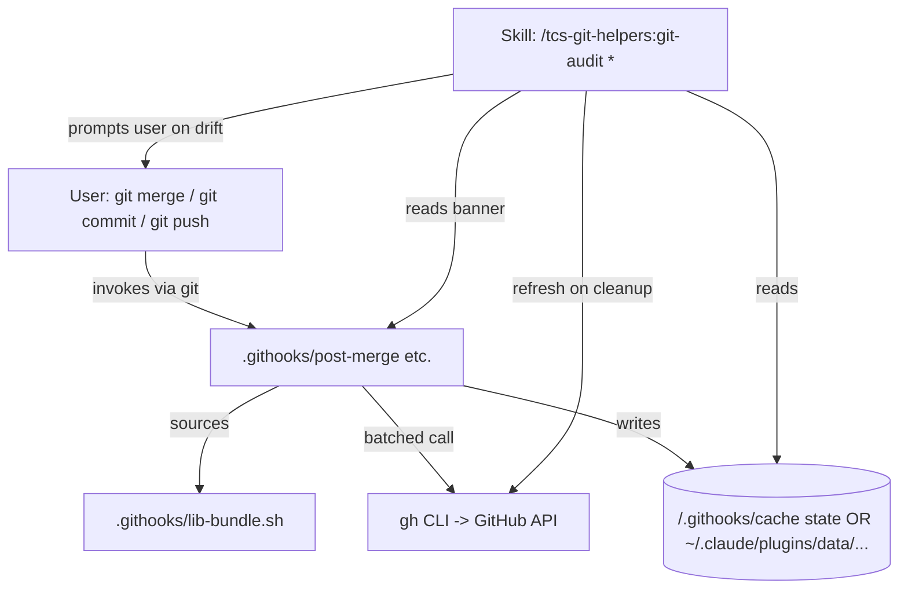
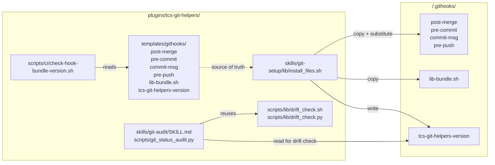
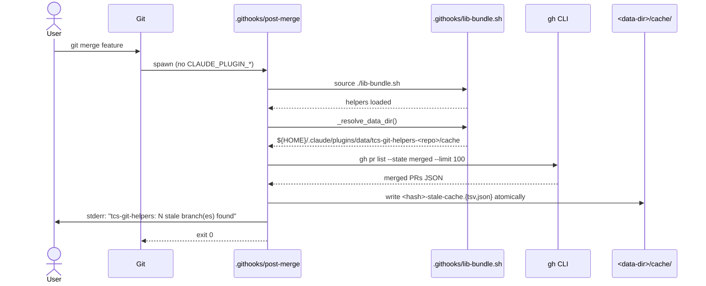
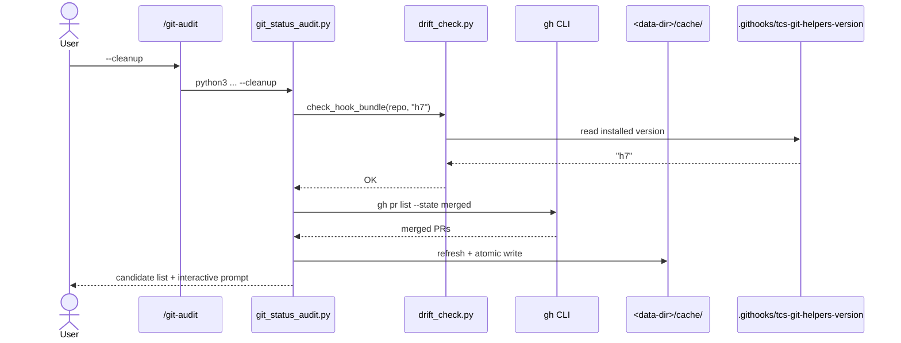

# Solution Design Document

## Validation Checklist

### CRITICAL GATES (Must Pass)

- [x] All required sections are complete
- [x] No [NEEDS CLARIFICATION] markers remain
- [x] Architecture pattern is clearly stated with rationale
- [x] **All architecture decisions confirmed by user**
- [x] Every interface has specification

### QUALITY CHECKS (Should Pass)

- [x] All context sources are listed with relevance ratings
- [x] Project commands are discovered from actual project files
- [x] Constraints → Strategy → Design → Implementation path is logical
- [x] Every component in diagram has directory mapping
- [x] Error handling covers all error types
- [x] Quality requirements are specific and measurable
- [x] Component names consistent across diagrams
- [x] A developer could implement from this design

---

## Constraints

Inherited verbatim from the PRD; restated here so the SDD can be read standalone.

- **CON-1 — Env-var contract.** `CLAUDE_PLUGIN_ROOT` / `CLAUDE_PLUGIN_DATA` are not present in git-invoked subprocesses. The installed hooks MUST NOT rely on them at runtime.
- **CON-2 — Self-contained per-repo install.** Nothing the installed hooks load at runtime may live under `~/.claude/plugins/cache/...`. All required code is inside the repo's `.githooks/` after install.
- **CON-3 — One atomic version unit.** All four installed hooks (`post-merge`, `pre-commit`, `commit-msg`, `pre-push`) and their shared lib are versioned together by a single `HOOK_BUNDLE_VERSION` string. One bump → one re-install of all of it.
- **CON-4 — Maintainer contract enforced by CI.** Any change to any file under `templates/githooks/` or to the shared lib MUST also bump `HOOK_BUNDLE_VERSION`. CI gate fails the build on mismatch.
- **CON-5 — Drift surface point.** Drift detection fires at skill-invocation time, not SessionStart. Any skill that depends on hook-produced state checks installed bundle version against its required version and prompts on mismatch.
- **CON-6 — Silent-failure elimination.** Every guard path that would prevent a hook from completing its job MUST emit a single-line stderr message naming the cause. No silent `return 0`.
- **CON-7 — Bash 3.2 compatible.** macOS ships bash 3.2 in `/bin/bash`. No bash-4+ features (`declare -A`, `mapfile`, `flock`, etc.).
- **CON-8 — STDOUT contract.** Hooks write only to stderr. STDOUT must remain empty so it doesn't pollute git's merge output.
- **CON-9 — Exit 0 always.** Hooks never block a merge/commit/push. Always exit 0.
- **CON-10 — No new network calls.** Reuse the existing single batched `gh pr list` call. No additional round-trips.

## Implementation Context

### Required Context Sources

#### Documentation Context
```yaml
- doc: docs/XDD/specs/012-tcs-git-helpers-hook-runtime-contract/requirements.md
  relevance: HIGH
  why: "PRD — source of all constraints and acceptance criteria for this work"

- doc: docs/XDD/specs/011-tcs-git-helpers/solution.md
  relevance: HIGH
  why: "Original tcs-git-helpers SDD — established the existing template-substitution + cache lib patterns this work extends"

- doc: docs/ai/memory/tools.md
  relevance: MEDIUM
  why: "Repo-scoped fact about CLAUDE_PLUGIN_* env-var contract"
```

#### Code Context
```yaml
- file: plugins/tcs-git-helpers/templates/githooks/post-merge
  relevance: HIGH
  why: "Current hook with the env-var dependency that must be removed"

- file: plugins/tcs-git-helpers/templates/githooks/pre-commit
  relevance: HIGH
  why: "Same runtime-contract treatment must apply"

- file: plugins/tcs-git-helpers/templates/githooks/commit-msg
  relevance: HIGH
  why: "Same runtime-contract treatment must apply"

- file: plugins/tcs-git-helpers/templates/githooks/pre-push
  relevance: HIGH
  why: "Same runtime-contract treatment must apply"

- file: plugins/tcs-git-helpers/scripts/lib/cache.sh
  relevance: HIGH
  why: "Lib that hooks need to source; must be copied into the repo install (or inlined) and version-bumped on any change"

- file: plugins/tcs-git-helpers/skills/git-setup/lib/install_files.sh
  relevance: HIGH
  why: "Installer that templates hooks into the repo; must learn the new HOOK_BUNDLE_VERSION substitution + lib copy step"

- file: plugins/tcs-git-helpers/scripts/git_status_audit.py
  relevance: HIGH
  why: "Contains cmd_cleanup which needs the refresh fix (Bug 1) and where the skill-side drift check is wired in"

- file: plugins/tcs-git-helpers/scripts/nudge-hook.sh
  relevance: MEDIUM
  why: "Reference for the working defensive pattern (env-var fallback to $HOME-derived default)"
```

### Implementation Boundaries

- **Must Preserve:**
  - All existing PRD-011 acceptance criteria for tcs-git-helpers (cache schemas, single-batched-`gh` call, stdout silence, exit-0-always, worktree exclusion, M6 AC3).
  - Cache file naming convention (`<repo-hash>-stale-cache.{tsv,json}`).
  - The existing `__TCS_GIT_HELPERS_VERSION__` banner-substitution pattern (it works; we're adding a sibling substitution).
- **Can Modify:**
  - All four hook templates and their internals.
  - `install_files.sh` (adds the new substitution + lib copy steps).
  - `git_status_audit.py` `cmd_cleanup` (Bug 1 fix).
  - Any skill that reads the stale cache (drift check wiring).
- **Must Not Touch:**
  - `nudge-hook.sh` and other harness-spawned hooks — those run in harness context where env vars are set; they already work.
  - The Claude Code harness contract for `CLAUDE_PLUGIN_*` env vars — out of scope.
  - The plugin marketplace / `plugin.json` version (decoupled from `HOOK_BUNDLE_VERSION`).

### External Interfaces

#### System Context Diagram



#### Interface Specifications

```yaml
# Inbound — what triggers the installed code
inbound:
  - name: "git merge / git commit / git push"
    type: process spawn (no env vars from harness)
    format: bash script invocation, $1.. positional args per git hook spec
    authentication: n/a
    data_flow: "Repository event triggers hook"

  - name: "Skill invocation by Claude Code harness"
    type: process spawn (env vars present)
    format: skill body executes `python3 .../git_status_audit.py <flags>`
    authentication: n/a
    data_flow: "User runs /tcs-git-helpers:git-audit ..."

# Outbound — what the installed code calls
outbound:
  - name: "gh CLI (GitHub API)"
    type: process spawn
    format: `gh pr list --state merged --json ... --limit 100`
    authentication: gh auth (user's)
    data_flow: "Batched merged-PR query"
    criticality: HIGH

# Data — where state is persisted
data:
  - name: "Stale-branch cache"
    type: TSV + JSON dual-write under <data dir>/cache/
    connection: direct fs write (atomic via .tmp + mv)
    data_flow: "Hook writes; skills read"
```

### Project Commands

```bash
# Bash test suite for tcs-git-helpers (existing)
Test:    bats plugins/tcs-git-helpers/tests/
Lint:    shellcheck plugins/tcs-git-helpers/templates/githooks/* plugins/tcs-git-helpers/scripts/**/*.sh
Python:  pytest plugins/tcs-git-helpers/tests/python/

# CI-enforced version-bump check (NEW — to be added in this work)
CheckBundle:  scripts/ci/check-hook-bundle-version.sh   # NEW — fails if templates/githooks/ or shared lib changed without HOOK_BUNDLE_VERSION bump

# Reinstall in a repo
Install:   /tcs-git-helpers:git-setup    # invokes install_files.sh
```

## Solution Strategy

- **Architecture Pattern:** Self-contained per-repo install with bundle versioning and skill-side drift detection.
- **Integration Approach:** Extends the existing `install_files.sh` template-substitution mechanism. Adds a sibling lib file alongside the hooks, plus a `tcs-git-helpers-version` marker file. Drift-detection logic added to skills via a shared helper.
- **Justification:** Given CON-1 (env vars unavailable at git-hook time) and CON-3 (one atomic bundle), the only correct shape is "copy everything the hooks need into the repo at install time." Self-contained installs eliminate the runtime dependency on harness state. Bundle versioning + skill-side drift check provides the upgrade signal without nagging users on SessionStart.
- **Key Decisions** (each formalized as an ADR below):
  - Hook + lib are siblings inside `.githooks/`, not single-file inline (ADR-1).
  - `HOOK_BUNDLE_VERSION` lives in `plugins/tcs-git-helpers/templates/githooks/tcs-git-helpers-version` (ADR-2).
  - Skills read the installed bundle version from `<repo>/.githooks/tcs-git-helpers-version` (a tiny file written at install time), not by parsing hook banner regex (ADR-3).
  - One shared drift-check helper in the plugin code (ADR-4).
  - `cmd_cleanup` refreshes against `gh` on every invocation when possible (ADR-5).
  - Silent-failure replacement is a structured one-liner (ADR-6).

## Building Block View

### Components



### Directory Map

**Component:** `tcs-git-helpers` plugin

```
plugins/tcs-git-helpers/
├── .claude-plugin/plugin.json
├── templates/
│   └── githooks/
│       ├── tcs-git-helpers-version       # NEW — sole source of HOOK_BUNDLE_VERSION
│       ├── lib-bundle.sh                 # NEW — moved/renamed; contains the lib code installed hooks need
│       ├── post-merge                    # MODIFY — remove CLAUDE_PLUGIN_* deps; source ./lib-bundle.sh by relative path
│       ├── pre-commit                    # MODIFY — same treatment
│       ├── commit-msg                    # MODIFY — same treatment
│       └── pre-push                      # MODIFY — same treatment
├── scripts/
│   ├── lib/
│   │   ├── cache.sh                      # MODIFY — keep harness-spawned uses, but the hook-side caller now reads from .githooks/lib-bundle.sh
│   │   └── drift_check.sh                # NEW — shared bash helper for skill-side drift comparison
│   ├── lib/
│   │   └── drift_check.py                # NEW — same logic in python for git_status_audit.py callers
│   ├── git_status_audit.py               # MODIFY — cmd_cleanup calls refresh_stale_cache(); drift check wired into every mode that reads stale cache
│   ├── session-start-brief.sh            # MODIFY (small) — surfaces stale cache value but no longer claims authority; falls back gracefully if missing
│   └── ci/
│       └── check-hook-bundle-version.sh  # NEW — CI gate enforcing maintainer contract (CON-4)
├── skills/
│   └── git-setup/
│       └── lib/
│           └── install_files.sh          # MODIFY — substitutes __HOOK_BUNDLE_VERSION__, copies lib-bundle.sh, writes `tcs-git-helpers-version` file
└── tests/
    ├── bats/
    │   ├── hooks-runtime-contract.bats   # NEW — asserts each installed hook runs successfully with CLAUDE_PLUGIN_* unset in a throwaway repo
    │   └── hooks-version-bundle.bats     # NEW — asserts installed hooks all carry the same version banner; asserts `tcs-git-helpers-version` file matches
    └── python/
        └── test_drift_check.py           # NEW — unit tests for drift_check.py
```

**Component:** Repo install state (after `/tcs-git-helpers:git-setup`)

```
<repo>/
└── .githooks/
    ├── tcs-git-helpers-version  # NEW — single line: HOOK_BUNDLE_VERSION value (e.g. "h7")
    ├── lib-bundle.sh            # NEW — copy of plugin's templates/githooks/lib-bundle.sh
    ├── post-merge               # MODIFY — sources ./lib-bundle.sh, no env-var deps
    ├── pre-commit               # MODIFY — same
    ├── commit-msg               # MODIFY — same
    └── pre-push                 # MODIFY — same
```

### Interface Specifications

#### Data Storage Changes

```yaml
# Cache files — schema UNCHANGED from spec/011
# What changes is how the writer (post-merge) resolves the path

# Location resolution (NEW, derived without env vars):
data_dir_resolution:
  pseudocode: |
    # In .githooks/lib-bundle.sh, function _resolve_data_dir():
    repo_path="$(git rev-parse --show-toplevel)"
    repo_name="$(basename "$repo_path")"
    plugin_name="tcs-git-helpers"  # hardcoded — this lib is only used by this plugin's hooks
    data_dir="${HOME}/.claude/plugins/data/${plugin_name}-${repo_name}/cache"
    # User can override via CLAUDE_PLUGIN_DATA if they explicitly set it
    [ -n "${CLAUDE_PLUGIN_DATA:-}" ] && data_dir="${CLAUDE_PLUGIN_DATA}/cache"

# `tcs-git-helpers-version` file — NEW
file: <repo>/.githooks/tcs-git-helpers-version
content: single line, e.g. "h7"
purpose: skill-side drift check reads this to compare against plugin's expected version
```

#### Internal API Changes

**Bash helper API (`scripts/lib/drift_check.sh`):**

```yaml
function: drift_check_hook_bundle
  inputs:
    - $1: repo_path (absolute)
    - $2: expected_version (string, e.g. "h7")
  outputs (via stdout — caller reads):
    - "OK"                      # versions match
    - "MISSING"                 # .githooks/tcs-git-helpers-version does not exist (not installed)
    - "DRIFT:<installed>"       # installed != expected; e.g. "DRIFT:h5"
  exit code:
    - 0: always (caller decides action; helper just reports)
  side effects: none (read-only)
```

**Python helper API (`scripts/lib/drift_check.py`):**

```yaml
function: check_hook_bundle(repo_path: Path, expected_version: str) -> DriftResult
  DriftResult enum: OK | MISSING | DRIFT
  attributes:
    - status: DriftResult
    - installed_version: str | None
  side effects: none
```

**Skill drift-emission pattern (used by git-audit modes that read stale cache):**

Every hook-dependent skill mode begins with:

```pseudocode
expected = read_expected_hook_bundle_version()  # reads plugin's templates/githooks/tcs-git-helpers-version
result = drift_check(repo_path, expected)
match result.status:
  case OK:
    # proceed normally
  case MISSING:
    print_stderr("tcs-git-helpers: hooks not installed in this repo. Run /tcs-git-helpers:git-setup to install.")
    exit 1
  case DRIFT:
    print_stderr(f"tcs-git-helpers: installed hooks are {result.installed_version}; this command needs {expected}. Run /tcs-git-helpers:git-setup to update.")
    exit 1
```

#### Application Data Models

```pseudocode
# No new data models. Cache record shape unchanged from spec/011:
ENTITY: StaleBranchEntry (UNCHANGED)
  FIELDS:
    name: string         # branch name
    pr_number: int
    merged_at: ISO8601 string
```

#### Integration Points

```yaml
# No new external integrations. gh CLI usage unchanged.
# Inter-component:
- from: git merge subprocess
  to: .githooks/post-merge
    - protocol: process spawn (no env vars from harness)
    - data_flow: "Hook script invoked by git after merge completion"

- from: skill (python script)
  to: <repo>/.githooks/tcs-git-helpers-version
    - protocol: filesystem read
    - data_flow: "Read installed bundle version for drift check"

- from: install_files.sh (during /tcs-git-helpers:git-setup)
  to: <repo>/.githooks/{*, tcs-git-helpers-version}
    - protocol: filesystem write (atomic via .tmp + mv pattern)
    - data_flow: "Copy hook + lib templates into repo; write tcs-git-helpers-version marker"
```

### Implementation Examples

#### Example: hook resolves its data dir without env vars

**Why this example:** This is the core change that fixes the runtime-contract bug. Showing the resolution explicitly prevents the implementer from regressing back to env-var dependence.

```bash
# In templates/githooks/lib-bundle.sh

_resolve_data_dir() {
  # 1. User-explicit override wins (lets tests + power users redirect)
  if [ -n "${CLAUDE_PLUGIN_DATA:-}" ]; then
    printf '%s/cache' "$CLAUDE_PLUGIN_DATA"
    return 0
  fi
  # 2. Derive deterministically from repo identity (the normal production path)
  local repo_path repo_name
  repo_path="$(git rev-parse --show-toplevel 2>/dev/null)" || return 1
  repo_name="$(basename "$repo_path")"
  printf '%s/.claude/plugins/data/tcs-git-helpers-%s/cache' "$HOME" "$repo_name"
}
```

#### Example: drift-check helper (bash)

**Why this example:** Defines the wire shape skills depend on. Three-state result keeps caller logic small and explicit.

```bash
# scripts/lib/drift_check.sh — sourced by skills running in harness context

drift_check_hook_bundle() {
  local repo_path="$1"
  local expected_version="$2"
  local version_file="${repo_path}/.githooks/tcs-git-helpers-version"

  if [ ! -f "$version_file" ]; then
    printf 'MISSING\n'
    return 0
  fi
  local installed
  installed="$(head -n 1 "$version_file" | tr -d '[:space:]')"
  if [ "$installed" = "$expected_version" ]; then
    printf 'OK\n'
  else
    printf 'DRIFT:%s\n' "$installed"
  fi
}
```

#### Example: cmd_cleanup refresh (Bug 1 fix)

**Why this example:** This is the change that makes `--cleanup` reflect live state instead of an empty cache.

```python
# scripts/git_status_audit.py — cmd_cleanup pseudocode

def cmd_cleanup(*, cache_dir, repo_path, interactive=True):
    # NEW: drift check first
    result = check_hook_bundle(repo_path, EXPECTED_HOOK_BUNDLE_VERSION)
    if result.status == DriftResult.MISSING:
        print_stderr("tcs-git-helpers: hooks not installed. Run /tcs-git-helpers:git-setup.")
        sys.exit(1)
    if result.status == DriftResult.DRIFT:
        print_stderr(f"tcs-git-helpers: installed hooks are {result.installed_version}; this command needs {EXPECTED_HOOK_BUNDLE_VERSION}. Run /tcs-git-helpers:git-setup.")
        sys.exit(1)

    # NEW: refresh stale cache against live gh state (fixes Bug 1)
    if gh_available():
        try:
            refresh_stale_cache(cache_dir=cache_dir, repo_path=repo_path)
        except GhAuthMissing:
            print_stderr("tcs-git-helpers: gh CLI unauthenticated — falling back to cached state (may be stale).")

    # Existing read-and-prompt logic continues unchanged from here
    cache_data = _read_stale_cache(cache_dir, repo_path)
    ...
```

## Runtime View

### Primary Flow: stale-cache write on post-merge

1. User runs `git merge feature-branch`
2. git completes the merge, then spawns `.githooks/post-merge` (no harness env vars set)
3. Hook sources sibling `./lib-bundle.sh` via relative path (`source "$(dirname "$0")/lib-bundle.sh"`)
4. Hook calls `_resolve_data_dir()` → derives path from `$HOME` + repo basename (CLAUDE_PLUGIN_DATA respected if explicitly set)
5. Hook checks `gh` availability — if missing, emits structured stderr message and exits 0
6. Hook calls `gh pr list --state merged --limit 100`, cross-references against local branches (excluding worktree-attached ones per M6 AC3)
7. Hook writes `<repo-hash>-stale-cache.{tsv,json}` atomically (.tmp → mv)
8. Hook emits existing stderr suggestion line if stale branches found
9. Hook exits 0



### Primary Flow: skill drift-check on `--cleanup`

1. User runs `/tcs-git-helpers:git-audit --cleanup`
2. Skill body invokes `python3 git_status_audit.py --cleanup` (harness env present here)
3. `cmd_cleanup` calls `check_hook_bundle(repo_path, EXPECTED_HOOK_BUNDLE_VERSION)`
4. Result `OK` → continue. Result `MISSING` / `DRIFT` → stderr prompt + exit 1
5. On OK: `refresh_stale_cache()` calls `gh pr list ...` and overwrites the cache (Bug 1 fix)
6. Reads refreshed cache, presents candidates with interactive y/N prompt per existing flow
7. Exits 0 on completion



### Error Handling

| Condition | Hook (post-merge etc.) | Skill (cleanup etc.) |
|---|---|---|
| `gh` not installed | stderr: `tcs-git-helpers: gh CLI not installed — skipping stale-branch refresh. Install gh to enable cleanup hints.` Exit 0. | stderr same, then fall back to existing cache content (rather than reporting "none") |
| `gh` unauthenticated | stderr: `tcs-git-helpers: gh CLI unauthenticated — skipping stale-branch refresh. Run \`gh auth login\`.` Exit 0. | Same; fall back to existing cache |
| `git rev-parse --show-toplevel` fails (not in a repo) | stderr: `tcs-git-helpers: not inside a git repository — hook skipped.` Exit 0. (Defensive; shouldn't reach here under git invocation.) | Existing behavior — script already handles this |
| `lib-bundle.sh` not found (broken install) | stderr: `tcs-git-helpers: lib-bundle.sh missing in .githooks/ — re-run /tcs-git-helpers:git-setup.` Exit 0. | Drift check would catch this as MISSING and prompt before reaching the failure |
| Data dir write fails (disk full / permission) | stderr: `tcs-git-helpers: cache write failed (<errno>) — \`--cleanup\` will report stale data until next successful merge.` Exit 0. | Skill emits its own stderr if it then tries to refresh and also fails |
| `.githooks/tcs-git-helpers-version` missing | (hook continues; no version check at hook level — this is a skill-side concern) | Drift returns MISSING; skill emits "hooks not installed" prompt and exits 1 |
| `.githooks/tcs-git-helpers-version` content mismatch | (hook continues; not its concern) | Drift returns DRIFT; skill emits "needs update" prompt and exits 1 |

## Deployment View

### Single Application Deployment

No deployment infrastructure changes. The plugin ships through the existing Claude Code marketplace mechanism. Users get the fix by:

1. Plugin update from cache (automatic when marketplace refreshes)
2. Existing repos: first hook-dependent skill invocation surfaces the drift prompt
3. User runs `/tcs-git-helpers:git-setup` to update the installed hooks + lib + `tcs-git-helpers-version`

No staged rollout, no feature flags. The drift-check is non-breaking — old installs (without `.githooks/tcs-git-helpers-version`) trigger the MISSING branch which already prompts to run `git-setup`.

### Multi-Component Coordination

N/A. Single plugin; no cross-service coordination.

## Cross-Cutting Concepts

### System-Wide Patterns

- **Atomic file writes:** All filesystem writes use the existing `.tmp → mv` pattern from spec/011 to keep readers safe from torn reads. Applies to cache writes AND the new `.githooks/tcs-git-helpers-version` write.
- **Stderr-only diagnostic output:** Preserved from spec/011. STDOUT remains empty in hook paths.
- **Bash 3.2 portability:** No `declare -A`, no `mapfile`, no `flock`. Reuses helpers and idioms from `scripts/lib/cache.sh`.
- **Self-contained per-repo install:** No installed code references the plugin cache at runtime. This is the architectural pillar the fix rests on.

### UI

N/A. CLI only.

### Multi-Component Patterns

N/A.

## Architecture Decisions

Each decision below needs user confirmation before the SDD is marked complete.

- [x] **ADR-1 — Hook physical layout: siblings, not inline**
  - **Choice:** `.githooks/` contains the four hook files + a sibling `lib-bundle.sh`. Each hook sources the sibling via `source "$(dirname "$0")/lib-bundle.sh"`.
  - **Rationale:** Four hooks share ~200 lines of lib code. Inlining duplicates ~800 lines across the install — every code review of any hook drowns in duplicated lib code, and bumping `HOOK_BUNDLE_VERSION` for a lib-only change means re-templating four near-identical files instead of one. Siblings keep the lib in one place per repo; per-hook files stay focused.
  - **Trade-offs accepted:** Hooks have one runtime file dependency (the lib must exist next to them). Mitigated because both are installed atomically by `install_files.sh`, and the missing-lib stderr path is explicit.
  - **Alternative considered:** Single-file inline (PRD option D-inline). Rejected on review-ergonomics + duplication grounds.
  - **User confirmed:** 2026-05-13

- [x] **ADR-2 — `HOOK_BUNDLE_VERSION` source-of-truth: `templates/githooks/tcs-git-helpers-version` file**
  - **Choice:** A single-line file at `plugins/tcs-git-helpers/templates/githooks/tcs-git-helpers-version` (content example: `h7`). Read by `install_files.sh` at install time and by the CI check at PR time.
  - **Rationale:** Easier for CI to read than a constant inside a script. Easier for maintainers to spot at a glance — sitting next to the templates it gates. Cleanly separates "hook bundle version" from the plugin's `plugin.json` version, which is the entire point of Q3's resolution.
  - **Trade-offs accepted:** One more file in the repo. Negligible cost.
  - **Alternative considered:** A constant `HOOK_BUNDLE_VERSION="h7"` in `install_files.sh`. Rejected for being less visible to maintainers and harder for the CI lint to parse.
  - **User confirmed:** 2026-05-13

- [x] **ADR-3 — Skill-side read of installed version: `.githooks/tcs-git-helpers-version` file, not banner parse**
  - **Choice:** `install_files.sh` writes a `.githooks/tcs-git-helpers-version` file in the repo at install time. Skills read this file via `head -n 1` (bash) or equivalent in python.
  - **Rationale:** A dedicated, programmatic file is easier and more robust than regexing a banner comment out of a hook script. If the banner format ever changes (e.g. maintainer edits a comment), the skill drift check breaks. Independent file decouples the check from the hook's internal formatting.
  - **Trade-offs accepted:** One more installed file per repo. The hook banner comment can remain for human readability — but it's not what the skill reads.
  - **Alternative considered:** Grep the first 20 lines of any installed hook for `# tcs-git-helpers-hook: hX`. Rejected for fragility.
  - **User confirmed:** 2026-05-13

- [x] **ADR-4 — Drift-check helper is shared, lives in plugin code: `scripts/lib/drift_check.{sh,py}`**
  - **Choice:** A single bash helper (`drift_check.sh`) and python module (`drift_check.py`) in the plugin, both implementing the same three-state contract (OK / MISSING / DRIFT). Skills reuse them; no inline duplication.
  - **Rationale:** Skills that depend on hook state already exist (git-audit modes that read stale cache) and more may come. A shared helper means one source of truth for the comparison logic and stderr message format. Two languages because bash skills and python audit script both need it.
  - **Trade-offs accepted:** Two implementations to keep in sync. Mitigated by a tiny shared test suite asserting identical behavior on the same set of (installed_version, expected_version) inputs.
  - **Alternative considered:** Per-skill inline drift check. Rejected — duplication risk in stderr message wording, future skills would diverge.
  - **User confirmed:** 2026-05-13

- [x] **ADR-5 — `cmd_cleanup` refresh: live `gh` call on every invocation when authenticated**
  - **Choice:** `cmd_cleanup` always calls `refresh_stale_cache()` (which runs the single batched `gh pr list`) before reading the cache, unless `gh` is unavailable/unauthenticated.
  - **Rationale:** Correctness > speed for an interactive cleanup command. The `gh` call is ~100–300ms; user is mid-cleanup-decision so the latency is acceptable. The cache becomes an optimization for the brief/SessionStart fast path, not the source of truth for cleanup.
  - **Trade-offs accepted:** Cleanup is slower than today (today it returns instantly with wrong data; that's a regression masquerading as a feature). `gh` rate limits could become a factor for users running cleanup in a tight loop — acceptable since it's interactive.
  - **Alternative considered:** Refresh only when cache is empty or >24h old. Rejected because today's failure mode (silent empty cache) is exactly the case the cache-only path can't detect.
  - **User confirmed:** 2026-05-13

- [x] **ADR-6 — Silent-failure replacement: structured single-line stderr messages**
  - **Choice:** Every guard path that would prevent the hook from completing its job emits one stderr line in the format `tcs-git-helpers: <action> <result> — <reason>. <suggested user action>.`. Exit code stays 0.
  - **Rationale:** Today's silent `return 0` is the root cause of why this bug went undiagnosed for months. A single visible line per cause makes failure modes legible without spamming git output. Structured format makes it greppable / parseable by future tooling.
  - **Trade-offs accepted:** Slightly noisier `git merge` output when something is wrong. That's the point — silence on broken plumbing was the original sin.
  - **Alternative considered:** A persistent log file that the maintainer reads later. Rejected because users don't read log files until they're already debugging; inline stderr is the only message that fires the user's attention loop at the right moment.
  - **User confirmed:** 2026-05-13

- [x] **ADR-7 — CI enforcement of maintainer contract (CON-4)**
  - **Choice:** A new CI step (`scripts/ci/check-hook-bundle-version.sh`) compares the diff in `templates/githooks/` (any file) against the git history of `templates/githooks/tcs-git-helpers-version`. If the directory changed but `tcs-git-helpers-version` did not bump in the same PR/commit-range, CI fails with a clear message naming the unbumped files.
  - **Rationale:** CON-4 says "maintainer contract enforced by CI, not honor-system." Humans forget. This check survives team turnover and is itself the documentation of the rule.
  - **Trade-offs accepted:** Maintainers occasionally hit "you changed a hook, bump `tcs-git-helpers-version`" CI failure and have to amend. Acceptable cost. False positives if a hook is touched in a no-op way (whitespace, comments) — mitigated by accepting that any change to `templates/githooks/` is treated as a real change for versioning purposes.
  - **Alternative considered:** Pre-commit hook in the dev workflow. Rejected as too easy to bypass and missing for non-dev contributors.
  - **User confirmed:** 2026-05-13

- [x] **ADR-8 — Migration for users with pre-bundle installs**
  - **Choice:** Drift check treats "no `.githooks/tcs-git-helpers-version` file present" as `MISSING` (not as `DRIFT` against an unknown version). The MISSING branch emits `tcs-git-helpers: hooks not installed (or installed before bundle versioning) — run /tcs-git-helpers:git-setup to install.`
  - **Rationale:** Users on the version before this fix have `.githooks/post-merge` but no `tcs-git-helpers-version` file. Treating that as MISSING (rather than a special "legacy" state) keeps the state model two-valued (installed-and-current vs not), which is simpler and converges on the right end state (fresh install). No special migration code path needed.
  - **Trade-offs accepted:** Users get prompted to "install" even though they technically have hooks. Wording softened to "or installed before bundle versioning" makes it clear and the action (`git-setup`) is the same regardless.
  - **Alternative considered:** Special "LEGACY" enum value with separate prompt. Rejected as YAGNI — no behavior diverges.
  - **User confirmed:** 2026-05-13

## Quality Requirements

- **Performance:**
  - Hook total runtime: ≤ 1.5s p95 on a repo with ≤ 100 local branches and ≤ 100 merged PRs (matches spec/011 target). The single batched `gh pr list` call dominates.
  - Skill drift check: ≤ 5ms (single fs read + string compare).
  - `cmd_cleanup` with refresh: hook runtime + ~50ms post-processing on top.
- **Usability:**
  - Drift prompt MUST contain both the installed version, the required version, AND the exact command to fix.
  - Silent-failure stderr lines MUST be self-contained — readable without project context.
- **Security:**
  - `.githooks/tcs-git-helpers-version` content is non-secret. No special permissions required.
  - Hooks must not log secrets, PR titles, or branch names that could leak private project info (preserve existing audit privacy posture from spec/011).
- **Reliability:**
  - Cache writes atomic (`.tmp → mv`). A crashed hook never leaves a half-written cache.
  - Hook exit code never blocks `git`. Hard requirement.
  - Drift check is read-only — running it many times has no side effects.

## Acceptance Criteria

Translated from PRD Features 1–8 to EARS format.

**Main flow (PRD Feature 1 — post-merge writes cache):**
- [ ] WHEN `git merge` completes in a repo with `tcs-git-helpers` hooks installed AND `gh` is authenticated, THE SYSTEM SHALL write `<repo-hash>-stale-cache.{tsv,json}` to the resolved data dir within the same hook invocation.
- [ ] WHEN the harness env vars `CLAUDE_PLUGIN_ROOT` / `CLAUDE_PLUGIN_DATA` are unset in the calling shell, THE SYSTEM SHALL still resolve the data dir and write the cache.

**Cleanup correctness (PRD Feature 2 — cleanup reflects git reality):**
- [ ] WHEN `/tcs-git-helpers:git-audit --cleanup` is invoked AND `gh` is authenticated, THE SYSTEM SHALL refresh the cache against live `gh pr list` before reporting candidates.
- [ ] WHEN the refresh succeeds, THE SYSTEM SHALL include every local branch that matches a merged PR in the candidate list.

**Update propagation (PRD Feature 3 — version updates surface visibly):**
- [ ] WHILE the installed `.githooks/tcs-git-helpers-version` does NOT match the plugin's `templates/githooks/tcs-git-helpers-version`, the system SHALL emit a drift prompt when any hook-dependent skill runs.
- [ ] WHEN the user runs `/tcs-git-helpers:git-setup` after a drift was detected, THE SYSTEM SHALL update all four installed hooks + `lib-bundle.sh` + `tcs-git-helpers-version` atomically.

**Skill-side drift check (PRD Feature 4):**
- [ ] WHEN a hook-dependent skill is invoked AND `.githooks/tcs-git-helpers-version` is missing, THE SYSTEM SHALL emit a "not installed" prompt and exit 1.
- [ ] WHEN a hook-dependent skill is invoked AND `.githooks/tcs-git-helpers-version` matches the expected version, THE SYSTEM SHALL produce no drift-related output (silent on happy path).
- [ ] WHERE a skill does not depend on hook-produced state, THE SYSTEM SHALL skip the drift check entirely.

**Silent-failure elimination (PRD Feature 5):**
- [ ] WHEN any guard path in any installed hook prevents the cache write, THE SYSTEM SHALL emit exactly one stderr line in the structured format `tcs-git-helpers: <action> <result> — <reason>. <suggested user action>.`.
- [ ] THE SYSTEM SHALL exit 0 from every hook invocation regardless of internal success/failure (preserve "never block git" contract).

**Atomic bundle (PRD Feature 6):**
- [ ] WHEN `/tcs-git-helpers:git-setup` runs, THE SYSTEM SHALL install all four hooks + lib + `tcs-git-helpers-version` file with the same `HOOK_BUNDLE_VERSION` value.
- [ ] IF the diff of a PR changes any file in `templates/githooks/` but the `tcs-git-helpers-version` file is unchanged, THEN the CI check SHALL fail the build with a message naming the offending files.

**Install-state inspection (PRD Feature 7 — Could Have, optional):**
- [ ] WHEN the user runs `/tcs-git-helpers:git-setup --check` (or equivalent), THE SYSTEM SHALL report which hooks are installed, their bundle version, whether the data-dir write path resolves, and whether the version matches the plugin's expected version.

**Telemetry (PRD Feature 8 — Could Have, optional):**
- [ ] WHILE a local rolling log exists, every hook invocation SHALL record `outcome` (cache_written / gracefully_degraded / silent_failure_eliminated / loud_failure) and `degradation_reason` (none / no_gh / no_auth / no_jq / other).

## Risks and Technical Debt

### Known Technical Issues

- Today's `.githooks/post-merge` silently no-ops on every production invocation — this is the bug being fixed; explicitly tracked so we have a regression test target.
- `cmd_cleanup` reads from an empty cache and reports "none" — the same surface bug, separate code path.

### Technical Debt

- The existing `scripts/lib/cache.sh` has a fallback for missing `CLAUDE_PLUGIN_DATA` (`${CLAUDE_PLUGIN_DATA:-${HOME}/.claude/plugin-data}`) that points at a DIFFERENT directory than where harness-spawned code actually writes. This is debt from spec/011; it's working accidentally (no hook successfully writes via that path because the hook never sources the lib). After this fix lands, the existing `cache.sh` fallback path can be removed — `_resolve_data_dir` in `lib-bundle.sh` becomes the single resolver.

### Implementation Gotchas

- `git rev-parse --show-toplevel` inside a hook MUST be called from the working directory git invoked the hook in. Don't `cd` first; just call it.
- Sourcing a sibling via `"$(dirname "$0")/lib-bundle.sh"` requires `$0` to be the hook's absolute or relative path as git passed it. Git always invokes hooks with a usable `$0`. Verified across git 2.30+.
- `head -n 1` on `.githooks/tcs-git-helpers-version` — guard against trailing whitespace/CRLF with `tr -d '[:space:]'`.
- The `__HOOK_BUNDLE_VERSION__` substitution must happen at install time on the hook templates AND must write the same value to the `.githooks/tcs-git-helpers-version` file. Easy to forget one.
- Two repos with the same basename on the same machine share a data dir (pre-existing limitation). Cache files within use repo-path SHA hashes so they don't collide. Document in user-facing docs; don't try to fix in this scope.

## Glossary

### Domain Terms

| Term | Definition | Context |
|---|---|---|
| Hook bundle | The atomic unit of installed code: four hook files + shared lib + tcs-git-helpers-version marker | Versioning unit per CON-3 |
| Drift | State where installed hook bundle version ≠ plugin's expected bundle version | Surfaced by skill-side drift check (CON-5) |
| Stale-merged branch | Local branch whose PR has been merged on GitHub | Existing concept from spec/011 |

### Technical Terms

| Term | Definition | Context |
|---|---|---|
| `HOOK_BUNDLE_VERSION` | String identifier (e.g., `h7`) versioning the installed-code unit independently of plugin version | Source of truth: `templates/githooks/tcs-git-helpers-version` |
| Harness-spawned | Code launched directly by the Claude Code agent (PostToolUse hooks, SessionStart hooks, skill bash) — receives `CLAUDE_PLUGIN_*` env vars | Distinguishes from git-spawned context |
| Git-spawned | Code launched by `git` itself as a hook — does NOT receive `CLAUDE_PLUGIN_*` env vars | Production condition for `.githooks/*` |

### API/Interface Terms

| Term | Definition | Context |
|---|---|---|
| Drift result | Three-state outcome of skill drift check: `OK` / `MISSING` / `DRIFT:<installed>` | Returned by `drift_check.{sh,py}` |
| Data dir | Filesystem location where stale-branch cache files live | Resolved by `_resolve_data_dir()` in `lib-bundle.sh` |
