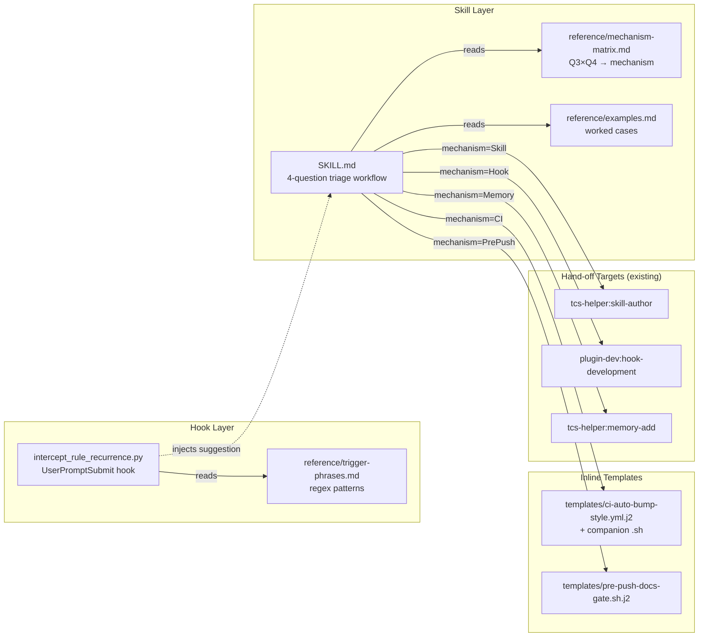
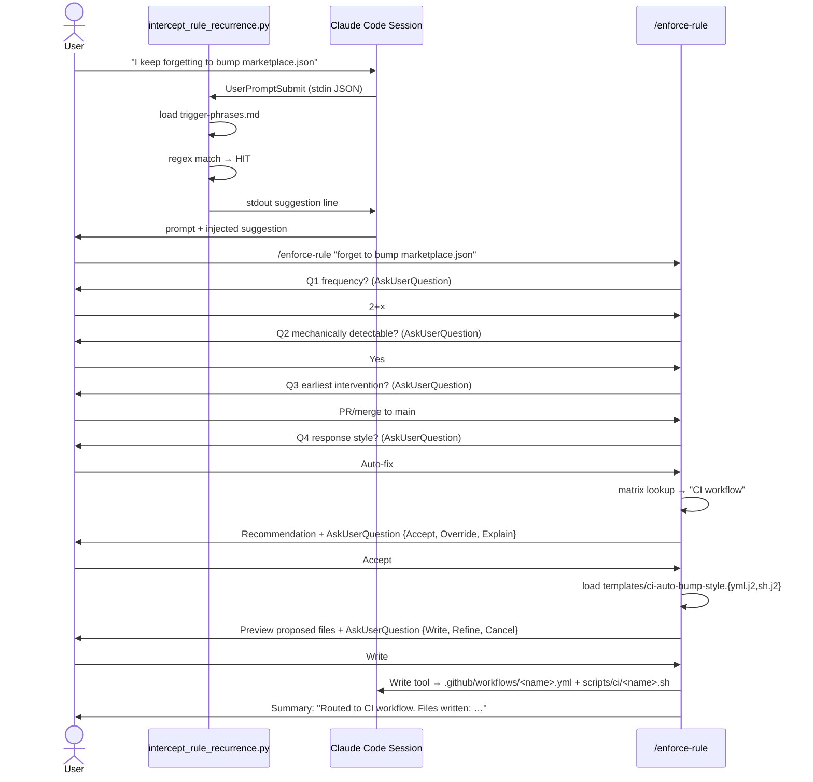

# Solution Design Document

## Validation Checklist

### CRITICAL GATES (Must Pass)

- [x] All required sections are complete
- [x] No [NEEDS CLARIFICATION] markers remain
- [x] Architecture pattern is clearly stated with rationale
- [x] All architecture decisions confirmed by user (8 ADRs documented; user confirmation point at end of SDD)
- [x] Every interface has specification

### QUALITY CHECKS (Should Pass)

- [x] All context sources are listed with relevance ratings
- [x] Project commands are discovered from actual project files
- [x] Constraints → Strategy → Design → Implementation path is logical
- [x] Every component in diagram has directory mapping
- [x] Error handling covers all error types
- [x] Quality requirements are specific and measurable
- [x] Component names consistent across diagrams
- [x] A developer could implement from this design

---

## Constraints

| ID | Constraint |
|----|-----------|
| **CON-1** | Lives in `plugins/tcs-helper/skills/rule-enforcer/` (Meta-Tools cluster alongside skill-author, agent-author, memory-add) |
| **CON-2** | Hook p95 latency ≤ 50ms (UserPromptSubmit runs on every prompt) |
| **CON-3** | Pure Python 3 + bash 3.2 — no new runtime dependencies (Python is already available per `capture_learning.py` precedent) |
| **CON-4** | Hook MUST exit 0 on errors — never block the user's prompt (graceful degradation, per `capture_learning.py` `except Exception: pass` pattern) |
| **CON-5** | Trigger-phrase config data-driven (markdown reference file, not code-baked) so user can extend without plugin reinstall |
| **CON-6** | SKILL.md ≤ 500 lines per `tcs-helper:skill-author` conventions (drives ADR-1 matrix location decision) |

## Implementation Context

### Required Context Sources

#### Documentation Context

```yaml
- doc: docs/XDD/specs/013-rule-enforcer/requirements.md
  relevance: CRITICAL
  why: "PRD — drives every design decision"

- doc: docs/XDD/ideas/2026-05-21-rule-enforcer.md
  relevance: HIGH
  why: "Brainstorm artifact — mechanism matrix sketch + 12 design questions"

- doc: ~/.claude/rules/authoring.md
  relevance: HIGH
  why: "Existing PostToolUse skill-author reminder is the proven nudge precedent for one matrix mechanism"

- doc: plugins/tcs-helper/skills/skill-author/reference/conventions.md
  relevance: HIGH
  why: "Skill structure conventions — drives directory layout + SKILL.md size budget"
```

#### Code Context

```yaml
- file: plugins/tcs-helper/scripts/capture_learning.py
  relevance: CRITICAL
  why: "Direct precedent — UserPromptSubmit hook in same plugin, sets pattern for stdin JSON parsing, error handling, never-block discipline"

- file: plugins/tcs-helper/hooks/hooks.json
  relevance: CRITICAL
  why: "Hook registration target — intercept hook appends to existing UserPromptSubmit array"

- file: plugins/tcs-helper/scripts/lib/reflect_utils.py
  relevance: HIGH
  why: "Shared util library pattern — intercept hook's trigger-phrase loader belongs in a similar lib"

- file: plugins/tcs-helper/skills/memory-add/SKILL.md
  relevance: HIGH
  why: "Hand-off target — Memory fallback invokes this; need to understand its interface"

- file: plugins/tcs-helper/skills/skill-author/SKILL.md
  relevance: HIGH
  why: "Hand-off target for 'skill with discipline language' mechanism"

- file: .github/workflows/auto-bump-versions.yml
  relevance: HIGH
  why: "Gold-standard CI workflow that inline-scaffold M6 must mirror"

- file: scripts/ci/auto-bump-versions.sh
  relevance: HIGH
  why: "Gold-standard bash script style for inline-scaffold M6 CI templates"

- file: plugins/tcs-git-helpers/templates/githooks/pre-push
  relevance: MEDIUM
  why: "Pattern reference for pre-push hook scaffolding (ADR-2 chose standalone, not bundle-integrated, but this is the style template)"
```

#### External APIs

```yaml
- service: Claude Code hooks API
  doc: https://docs.claude.com/en/docs/claude-code/hooks
  relevance: CRITICAL
  why: "UserPromptSubmit event contract — stdin JSON, stdout injection, exit code semantics"

- service: Claude Code Skill tool
  doc: ~/.claude/rules/authoring.md
  relevance: HIGH
  why: "Skill invocation contract — how rule-enforcer hands off to skill-author / hook-development / memory-add"
```

### Implementation Boundaries

- **Must Preserve:**
  - Existing `plugins/tcs-helper/hooks/hooks.json` structure (UserPromptSubmit array gets one new entry, do not break `capture_learning.py` registration)
  - `capture_learning.py` execution (rule-enforcer hook MUST NOT interfere with learning-capture flow)
  - All `plugins/tcs-helper/skills/{skill-author,agent-author,memory-add}` interfaces (we route to them, must not break them)
- **Can Modify:**
  - `plugins/tcs-helper/hooks/hooks.json` (add entry to UserPromptSubmit array)
  - New directory `plugins/tcs-helper/skills/rule-enforcer/` entirely
  - New script `plugins/tcs-helper/scripts/intercept_rule_recurrence.py` and shared lib helper
- **Must Not Touch:**
  - Repo-level `.githooks/` directly (the inline pre-push scaffolder PROPOSES content; user accepts and writes manually or via Edit tool — per PRD W1 "no automatic hook installation")

### External Interfaces

#### System Context Diagram

```mermaid
graph TB
    User[Marcus / Operator]
    Claude[Claude Code Session]
    Hook[rule-enforcer<br/>intercept hook]
    Skill[/enforce-rule<br/>skill]
    Matrix[Mechanism Matrix<br/>reference/]

    User -->|submits prompt| Claude
    Claude -->|UserPromptSubmit| Hook
    Hook -->|stdout: suggestion| Claude
    User -->|/enforce-rule| Skill
    Skill -->|reads| Matrix
    Skill -->|Skill tool| SkillAuthor[tcs-helper:skill-author]
    Skill -->|Skill tool| HookDev[plugin-dev:hook-development]
    Skill -->|Skill tool| MemAdd[tcs-helper:memory-add]
    Skill -->|inline scaffold| FS[Filesystem<br/>.github/workflows/ or .githooks/]
```

#### Interface Specifications

```yaml
# Inbound Interfaces (what calls this system)
inbound:
  - name: "UserPromptSubmit hook event"
    type: stdin-json
    format: |
      {"cwd": "<path>", "prompt": "<text>", "session_id": "<uuid>"}
    authentication: none (local process)
    doc: https://docs.claude.com/en/docs/claude-code/hooks#userpromptsubmit
    data_flow: "Every user prompt passes through; intercept decides whether to inject suggestion"

  - name: "/enforce-rule slash command"
    type: skill-invocation
    format: $ARGUMENTS = "<rule description>"
    authentication: none (in-session)
    data_flow: "User triggers triage workflow with a description of the recurring rule"

# Outbound Interfaces (what this system calls)
outbound:
  - name: "Skill: tcs-helper:skill-author"
    type: Skill tool
    format: |
      Skill(skill="tcs-helper:skill-author",
            args="<rule description, intended as discipline-enforcing skill>")
    criticality: HIGH
    data_flow: "Hand-off when mechanism = 'Skill with discipline-enforcing language'"

  - name: "Skill: plugin-dev:hook-development"
    type: Skill tool
    format: |
      Skill(skill="plugin-dev:hook-development",
            args="<rule description, hook event type pre-selected>")
    criticality: HIGH
    data_flow: "Hand-off when mechanism = 'Claude * hook'"

  - name: "Skill: tcs-helper:memory-add"
    type: Skill tool
    format: |
      Skill(skill="tcs-helper:memory-add",
            args="<rule description, type=feedback, strong-language template>")
    criticality: HIGH
    data_flow: "Hand-off when mechanism = 'Memory rule' (last resort)"

  - name: "Filesystem write (inline scaffold M6)"
    type: Write/Edit tool (in-session)
    format: file content as string
    criticality: MEDIUM
    data_flow: "Two known templates: CI auto-bump-style + pre-push docs-gate-style. User confirms before each Write."

# Data Interfaces
data:
  - name: "Trigger phrase catalog"
    type: markdown file
    connection: read at hook invocation
    doc: plugins/tcs-helper/skills/rule-enforcer/reference/trigger-phrases.md
    data_flow: "List of regex patterns per language (DE, EN); hook greps prompt against patterns"

  - name: "Mechanism matrix"
    type: markdown file
    connection: lazy-load by skill when triage runs
    doc: plugins/tcs-helper/skills/rule-enforcer/reference/mechanism-matrix.md
    data_flow: "Decision matrix: Q3 × Q4 → mechanism (consumed by skill workflow)"
```

### Project Commands

```bash
# Plugin development (from repo root)
Install:     (no install step — Claude Code auto-discovers plugins)
Test (skill): manual via /enforce-rule in a Claude Code session
Test (hook): echo '{"prompt":"I keep forgetting X"}' | python3 plugins/tcs-helper/scripts/intercept_rule_recurrence.py
Lint:        bash plugins/tcs-helper/scripts/*.py via flake8 (optional)
```

## Solution Strategy

- **Architecture Pattern:** Router skill + content-injection hook. The skill is a deterministic triage router (Q1→Q4 → mechanism → hand-off). The hook is a stateless prompt-content detector that injects a single-line suggestion when trigger phrases match.
- **Integration Approach:** Augments existing `tcs-helper` plugin without breaking changes. Hook script appends to `hooks/hooks.json` UserPromptSubmit array (alongside `capture_learning.py`). Skill lives in `skills/rule-enforcer/` matching `skill-author` / `agent-author` / `memory-add` cluster.
- **Justification:** Router pattern (over duplicating author logic) keeps the skill ~150–200 lines, defers actual file creation to specialists, and respects established TCS authoring conventions. Stateless hook (over a stateful detector) avoids persistence concerns and matches the `capture_learning.py` precedent.
- **Key Decisions:** See Architecture Decisions section (8 ADRs).

## Building Block View

### Components



### Directory Map

**New paths:**

```
plugins/tcs-helper/
├── hooks/
│   └── hooks.json                                          # MODIFY: add UserPromptSubmit entry
├── scripts/
│   ├── intercept_rule_recurrence.py                        # NEW: UserPromptSubmit hook script
│   └── lib/
│       └── trigger_phrases.py                              # NEW: shared phrase loader
└── skills/
    └── rule-enforcer/                                      # NEW: skill home
        ├── SKILL.md                                        # NEW: triage workflow (~200 lines)
        ├── reference/
        │   ├── mechanism-matrix.md                         # NEW: Q3×Q4 → mechanism (~80 lines)
        │   ├── trigger-phrases.md                          # NEW: regex per language (~40 lines)
        │   └── examples.md                                 # NEW: 5+ worked cases (~120 lines)
        ├── templates/
        │   ├── ci-auto-bump-style.yml.j2                   # NEW: M6 CI template (~60 lines)
        │   ├── ci-auto-bump-style.sh.j2                    # NEW: M6 CI companion script (~80 lines)
        │   └── pre-push-docs-gate.sh.j2                    # NEW: M6 pre-push template (~40 lines)
        └── examples/
            └── output-example.md                           # NEW: sample triage session
```

**No paths must be deleted.**

### Interface Specifications

#### Hook Contract

```yaml
hook:
  event: UserPromptSubmit
  registration: plugins/tcs-helper/hooks/hooks.json (append to existing UserPromptSubmit array)
  command: python3 "${CLAUDE_PLUGIN_ROOT}/scripts/intercept_rule_recurrence.py"

  stdin (JSON):
    cwd: string         # working directory
    prompt: string      # user prompt text
    session_id: string  # session UUID (optional)

  stdout (when trigger matched):
    single-line system reminder, e.g.:
    "[rule-enforcer] Recurrence signal detected ('I keep forgetting'). Consider /enforce-rule \"<rule>\" to triage."

  stdout (when no trigger):
    empty (exit 0)

  exit code:
    0 always — even on internal errors (per CON-4, never block user prompt)

  performance budget:
    p95 ≤ 50ms (CON-2)
```

#### Skill Contract

```yaml
skill:
  name: tcs-helper:rule-enforcer
  invocation: /enforce-rule [description]
  user-invocable: true

  args:
    $ARGUMENTS: optional free-text rule description.
                If empty, skill asks via AskUserQuestion.

  workflow steps:
    1. Echo rule description; confirm with user
    2. Q1 (frequency): AskUserQuestion {1×, 2+×, Cross-cutting}
       - If 1×: short-circuit → Memory recommendation
    3. Q2 (mechanical detectability): AskUserQuestion {Yes, No-judgment-only}
       - If No: short-circuit → Memory recommendation (strong-language template)
    4. Q3 (earliest intervention): AskUserQuestion {7 options matching matrix}
    5. Q4 (response style): AskUserQuestion {Block, Auto-fix, Nudge}
    6. Compute mechanism via reference/mechanism-matrix.md lookup
    7. Present recommendation: AskUserQuestion {Accept, Override, Explain}
    8. Hand off:
       - Skill mechanism → Skill(tcs-helper:skill-author)
       - Hook mechanism → Skill(plugin-dev:hook-development)
       - Memory mechanism → Skill(tcs-helper:memory-add)
       - CI mechanism → inline scaffold from template (M6); user confirms each Write
       - Pre-push mechanism → inline scaffold from template (M6); user confirms

  return value:
    one-line summary: "[rule-enforcer] Routed to <mechanism>. Next: <author-skill> | <scaffolded file>"
```

#### Trigger Phrases File Format

```markdown
# reference/trigger-phrases.md

## English

```regex
\bkeep forgetting\b
\bI always forget\b
\bremember to\b
\bnext time\b
```

## Deutsch

```regex
\bvergessen\b.*\bwieder\b|\bwieder vergessen\b
\bnicht daran denken\b
\bschon wieder\b
```
```

Parser: extract code-fenced regex blocks per `##` heading. Hook loads union and matches per language.

#### Mechanism Matrix File Format

```markdown
# reference/mechanism-matrix.md

## Q3 = Before Claude calls a tool
| Q4 | Mechanism |
|----|-----------|
| Block | Claude PreToolUse hook |
| Nudge | Claude PreToolUse hook (warn-only) |

## Q3 = After Claude calls a tool
| Q4 | Mechanism |
|----|-----------|
| Block | Claude PostToolUse hook (rare — usually nudge) |
| Auto-fix | Claude PostToolUse hook |
| Nudge | Claude PostToolUse hook |

[... etc for all 7 Q3 options × 3 Q4 options]
```

Parser: read tables per `## Q3 = X` section; skill renders matrix during workflow step 6.

## Runtime View

### Primary Flow: Recurring Rule Detection → Mechanization



### Error Handling

| Error | Handling |
|-------|----------|
| Hook can't read trigger-phrases.md | Exit 0 silently (CON-4); no suggestion injected (graceful degradation) |
| Hook regex compile failure | Exit 0 silently; log to stderr (visible only in Claude Code debug mode) |
| Skill invoked with empty $ARGUMENTS | AskUserQuestion asks for rule description before Q1 |
| Skill invoked with vague description that can't be triaged | After Q1 ask "refine description?" before Q2 (per PRD EC-1) |
| Hand-off target skill not installed (e.g., plugin-dev not present) | Fall back to inline guidance + AskUserQuestion {Install plugin, Use Memory instead, Cancel} |
| Template file missing for inline scaffold | Fall back to hand-off mode; explain gap |
| User overrides matrix recommendation | Proceed with user's chosen mechanism; record override reason in session context (ADR-3 says no persistence in v1) |

### Complex Logic — Mechanism Matrix Lookup

```
ALGORITHM: ComputeMechanism
INPUT:  q3 (one of 7 intervention points), q4 (Block | Auto-fix | Nudge)
OUTPUT: mechanism (one of 5 categories) + sub-classification

1. LOAD reference/mechanism-matrix.md as parsed table per ## Q3 = X section
2. LOOKUP row in section[q3] where column = q4
3. IF no row matches:
     RETURN fallback "Memory rule" with explanation
4. RETURN mechanism string + sub-classification (e.g., "PreToolUse hook" vs "PostToolUse hook")

NB: Q1=1× and Q2=judgment-only short-circuit BEFORE reaching ComputeMechanism
    (handled in workflow steps 2 and 3 — see Skill Contract above).
```

## Deployment View

- **Environment:** Runs in user's local Claude Code session (no remote component)
- **Configuration:** Hook is on by default after plugin install (ADR-4 = Q8 from PRD)
- **Dependencies:** Python 3 (already required by `capture_learning.py`); no new dependencies
- **Performance:** Hook p95 ≤ 50ms (CON-2); skill response time bounded by user AskUserQuestion latency, not skill logic

## Cross-Cutting Concepts

### Pattern Documentation

```yaml
# Existing patterns used in this feature
- pattern: ~/.claude/rules/authoring.md
  relevance: HIGH
  why: "Proven PostToolUse nudge pattern; one matrix option (Q3=PostToolUse, Q4=Nudge) routes to this style"

- pattern: plugins/tcs-helper/scripts/capture_learning.py
  relevance: CRITICAL
  why: "Hook script structure, stdin JSON parsing, never-block discipline"

- pattern: .github/workflows/auto-bump-versions.yml + scripts/ci/auto-bump-versions.sh
  relevance: HIGH
  why: "Gold-standard CI workflow + bash companion that M6 inline scaffold templates mirror"
```

### System-Wide Patterns

- **Security:** Hook reads `prompt` from stdin; no execution of prompt content (regex match only). No exfiltration risk — output goes to stdout (Claude Code-visible only).
- **Error Handling:** Never-block discipline (CON-4) — hook returns 0 even on errors; skill catches exceptions in workflow steps and falls back to memory recommendation.
- **Performance:** Hook is hot path (every prompt). Parse `trigger-phrases.md` once per invocation (regex compilation budget); cache compiled patterns module-globally if needed.
- **Logging/Auditing:** No persistent logs in v1 (ADR-6); errors → stderr (debug-mode only).

## Architecture Decisions

- [x] **ADR-1: Mechanism-matrix lives in `reference/mechanism-matrix.md` (lazy-loaded)** — NOT inline in SKILL.md
  - **Rationale:** SKILL.md token budget per `tcs-helper:skill-author` conventions is <500 lines. Mechanism matrix is ~80 lines of pure reference content used only during workflow step 6. Lazy-loading it follows the progressive-disclosure pattern that the rest of `tcs-helper` skills use.
  - **Trade-offs:** Skill must explicitly Read the file at workflow step 6 (one extra tool call per triage). Acceptable cost — runs once per `/enforce-rule` invocation, not per-prompt.
  - **User confirmed:** ✅ 2026-05-21 by Marcus

- [x] **ADR-2: Pre-push hook scaffolding produces standalone snippet for repo's `.githooks/`** — NOT integrated with `tcs-git-helpers` bundle
  - **Rationale:** `tcs-git-helpers` bundle exists for cross-repo distribution + version-controlled upgrades. Rule-enforcer-produced pre-push hooks are repo-specific (each rule encodes one repo's situation). Bundle versioning adds overhead without benefit. If a rule becomes cross-repo over time, user can migrate it into `tcs-git-helpers` manually.
  - **Trade-offs:** Two pre-push systems coexist per repo (tcs-git-helpers bundle hook + rule-enforcer-scaffolded hook). Mitigation: scaffolder explicitly names the rule-enforcer hook to avoid filename collision.
  - **User confirmed:** ✅ 2026-05-21 by Marcus

- [x] **ADR-3: No session-log persistence in v1** — override decisions and triage history exist only in conversation context
  - **Rationale:** Per-rule-class override memory requires a persistence model (`.claude/rule-enforcer-state.json`?), privacy considerations, and cleanup story. Adds complexity for unclear ROI — override usage will be rare in v1. Defer to v2 if a pattern emerges.
  - **Trade-offs:** User answering Q1–Q4 the same way for the same rule in a new session will get the same recommendation but re-walk the questions. Acceptable — triage is fast and forces re-evaluation if context has changed.
  - **User confirmed:** ✅ 2026-05-21 by Marcus

- [x] **ADR-4: Hook script in python3** — NOT bash
  - **Rationale:** Direct precedent (`capture_learning.py` same plugin, same UserPromptSubmit event, also python). Python regex handles UTF-8 trigger phrases (DE umlauts in "vergessen") cleanly; bash would need careful sed escaping per locale. Python module-level imports allow regex compilation caching for CON-2 performance budget.
  - **Trade-offs:** Adds one more `import json/sys` boilerplate vs bash one-liner. Negligible.
  - **User confirmed:** ✅ 2026-05-21 by Marcus

- [x] **ADR-5: Trigger-phrase storage = markdown with code-fenced regex per language**
  - **Rationale:** User-readable + extensible (add a language by adding a `## <Language>` section). Hook parser is trivial (markdown sections + code fences). Matches existing `reference/` doc conventions in TCS skills. Alternative (YAML/TOML) adds parsing dependency and isn't more readable.
  - **Trade-offs:** Parser must handle malformed markdown gracefully (treat as no-trigger, CON-4). Acceptable.
  - **User confirmed:** ✅ 2026-05-21 by Marcus

- [x] **ADR-6: No persistence layer in v1** — neither triage log nor analytics
  - **Rationale:** PRD Tracking Requirements section explicitly marks tracking as optional v1. Stays consistent with `feedback_archive-source-docs` user preference (no telemetry without explicit value). Re-evaluate in v2 when KPIs need measurement.
  - **Trade-offs:** Can't measure adoption / triage distribution / override rate empirically in v1. Acceptable — user observation is sufficient signal at solo-author scale.
  - **User confirmed:** ✅ 2026-05-21 by Marcus

- [x] **ADR-7: M6 inline scaffolding output mode = preview + AskUserQuestion + Write tool**
  - **Rationale:** Per PRD W1 "no automatic hook installation". Show user the proposed file content, ask `{Write, Refine, Cancel}`, then use the Write tool in-conversation (which the user sees). Matches `skill-author` UX where user always sees + confirms file content before commit.
  - **Trade-offs:** Two-step UX (preview, then confirm) vs one-shot write. Acceptable — confirms PRD W1 boundary explicitly.
  - **User confirmed:** ✅ 2026-05-21 by Marcus

- [x] **ADR-8: Hook registration via append to existing `plugins/tcs-helper/hooks/hooks.json` UserPromptSubmit array**
  - **Rationale:** Established Claude Code hooks pattern — multiple hooks per event are arrayed. `capture_learning.py` is already registered for UserPromptSubmit; rule-enforcer adds a sibling entry. Both run on every prompt independently; order is array-defined (sequential).
  - **Trade-offs:** Two scripts run per prompt (total budget = both p95s; capture_learning is ~10ms, intercept must stay ≤ 50ms to keep combined within sane bounds). Acceptable.
  - **User confirmed:** ✅ 2026-05-21 by Marcus

## Quality Requirements

| Dimension | Target | Measurement |
|-----------|--------|-------------|
| Performance | Hook p95 latency ≤ 50ms | `time` 100 invocations; histogram p95 |
| Performance | Skill triage end-to-end ≤ 30s (user-answer-bound) | session-time observation |
| Usability | False-positive trigger rate ≤ 10% of fired hooks | Manual audit over 30 days |
| Reliability | Hook never blocks user prompt | exit code = 0 on all error paths (CON-4); unit test asserts this |
| Reliability | Skill graceful degradation when hand-off target missing | AskUserQuestion offers alternatives instead of crashing |
| Coverage | All 5 mechanism categories reachable from valid Q1–Q4 paths | matrix-coverage unit test |
| Coverage | All 3 session-test cases route to correct mechanism (PRD F7) | scenario fixtures in `examples/` exercised manually + via test harness |

## Acceptance Criteria

EARS-format mapping to PRD acceptance criteria:

**Main Flow (PRD M1 — Intercept hook):**
- [ ] WHEN a user prompt contains any regex in `reference/trigger-phrases.md`, THE SYSTEM SHALL inject a single-line suggestion via stdout
- [ ] WHEN a user prompt contains no trigger phrase, THE SYSTEM SHALL exit 0 with empty stdout
- [ ] THE SYSTEM SHALL keep hook p95 latency ≤ 50ms (measured over 100 invocations)

**Main Flow (PRD M2 — Slash command):**
- [ ] WHEN user runs `/enforce-rule <description>`, THE SYSTEM SHALL announce active state and begin triage with description as context
- [ ] WHEN user runs `/enforce-rule` with no description, THE SYSTEM SHALL ask for description via AskUserQuestion before Q1

**Main Flow (PRD M3 — 4-question triage):**
- [ ] WHEN triage begins, THE SYSTEM SHALL ask Q1 first with options {1×, 2+×, Cross-cutting}
- [ ] IF Q1 answer = `1×`, THEN THE SYSTEM SHALL skip Q2–Q4 and recommend Memory
- [ ] IF Q2 answer = `No — judgment only`, THEN THE SYSTEM SHALL skip Q3–Q4 and recommend Memory with strong-language template

**Main Flow (PRD M4 — Matrix routing):**
- [ ] WHEN Q3 = `Before Claude calls a tool` AND Q4 = `Block`, THE SYSTEM SHALL recommend `Claude PreToolUse hook`
- [ ] WHEN Q3 = `PR/merge to main` AND Q4 = `Auto-fix`, THE SYSTEM SHALL recommend `CI workflow`
- [ ] WHEN Q3 = `Local git operation` AND Q4 = `Block`, THE SYSTEM SHALL recommend `git pre-push hook`

**Main Flow (PRD M5 — Hand-off):**
- [ ] WHEN mechanism = `Skill with discipline-enforcing language`, THE SYSTEM SHALL invoke `Skill(tcs-helper:skill-author)` with rule description
- [ ] WHEN mechanism = `Claude * hook`, THE SYSTEM SHALL invoke `Skill(plugin-dev:hook-development)` with hook event type pre-selected
- [ ] WHEN mechanism = `Memory rule`, THE SYSTEM SHALL invoke `Skill(tcs-helper:memory-add)` with strong-language hint

**Main Flow (PRD M6 — Inline scaffolding):**
- [ ] WHEN mechanism = `CI workflow` AND user accepts inline template, THE SYSTEM SHALL produce `.github/workflows/<name>.yml` + `scripts/ci/<name>.sh` from `templates/ci-auto-bump-style.{yml.j2,sh.j2}` with rule-specific detection logic substituted
- [ ] WHEN mechanism = `git pre-push hook` AND user accepts inline template, THE SYSTEM SHALL produce `.githooks/pre-push` snippet from `templates/pre-push-docs-gate.sh.j2`

**Main Flow (PRD M7 — Self-test):**
- [ ] WHILE the self-test fixture set is exercised, IF rule = "I keep forgetting to bump marketplace.json", THEN THE SYSTEM SHALL recommend `CI workflow` (matches PR #29)
- [ ] WHILE the self-test fixture set is exercised, IF rule = "I keep forgetting to update CHANGELOG/README after shipping", THEN THE SYSTEM SHALL recommend `git pre-push hook`
- [ ] WHILE the self-test fixture set is exercised, IF rule = "I keep forgetting to run skill-author after editing skills/", THEN THE SYSTEM SHALL recommend `Claude PostToolUse hook`

**Error Handling:**
- [ ] WHEN hook execution raises any exception, THE SYSTEM SHALL exit 0 (never block user prompt)
- [ ] WHEN `reference/trigger-phrases.md` is missing or empty, THE SYSTEM SHALL exit 0 silently (no suggestion injected)
- [ ] IF a hand-off target skill is not installed, THEN THE SYSTEM SHALL fall back to AskUserQuestion {Install plugin, Use Memory instead, Cancel}

**Edge Cases:**
- [ ] IF user description is too vague to triage, THEN THE SYSTEM SHALL request refinement via AskUserQuestion before Q1
- [ ] WHILE inline scaffold preview is shown, IF user picks `Cancel`, THE SYSTEM SHALL not write any file

## Risks and Technical Debt

### Known Technical Issues

- The Claude Code hooks API contract for stdout injection format is the documented spec — but real-world UX may vary by Claude Code version. **Mitigation:** test with current Claude Code version (4.7+); document version compatibility.
- Multiple UserPromptSubmit hooks (capture_learning + intercept) run sequentially; if either is slow, total adds up. **Mitigation:** CON-2 budget of 50ms per hook keeps combined within 100ms which is below user-perceptible.

### Technical Debt

- Inline templates in `templates/*.j2` will need maintenance as the auto-bump-versions.yml gold-standard evolves. **Mitigation:** add a comment in each template pointing to the source file and an instruction to re-derive on major changes.
- No automated test harness for the skill workflow (only manual scenario testing). **Acceptable in v1** — skill behavior is conversational; LLM-style integration testing is the right model but not yet established in TCS.

### Implementation Gotchas

- Python module-level regex compilation only works if module is cached across invocations. Hook scripts in Claude Code are short-lived processes, so compile-per-invocation is the realistic baseline. **Mitigation:** keep total regex set small (<50 patterns) so per-invocation compile is well under 10ms.
- Trigger-phrase regex must NOT match within code blocks in the user's prompt (false positive: user shares code that contains "remember to" in a comment). **v1 acceptance:** treat as known false-positive; v2 may add code-block stripping.
- Hand-off `Skill()` invocation passes args as a single string — author skills should not assume structured args. **Mitigation:** test each hand-off path; document the args contract in `examples/output-example.md`.

## Glossary

### Domain Terms

| Term | Definition | Context |
|------|------------|---------|
| Recurrence signal | A trigger phrase in a user prompt suggesting they've experienced this rule violation before | Hook detection layer |
| Mechanism | One of {Claude hook, git hook, CI workflow, Skill, Memory} — the response category for a rule | Triage output |
| Triage | The 4-question workflow (Q1–Q4) that maps a rule description to a mechanism | Skill workflow |
| Inline scaffolding | Skill writes the actual file (CI workflow YAML, pre-push hook bash) directly, vs handing off to an author skill | PRD M6 |
| Hand-off | Skill invokes another skill (skill-author, hook-development, memory-add) to handle the actual file creation | PRD M5 |

### Technical Terms

| Term | Definition | Context |
|------|------------|---------|
| UserPromptSubmit | Claude Code hook event fired on every user prompt | Hook contract |
| AskUserQuestion | Claude Code tool for structured choice prompts | Skill workflow |
| Skill tool | Claude Code mechanism for one skill to invoke another in-session | Hand-off contract |
| stdin JSON | Hook input format: `{"cwd": ..., "prompt": ..., "session_id": ...}` | Hook contract |
| stdout injection | Hook output mechanism — single-line stdout content is prepended to the prompt context Claude sees | Hook contract |

### API/Interface Terms

| Term | Definition | Context |
|------|------------|---------|
| `.j2` | Jinja2-style template files (in v1, just placeholder substitution — full Jinja2 deferred to v2 if needed) | Template directory |
| `${CLAUDE_PLUGIN_ROOT}` | Claude Code env var resolved to the plugin's installed path | Hook registration |
