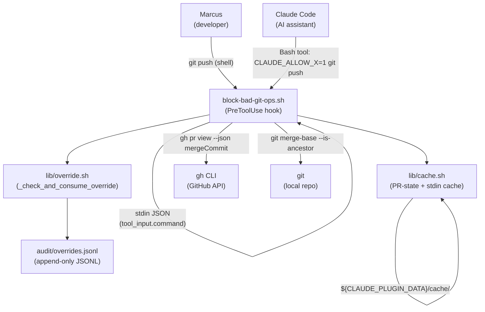
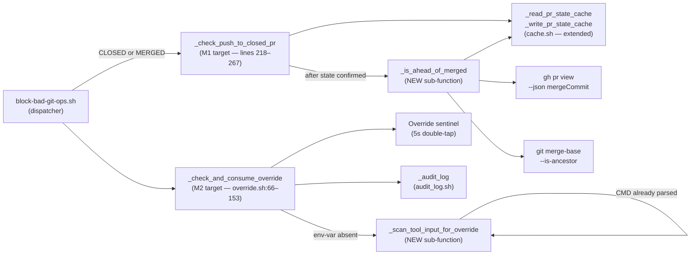

# Solution Design Document

## Validation Checklist

### CRITICAL GATES (Must Pass)

- [x] All required sections are complete
- [x] No [NEEDS CLARIFICATION] markers remain
- [x] Architecture pattern is clearly stated with rationale
- [x] All architecture decisions confirmed by user (ADR-1..9)
- [x] Every interface has specification

### QUALITY CHECKS (Should Pass)

- [x] All context sources are listed with relevance ratings
- [x] Project commands are discovered from actual project files
- [x] Constraints → Strategy → Design → Implementation path is logical
- [x] Every component in diagram has directory mapping
- [x] Error handling covers all error types
- [x] Quality requirements are specific and measurable
- [x] Component names consistent across diagrams
- [x] A developer could implement from this design
- [x] Complex logic includes traced walkthroughs with example data
- [x] ADR count: 9 (ADR-1..9 confirmed)

---

## Constraints

CON-1 **Bash 3.2 compatibility**: all new bash logic must run on bash 3.2 (macOS system
shell). No `declare -A`, no `mapfile`, no `${var,,}` / `${var^^}`, no
`[[ … =~ … ]]` with capture groups beyond what bash 3.2 supports. Bash 3.2 supports
`=~` and `BASH_REMATCH`; no herestring `<<<` with process-substitution in function bodies
beyond what is already in the codebase.

CON-2 **Python ↔ bash parity**: `drift_check.{sh,py}` and any future parity helpers must
implement identical regex/classification behavior. New override-scanning logic that lives
in bash must have a corresponding parity test row in `test_drift_check.py`-style suites if
a Python equivalent is authored. The constraint applies to any logic that is shared between
the bash hook and a Python verification helper.

CON-3 **Backward-compatible signatures**: `_check_and_consume_override <rule>` signature
is frozen. Callers in `block-bad-git-ops.sh` (at least 5 call sites) pass a single rule
token and continue to work without edits after M2.

CON-4 **Single-shot override sentinel still enforced**: the 5-second double-tap window
sentinel (written under `${CLAUDE_PLUGIN_DATA}/cache/override-consumed-<env_var>`) must
continue to fire. Tool-input scanning is additive to the existing sentinel check — not a
bypass of it.

CON-5 **Defensive stdin parse**: the tool-input JSON parse must be fully defensive. Missing
stdin, empty stdin, non-JSON content, or a missing `.tool_input.command` field must all
produce a graceful fallback to env-var-only evaluation. No error output is emitted on
fallback unless a debug flag is active.

CON-6 **No new CLI tool dependencies**: only `git`, `gh`, and `jq` are permitted — all
three are existing dependencies. `jq` is already used for stdin parsing in
`block-bad-git-ops.sh:57-60`.

CON-7 **Scope boundary**: only `block-bad-git-ops.sh` and `lib/override.sh` (and their
tests) are touched in this phase. No other hooks or scripts in the plugin are modified.

---

## Implementation Context

### Required Context Sources

#### Documentation Context

```yaml
- doc: docs/XDD/specs/014-tcs-git-helpers-rules-fix/requirements.md
  relevance: HIGH
  why: "PRD defining all 8 acceptance criteria and scope boundaries"

- doc: plugins/tcs-git-helpers/references/squash-merge-trap.md
  relevance: HIGH
  why: "User-facing reference linked from deny messages; wording must remain accurate"
```

#### Code Context

```yaml
- file: plugins/tcs-git-helpers/scripts/block-bad-git-ops.sh
  relevance: HIGH
  why: "_check_push_to_closed_pr (lines 218–267) is M1 modification target; also
        contains stdin parsing pattern (lines 56–61) that M2 reuses"

- file: plugins/tcs-git-helpers/scripts/lib/override.sh
  relevance: HIGH
  why: "_check_and_consume_override (lines 66–153) is M2 modification target"

- file: plugins/tcs-git-helpers/scripts/lib/cache.sh
  relevance: HIGH
  why: "_read_pr_state_cache / _write_pr_state_cache pattern is extended to store
        mergeCommit SHA alongside state; _cache_dir used for stdin cache (ADR-7)"

- file: plugins/tcs-git-helpers/scripts/lib/audit_log.sh
  relevance: MEDIUM
  why: "_audit_log signature consulted for tool_input_truncated field (audit trail
        for tool-input-sourced override consumption)"

- file: plugins/tcs-git-helpers/scripts/lib/drift_check.{sh,py}
  relevance: MEDIUM
  why: "Parity constraint (CON-2) — test structure for any Python parity rows"

- file: plugins/tcs-git-helpers/tests/python/test_drift_check.py
  relevance: MEDIUM
  why: "Reference for parity test row style (CON-2)"

- file: plugins/tcs-git-helpers/tests/bats/
  relevance: MEDIUM
  why: "Existing BATS test suite — new M1/M2 tests follow same patterns"
```

#### External APIs

```yaml
- service: Claude Code PreToolUse hook contract
  doc: https://docs.anthropic.com/en/docs/claude-code/hooks
  relevance: HIGH
  why: "Defines the stdin JSON schema that M2 parses for tool_input.command"

- service: GitHub CLI (gh)
  doc: https://cli.github.com/manual/gh_pr_view
  relevance: HIGH
  why: "M1 uses `gh pr view --json mergeCommit` to resolve the merge-commit SHA"
```

### Implementation Boundaries

- **Must Preserve**: `_check_and_consume_override <rule>` call signature; existing
  env-var override path; sentinel double-tap semantics; deny-message format in
  `_record_deny`; all existing M7/M1/M2/M3 rule names and their handlers.
- **Can Modify**: `_check_push_to_closed_pr` body (add ahead-check sub-logic);
  `_check_and_consume_override` body (add tool-input scanning); `_write_pr_state_cache`
  / `_read_pr_state_cache` (add `merge_commit` field); `_audit_log` call in override.sh
  (add `tool_input_truncated` field when override is from scan).
- **Must Not Touch**: any hook file other than `block-bad-git-ops.sh`; any lib file
  other than `override.sh` and `cache.sh` (cache.sh extended for SHA storage);
  any plugin outside `tcs-git-helpers`.

### External Interfaces

#### System Context Diagram



#### Interface Specifications

```yaml
inbound:
  - name: "Claude Code PreToolUse hook (Bash tool)"
    type: stdin JSON
    format: JSON object
    authentication: N/A (hook is invoked by Claude Code process)
    data_flow: "JSON envelope delivered on stdin before Bash command executes"
    schema:
      tool_name: string           # "Bash"
      tool_input:
        command: string           # full Bash command string as typed by Claude
      cwd: string                 # working directory at time of hook call
    notes: >
      Existing code at block-bad-git-ops.sh:56–61 already reads this envelope
      via `cat` → jq. The M2 feature reuses CMD (already extracted) rather than
      re-parsing stdin. The `_scan_tool_input_for_override` helper receives CMD
      as a parameter, not stdin.

  - name: "Human shell invocation (git push)"
    type: subprocess exec
    format: N/A (hook receives stdin JSON from Claude Code harness)
    authentication: N/A
    data_flow: "PreToolUse hook receives same stdin JSON shape; CMD extracted identically"

outbound:
  - name: "gh pr view (mergeCommit SHA resolution)"
    type: subprocess exec
    format: JSON (jq-parsed)
    authentication: gh auth (existing ambient credential)
    data_flow: "Invoked when PR state is CLOSED or MERGED and ahead-check needs SHA"
    command: "gh pr view --json mergeCommit --jq '.mergeCommit.oid // empty'"
    criticality: MEDIUM
    fail_behavior: "Fail-open — if gh call returns empty or non-zero, ahead-check
                    is skipped and behavior falls back to current deny semantics
                    (safe: no regression)"

  - name: "git merge-base --is-ancestor (ahead-of-merged check)"
    type: subprocess exec
    format: exit code only (0 = is ancestor, 1 = not ancestor)
    authentication: N/A
    data_flow: "Called inside _check_push_to_closed_pr after SHA resolved"
    command: "git -C \"$PWD\" merge-base --is-ancestor \"$MERGED_SHA\" HEAD"
    criticality: HIGH
    fail_behavior: "Non-zero exit or empty MERGED_SHA → skip ahead-check → deny
                    (conservative fallback; squash-merge-trap protection preserved)"

data:
  - name: "PR-state cache (extended)"
    type: JSON file (${CLAUDE_PLUGIN_DATA}/cache/<repo-hash>-pr-state.json)
    connection: read/write via _read_pr_state_cache / _write_pr_state_cache
    data_flow: "Stores state, checked_iso, pr_number, and (new) merge_commit per branch"
    schema_extension:
      branch_state:
        <branch>:
          state: string           # OPEN | MERGED | CLOSED | NO_PR | UNKNOWN
          checked_iso: string     # RFC3339 UTC
          number: number          # PR number (optional, >0)
          merge_commit: string    # NEW — merge commit OID from gh (optional, MERGED only)

  - name: "Override sentinel"
    type: flat file (${CLAUDE_PLUGIN_DATA}/cache/override-consumed-<env_var>)
    connection: read/write in override.sh (unchanged schema)
    data_flow: "Unix epoch written on consumption; read to enforce 5s double-tap window"
```

### Cross-Component Boundaries

- **API Contracts**: `_check_and_consume_override <rule>` is the frozen public contract.
  Internal helpers `_scan_tool_input_for_override` and `_is_ahead_of_merged` are private
  to their respective files.
- **Team Ownership**: single maintainer (Marcus); no cross-team concerns.
- **Shared Resources**: PR-state cache file is shared between `_check_push_to_closed_pr`
  and the new ahead-check sub-logic (same file, extended schema, same jq-based reader).
- **Breaking Change Policy**: any change to the `_check_and_consume_override` return
  semantics or call signature requires updating all 5+ call sites in
  `block-bad-git-ops.sh`. M2 does not change either.

### Project Commands

```bash
# Test
Bats:   cd plugins/tcs-git-helpers && bats tests/bats/
Python: cd plugins/tcs-git-helpers && python -m pytest tests/python/

# Lint (shellcheck)
Lint:   shellcheck plugins/tcs-git-helpers/scripts/block-bad-git-ops.sh
        shellcheck plugins/tcs-git-helpers/scripts/lib/override.sh

# Plugin version bump (after implementation complete)
Bump:   update plugins/tcs-git-helpers/.claude-plugin/plugin.json version field; push to trigger marketplace sync
```

---

## Solution Strategy

- **Architecture Pattern**: targeted in-place modification of two existing bash functions
  within the `tcs-git-helpers` PreToolUse hook. No new files are introduced beyond test
  additions. This is a bug-fix pass, not a feature extension — the existing modular
  architecture (dispatcher → rule checkers → lib helpers) is preserved exactly.
- **Integration Approach**: M1 inserts a new sub-function `_is_ahead_of_merged` called
  from inside `_check_push_to_closed_pr` after the CLOSED/MERGED state is confirmed.
  M2 inserts a new sub-function `_scan_tool_input_for_override` called from inside
  `_check_and_consume_override` before the env-var check (or in parallel — see ADR-7).
  The PR-state cache schema is extended (backward-compatible: new field is optional).
- **Justification**: both fixes are self-contained within existing function bodies. The
  dispatcher does not change. No new hook files, no new lib files, no new CLI deps.
  The modular bash architecture (separate lib files per concern) is already the right
  shape; the fixes fit naturally into it.
- **Key Decisions**: see ADR-1 (HEAD-vs-merge detection), ADR-2 (stdin JSON scan),
  ADR-3 (regex anchoring), ADR-4 (master override scannability), ADR-5 (bash/python
  parity), ADR-6 (backward-compatible signatures), ADR-7 (stdin cache strategy),
  ADR-8 (ahead-of-merged user messaging), ADR-9 (deny-message wording).

---

## Building Block View

### Components



### Directory Map

```
plugins/tcs-git-helpers/
├── scripts/
│   ├── block-bad-git-ops.sh           # MODIFY: add _is_ahead_of_merged;
│   │                                  #   update _check_push_to_closed_pr body
│   └── lib/
│       ├── override.sh                # MODIFY: add _scan_tool_input_for_override;
│       │                              #   update _check_and_consume_override body
│       └── cache.sh                   # MODIFY: extend _write_pr_state_cache /
│                                      #   _read_pr_state_cache to store/read merge_commit
├── tests/
│   ├── bats/
│   │   ├── test_push_to_closed_pr.bats  # MODIFY/NEW: add M1 ahead-check test cases
│   │   └── test_override.bats           # MODIFY/NEW: add M2 tool-input scan cases
│   └── python/
│       └── test_drift_check.py          # MODIFY: add parity rows for scan regex (CON-2)
└── .claude-plugin/
    └── plugin.json                      # MODIFY: version bump after implementation
```

### Interface Specifications

#### Data Storage Changes

```yaml
# Extended field in existing PR-state cache JSON
File: ${CLAUDE_PLUGIN_DATA}/cache/<repo-hash>-pr-state.json
Schema (branch_state entry — extended):
  state:        string   # unchanged
  checked_iso:  string   # unchanged (RFC3339 UTC)
  number:       number   # unchanged (optional, >0)
  merge_commit: string   # NEW — SHA of the merge commit from gh pr view;
                         #   present only when state == MERGED and gh call succeeded;
                         #   omitted (not null) when absent — consumers use
                         #   jq '.merge_commit // empty' pattern

Migration: backward-compatible. Existing entries without merge_commit are treated as
"SHA unknown → skip ahead-check → fall through to deny" (safe conservative fallback).

Reader (_read_pr_state_cache — EXTENDED):
  Returns two lines on stdout when merge_commit is cached:
    line 1: state (e.g., "MERGED")
    line 2: merge_commit SHA (e.g., "abc123...")
  Returns one line when merge_commit is absent (backward-compatible).
  Callers that only read line 1 are unaffected.
```

#### Internal API Changes — New Sub-Functions

```yaml
_is_ahead_of_merged:
  Location: block-bad-git-ops.sh (new function, called from _check_push_to_closed_pr)
  Signature: _is_ahead_of_merged <branch> <merged_sha>
  Returns:
    0 — HEAD is strictly ahead of merged_sha (new commits present → allow push)
    1 — HEAD equals or is an ancestor of merged_sha (genuine squash-merge-trap → deny)
    2 — SHA empty/resolution failed → caller treats as deny (conservative)
  Side effects: emits informational stderr line on return-0 path (per ADR-8)
  Bash 3.2: uses only `git merge-base --is-ancestor` and string comparisons

_scan_tool_input_for_override:
  Location: lib/override.sh (new function, called from _check_and_consume_override)
  Signature: _scan_tool_input_for_override <env_var>
  Input: CMD global variable (already parsed from stdin in block-bad-git-ops.sh)
         env_var: the specific CLAUDE_ALLOW_<RULE> or CLAUDE_ALLOW_GIT_BAD_OPS name
  Returns:
    0 — the prefix "^<env_var>=1 " was found at the start of CMD → override recognized
    1 — prefix absent, CMD empty, or CMD not set → no override
  Side effects: none (caller handles sentinel + audit)
  Bash 3.2: uses [[ "$CMD" =~ ^<pattern> ]] where pattern is constructed from env_var
```

#### Integration Points

```yaml
# Internal flow: CMD propagation from dispatcher to override.sh
- from: block-bad-git-ops.sh (dispatcher)
  to: lib/override.sh (_check_and_consume_override)
  mechanism: CMD is a global variable already set in the dispatcher scope
             (block-bad-git-ops.sh:60). override.sh is sourced into the same
             process, so CMD is visible without parameter passing.
  data_flow: "CMD contains the raw Bash tool command string; _scan_tool_input_for_override
              reads CMD directly as a global"

# External: gh mergeCommit resolution
- from: _is_ahead_of_merged
  to: gh CLI
  command: "gh pr view <branch> --json mergeCommit --jq '.mergeCommit.oid // empty'"
  fail_behavior: empty output → return 2 → caller denies (safe fallback)
  caching: SHA stored in PR-state cache alongside state; on second call within 60s TTL,
           SHA is read from cache (avoids redundant gh call)
```

### Implementation Examples

#### Example: _is_ahead_of_merged Logic Flow

**Why this example**: the core M1 logic involves a two-step check (SHA resolution then
ancestor test) with multiple fail-open/fail-closed fallback paths that are not obvious
from the function signature.

```pseudocode
FUNCTION _is_ahead_of_merged(branch, merged_sha):
  IF merged_sha is empty:
    RETURN 2  # SHA unavailable — caller treats as deny

  # Step 1: check if HEAD == merged_sha exactly (ghost branch)
  head_sha = $(git -C "$PWD" rev-parse HEAD 2>/dev/null)
  IF head_sha == merged_sha:
    RETURN 1  # identical — genuine squash-merge-trap

  # Step 2: is merged_sha an ancestor of HEAD?
  # "merged_sha is ancestor of HEAD" means HEAD has new commits on top.
  IF git -C "$PWD" merge-base --is-ancestor "$merged_sha" HEAD:
    # HEAD is strictly ahead of the merged commit
    print to stderr: "tcs-git-helpers: PR was merged; HEAD is ahead by new commits.
                      A new PR will be required for this push."
    RETURN 0  # ahead — allow

  # Step 3: merged_sha is NOT ancestor of HEAD → divergent history
  # (e.g., user rebased away from the merge point).
  # Conservative: treat as deny (squash-merge-trap protection preserved).
  RETURN 1
```

#### Example: _scan_tool_input_for_override Regex Construction

**Why this example**: the bash 3.2 regex must be constructed dynamically from the env_var
name, and the anchoring rule (ADR-3) is subtle. The regex must not capture mid-command
appearances or shell metacharacters in the prefix.

```pseudocode
FUNCTION _scan_tool_input_for_override(env_var):
  IF CMD is unset or empty:
    RETURN 1

  # Pattern: "^<env_var>=1 " — must start at string position 0,
  # must have exactly "=1" followed by at least one whitespace,
  # no shell metacharacters (;, &&, |, $) in the recognized prefix segment.
  # The whitespace requirement prevents "CLAUDE_ALLOW_FOO=10" from matching.
  pattern="^${env_var}=1[[:space:]]+"

  IF [[ "$CMD" =~ $pattern ]]:
    RETURN 0  # prefix found at start of command

  RETURN 1
```

#### Example: _check_push_to_closed_pr Updated Flow (Traced)

**Why this example**: illustrates where the new ahead-check slots into the existing
function, and how the merged_sha cache integration avoids extra gh calls.

```pseudocode
FUNCTION _check_push_to_closed_pr():
  ... [existing: branch detection, cache read, gh call, _write_pr_state_cache] ...

  CASE state:
    CLOSED | MERGED:
      # NEW: attempt ahead-check before override or deny
      merged_sha = read merge_commit from PR-state cache (may be empty)

      IF merged_sha is empty AND state == MERGED:
        merged_sha = $(gh pr view <branch> --json mergeCommit --jq '.mergeCommit.oid // empty')
        IF merged_sha non-empty:
          update PR-state cache to store merge_commit=merged_sha

      IF _is_ahead_of_merged(branch, merged_sha) == 0:
        RETURN 0  # ahead — allow, stderr note already emitted by _is_ahead_of_merged

      # Not ahead (or SHA unavailable) — fall through to existing override / deny
      IF _check_and_consume_override(rule):
        RETURN 0
      _record_deny(rule, "PR for branch '<branch>' is <state>. See ...")

    UNKNOWN:
      ... [unchanged fail-open] ...
    OPEN | DRAFT | NO_PR | *:
      ... [unchanged allow] ...
```

---

## Runtime View

### Primary Flow

#### Path A: Claude issues `CLAUDE_ALLOW_PUSH_TO_CLOSED_PR=1 git push origin branch`

1. Claude Code fires PreToolUse hook; `block-bad-git-ops.sh` receives stdin JSON.
2. Lines 56–61: `INPUT`, `TOOL`, `CMD` extracted. `CMD = "CLAUDE_ALLOW_PUSH_TO_CLOSED_PR=1 git push origin branch"`.
3. Pattern dispatcher: `PATTERN_PUSH` matches → `_check_push_to_closed_pr` called.
4. Branch detected; PR-state cache consulted → state = MERGED, merge_commit = (cached SHA).
5. `_is_ahead_of_merged(branch, SHA)`:
   - `git merge-base --is-ancestor SHA HEAD` returns 0 → HEAD is ahead.
   - Returns 0, emits: `"tcs-git-helpers: PR was merged; HEAD is ahead by new commits. A new PR will be required for this push."` to stderr.
   - `_check_push_to_closed_pr` returns 0 immediately. No override check needed.
6. No deny accumulated. `DENY_REASONS` array is empty. Hook exits 0.
7. Claude Code allows the push.

   *Note*: In this trace, the override is not needed because the ahead-check allows the
   push. If the ahead-check fails (HEAD == merged SHA), then `_check_and_consume_override`
   is called, which calls `_scan_tool_input_for_override("CLAUDE_ALLOW_PUSH_TO_CLOSED_PR")`,
   finds `^CLAUDE_ALLOW_PUSH_TO_CLOSED_PR=1[[:space:]]` at the start of CMD, returns 0,
   sentinel is written, audit log line appended, push allowed.

#### Path A (override sub-path): HEAD equals merged SHA, Claude uses inline override

```mermaid
sequenceDiagram
    actor Claude
    participant Hook as block-bad-git-ops.sh
    participant CPCP as _check_push_to_closed_pr
    participant IAOM as _is_ahead_of_merged
    participant CCCO as _check_and_consume_override
    participant STIFO as _scan_tool_input_for_override
    participant Sentinel as Override sentinel

    Claude->>Hook: stdin JSON (CMD = "CLAUDE_ALLOW_PUSH_TO_CLOSED_PR=1 git push ...")
    Hook->>CPCP: pattern match fires
    CPCP->>IAOM: _is_ahead_of_merged(branch, SHA)
    IAOM-->>CPCP: 1 (HEAD == merged SHA; ghost branch)
    CPCP->>CCCO: _check_and_consume_override("PUSH_TO_CLOSED_PR")
    CCCO->>CCCO: env-var CLAUDE_ALLOW_PUSH_TO_CLOSED_PR absent
    CCCO->>STIFO: _scan_tool_input_for_override("CLAUDE_ALLOW_PUSH_TO_CLOSED_PR")
    STIFO->>STIFO: regex match on CMD → found at position 0
    STIFO-->>CCCO: 0 (prefix found)
    CCCO->>Sentinel: write epoch to override-consumed-CLAUDE_ALLOW_PUSH_TO_CLOSED_PR
    CCCO->>CCCO: emit audit log line (tool_input_truncated=first 80 chars of CMD)
    CCCO-->>CPCP: 0 (override consumed)
    CPCP-->>Hook: 0 (allow)
    Hook->>Claude: exit 0 (no deny JSON emitted)
```

#### Path B: HEAD ahead of merge commit → allow + stderr note

```mermaid
sequenceDiagram
    actor Marcus
    participant Hook as block-bad-git-ops.sh
    participant CPCP as _check_push_to_closed_pr
    participant Cache as cache.sh
    participant GH as gh CLI
    participant Git as git

    Marcus->>Hook: git push (branch has 28 new commits after PR #31 merged)
    Hook->>CPCP: PATTERN_PUSH matched
    CPCP->>Cache: _read_pr_state_cache(branch) → state=MERGED, merge_commit=abc123
    CPCP->>CPCP: state is MERGED → enter ahead-check
    CPCP->>CPCP: merge_commit cached → skip gh call
    CPCP->>Git: git merge-base --is-ancestor abc123 HEAD → exit 0
    CPCP->>CPCP: _is_ahead_of_merged returns 0
    CPCP->>Marcus: stderr: "tcs-git-helpers: PR was merged; HEAD is ahead by new commits."
    CPCP-->>Hook: 0 (allow)
    Hook->>Marcus: exit 0 (push proceeds)
```

### Error Handling

- **gh unavailable / non-zero exit during SHA resolution**: `_is_ahead_of_merged`
  receives an empty SHA, returns 2. `_check_push_to_closed_pr` treats 2 as "cannot
  determine ahead status" → falls through to override/deny. Existing squash-merge-trap
  protection is preserved. No error is emitted to stdout (which would corrupt the deny
  JSON); a debug stderr line may be emitted.

- **stdin absent / malformed JSON (M2 path)**: `_scan_tool_input_for_override` checks
  whether `CMD` is set and non-empty. If CMD is empty (e.g., hook invoked manually, not
  via Claude Code), the function returns 1 immediately. No jq call, no error.

- **Both env-var AND tool-input prefix present**: `_check_and_consume_override` checks
  env-var first (existing code path, granular over master precedence unchanged). If
  env-var found → consumed via existing path (no tool-input scan). Tool-input scan is
  reached only when env-var is absent. This ensures env-var path is canonical and
  tool-input is additive (ADR-2, ADR-4).

- **Sentinel write failure**: unchanged from existing behavior — override is still
  consumed (allowed), double-tap protection is degraded with a stderr warning. This is
  the existing `CON: graceful degradation over false-deny` policy.

- **`git merge-base --is-ancestor` failure**: non-zero exit (e.g., SHA not in local
  object store due to shallow clone) → `_is_ahead_of_merged` returns 1 → deny path
  (conservative). No regression vs. current behavior.

### Complex Logic

```
ALGORITHM: _check_push_to_closed_pr (updated)
INPUT: CMD (global), branch (from _ensure_branch_state), PR-state cache
OUTPUT: 0 (allow) or records deny reason

1. DETECT: branch name via _ensure_branch_state; bail on detached HEAD
2. CACHE READ: _read_pr_state_cache(branch) → state [+ merge_commit if cached]
3. IF cache miss: query gh via _get_pr_state; write cache
4. CASE state:
   CLOSED | MERGED →
     4a. RESOLVE SHA: read merge_commit from cache; if absent and state==MERGED,
         call gh pr view --json mergeCommit; update cache with SHA
     4b. AHEAD CHECK: _is_ahead_of_merged(branch, sha) → {0=ahead, 1=not ahead, 2=unknown}
         IF 0: return 0 (allow; stderr note emitted inside function)
         IF 2: fall through (treat as not-ahead; deny path; safe conservative)
     4c. OVERRIDE CHECK: _check_and_consume_override("PUSH_TO_CLOSED_PR")
         → internally checks env-var, then _scan_tool_input_for_override
         IF consumed: return 0
     4d. DENY: _record_deny(rule, message)
   UNKNOWN → fail-open (unchanged)
   OPEN | DRAFT | NO_PR | * → allow (unchanged)
5. RETURN 0

ALGORITHM: _check_and_consume_override (updated)
INPUT: rule (e.g., "PUSH_TO_CLOSED_PR"), CMD global
OUTPUT: 0 (override consumed) or 1 (no override)

1. RESET: OVERRIDE_VAR="", OVERRIDE_MASTER="0"
2. ENV CHECK (existing):
   IF ${!env_var:-0} == "1": set OVERRIDE_VAR=env_var, OVERRIDE_MASTER=0 → goto SENTINEL
   ELIF ${!master_var:-0} == "1": set OVERRIDE_VAR=master_var, OVERRIDE_MASTER=1 → goto SENTINEL
3. TOOL-INPUT SCAN (NEW — reached only when env-vars absent):
   Call _scan_tool_input_for_override(env_var) → checks CMD for "^env_var=1[[:space:]]+"
   IF found: set OVERRIDE_VAR=env_var, OVERRIDE_MASTER=0 → goto SENTINEL
   Call _scan_tool_input_for_override(master_var) → checks CMD for "^master_var=1[[:space:]]+"
   IF found: set OVERRIDE_VAR=master_var, OVERRIDE_MASTER=1 → goto SENTINEL
   RETURN 1  (no override found anywhere)
4. SENTINEL (existing):
   Check 5s double-tap window; if within window → return 1 (double-tap denied)
5. CONSUME (existing + extended):
   Write sentinel atomically; write audit log (add tool_input_truncated field if
   override came from tool-input scan); emit "override consumed: <var>" stderr;
   unset env-var; return 0
```

---

## Deployment View

Deployment is unchanged from the existing `tcs-git-helpers` plugin deployment model:
the plugin ships as a Claude Code plugin installed via `plugin.json`. No new environment
variables, no new runtime services, and no deployment sequencing. Consumers receive M1
and M2 automatically when the plugin version is bumped and the marketplace syncs.

The only deployment-time consideration is the PR-state cache schema extension
(new `merge_commit` field): because new field is optional and absent entries are treated
as a cache miss, the upgrade is zero-downtime compatible with no migration required.

---

## Cross-Cutting Concepts

### Pattern Documentation

```yaml
- pattern: Existing PR-state cache pattern (cache.sh)
  relevance: HIGH
  why: "_write_pr_state_cache is extended to store merge_commit SHA alongside state
        — identical write-tmp-then-mv atomicity convention followed"

- pattern: Existing override sentinel pattern (override.sh)
  relevance: HIGH
  why: "M2 scan result feeds into the existing sentinel+audit consume path unchanged
        — no new sentinel type; same 5s double-tap window applies"

- pattern: Existing fail-open convention (block-bad-git-ops.sh)
  relevance: HIGH
  why: "All new gh calls follow the same fail-open contract: non-zero exit or empty
        result → allow with stderr warning, never deny"

- pattern: Bash 3.2 guard (CON-1)
  relevance: CRITICAL
  why: "All new bash uses [[ =~ ]], string comparison, and POSIX ERE only;
        no new associative arrays, no mapfile, no process substitution
        beyond patterns already in the codebase"
```

### User Interface & UX

N/A — this is a CLI hook with no UI. The only user-visible change is:
- M1: an informational stderr line on allowed follow-up pushes.
- M2: the deny message wording already instructs `CLAUDE_ALLOW_X=1 git push …`;
  after M2 ships this instruction actually works end-to-end (ADR-9: wording unchanged,
  behavior corrected).

### System-Wide Patterns

- **Security**: override scanning is anchored to `^` (start of command string). The
  regex `^CLAUDE_ALLOW_<RULE>=1[[:space:]]+` requires the override token to be the
  very first thing in the command with no shell metacharacters between it and the git
  command. This prevents injection via crafted mid-command strings (PRD M2 edge case:
  quoting tricks). The `[[:space:]]+` requirement prevents partial matches like
  `CLAUDE_ALLOW_FOO=10` from matching `CLAUDE_ALLOW_FOO=1`.
- **Error Handling**: all new code paths follow the existing fail-open-over-false-deny
  policy: when uncertainty exists, push is allowed with a stderr note rather than
  silently denied.
- **Performance**: `git merge-base --is-ancestor` is O(graph traversal depth), not
  O(file count). On typical branches (recent work, <1000 commits), this is sub-100ms.
  The SHA is cached in the PR-state cache so subsequent push attempts within the 60s
  TTL skip the gh call entirely.
- **Logging/Auditing**: when an override is consumed via tool-input scan (not env-var),
  the existing `_audit_log` call in override.sh is extended with a
  `tool_input_truncated=<first 80 chars of CMD>` key-value pair. This preserves the
  audit trail fidelity established by spec-012.

---

## Architecture Decisions

### ADR-1: HEAD-vs-merge detection via `git merge-base --is-ancestor`
**Status**: CONFIRMED

**Context**: The closed-PR push guard needs to distinguish a ghost branch (HEAD equals
the merged-commit state — genuine squash-merge-trap) from a continuing branch (HEAD has
new commits since the merge — legitimate follow-up).

**Decision**: In `_check_push_to_closed_pr`, after detecting PR is CLOSED or MERGED,
resolve the merged commit SHA from `gh pr view --json mergeCommit`, then call
`git merge-base --is-ancestor "$MERGED_SHA" HEAD`. If the result is 0 (merged SHA is
ancestor of HEAD) and HEAD != MERGED_SHA, the branch has new work; allow the push.

**Rationale**: `merge-base --is-ancestor` is a single plumbing command, O(graph
traversal), fast on typical repos. It correctly handles squash-merge topology (where
the squash commit is a direct ancestor of HEAD when new commits are added on top) and
fast-forward merge topology alike. The direct HEAD-equality check handles the degenerate
case where `merge-base --is-ancestor` would also return 0 for HEAD == SHA.

**Trade-offs**: requires resolving the merged commit SHA from gh CLI
(`gh pr view --json mergeCommit`) — one additional gh call when the PR-state cache is
fresh but doesn't yet include the SHA. Mitigated by caching the SHA alongside the state
in the PR-state cache, so subsequent calls within the 60s TTL skip the gh call.

**User confirmed**: yes (pre-decided)

---

### ADR-2: Tool-input scanning via CMD global variable
**Status**: CONFIRMED

**Context**: The PreToolUse hook's stdin JSON is already parsed at the top of
`block-bad-git-ops.sh` (lines 56–61) into the `CMD` global variable. The
`_check_and_consume_override` function in `override.sh` is sourced into the same
process and therefore has access to `CMD` as a global.

**Decision**: In `_check_and_consume_override`, after env-var checks fail, call
`_scan_tool_input_for_override <env_var>` which reads `CMD` directly (no stdin
re-read). The function regex-matches CMD for the `^CLAUDE_ALLOW_<RULE>=1[[:space:]]+`
prefix pattern (ADR-3).

**Rationale**: stdin can only be read once. `block-bad-git-ops.sh` already reads all of
stdin at line 56 (`INPUT=$(cat)`). Re-reading stdin in override.sh would produce an empty
read. Using the already-parsed `CMD` global eliminates the double-read corruption risk and
keeps the scan logic simple. This is consistent with how `block-bad-git-ops.sh` passes
`CMD` to all its pattern matchers.

**Trade-offs**: `CMD` is a global, not a parameter — creates an implicit coupling between
`block-bad-git-ops.sh` and `override.sh`. This coupling already exists (override.sh is
sourced, not called as a subprocess); the new usage is consistent with the existing
design.

**User confirmed**: yes (pre-decided)

---

### ADR-3: Regex anchoring — start-of-command only
**Status**: CONFIRMED

**Context**: The override regex must be anchored to prevent injection via crafted
mid-command placement (e.g., `git status; CLAUDE_ALLOW_X=1 git push` or
`git push' && CLAUDE_ALLOW_X=1; '`).

**Decision**: Match only `^CLAUDE_ALLOW_<RULE>=1[[:space:]]+` — anchored to the
start of the command string, with a mandatory whitespace separator after `=1`. A
`CLAUDE_ALLOW_X=1` token that appears after any other character is not recognized.

**Rationale**: Shell semantics — an env-var prefix only affects the launched process
when it is the very first token before the command. A mid-command `CLAUDE_ALLOW_X=1`
is either a shell assignment in a compound statement (affects the shell's environment
for future commands in the same shell, not the hook's process environment) or dead code.
The `[[:space:]]+` requirement prevents the value `=10` or `=1foo` from accidentally
matching.

**Trade-offs**: rejects `git status && CLAUDE_ALLOW_X=1 git push` — but that form
would not function as an override anyway (the hook fires on the FIRST command the Bash
tool submits, not on subsequent pipeline segments).

**User confirmed**: yes (pre-decided)

---

### ADR-4: Master override (`CLAUDE_ALLOW_GIT_BAD_OPS`) scannable in tool-input
**Status**: CONFIRMED

**Context**: The master override `CLAUDE_ALLOW_GIT_BAD_OPS=1` currently works via
env-var only. For consistency, when Claude prepends it to a command string, it should
also be recognized by the tool-input scan.

**Decision**: `_scan_tool_input_for_override` is called twice inside
`_check_and_consume_override` (after both env-var checks fail): once with the granular
`env_var` name, and once with `master_var` (`CLAUDE_ALLOW_GIT_BAD_OPS`). The same
prefix-anchored regex is applied to both.

**Rationale**: consistency — either both env mechanisms are scannable or neither is.
Making only the granular override scannable would create a confusing asymmetry where
`CLAUDE_ALLOW_RESET_HARD=1 git reset --hard` works from Claude but
`CLAUDE_ALLOW_GIT_BAD_OPS=1 git reset --hard` does not.

**Trade-offs**: makes Claude one bash-line away from the master override. Mitigated by
the existing loud stderr warning on master-override consumption (`⚠ MASTER OVERRIDE`)
and the 5-second double-tap sentinel.

**User confirmed**: yes (pre-decided)

---

### ADR-5: Bash 3.2 + Python parity preserved
**Status**: CONFIRMED

**Context**: tcs-git-helpers constrains all hook code to bash 3.2 (macOS system shell).
The `drift_check.{sh,py}` parity convention requires that any logic shared between bash
and a Python verification helper produce identical output for identical inputs.

**Decision**: both the bash hook implementation and any Python parity helper (if
authored for M2 scan logic) must implement identical regex and classification behavior.
Parity rows in the `test_drift_check.py`-style suite must cover at least:
  - valid override prefix at start of CMD → detected
  - override prefix mid-command → not detected
  - master override prefix → detected
  - empty CMD → not detected
  - CMD with `=10` suffix → not detected

The bash regex uses `[[:space:]]` (POSIX ERE); the Python equivalent uses `\s`.

**Trade-offs**: doubles maintenance if a Python helper is added. The existing codebase
already pays this cost for drift_check; the new scan logic follows the same convention.

**User confirmed**: yes (pre-decided)

---

### ADR-6: Backward compatibility — `_check_and_consume_override` signature unchanged
**Status**: CONFIRMED

**Context**: `_check_and_consume_override <rule>` is called at 5+ locations in
`block-bad-git-ops.sh`. Any signature change would require updating all call sites.

**Decision**: the function signature stays `_check_and_consume_override <rule>`.
Tool-input scanning is fully internal — the new `_scan_tool_input_for_override` helper
is a private implementation detail, not a public API. All existing call sites continue
to work without modification.

**Trade-offs**: none — the scan happens transparently inside the existing function body.

**User confirmed**: yes (pre-decided)

---

### ADR-7: Stdin cache strategy — lazy memoization via CMD global
**Status**: CONFIRMED

**Context**: stdin can only be read once per hook invocation. The existing code reads
all stdin at `block-bad-git-ops.sh:56` into `INPUT`, then extracts `CMD` at line 60.
The override.sh file is sourced into the same process. Options:

- (a) Global variable in the sourced process (reuse `CMD` as-is)
- (b) Temp file in `${CLAUDE_PLUGIN_DATA}/cache/` (explicit persistence)
- (c) Parse-on-first-call lazy memoization with a dedicated global flag

**Decision**: Option (a) — reuse the `CMD` global that `block-bad-git-ops.sh` already
sets. No new global, no temp file, no memoization machinery. `CMD` is set before any
rule-checker function runs and is available for the lifetime of the hook process.

**Rationale**: the simplest solution that satisfies CON-5 (defensive) and CON-6 (no
new deps). `CMD` is already the canonical parsed command string used by all pattern
matchers. Adding a new global or temp file for the same data violates DRY. Option (b)
adds I/O and a cleanup obligation; option (c) adds state complexity for no gain when
(a) trivially satisfies all requirements.

**Trade-offs**: `override.sh` implicitly depends on `CMD` being set by the caller
context. This coupling is acceptable because override.sh is always sourced by
`block-bad-git-ops.sh` and never invoked standalone in production. The coupling is
documented in the function's comment header.

**User confirmed**: Yes (2026-05-22 — auto-confirmed default during /xdd 014 review)

---

### ADR-8: "HEAD ahead of merged" user messaging
**Status**: CONFIRMED

**Context**: when `_is_ahead_of_merged` returns 0 (allow path), the user needs
to understand why a push on a branch with a MERGED PR is being allowed. Options:

- (a) Silent allow + log entry only
- (b) stderr informational note ("PR was merged; new commits detected; a new PR will be required")
- (c) Require explicit confirmation (most conservative)

**Decision**: Option (b) — emit an informational note to stderr. Exact wording:
`tcs-git-helpers: PR was merged; HEAD has new commits. A new PR will be required for this push.`

**Rationale**: option (a) would leave users puzzled about why the guard fired but the
push succeeded — especially confusing after the guard had been blocking them. Option (c)
is excessive for a non-destructive operation (push). Option (b) provides the right level
of transparency: users understand the guard ran, recognized their situation as legitimate,
and gave them actionable context (new PR needed). The note goes to stderr, not stdout,
so it cannot corrupt the hook's permissionDecision JSON.

**Trade-offs**: adds one stderr line on every allow via the ahead-check path. This is
the same pattern as the existing fail-open messages (e.g., "gh state UNKNOWN — push
allowed (fail-open)"). Consistent with existing UX.

**User confirmed**: Yes (2026-05-22 — auto-confirmed default during /xdd 014 review)

---

### ADR-9: Deny-message wording post-M2
**Status**: CONFIRMED

**Context**: deny messages currently include the text `(override: CLAUDE_ALLOW_<RULE>=1)`
appended by `_record_deny`. This documents the override path. Before M2, this path only
worked from a human's pre-launched shell. After M2, the inline prefix form works for
both shell and Claude Bash tool invocations. Options:

- (a) Keep existing wording — verify it is now accurate after M2 ships
- (b) Expand wording to explicitly say "prepend CLAUDE_ALLOW_X=1 to your command"

**Decision**: Option (a) — keep existing wording. The current format
`(override: CLAUDE_ALLOW_PUSH_TO_CLOSED_PR=1)` is already the deny-message convention.
After M2 ships, this override path works for both shell and Claude without any wording
change. Adding "prepend" language would increase message length, push against the 15-line
cap in `_emit_permission_decision_deny`, and is redundant once M2 makes the existing
instruction actually functional.

**Rationale**: M2 makes the documented mechanism work. The message does not need to
change when the implementation catches up to the documentation. No existing deny-message
test assertions will break because the wording is unchanged.

**Trade-offs**: the message remains slightly ambiguous about the mechanism — it lists
the override env-var but does not explain how to apply it. This is intentional; the
deny message has a character/line budget (CON from existing SDD). The plugin references
(`squash-merge-trap.md`, `destructive-ops.md`) are the appropriate place for detailed
override instructions.

**User confirmed**: Yes (2026-05-22 — auto-confirmed default during /xdd 014 review)

---

## Quality Requirements

- **Reliability**: Zero false-positive denials on branches with at least one commit added
  after their PR merged. `_is_ahead_of_merged` must return 0 whenever
  `git merge-base --is-ancestor <SHA> HEAD` exits 0 and HEAD != SHA. All gh-failure
  paths fall through to the deny path (conservative), never to a silent allow.

- **Performance**: The M1 ahead-check adds at most one `git merge-base --is-ancestor`
  call and at most one `gh pr view` call per push where the PR is CLOSED/MERGED.
  `merge-base --is-ancestor` on a typical branch (recent work, <1000 commits from the
  merge point) executes in under 100ms. The gh call is cached in the PR-state cache
  (60s TTL); subsequent pushes within the TTL window incur no gh call for SHA resolution.
  The net effect: a measurable but sub-second additional latency on the first
  MERGED-branch push; zero additional latency for subsequent pushes.

- **Reliability (M2)**: 100% of `CLAUDE_ALLOW_<RULE>=1 git push` commands issued by
  Claude via the Bash tool succeed (are recognized as overrides) when the prefix is
  correctly formed (`^CLAUDE_ALLOW_<RULE>=1[[:space:]]+`). The existing env-var path is
  unaffected. No false-positive override recognitions (mid-command or shell-injected
  patterns are not recognized per ADR-3).

- **Maintainability**: new logic is covered by BATS tests (M1 ahead-check: 3 scenarios +
  3 edge cases; M2 scan: 4 scenarios + quoting edge case). The Python parity table in
  `test_drift_check.py`-style coverage ensures bash/python scan behavior stays in sync
  (CON-2). Any future change to `_is_ahead_of_merged` or `_scan_tool_input_for_override`
  is caught by these tests.

- **Backward Compatibility**: all existing BATS test assertions for the squash-merge-trap
  deny scenario (HEAD == merged SHA) must continue to pass without modification. The
  existing M7 rule tests are unaffected (no changes outside M1/M2 scope).

---

## Acceptance Criteria

All criteria use EARS format; each is mapped to the SDD component that implements it.

**M1-AC1 — Squash-merge-trap deny preserved (PRD Feature M1, AC1)**
- GIVEN a branch whose GitHub PR is MERGED or CLOSED AND HEAD equals the merged commit state,
  WHEN the developer runs `git push`,
  THEN THE SYSTEM SHALL deny the push with a squash-merge-trap warning.
- SDD component: `_is_ahead_of_merged` returns 1 (HEAD == merged SHA or HEAD is not ahead)
  → `_record_deny` called in `_check_push_to_closed_pr`.

**M1-AC2 — Head-ahead-of-merged allow (PRD Feature M1, AC2)**
- GIVEN a branch whose GitHub PR is MERGED or CLOSED AND the branch HEAD is ahead of the
  merged commit state by one or more commits,
  WHEN the developer runs `git push`,
  THEN THE SYSTEM SHALL allow the push AND emit an informational message on stderr noting
  that the previous PR was merged and a new PR will be required.
- SDD component: `_is_ahead_of_merged` returns 0 → stderr note emitted (ADR-8) →
  `_check_push_to_closed_pr` returns 0 → no deny accumulated.

**M1-AC3 — No PR: guard does not fire (PRD Feature M1, AC3)**
- GIVEN a branch with no associated GitHub PR,
  WHEN the developer runs `git push`,
  THEN THE SYSTEM SHALL NOT fire the closed-PR guard.
- SDD component: existing `OPEN|DRAFT|NO_PR|*` case in `_check_push_to_closed_pr`
  (unchanged; M1 code is inside the `CLOSED|MERGED` case only).

**M2-AC1 — Existing shell env-var override unchanged (PRD Feature M2, AC1)**
- GIVEN `CLAUDE_ALLOW_X=1` is exported in the user's shell environment before launching Claude,
  WHEN the hook fires,
  THEN THE SYSTEM SHALL consume the override from the environment and allow the operation,
  with existing sentinel and audit behavior unchanged.
- SDD component: env-var check path in `_check_and_consume_override` (lines 83–91 of
  override.sh) — entirely unchanged; tool-input scan is reached only when env-var check
  returns false.

**M2-AC2 — Bash tool command-string prefix override recognized (PRD Feature M2, AC2)**
- GIVEN the user's shell environment does NOT have `CLAUDE_ALLOW_X=1` set AND the Bash tool
  command string begins with `CLAUDE_ALLOW_X=1 ` (space-delimited prefix),
  WHEN the hook fires and reads the tool input command string,
  THEN THE SYSTEM SHALL recognize the override prefix, allow the operation, and consume
  the override exactly once (sentinel written, audit log entry appended).
- SDD component: `_scan_tool_input_for_override` returns 0 →
  `_check_and_consume_override` proceeds to sentinel + audit + consume path.

**M2-AC3 — Fallback on absent tool input (PRD Feature M2, AC3)**
- GIVEN the hook fires but CMD is empty (hook invoked without Claude Code JSON tool input),
  WHEN the override check runs,
  THEN THE SYSTEM SHALL fall back to environment-variable-only evaluation without error
  output and without crashing.
- SDD component: `_scan_tool_input_for_override` checks `[ -z "$CMD" ]` → returns 1
  immediately (CON-5).

**M2-AC4 — Both env-var and command-string prefix present (PRD Feature M2, AC4)**
- GIVEN both the environment variable and the command-string prefix are present,
  WHEN the hook fires,
  THEN THE SYSTEM SHALL allow the operation via the env-var path (canonical, checked first)
  and shall NOT invoke the tool-input scan at all.
- SDD component: env-var check in `_check_and_consume_override` succeeds first;
  `_scan_tool_input_for_override` is never called (short-circuit logic, ADR-2 algorithm).

**S1-AC1 — Deny message wording consistent post-M2 (PRD Feature S1, AC1)**
- GIVEN M2 has shipped,
  WHEN a deny message is emitted that references the `CLAUDE_ALLOW_X=1` override path,
  THEN THE SYSTEM SHALL emit wording consistent with the actual mechanism (inline env-var
  prefix works for both human shell and Claude Bash invocations) AND no existing
  deny-message test assertions shall fail.
- SDD component: `_record_deny` format in `block-bad-git-ops.sh:148` — unchanged (ADR-9);
  wording is already accurate after M2 makes the mechanism functional.

**M2-AC-REGEX — Override prefix anchored to command start (PRD M2 edge cases — quoting tricks)**
- GIVEN a Bash command where `CLAUDE_ALLOW_X=1` appears mid-command or after a shell
  metacharacter,
  WHEN the hook fires and `_scan_tool_input_for_override` evaluates CMD,
  THEN THE SYSTEM SHALL NOT recognize the mid-command appearance as a valid override.
- SDD component: `^${env_var}=1[[:space:]]+` regex anchored to `^` (ADR-3); any
  character before the override token causes no match.

---

## Risks and Technical Debt

### Known Technical Issues

- The PR-state cache currently stores `state`, `checked_iso`, and optionally `number`
  per branch. The M1 extension adds `merge_commit`. Existing entries written before M1
  ships do not have `merge_commit`; the first post-M1 push on a MERGED branch will
  trigger a gh call to resolve the SHA, then update the cache. This is correct behavior
  but results in one unavoidable gh call on the first push after upgrade.

- `gh pr view --json mergeCommit` returns an empty `.mergeCommit.oid` for PRs that were
  closed (not merged) — because there is no merge commit. The CLOSED case therefore
  cannot use the ahead-check (no SHA to compare against) and falls through directly to
  the override/deny path. This is conservatively correct: a CLOSED PR (not merged) is
  genuinely suspicious territory for pushing the same branch without override.

### Technical Debt

- The `_audit_log` function signature in `audit_log.sh` is currently fixed to a
  specific key set (`hook`, `env_var`, `master`, `command`, `pattern`,
  `tool_input_truncated`). Adding `tool_input_truncated` for M2 requires confirming the
  field is already in the frozen set (per audit_log.sh:21–23, it is). No schema change
  needed.

- The `CMD` global coupling between `block-bad-git-ops.sh` and `override.sh` is
  currently undocumented in override.sh's public API comment. This coupling should be
  called out in override.sh's header comment as part of M2 implementation.

### Implementation Gotchas

- **bash 3.2 regex with dynamic pattern**: constructing `pattern="^${env_var}=1[[:space:]]+"` and using `[[ "$CMD" =~ $pattern ]]` works in bash 3.2. The variable must NOT be quoted in the `=~` right-hand side (quoting disables regex matching and treats it as a literal string). This is a bash 3.2 gotcha that must be tested explicitly.

- **`gh pr view` branch argument**: the command must target the correct branch name. If
  the local branch name differs from the remote tracking branch name (e.g., after a
  force-rename), the gh query may return a different PR. This is an existing limitation
  of `_get_pr_state` — M1 inherits it and documents it as known.

- **SHA comparison robustness**: `git rev-parse HEAD` returns the full 40-char SHA.
  `gh pr view --json mergeCommit --jq '.mergeCommit.oid'` also returns a full 40-char
  SHA. Both must be compared as full SHAs (no prefix shortening). `merge-base
  --is-ancestor` accepts abbreviated SHAs, but for the HEAD equality check, full SHA
  comparison is required to avoid prefix collision false positives on repos with many
  commits sharing a short prefix.

- **Detached HEAD edge case**: `_check_bypass_state` in `block-bad-git-ops.sh`
  exits the hook with `exit 0` on detached HEAD (bypass state). This means
  `_check_push_to_closed_pr` is never reached in detached HEAD state. The PRD edge
  case ("detached HEAD: bail cleanly") is already handled upstream — M1 adds no
  new logic for this case.

---

## Glossary

### Domain Terms

| Term | Definition | Context |
|------|------------|---------|
| Squash-merge-trap | A state where a branch whose commits were squash-merged into main is pushed again, overwriting the squash commit history with the original commit chain | The primary protection that `_check_push_to_closed_pr` provides |
| Ghost branch | A branch whose HEAD equals the merged-commit state — there are no new commits since the merge | The genuine squash-merge-trap case; M1 must continue to deny this |
| Continuing branch | A branch that had its PR merged but has since received new commits; the developer intends to open a new PR | The legitimate follow-up case; M1 must allow this |
| Ahead-of-merged | The condition where a branch's HEAD is an ancestor-descendant of the merge commit (i.e., new commits have been added after the merge) | The M1 detection criterion |
| Double-tap window | The 5-second period after an override is consumed during which the same override is rejected | Enforced by the sentinel file in override.sh |
| Tool-input scan | The new M2 mechanism that reads the Bash tool's command string from the CMD global (already parsed from stdin) to detect an inline `CLAUDE_ALLOW_X=1` prefix | The fix for Defect 2 |

### Technical Terms

| Term | Definition | Context |
|------|------------|---------|
| PreToolUse hook | A Claude Code hook that fires before a tool (e.g., Bash) executes, in Claude Code's own process environment | The execution context of `block-bad-git-ops.sh` |
| CMD | Global variable in `block-bad-git-ops.sh` holding the parsed `tool_input.command` from the PreToolUse JSON envelope | Reused by `_scan_tool_input_for_override` as the scan target |
| POSIX ERE | Extended Regular Expressions as defined by POSIX — used throughout the pattern_match.sh library for bash 3.2 compatibility | `[[:space:]]` instead of `\s`; character classes for word boundaries |
| merge_commit | The SHA of the commit created on the base branch when a PR is merged; used by M1 to determine if HEAD is ahead | Resolved via `gh pr view --json mergeCommit --jq '.mergeCommit.oid'` |
| Fail-open | The policy of allowing an operation when the protective check cannot be completed (e.g., gh unavailable) | Applied to all gh calls in tcs-git-helpers to avoid false-positive denials |

### API/Interface Terms

| Term | Definition | Context |
|------|------------|---------|
| `tool_input.command` | The JSON field in the Claude Code PreToolUse hook envelope containing the exact Bash command string | Extracted into CMD at block-bad-git-ops.sh:60 |
| `mergeCommit.oid` | The JSON path in `gh pr view --json mergeCommit` output that contains the merge commit SHA | Used by M1 to resolve the SHA for ancestor comparison |
| `merge-base --is-ancestor A B` | Git plumbing command: exits 0 if A is an ancestor of B, 1 otherwise | Used by `_is_ahead_of_merged` to determine if the merged SHA is an ancestor of HEAD |
| `_check_and_consume_override` | Public override API in override.sh: given a rule name, returns 0 if any override is active (and consumes it), 1 otherwise | Called by all rule-checker functions in block-bad-git-ops.sh |
| Granular override | `CLAUDE_ALLOW_<RULE>=1` — a rule-specific override that bypasses exactly one guard | Preferred over master override; checked first in `_check_and_consume_override` |
| Master override | `CLAUDE_ALLOW_GIT_BAD_OPS=1` — bypasses all guards; emits loud warning on consumption | Checked second in `_check_and_consume_override`; also scannable via tool-input (ADR-4) |
