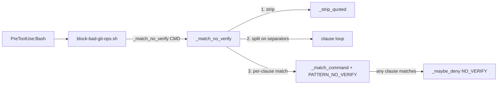

# Solution Design Document

## Validation Checklist

### CRITICAL GATES (Must Pass)

- [x] All required sections are complete (N/A sections explicitly marked)
- [x] No [NEEDS CLARIFICATION] markers remain
- [x] Architecture pattern is clearly stated with rationale
- [x] **All architecture decisions confirmed by user**
- [x] Every interface has specification

### QUALITY CHECKS (Should Pass)

- [x] Context sources listed with relevance ratings
- [x] Project commands discovered from actual project files
- [x] Constraints → Strategy → Design → Implementation path is logical
- [x] Error handling covers all error types
- [x] Quality requirements are specific and measurable
- [x] A developer could implement from this design
- [x] Complex logic includes a traced walkthrough with example data

---

## Constraints

CON-1 **bash 3.2 compatible** — macOS default `/bin/bash` 3.2.57. No associative arrays,
no `mapfile`, no process substitution requirements. Parameter expansion and here-strings (`<<<`)
are permitted (already used in the codebase).

CON-2 **POSIX ERE only** — never PCRE. No `\s`, `\S`, `\b`. Use `[[:space:]]`, `[[:<:]]`,
`[[:>:]]`. (Existing CON-9 in `pattern_match.sh`.)

CON-3 **Scope confinement** — change is limited to `plugins/tcs-git-helpers/scripts/lib/pattern_match.sh`
(helper), its single call site in `plugins/tcs-git-helpers/scripts/block-bad-git-ops.sh`, and the
bats test suite. No other rule may change behavior.

CON-4 **Behavior preservation** — genuine `--no-verify` / `-n` on a `git commit` clause (including
when chained, e.g. `git add . && git commit -n`) must still DENY; `-n` text inside a quoted
`-m "..."` message must still be exempt.

## Implementation Context

### Required Context Sources

#### Code Context
```yaml
- file: plugins/tcs-git-helpers/scripts/lib/pattern_match.sh
  relevance: CRITICAL
  why: "Defines PATTERN_NO_VERIFY, _match_command, _strip_quoted. Fix lives here."

- file: plugins/tcs-git-helpers/scripts/block-bad-git-ops.sh
  relevance: CRITICAL
  why: "Dispatcher; NO_VERIFY call site at the `_match_command \"$(_strip_quoted \"$CMD\")\" \"$PATTERN_NO_VERIFY\"` line."

- file: plugins/tcs-git-helpers/tests/bats/block-bad-git-ops.bats
  relevance: HIGH
  why: "Existing NO_VERIFY behavior tests; regression cases added here."

- file: plugins/tcs-git-helpers/tests/bats/lib_pattern_match.bats
  relevance: HIGH
  why: "Unit tests for pattern_match.sh helpers; new helper tested here."

- file: plugins/tcs-git-helpers/tests/fixtures/commands/bypass_corpus.txt
  relevance: MEDIUM
  why: "Corpus of bypass commands that must DENY."
```

### Implementation Boundaries
- **Must Preserve**: genuine-bypass detection (incl. chained commits), the `_strip_quoted`
  message-body exemption, the `CLAUDE_ALLOW_NO_VERIFY=1` inline override, all other PATTERN_* rules.
- **Can Modify**: the NO_VERIFY dispatch line; add one new helper to `pattern_match.sh`.
- **Must Not Touch**: any other PATTERN_* constant, other dispatch lines, the `_maybe_deny` /
  override-audit machinery, hooks.json.

### External Interfaces
N/A — internal shell library invoked by the PreToolUse:Bash hook. No network, DB, or API boundaries.

### Project Commands
```bash
# Discovered from plugins/tcs-git-helpers/tests/
Test (bats):   bats plugins/tcs-git-helpers/tests/bats/
Test (e2e):    plugins/tcs-git-helpers/tests/e2e/dogfood.sh
Lint (shell):  shellcheck plugins/tcs-git-helpers/scripts/lib/pattern_match.sh \
                          plugins/tcs-git-helpers/scripts/block-bad-git-ops.sh
```

## Solution Strategy

- **Architecture Pattern**: Compose a new small pure-bash helper with the existing helpers. The
  NO_VERIFY check becomes: `_strip_quoted` → split into shell clauses on separators → run the
  **unchanged** `PATTERN_NO_VERIFY` against each clause individually. Deny if any clause matches.
- **Integration Approach**: Replace only the NO_VERIFY dispatch line in `block-bad-git-ops.sh`
  with a call to the new helper `_match_no_verify "$CMD"`. The helper internally applies
  `_strip_quoted`, splits, and per-clause matches.
- **Justification**: Per-clause matching contains the unbounded `.*` to a single clause that, by
  construction, holds no separators — so `.*` can no longer bridge from `git commit` to a sibling
  command's `-n`. `PATTERN_NO_VERIFY` stays byte-identical, preserving its proven semantics
  (commit-then-flag ordering, `[[:>:]]` word boundary). `_strip_quoted` runs first so separators
  inside a quoted message are already neutralized and cannot cause spurious splits.
- **Key Decisions**: see ADR-1 (per-clause vs. bounded regex), ADR-2 (keep PATTERN_NO_VERIFY
  unchanged), ADR-3 (separator set + pure-bash split).

## Building Block View

### Components


### Directory Map
**Component**: tcs-git-helpers
```
plugins/tcs-git-helpers/
├── scripts/
│   ├── lib/
│   │   └── pattern_match.sh        # MODIFY: add _match_no_verify helper; PATTERN_NO_VERIFY unchanged
│   └── block-bad-git-ops.sh        # MODIFY: NO_VERIFY dispatch line → _match_no_verify "$CMD"
└── tests/
    ├── bats/
    │   ├── lib_pattern_match.bats   # MODIFY: unit tests for _match_no_verify
    │   └── block-bad-git-ops.bats   # MODIFY: dispatcher regression tests
    └── fixtures/commands/
        └── bypass_corpus.txt        # MODIFY (optional): add chained-bypass line
```

### Interface Specifications

#### New helper — `_match_no_verify`
```
_match_no_verify <raw_command>
  Returns 0 (match → caller should deny) if any git-commit clause in <raw_command>
  carries a genuine --no-verify / -n flag; returns 1 otherwise.

  Steps:
    1. stripped = _strip_quoted "<raw_command>"      # neutralize quoted bodies
    2. normalize separators (&&, ||, |, ;, &) to newlines in `stripped`
    3. for each newline-delimited clause:
         if _match_command "clause" "$PATTERN_NO_VERIFY" -> return 0
    4. return 1

  Constraints: bash 3.2; pure parameter expansion + here-string read loop; no externals.
  Composes: _strip_quoted (existing), _match_command (existing), PATTERN_NO_VERIFY (unchanged).
```

#### Data Storage Changes
N/A — no persistence.

#### Internal API Changes
N/A — internal shell function only; no external contract.

### Implementation Examples

#### Example: `_match_no_verify` (reference implementation)

**Why this example**: The separator-normalization order is the one non-obvious part (two-char
operators must be replaced before their single-char prefixes), and the per-clause loop is what
contains the `.*`. This shows the intended shape, not prescriptive final code.

```bash
# _match_no_verify <command>
#   True (0) iff a genuine --no-verify / -n flag belongs to a `git commit` clause.
#   Splits on shell separators so PATTERN_NO_VERIFY's `.*` cannot bridge from
#   `git commit` into a sibling command's `-n` (e.g. `git commit && echo -n`).
_match_no_verify() {
  local stripped clause
  stripped="$(_strip_quoted "$1")"
  # Normalize separators to newlines. Two-char operators FIRST, then single-char,
  # so `&&`/`||` are not half-consumed by the `&`/`|` passes.
  stripped="${stripped//&&/$'\n'}"
  stripped="${stripped//||/$'\n'}"
  stripped="${stripped//|/$'\n'}"
  stripped="${stripped//;/$'\n'}"
  stripped="${stripped//&/$'\n'}"
  while IFS= read -r clause; do
    _match_command "$clause" "$PATTERN_NO_VERIFY" && return 0
  done <<< "$stripped"
  return 1
}
```

Dispatcher change (`block-bad-git-ops.sh`), replacing the current two-line NO_VERIFY call:
```bash
# Was: _match_command "$(_strip_quoted "$CMD")" "$PATTERN_NO_VERIFY" && _maybe_deny ...
_match_no_verify "$CMD" && _maybe_deny NO_VERIFY "--no-verify bypasses .githooks/ — defeats the purpose"
```

#### Test Examples as Interface Documentation
```bash
# lib_pattern_match.bats — _match_no_verify contract
@test "_match_no_verify: genuine --no-verify denies"        { run _match_no_verify 'git commit --no-verify -m "x"'; [ "$status" -eq 0 ]; }
@test "_match_no_verify: genuine -n denies"                 { run _match_no_verify 'git commit -n -m "x"'; [ "$status" -eq 0 ]; }
@test "_match_no_verify: chained genuine bypass denies"     { run _match_no_verify 'git add . && git commit -n'; [ "$status" -eq 0 ]; }
@test "_match_no_verify: sibling echo -n allowed"           { run _match_no_verify 'git commit -m "done" && echo -n ok'; [ "$status" -eq 1 ]; }
@test "_match_no_verify: sibling head -n allowed"           { run _match_no_verify 'git commit -m "m" ; head -n 5 f'; [ "$status" -eq 1 ]; }
@test "_match_no_verify: piped grep -n allowed"             { run _match_no_verify 'git commit -m "m" | grep -n foo'; [ "$status" -eq 1 ]; }
@test "_match_no_verify: -n in message body allowed"        { run _match_no_verify 'git commit -m "fixed -n, ok"'; [ "$status" -eq 1 ]; }
@test "_match_no_verify: newline-separated sibling allowed" { run _match_no_verify "$(printf 'git commit -m "d"\necho -n ok')"; [ "$status" -eq 1 ]; }
```

## Runtime View

### Primary Flow: PreToolUse evaluation of a compound commit command
1. Hook passes the raw command string `$CMD` to the dispatcher.
2. Dispatcher calls `_match_no_verify "$CMD"`.
3. Helper strips quoted bodies, splits on separators, tests each clause with `PATTERN_NO_VERIFY`.
4. If any clause matches → returns 0 → `_maybe_deny NO_VERIFY` (subject to override audit).
5. Otherwise returns 1 → no NO_VERIFY denial; other rules continue.

### Error Handling
- **Empty / no `git commit` clause**: loop finds no match → returns 1 (allow). Correct.
- **Malformed quoting** (unbalanced quote): `_strip_quoted` documented limitation unchanged; the
  `CLAUDE_ALLOW_NO_VERIFY=1` inline override remains the escape hatch (preserved behavior).
- **Clause with separator inside an unbalanced/unstripped context**: worst case is an over-split
  that can only *reduce* matching surface for sibling tokens; a genuine `git commit -n` clause has
  no internal separator so it is never split apart → no false negative for real bypass.

### Complex Logic — traced walkthrough

Input: `git commit -m "done -n" && echo -n ok`

| Step | Value |
|------|-------|
| raw `$CMD` | `git commit -m "done -n" && echo -n ok` |
| after `_strip_quoted` | `git commit -m          && echo -n ok` (quoted body → spaces) |
| after separator normalize | clause A `git commit -m         `  ⏎  clause B ` echo -n ok` |
| match clause A vs PATTERN_NO_VERIFY | no `--no-verify`/`-n[[:>:]]` → no match |
| match clause B vs PATTERN_NO_VERIFY | has `-n` but no `git[[:space:]]+commit` → no match |
| result | return 1 → **allowed** ✅ (was wrongly denied before) |

Contrast — real bypass `git add . && git commit -n`:

| Step | Value |
|------|-------|
| after normalize | clause A `git add . `  ⏎  clause B ` git commit -n` |
| match clause B | `git commit` present AND `-n[[:>:]]` → **match** → deny ✅ |

## Deployment View
- **Environment**: runs in-process in the PreToolUse:Bash hook (developer machine / agent shell).
- **Configuration**: none new. `CLAUDE_ALLOW_NO_VERIFY=1` / `CLAUDE_ALLOW_GIT_BAD_OPS=1` overrides
  unchanged.
- **Dependencies**: none new.
- **Rollout**: plugin version bump (auto-bump pipeline already in repo); installed repos pick it up
  via `git-setup --update`. No migration.

## Cross-Cutting Concepts

### System-Wide Patterns
- **Error Handling**: deny-on-match; helper returns 0/1, dispatcher unchanged otherwise.
- **Logging/Auditing**: existing override-audit path (`_maybe_deny`) unchanged; denials still logged.
- **Security posture**: the fix narrows false-positives only; it does not widen what is allowed for
  genuine bypass. No reduction in protection.

### Multi-Component Patterns
N/A.

## Architecture Decisions

- [x] **ADR-1 Isolation technique: per-clause matching** (chosen over bounded-regex)
  - Choice: Split the stripped command on shell separators and run the existing
    `PATTERN_NO_VERIFY` against each clause; deny if any matches.
  - Rationale: Cleanly handles newlines (which a `[^;&|]*`-bounded regex cannot express in a
    single-quoted POSIX-ERE constant without embedding a literal newline); keeps the proven
    pattern semantics intact; composes naturally with `_strip_quoted` and `_match_command`;
    directly testable as a unit.
  - Trade-offs: Adds a small helper + here-string loop rather than a one-character regex tweak;
    does not parse subshells / command substitution (documented limitation, escape hatch exists).
  - User confirmed: ✅ 2026-06-01

- [x] **ADR-2 Keep `PATTERN_NO_VERIFY` byte-identical**
  - Choice: Do not modify the regex constant; move the fix entirely into the new helper + the
    dispatch line.
  - Rationale: The pattern is exported and reusable; its commit-then-flag ordering and `[[:>:]]`
    boundary are already validated by existing tests. Changing the constant risks regressions in
    other consumers and re-opens settled trade-offs (e.g. bundled-flag caveat documented inline).
  - Trade-offs: The "fix" is not visible at the constant definition; a code comment must point
    readers from the constant to the helper.
  - User confirmed: ✅ 2026-06-01

- [x] **ADR-3 Separator set & pure-bash split**
  - Choice: Normalize `&&`, `||`, `|`, `;`, `&`, and newline to a clause boundary using ordered
    bash parameter substitution (two-char operators before single-char), then iterate with a
    here-string `read` loop.
  - Rationale: Covers all observed false-positive separators; bash 3.2 safe; no external process
    (`sed`/`tr`) per hook invocation; replacement order avoids half-consuming `&&`/`||`.
  - Trade-offs: Treats a single `&` (background) as a boundary too — acceptable, since a real
    `git commit ... &` clause keeps its own flags within the clause; redirection (`>`, `<`) is not
    treated as a separator (not needed — redirection targets are not flags and `_strip_quoted`
    plus the `git commit` anchor already prevent bridging into them in practice).
  - User confirmed: ✅ 2026-06-01

## Quality Requirements
- **Correctness**: 0 matches across the sibling-command false-positive corpus; 100% matches across
  the genuine-bypass corpus (incl. chained). Verified by bats.
- **Compatibility**: passes under bash 3.2; `shellcheck` clean on both modified scripts.
- **Performance**: O(n) over command length, pure in-process; negligible vs. existing hook cost.
- **Maintainability**: helper documented with intent + the contained-`.*` rationale; constant
  carries a pointer comment to the helper.

## Acceptance Criteria (EARS)

**Sibling isolation (PRD F1 / AC):**
- [ ] WHEN a command chains `git commit` with a sibling command bearing `-n` (`&&`, `;`, `|`,
  `&`, or newline), THE SYSTEM SHALL NOT raise NO_VERIFY.
- [ ] IF the sibling `-n` follows `git commit` across a newline, THEN THE SYSTEM SHALL NOT raise
  NO_VERIFY.

**Genuine bypass preserved (PRD F2 / AC):**
- [ ] WHEN a `git commit` clause carries `--no-verify` or `-n`, THE SYSTEM SHALL raise NO_VERIFY,
  including when the commit is chained after another command.

**Message-body exemption preserved (PRD F3 / AC):**
- [ ] WHERE `-n` / `--no-verify` text appears only inside a quoted `-m "..."` message, THE SYSTEM
  SHALL NOT raise NO_VERIFY.

**Non-regression:**
- [ ] THE SYSTEM SHALL leave all other PATTERN_* rule behaviors unchanged.

## Risks and Technical Debt

### Known Technical Issues
- The current v2.2.3 `PATTERN_NO_VERIFY` false-positives on sibling-command `-n` (the bug this
  spec fixes), reproduced 2026-06-01.

### Technical Debt
- `_strip_quoted`'s documented nested-quote / command-substitution limitations remain; this fix
  does not address them and is not expected to (escape hatch exists).

### Implementation Gotchas
- **Replacement order matters**: replace `&&`/`||` before `|`/`&`, or two-char operators get
  half-consumed and clauses split incorrectly.
- **`<<<` here-string adds a trailing newline**: the final `read` iteration handles an empty
  trailing clause gracefully (no match) — confirm with the newline test case.
- **Do not** reintroduce a global `.*` match over the joined clauses — `.` matches newline in bash
  `[[ =~ ]]` (no `REG_NEWLINE`), which is the root cause; matching must stay per-clause.

## Glossary

### Technical Terms
| Term | Definition | Context |
|------|------------|---------|
| Clause | A maximal command segment between shell separators | The unit `_match_no_verify` tests individually |
| `_strip_quoted` | Existing helper replacing quoted content with spaces | Run first so quoted separators don't cause spurious splits |
| `[[:>:]]` | POSIX ERE end-of-word boundary | Distinguishes flag `-n` from `-n` inside a longer token |
| `REG_NEWLINE` | regex flag making `.` stop at newlines | NOT set by bash `[[ =~ ]]`; why `.*` bridged across lines |
