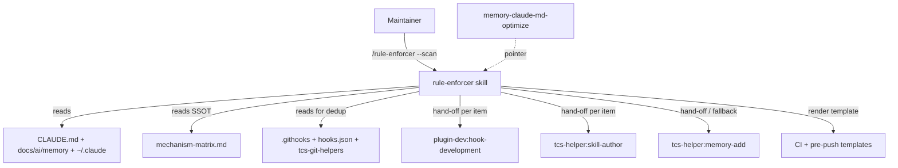
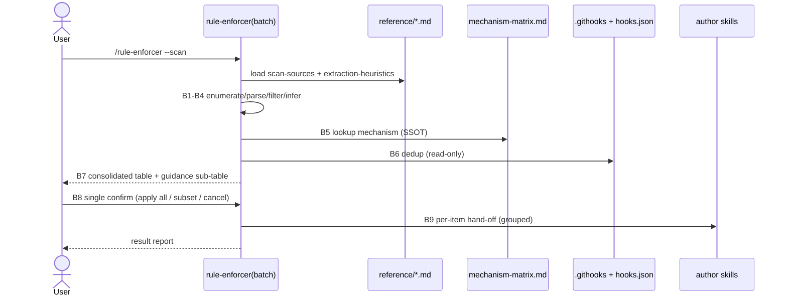
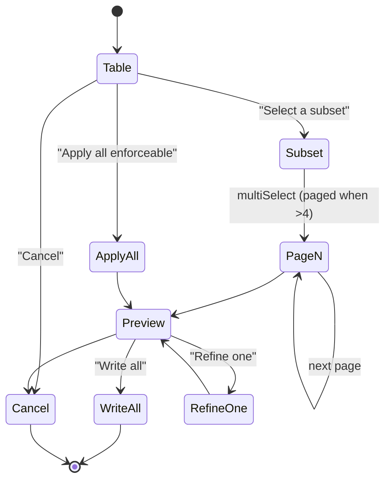

# Solution Design Document

## Validation Checklist

### CRITICAL GATES (Must Pass)

- [x] All required sections are complete
- [x] No [NEEDS CLARIFICATION] markers remain
- [x] Architecture pattern is clearly stated with rationale
- [x] **All architecture decisions confirmed by user** — ADR-1..ADR-6 confirmed 2026-07-02
- [x] Every interface has specification

### QUALITY CHECKS (Should Pass)

- [x] All context sources are listed with relevance ratings
- [x] Project commands are discovered from actual project files
- [x] Constraints → Strategy → Design → Implementation path is logical
- [x] Every component in diagram has directory mapping
- [x] Error handling covers all error types
- [x] Quality requirements are specific and measurable
- [x] Component names consistent across diagrams
- [x] A developer could implement from this design

---

## Output Schema

### SDD Status Report

| Field | Value |
|-------|-------|
| specId | 016-rule-enforcer-claude-md-sweep |
| architecture.pattern | Mode-gated skill front-end that pre-fills existing hand-off pipeline |
| validationPassed | 12 |
| validationPending | 1 (ADR confirmation) |

---

## Constraints

CON-1 **Matrix is the Single Source of Truth.** Classification MUST reuse
`plugins/tcs-helper/skills/rule-enforcer/reference/mechanism-matrix.md` verbatim. No
parallel or duplicated `(Q3, Q4) → mechanism` mapping may be introduced.

CON-2 **Hand-off only — no new writer.** All artifact generation (hooks, CI, pre-push,
memory) goes through the *existing* Step 8 hand-off targets and templates. Batch mode
adds classification + dedup + orchestration, never a new file-writing path.

CON-3 **SKILL.md line budget (≤500).** The skill is at ~251 lines. Batch-mode
procedural detail (source list, extraction heuristics, dedup catalog) MUST live in
lazy-loaded `reference/` files; SKILL.md gains only a thin orchestration skeleton
(target: +≤60 lines).

CON-4 **Read-only until single confirm.** The sweep performs no writes and installs no
hook until the one batch confirmation gate. Inherits ADR-3 (no persistence): no scan
log or cache is written to disk.

CON-5 **Privacy.** Personal content under `~/.claude/` must never be echoed into
committed artifacts or hand-off `$ARGUMENTS`. Generated files paraphrase rule *intent*
and cite the *concept*, never a personal-file path/line.

CON-6 **Interactive path untouched.** The existing single-rule flow (Steps 1–8) must
behave identically after batch mode is added. Batch mode is reachable only via an
explicit argument shape.

CON-7 **bash 3.2 / macOS dev env.** Any shell used in tests/self-tests must be
bash-3.2-compatible (per repo guardrails); zsh `!` mangling avoided.

## Implementation Context

**IMPORTANT**: These sources define the constraints, patterns, and existing
architecture batch mode extends.

### Required Context Sources

#### Documentation Context
```yaml
- doc: plugins/tcs-helper/skills/rule-enforcer/SKILL.md
  relevance: CRITICAL
  why: "The skill being extended; Steps 1-8 and the Never-constraints batch mode must respect/except"

- doc: plugins/tcs-helper/skills/rule-enforcer/reference/mechanism-matrix.md
  relevance: CRITICAL
  why: "SSOT for (Q3,Q4)->mechanism; section headings are the bare-label lookup keys batch mode must emit"

- doc: plugins/tcs-helper/skills/rule-enforcer/reference/examples.md
  relevance: HIGH
  why: "5 worked (rule -> Q2/Q3/Q4 -> mechanism) cases; the labeled training set for inference + parity test"

- doc: plugins/tcs-helper/skills/rule-enforcer/reference/trigger-phrases.md
  relevance: MEDIUM
  why: "Existing trigger vocabulary; batch entry must not collide with interactive triggers"

- doc: plugins/tcs-helper/skills/memory-claude-md-optimize/SKILL.md
  relevance: HIGH
  why: "Neighbor skill: @-import resolution + scope classification to reuse; pointer insertion points"

- doc: plugins/tcs-helper/skills/memory-claude-md-optimize/reference/categorization.md
  relevance: MEDIUM
  why: "always/never/prefer directive detection — the candidate population for the optimizer->batch pointer"
```

#### Code Context
```yaml
- file: plugins/tcs-git-helpers/hooks/hooks.json
  relevance: HIGH
  why: "Registered PreToolUse/PostToolUse/SessionStart hooks — authoritative dedup input"

- file: plugins/tcs-git-helpers/scripts/block-bad-git-ops.sh
  relevance: HIGH
  why: "19 already-enforced git patterns (incl --no-verify, push-to-main); dedup catalog source"

- file: plugins/tcs-git-helpers/scripts/pre-edit-branch-check.sh
  relevance: HIGH
  why: "block-main-edits equivalent; makes 'no edits/commits on main' already-enforced"

- file: plugins/tcs-helper/skills/rule-enforcer/templates/ci-auto-bump-style.yml.j2
  relevance: MEDIUM
  why: "CI hand-off template reused verbatim by batch mode"

- file: plugins/tcs-helper/templates/githooks/pre-push-rule-enforcer.sh.j2
  relevance: MEDIUM
  why: "pre-push hand-off template + tcs-helper-rule-enforcer-version marker (dedup + collision check)"

- file: plugins/tcs-helper/skills/rule-enforcer/test_examples_md.sh
  relevance: MEDIUM
  why: "Existing self-test pattern; the label-drift self-test follows this shape"
```

#### External APIs
Not applicable — this is a self-contained Claude Code skill; no third-party services.

### Implementation Boundaries
- **Must Preserve**: Interactive Steps 1–8 behavior; the `mechanism-matrix.md` file
  contents and heading strings; all existing hand-off templates and slug-validation
  gates; ADR-1/2/3 from spec-013.
- **Can Modify**: `rule-enforcer/SKILL.md` (add Step 0 + batch workflow skeleton +
  frontmatter); `memory-claude-md-optimize/SKILL.md` (add pointer only, no logic).
- **Must Not Touch**: `tcs-git-helpers` scripts/hooks (read-only dedup source);
  `plugin-dev` hand-off skills; the interactive Q1–Q4 AskUserQuestion flow.

### External Interfaces

#### System Context Diagram



#### Interface Specifications

The only external "interface" is the skill's argument surface (a CLI-like invocation)
and the internal `Skill()` hand-off calls. No HTTP/DB/queue interfaces exist.

```yaml
inbound:
  - name: "Skill invocation (interactive)"
    type: slash-command / Skill()
    format: "$ARGUMENTS = <rule description sentence>"
    data_flow: "Single rule to triage — existing behavior, unchanged"

  - name: "Skill invocation (batch)"
    type: slash-command / Skill()
    format: "$ARGUMENTS empty | '--scan [--scope repo|project|global]' | '--from-file <path>'"
    data_flow: "Trigger a read-only sweep; --from-file is the memory-claude-md-optimize hand-off surface"

outbound:
  - name: "Author-skill hand-off"
    type: Skill() call
    format: "$ARGUMENTS = pre-filled rule context (paraphrased, personal content scrubbed)"
    targets: [plugin-dev:hook-development, tcs-helper:skill-author, tcs-helper:memory-add]
    criticality: HIGH
  - name: "Template render (CI / pre-push)"
    type: file render via existing Step 8 logic
    criticality: HIGH
```

#### Data Storage Changes
No change — batch mode is stateless (CON-4). No database, no persisted scan state.

#### Internal API Changes
No change — no HTTP endpoints. "API" here = the skill argument contract above.

#### Application Data Models

```pseudocode
ENTITY: BatchState (NEW — batch mode only)
  FIELDS:
    scope: repo | project | global          # from --scope, default: repo+project (global opt-in)
    sourceFiles: string[]                    # resolved by B1
    candidates: Candidate[]                  # produced by B2..B6

ENTITY: Candidate (NEW)
  FIELDS:
    sourceFile: string                       # provenance file
    line: number                             # provenance line
    rawText: string                          # extracted instruction (scrubbed if personal)
    q2: Yes | No                             # detectability (B3 gate)
    q3: string                               # BARE-LABEL matching a matrix heading (B4) — see ADR-4
    q4: Block | Auto-fix | Nudge             # style (B4)
    confidence: high | low                   # low => needs-review, default-off (EC-8)
    mechanism: string                        # resolved via matrix lookup (B5), SSOT
    dedupStatus: new | already-enforced      # B6
    target: string                           # Step 8 destination skill/template

# NOTE: Candidate mirrors the existing TriageState field-for-field so B9 can feed each
# Candidate straight into the unchanged Step 8 hand-off. No new authoring model.
```

Existing `TriageState`/`State` (interactive) are unchanged.

#### Integration Points

```yaml
# rule-enforcer (batch)  ->  author skills   [reuse existing Step 8 verbatim, looped]
- from: rule-enforcer(batch)
  to: plugin-dev:hook-development | tcs-helper:skill-author | tcs-helper:memory-add
  protocol: Skill() call
  data_flow: "One pre-filled Candidate per accepted row; grouped by mechanism bucket"

# memory-claude-md-optimize  ->  rule-enforcer(batch)   [one-directional pointer only]
- from: memory-claude-md-optimize
  to: rule-enforcer(batch)
  protocol: text pointer ("run /rule-enforcer --scan"), NOT a Skill() call
  data_flow: "Optimizer flags always/never/must candidates; user runs scan after relocation"

# rule-enforcer(batch)  ->  tcs-git-helpers installed hooks   [read-only dedup]
- from: rule-enforcer(batch)
  to: .githooks/ + hooks.json + tcs-git-helpers scripts
  protocol: file read / Glob
  data_flow: "Determine already-enforced status by mechanism+target-pattern"
```

### Implementation Examples

#### Example: Step 0 mode dispatch (SKILL.md skeleton)

**Why this example**: The dual-mode entry is the load-bearing design decision (ADR-1);
it must route batch vs interactive unambiguously without touching the interactive path.

```text
### 0. Mode dispatch
Inspect $ARGUMENTS:
- empty OR starts with "--scan"            -> BATCH mode (scope from --scope, default repo+project)
- starts with "--from-file <path>"         -> BATCH mode, single explicit file (validate path, see Security)
- otherwise (a rule sentence)              -> INTERACTIVE mode: proceed to Step 1 (UNCHANGED)

BATCH mode -> load reference/scan-sources.md and run pipeline B1..B9.
```

#### Example: Batch → Step-8 reuse (the "pre-fill TriageState" pattern)

**Why this example**: Shows how B9 inherits slug gates + templates for free by feeding
Candidates into the unchanged Step 8 dispatch rather than a parallel writer (CON-2).

```text
For each accepted candidate c (grouped by mechanism bucket):
    triage = TriageState{ q1: skipped, q2: c.q2, q3: c.q3, q4: c.q4, mechanism: c.mechanism }
    dispatch(triage)      # == existing Step 8 "Mechanism match" block, verbatim
# slug-validation gates (SKILL.md L181-184, L212-215) run inside dispatch -> inherited.
```

#### Example: label-drift self-test (guards ADR-4 coupling)

**Why this example**: The single most likely correctness bug — a batch Q3 string that
does not byte-match a matrix heading yields "mechanism not found."

```bash
#!/usr/bin/env bash
# test_batch_q3_labels.sh — every Q3 label the heuristics file can emit must exist
# as a "## Q3 = <label>" heading in mechanism-matrix.md. bash 3.2 compatible.
set -eu
matrix="reference/mechanism-matrix.md"
heur="reference/extraction-heuristics.md"
fail=0
# labels are listed one-per-line in a fenced block in the heuristics file
while IFS= read -r label; do
  [ -z "$label" ] && continue
  grep -qF "## Q3 = ${label}" "$matrix" || { echo "MISSING heading: ${label}"; fail=1; }
done < <(sed -n '/<!-- Q3-LABELS-START -->/,/<!-- Q3-LABELS-END -->/p' "$heur" | grep -v '<!--')
exit $fail
```

## Runtime View

### Primary Flow

#### Primary Flow: Sweep-and-Mechanize (`/rule-enforcer --scan`)
1. User triggers batch mode via `--scan` (or empty args).
2. B1 **Enumerate**: resolve source set from `reference/scan-sources.md` (repo +
   project by default; `~/.claude/` only if `--scope global`).
3. B2 **Parse**: read each file, follow eager `@`-imports transitively (reuse the
   optimizer's resolution model), split into candidate instructions with provenance.
4. B3 **Filter (Q2 gate)**: drop judgment-only lines using
   `reference/extraction-heuristics.md`; keep deterministically-enforceable ones.
5. B4 **Infer**: for each kept candidate, infer Q2/Q3/Q4 (Q1 skipped, ADR-2); emit Q3
   as the exact bare-label matrix heading string (ADR-4).
6. B5 **Matrix lookup**: resolve mechanism via the *same* matrix read as interactive
   Step 6 (CON-1).
7. B6 **Dedup**: mark `already-enforced` by matching mechanism+target-pattern against
   live `.githooks/` + `hooks.json` + per-rule slug files + version marker (catalog is
   a hint layer only, ADR-5).
8. B7 **Render table**: one consolidated proposal table + a "Left as guidance"
   sub-table for judgment-only lines.
9. B8 **Single confirm**: two-tier AskUserQuestion (`Apply all` / `Select subset` /
   `Cancel`; subset via multiSelect paging when >4).
10. B9 **Hand-off**: feed each accepted Candidate into the unchanged Step 8 dispatch,
    grouped by mechanism bucket; render optional grouped preview before any write;
    report written / skipped / degraded-to-memory / already-enforced.



### Error Handling
- **Zero enforceable rules found**: report "Scanned X files, Y directives — none
  mechanically enforceable"; no AskUserQuestion. (EC-3)
- **File not found / empty scope**: report probed paths, exit cleanly; suggest
  `/memory-setup` if whole scope empty. (mirror optimizer broken-ref handling)
- **All rules already enforced**: show the already-enforced table as evidence; no new
  output. (dedup happy-null case)
- **Target plugin absent**: degrade that whole mechanism bucket to memory-add
  (with confirm), continue other buckets; never hard-abort. (Should-have)
- **Invalid/unsafe slug from crafted rule text**: slug-validation gate flags the row
  ("slug invalid — will prompt") rather than aborting the batch. (Security)
- **`--from-file` path escapes allowed set**: reject before Glob/Read. (Security)

### Complex Logic

```text
ALGORITHM: Batch classify + dedup (B3..B6)
INPUT: candidate lines with provenance
OUTPUT: Candidate[] with mechanism + dedupStatus

1. FILTER (Q2): if line names a concrete tool/flag/command, file/path predicate,
   git boundary, or structural check -> enforceable; else -> judgment-only (drop to
   guidance list, do NOT fire per-line memory-add).
2. INFER Q3 bucket from cues (extraction-heuristics.md), emit BARE-LABEL string.
3. INFER Q4 default: destructive/env-corrupting -> Block; docs gate -> Nudge;
   pure-mechanical fill -> Auto-fix. Low confidence -> confidence=low (needs-review).
4. LOOKUP mechanism in mechanism-matrix.md by (## Q3 = <bare-label>) x (Q4 row).
5. DEDUP: build target-pattern for the mechanism; if it matches an installed hook
   (live .githooks + hooks.json) or an existing per-rule slug -> already-enforced.
6. COLLAPSE overlaps: same (q3, target-pattern) across scopes/import-paths -> one row
   at broadest scope; surface conflict if strengths differ.
```

## Deployment View
No change. Distribution is via the existing tcs-helper plugin release flow (bump
`plugins/tcs-helper/plugin.json` version, push — per repo convention; no manual
marketplace/cache sync). No runtime env, no external dependency.

## Cross-Cutting Concepts

### Pattern Documentation
```yaml
- pattern: reference/mechanism-matrix.md (existing, reused as SSOT)
  relevance: CRITICAL
  why: "Classification mapping — consumed by both interactive Step 6 and batch B5"

- pattern: bundle-versioning (tcs-helper-rule-enforcer-version marker)
  relevance: HIGH
  why: "Dedup + collision check for rule-enforcer-produced pre-push hooks"

- pattern: reference/extraction-heuristics.md (NEW)
  relevance: HIGH
  why: "Examples-driven enforceable-vs-not filter + Q3 cues + Q4 defaults; small, links to examples.md"

- pattern: reference/installed-enforcement-catalog.md (NEW)
  relevance: MEDIUM
  why: "Hint layer mapping already-enforced concepts to tcs-git-helpers hooks; live inspection authoritative"

- pattern: reference/scan-sources.md (NEW)
  relevance: MEDIUM
  why: "Default source set, editable without touching the workflow"
```

### User Interface & UX

**Consolidated proposal table** — one row per enforceable candidate:

```
┌───┬──────────────────────┬───────────────────────────┬────┬──────────────────────────┬────────┬────────────────┬─────────────────────────┐
│ # │ Source               │ Quote                     │ Q2 │ Mechanism                │ Style  │ Status         │ Target                  │
├───┼──────────────────────┼───────────────────────────┼────┼──────────────────────────┼────────┼────────────────┼─────────────────────────┤
│ 1 │ general.md:13        │ use venv, not --break-... │ ✓  │ PreToolUse hook          │ Block  │ new            │ plugin-dev:hook-develop │
│ 2 │ CLAUDE.md:19         │ no commits to main        │ ✓  │ PreToolUse hook          │ Block  │ already-enforced│ (pre-edit-branch-check) │
│ 3 │ general.md:15        │ update README on ship     │ ✓  │ git pre-push hook        │ Nudge  │ new            │ pre-push template       │
│ 4 │ memory/general.md:17 │ fd over find              │ ✓  │ PreToolUse hook          │ Nudge  │ needs-review   │ plugin-dev:hook-develop │
└───┴──────────────────────┴───────────────────────────┴────┴──────────────────────────┴────────┴────────────────┴─────────────────────────┘

Left as guidance (judgment-only, not mechanizable):
  - general.md: "English for all code"        — requires human judgment
  - general.md: "DRY / YAGNI"                 — requires human judgment
```

**Two-tier confirm** (respects AskUserQuestion 2–4 option limit):


- **Accessibility/behavior**: default and common path is "Apply all enforceable", so
  the single-confirm promise holds; `already-enforced` and `needs-review` rows default
  OFF; subset selection is the escape hatch.
- **Grouped preview**: after the set is approved, one grouped artifact preview (all
  rendered files under headings) with a single `Write all / Refine one / Cancel`;
  no per-file prompt loop.

### System-Wide Patterns
- **Security**: (a) `~/.claude/` personal content paraphrased, never pasted into
  committed artifacts or hand-off args (CON-5); (b) slug-validation gate (existing) is
  now attacker-facing because slugs derive from scanned file text — requires a
  malicious-fixture test (`rule: ../../etc/evil` must be caught, not written);
  (c) `--from-file <path>` confined — reject `..`, absolute paths outside repo + known
  `~/.claude/` set, before any read.
- **Error Handling**: bucket-level graceful degradation; never hard-abort a batch for
  one unavailable target or one bad slug.
- **Performance**: sweep is bounded by number of rule files (tens), not a hot path;
  no caching needed. One matrix read reused across candidates.
- **Logging/Auditing**: none persisted (CON-4); the final report is the audit surface.

## Architecture Decisions

- [x] **ADR-1 Dual-mode dispatch via explicit argument shape (not path-vs-sentence sniffing).**
  - Choice: A new "Step 0" guard routes `empty | --scan | --from-file <path>` → batch;
    any other `$ARGUMENTS` → existing interactive Steps 1–8. Frontmatter updated:
    `argument-hint: "[rule description] | --scan | --from-file <path>"`;
    `allowed-tools` gains `Glob`, `Grep`.
  - Rationale: explicit verbs are unambiguous and self-documenting; path-vs-sentence
    inference is itself a light-security risk (a rule mentioning a path would misroute).
  - Trade-offs: users must learn the `--scan` verb; two flows share one file (mitigated
    by mode gate at Step 0 and CON-6).
  - User confirmed: Yes (2026-07-02)

- [x] **ADR-2 Skip Q1; convert Q2 short-circuit to a filter.**
  - Choice: Batch mode skips Q1 (recurrence presumed for already-written rules) and
    treats Q2=No as "drop to guidance list", NOT a per-line memory-add hand-off.
  - Rationale: source is a file of codified rules; asking Q1 or firing N memory-adds is
    nonsensical/hostile at N-scale. Deliberate, documented exception to the interactive
    skill's `Never: Skip the Q1 short-circuit` constraint.
  - Trade-offs: batch inference can misjudge enforceability without the human Q2
    answer; mitigated by needs-review default-off and the single confirm as review gate.
  - User confirmed: Yes (2026-07-02)

- [x] **ADR-3 Reuse Step 8 hand-off verbatim by pre-filling Candidate≅TriageState.**
  - Choice: B9 builds a TriageState-shaped object per accepted row and feeds it into
    the unchanged Step 8 dispatch; no parallel writer.
  - Rationale: smallest diff; automatically inherits slug gates, templates, collision
    checks, and fallback (CON-2).
  - Trade-offs: N separate `Skill()` hand-offs for same-mechanism items (batching is a
    deferred optimization); the per-file confirm of Step 8 is replaced by the batch
    confirm + grouped preview — a deliberate divergence that must be documented.
  - User confirmed: Yes (2026-07-02)

- [x] **ADR-4 Emit bare-label Q3 strings coupled to matrix headings + self-test.**
  - Choice: `extraction-heuristics.md` lists the 7 canonical Q3 bare labels (in a
    marked block); B4 emits exactly those strings; a `test_batch_q3_labels.sh`
    self-test asserts each exists as a `## Q3 = <label>` heading in the matrix.
  - Rationale: matrix lookup is a string match on headings; drift = silent
    "mechanism not found". Documented drift pattern (parenthetical-label-drift).
  - Trade-offs: heuristics file and matrix headings are coupled — changing one requires
    changing the other; the self-test makes the coupling loud rather than silent.
  - User confirmed: Yes (2026-07-02)

- [x] **ADR-5 Dedup: live inspection authoritative, catalog is a hint layer.**
  - Choice: `installed-enforcement-catalog.md` maps already-enforced *concepts* to
    tcs-git-helpers hooks for fast recognition, but the authoritative dedup reads live
    `.githooks/` + `hooks.json` + per-rule slug files + version marker. Dedup key =
    mechanism + target-pattern, NOT rule text.
  - Rationale: catalog can drift from the scripts; live inspection can't. Text-based
    dedup fails because memory prose and hook wording differ.
  - Trade-offs: catalog is a maintenance liability (documented as hint-only); live
    inspection adds a few file reads per run (cheap).
  - User confirmed: Yes (2026-07-02)

- [x] **ADR-6 Optimizer→batch pointer is one-directional text, no back-call.**
  - Choice: `memory-claude-md-optimize` gains (a) a `Never` bullet forbidding it to
    mechanize directives, (b) a Step-3 detection subsection counting always/never/must
    candidates, (c) a Step-4 report pointer "run `/rule-enforcer --scan` after this
    applies". Batch mode does NOT call the optimizer back.
  - Rationale: prevents a mutual-invocation loop; keeps each skill authoritative on its
    domain (optimizer=relocate, enforcer=mechanize). Sequencing: relocate first, then
    scan canonical files.
  - Trade-offs: user performs two steps instead of one automated chain (acceptable;
    the pointer makes the next step obvious).
  - User confirmed: Yes (2026-07-02)

## Quality Requirements
- **Performance**: single matrix read reused across all candidates; sweep completes in
  one pass over the (tens of) rule files. No persisted state.
- **Usability**: common path = one confirm (`Apply all`); ≤ single-digit prompts
  regardless of N (SM-1). Every proposed row cites `file:line` (SM-6).
- **Security**: no personal content in committed artifacts (CON-5); slug gate catches
  path-traversal fixtures (100%); `--from-file` path confinement enforced.
- **Reliability**: dedup flags 100% of already-enforced rules (SM-3); zero
  false-positive block hooks in confirmed output (SM-2); batch parity with interactive
  mechanism for the 5 example cases (SM-4).

## Acceptance Criteria

**Main Flow Criteria: [PRD/Feature 1 & 4 — sweep + single confirm]**
- [ ] WHEN `$ARGUMENTS` is empty or starts with `--scan`, THE SYSTEM SHALL enter batch
  mode and run B1–B9. (AC-1, ADR-1)
- [ ] WHEN a rule sentence is passed as `$ARGUMENTS`, THE SYSTEM SHALL run the
  unchanged interactive Steps 1–8. (CON-6)
- [ ] WHILE scanning, THE SYSTEM SHALL NOT write any file or install any hook until the
  single batch confirm. (AC-3, CON-4)
- [ ] WHEN enforceable rules are found, THE SYSTEM SHALL present them in one
  consolidated table citing `file:line`, inferred Q3/Q4, mechanism, and dedup status.
  (AC-7, AC-8)
- [ ] WHEN the user accepts, THE SYSTEM SHALL hand each selected rule to the existing
  Step 8 dispatch without re-implementing authoring. (AC-10, ADR-3)

**Classification Criteria: [PRD/Feature 2]**
- [ ] THE SYSTEM SHALL resolve every mechanism via the existing `mechanism-matrix.md`
  (no duplicated mapping). (AC-5, CON-1)
- [ ] IF a candidate is judgment-only, THEN THE SYSTEM SHALL exclude it from output and
  list it under "Left as guidance" (no per-line memory-add). (AC-4, ADR-2)
- [ ] THE SYSTEM SHALL skip Q1 for all candidates. (AC-6, ADR-2)
- [ ] THE SYSTEM SHALL emit Q3 values byte-identical to matrix headings, verified by a
  self-test. (ADR-4)

**Dedup Criteria: [PRD/Feature 3]**
- [ ] WHEN a rule is already covered by an installed hook, THE SYSTEM SHALL mark it
  `already-enforced` and default it OFF. (AC-11, SM-3)
- [ ] WHEN the same rule appears via two import paths or scopes, THE SYSTEM SHALL show
  it once at the broadest scope. (EC-5, EC-6)

**Error Handling Criteria:**
- [ ] WHEN zero enforceable rules are found, THE SYSTEM SHALL report it and skip the
  confirm. (AC-12, EC-3)
- [ ] IF a target plugin is not installed, THEN THE SYSTEM SHALL degrade that bucket to
  memory-add and continue the batch. (Should-have)
- [ ] IF scanned text yields an unsafe slug, THEN THE SYSTEM SHALL flag the row and not
  write it. (Security)

**Edge Case Criteria:**
- [ ] IF a candidate has low inference confidence, THEN THE SYSTEM SHALL mark it
  `needs-review` and default it OFF. (EC-8)
- [ ] WHERE a rule looks enforceable but is high-false-positive (e.g. zsh `!`), THE
  SYSTEM SHALL demote it to nudge/memory or warn, never a silent block hook. (EC-1)

## Risks and Technical Debt

### Known Technical Issues
- Pre-existing `/enforce-rule` vs `/rule-enforcer` naming drift in examples
  (out of scope for this spec; do not propagate into a batch alias).

### Technical Debt
- `installed-enforcement-catalog.md` can drift from the actual tcs-git-helpers scripts
  (mitigated: documented as hint-only; live inspection authoritative — ADR-5).
- Coupling between `extraction-heuristics.md` Q3 labels and matrix headings (mitigated:
  self-test — ADR-4).

### Implementation Gotchas
- Q3 labels must be the *bare* labels (strip `(e.g. ...)`), matching the interactive
  Step 4 normalization — emit them pre-normalized in batch mode.
- multiSelect AskUserQuestion caps at 4 options → subset selection must page.
- The batch confirm replaces Step 8's per-file confirm; do not let both fire.
- bash 3.2 for self-tests; avoid zsh `!` in any inline shell.

## Glossary

### Domain Terms
| Term | Definition | Context |
|------|------------|---------|
| Deterministically enforceable | A rule with an unambiguous machine signal (tool/flag, file predicate, git boundary) | The Q2 gate; only these become mechanisms |
| Judgment-only | A rule needing human judgment per occurrence | Excluded from output; listed as guidance |
| Already-enforced | A rule already guarded by an installed hook | Dedup status; default-off in the proposal |

### Technical Terms
| Term | Definition | Context |
|------|------------|---------|
| Q1–Q4 | The four triage dimensions (recurrence, detectability, intervention point, style) | Q1 skipped, Q2 a filter, Q3/Q4 inferred in batch |
| Bare label | A matrix Q3 heading string without its `(e.g. ...)` suffix | The lookup key coupling (ADR-4) |
| SSOT | Single Source of Truth | `mechanism-matrix.md` for the (Q3,Q4)→mechanism mapping |
| TriageState / Candidate | The per-rule record fed into Step 8 hand-off | Candidate mirrors TriageState for verbatim reuse |

### API/Interface Terms
| Term | Definition | Context |
|------|------------|---------|
| `--scan` | Batch-mode trigger; sweeps the default source set | Step 0 dispatch |
| `--from-file <path>` | Batch mode over one explicit file | The optimizer hand-off surface |
| `--scope repo\|project\|global` | Widen/narrow the scan set | global (`~/.claude`) is opt-in |
