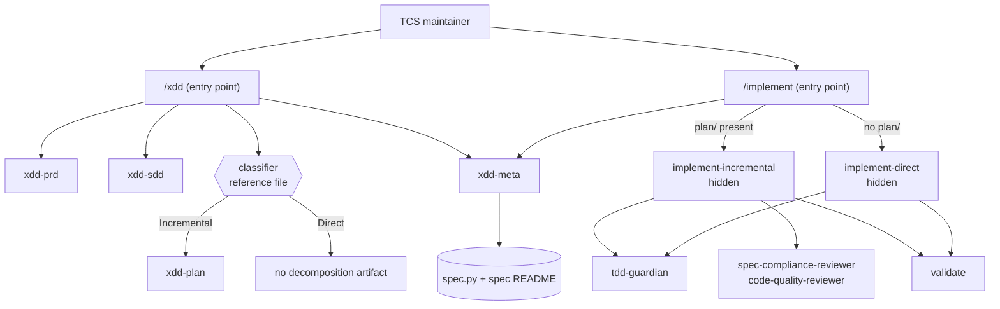
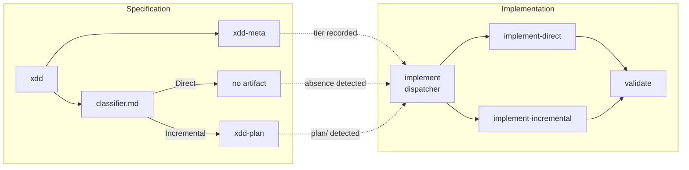
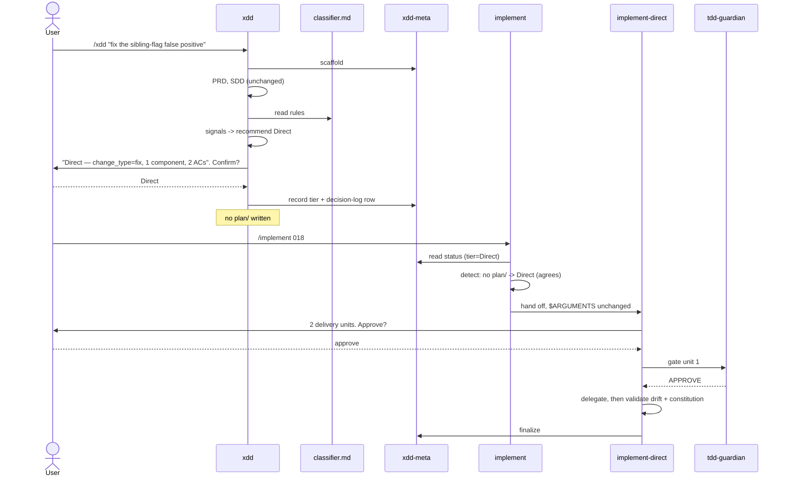

# Solution Design Document

## Validation Checklist

### CRITICAL GATES (Must Pass)

- [x] All required sections are complete
- [x] No [NEEDS CLARIFICATION] markers remain
- [x] Architecture pattern is clearly stated with rationale
- [x] **All architecture decisions confirmed by user** — ADR-1 … ADR-7 all confirmed 2026-09-03
- [x] Every interface has specification

### QUALITY CHECKS (Should Pass)

- [x] All context sources are listed with relevance ratings
- [x] Project commands are discovered from actual project files
- [x] Constraints → Strategy → Design → Implementation path is logical
- [x] Every component in diagram has directory mapping
- [x] Error handling covers all error types
- [x] Quality requirements are specific and measurable
- [x] Component names consistent across diagrams
- [x] A developer could implement from this design
- [x] Implementation examples use actual file names and frontmatter keys, verified against the skills in `plugins/tcs-workflow/skills/`
- [x] Classification logic includes a traced walkthrough with example specs

---

## Output Schema

### SDD Status Report

| Field | Value |
|-------|-------|
| specId | 017-complexity-tier-dispatch |
| architecture | Thin dispatcher + tier sub-skills; classifier as a reference file |
| validationPassed | 14 |
| validationPending | 0 |
| nextSteps | PLAN |

### ArchitectureSummary

| Field | Value |
|-------|-------|
| pattern | Entry-point dispatcher over hidden tier sub-skills, mirroring the existing `xdd` → `xdd-prd`/`xdd-sdd`/`xdd-plan` orchestration shape |
| keyComponents | `xdd` (classify + route), `xdd/reference/classifier.md` (NEW), `xdd-meta` (tier field), `implement` (dispatcher), `implement-direct` (NEW), `implement-incremental` (NEW, carries today's loop) |
| externalIntegrations | None |

### SectionStatus

| Section | Status | Detail |
|---------|--------|--------|
| Constraints | COMPLETE | |
| Implementation Context | COMPLETE | |
| Solution Strategy | COMPLETE | |
| Building Block View | COMPLETE | |
| Runtime View | COMPLETE | |
| Deployment View | COMPLETE | |
| Cross-Cutting Concepts | COMPLETE | |
| Architecture Decisions | COMPLETE | 7 ADRs, all confirmed |
| Quality Requirements | COMPLETE | |
| Acceptance Criteria | COMPLETE | 24 EARS criteria tracing to 24 PRD criteria |
| Risks and Technical Debt | COMPLETE | |
| Glossary | COMPLETE | |

---

## Constraints

CON-1 **Markdown skills, no runtime.** TCS skills are Markdown with YAML frontmatter, interpreted by the agent. The only executable component in scope is `xdd-meta/spec.py` (Python 3, standard library only). No new dependencies, no new languages.

CON-2 **`bash 3.2` compatibility for any shell added.** Recorded in the memory bank and enforced across this repo; PCRE `\s`/`\b` and bounded `^.{m,n}$` in `[[ =~ ]]` are unavailable.

CON-3 **The TDD gate cannot be weakened.** `tcs-workflow:xdd-tdd` states an iron law. Any tier that dropped it would put two skills in direct contradiction. (PRD Constraint.)

CON-4 **The spec-first rule survives verbatim.** Every tier writes requirements and solution. (PRD Constraint; ADR-1.)

CON-5 **Backwards compatible with 16 existing specs and with legacy `implementation-plan.md`.** Today's `implement` has a legacy branch for monolithic plans; removing it would break specs 001–00N. Absent tier must read cleanly.

CON-6 **One plugin, one version bump.** All changes land inside `tcs-workflow`. CI owns the version bump (`scripts/ci/auto-bump-versions.sh`); `plugin.json` is never bumped by hand.

CON-7 **Skill conventions are enforced.** New skills must satisfy the `tcs-helper:skill-author` audit: PICS structure, active-skill announcement, `argument-hint`, `allowed-tools`, description as triggering conditions only, SKILL.md under 500 lines and 25 KB.

CON-8 **The classifier must cost zero extra conversation turns.** A classifier that asks questions has become the ceremony it exists to remove. (PRD Constraint.)

## Implementation Context

**IMPORTANT**: You MUST read and analyze ALL listed context sources to understand constraints, patterns, and existing architecture.

### Required Context Sources

#### Documentation Context

```yaml
- doc: docs/XDD/specs/017-complexity-tier-dispatch/requirements.md
  relevance: CRITICAL
  why: "The 24 acceptance criteria this design must satisfy"

- doc: docs/about/skill-and-agent-design.md
  relevance: HIGH
  why: "Skill vs subagent vs slash-command granularity; the one-to-many extraction threshold that justifies splitting implement into tier sub-skills"

- doc: docs/about/principles.md
  relevance: HIGH
  why: "Activation contract and progressive disclosure — why tier sub-skills are hidden and why the classifier is a reference file rather than an always-loaded section"

- url: https://github.com/rsmdt/the-startup/blob/main/plugins/start/skills/specify/reference/classifier.md
  relevance: HIGH
  why: "The upstream classifier this one is adapted from — signals, thresholds, override handling, decision logging"

- url: https://github.com/rsmdt/the-startup/blob/main/plugins/start/skills/implement/SKILL.md
  relevance: HIGH
  why: "The artifact-detection dispatch contract adopted in ADR-4"

- url: https://github.com/rsmdt/the-startup/blob/main/plugins/start/skills/implement-direct/SKILL.md
  relevance: HIGH
  why: "The phase-less orchestrator shape, the 1-3 delivery-unit rule, and the escalation-out-of-Direct behaviour"
```

#### Code Context

```yaml
- file: plugins/tcs-workflow/skills/implement/SKILL.md
  relevance: CRITICAL
  why: "296 lines; its body becomes implement-incremental verbatim, and its shell becomes the dispatcher. Steps 4a-4h are the review chain the Direct tier drops."

- file: plugins/tcs-workflow/skills/xdd/SKILL.md
  relevance: CRITICAL
  why: "Step 6 is where classification is inserted; the PRD/SDD steps are untouched"

- file: plugins/tcs-workflow/skills/xdd-meta/SKILL.md
  relevance: CRITICAL
  why: "SpecStatus gains decomposition_tier; the phase-transition match gains a tier branch"

- file: plugins/tcs-workflow/skills/xdd-meta/spec.py
  relevance: HIGH
  why: "--read emits the TOML the workflow parses; tier must appear there"

- file: plugins/tcs-workflow/skills/xdd-meta/template.md
  relevance: HIGH
  why: "The spec README template gains a tier row in the Status table"

- file: plugins/tcs-workflow/skills/xdd-plan/SKILL.md
  relevance: MEDIUM
  why: "Unchanged by this design, but it defines the plan/ artifact shape the dispatcher detects"

- file: plugins/tcs-workflow/skills/xdd-tdd/SKILL.md
  relevance: HIGH
  why: "The iron law the Direct tier must not break (CON-3)"

- file: plugins/tcs-workflow/agents/tdd-guardian.md
  relevance: HIGH
  why: "The gate implement-direct keeps"

- file: plugins/tcs-workflow/agents/spec-compliance-reviewer.md
  relevance: MEDIUM
  why: "One of the two reviewers implement-direct drops"

- file: plugins/tcs-workflow/agents/code-quality-reviewer.md
  relevance: MEDIUM
  why: "The other reviewer implement-direct drops"
```

### Implementation Boundaries

- **Must Preserve:**
  - The `- [ ] [Phase N: Title](phase-N.md)` checklist format in `plan/README.md` — parsed by the phase loop for discovery and status tracking.
  - The legacy `implementation-plan.md` branch (CON-5).
  - `implement` and `xdd` as the user-facing entry-point names — no user-visible rename.
  - The `finalize` contract in `xdd-meta` and the `implement` step-7 call to it.
- **Can Modify:** the body of `implement` (moves wholesale), `xdd` step 6, `xdd-meta`'s SpecStatus and template, `spec.py`'s `--read` output.
- **Must Not Touch:** `xdd-prd`, `xdd-sdd`, `xdd-plan` document methodology; the three reviewer/guardian agents; any other plugin.

### External Interfaces

#### System Context Diagram



#### Interface Specifications

```yaml
inbound:
  - name: "/xdd"
    type: Skill invocation
    format: "$ARGUMENTS = feature description"
    authentication: n/a
    data_flow: "User's feature request enters the specification workflow"

  - name: "/implement"
    type: Skill invocation
    format: "$ARGUMENTS = spec ID or file path"
    authentication: n/a
    data_flow: "Spec ID enters the implementation workflow; dispatcher selects a tier route"

outbound:
  - name: "xdd-meta"
    type: Skill invocation
    format: "featureName | specId | 'finalize <specId> -- <notes>'"
    data_flow: "Scaffold, read status, transition phase, log decision, finalize"
    criticality: HIGH

  - name: "implement-direct / implement-incremental"
    type: Skill invocation (hidden sub-skills)
    format: "$ARGUMENTS passed through unchanged"
    data_flow: "Dispatcher hands off; sub-skill owns its whole loop and its own completion summary"
    criticality: HIGH

  - name: "tdd-guardian"
    type: Agent dispatch
    format: "task_description, sdd_ref, proposed_approach"
    data_flow: "APPROVE | BLOCK before any implementer runs — at BOTH tiers"
    criticality: CRITICAL

data:
  - name: "Spec directory"
    type: Filesystem (Markdown + TOML-emitting script)
    connection: spec.py
    data_flow: "requirements.md, solution.md, optional plan/, README.md status + decision log"
```

### Project Commands

```bash
# Discovered from .github/workflows/tests.yml and scripts/ci/
Test (python):  .venv/bin/python -m pytest tests/ -q
Test (bats):    bats plugins/*/tests/bats
Lint (shell):   shellcheck scripts/ci/*.sh
Changelog gate: bash scripts/ci/check-changelog-version-sync.sh --allow-ahead 1
Version bump:   handled by CI (scripts/ci/auto-bump-versions.sh) — never by hand
```

## Solution Strategy

- **Architecture Pattern:** *Entry-point dispatcher over hidden tier sub-skills.* `implement` stops orchestrating and starts routing; each tier's loop lives in its own skill. This is the shape TCS already uses for `xdd` → `xdd-prd`/`xdd-sdd`/`xdd-plan`, so it introduces no new structural idea — it applies an existing one to the implementation half.

- **Integration Approach:** Additive wherever possible. `xdd` gains one step. `xdd-meta` gains one field. `implement`'s body *moves* rather than being rewritten, so the phase loop that works today keeps working, byte for byte, under a new name. The only genuinely new behaviour is `implement-direct` and the classifier.

- **Justification:** The alternative — a `tier:` flag threaded through the existing `implement` with conditionals at each of steps 4a–4h — was rejected. It would make the most complex skill in the plugin more complex, put both tiers' logic in one 300-line file, and make "which gates run at Direct?" a matter of reading nested conditions rather than reading a separate short skill. Splitting matches the one-to-many extraction threshold in `docs/about/skill-and-agent-design.md`: two callers, distinct loops, shared vocabulary.

- **Key Decisions:** ADR-1 through ADR-7 below. The load-bearing three are: tier the plan only (ADR-1), dispatch by artifact detection rather than by re-reading the recorded tier (ADR-4), and move rather than rewrite the phase loop (ADR-5).

## Building Block View

### Components



### Directory Map

**Component**: `plugins/tcs-workflow`

```
plugins/tcs-workflow/
├── .claude-plugin/
│   └── plugin.json                      # MODIFY: keywords only (tier, dispatch). Version is CI's.
├── CHANGELOG.md                         # MODIFY: new version entry
└── skills/
    ├── xdd/
    │   ├── SKILL.md                     # MODIFY: step 6 becomes Classify → route; Reference Materials gains classifier.md
    │   └── reference/
    │       └── classifier.md            # NEW: signals, rules, rationale format, override + logging
    ├── xdd-meta/
    │   ├── SKILL.md                     # MODIFY: SpecStatus gains decomposition_tier; phase-transition match gains tier branch
    │   ├── spec.py                      # MODIFY: --read emits decomposition_tier (absent-safe)
    │   └── template.md                  # MODIFY: Status table gains "Decomposition tier" row
    ├── implement/
    │   ├── SKILL.md                     # REWRITE: thin dispatcher (~90 lines), artifact detection + handoff
    │   ├── reference/                   # MOVE: output-format.md, perspectives.md → implement-incremental
    │   └── examples/                    # MOVE: output-example.md → implement-incremental
    ├── implement-incremental/           # NEW (content is today's implement, moved)
    │   ├── SKILL.md                     # steps 1-7 of today's implement, user-invocable: false
    │   ├── reference/
    │   │   ├── output-format.md         # MOVED
    │   │   └── perspectives.md          # MOVED
    │   └── examples/
    │       └── output-example.md        # MOVED
    └── implement-direct/                # NEW
        ├── SKILL.md                     # phase-less orchestrator, user-invocable: false
        └── reference/
            └── output-format.md         # NEW: delivery-unit + completion summary shapes
```

Repository-level registration, outside the plugin:

```
.
├── README.md                            # MODIFY: tcs-workflow skill count
├── AGENTS.md                            # MODIFY: skill count + tree entry
└── docs/
    ├── reference/
    │   ├── plugins.md                   # MODIFY: skill count
    │   └── skills.md                    # MODIFY: new skills listed
    └── XDD/specs/017-.../               # this spec
```

### Interface Specifications

#### Interface Documentation References

```yaml
interfaces:
  - name: "Spec lifecycle metadata"
    doc: plugins/tcs-workflow/skills/xdd-meta/SKILL.md
    relevance: CRITICAL
    sections: [Interface, Workflow step 2, Workflow step 3]
    why: "decomposition_tier becomes a first-class SpecStatus field consumed by both entry points"

  - name: "Plan manifest format"
    doc: plugins/tcs-workflow/skills/xdd-plan/SKILL.md
    relevance: CRITICAL
    sections: [Constraints]
    why: "The `- [ ] [Phase N: Title](phase-N.md)` line format is the Incremental tier's detection signal and must not change"

  - name: "TDD gate"
    doc: plugins/tcs-workflow/agents/tdd-guardian.md
    relevance: CRITICAL
    sections: [whole]
    why: "Dispatched at both tiers; its APPROVE/BLOCK contract is unchanged"
```

#### Data Storage Changes

No database. The one persisted structure is the spec README, whose Status table gains a row:

```yaml
File: docs/XDD/specs/<NNN>-<name>/README.md
  Status table ADD ROW: "Decomposition tier" -> Direct | Incremental | (absent)
  Decisions Log ADD ROW (per tier decision): date, decision, rationale

File: plugins/tcs-workflow/skills/xdd-meta/spec.py
  --read output ADD KEY: decomposition_tier = "direct" | "incremental" | ""
  Absent/unparseable -> empty string, never an error (CON-5)
```

#### Internal API Changes

The "API" here is skill invocation. Three contracts change:

```yaml
Contract: Classify
  Invoked by: xdd, step 6
  Inputs:
    requirements.md: parsed for change_type, feature_count, ac_count
    solution.md:     parsed for component_count, parallel_markers
  Output:
    recommendation: Direct | Incremental
    signals:        the five values, verbatim, for display
  Side effects: none — recommendation only, never application

Contract: Record tier
  Invoked by: xdd, step 6, after user confirmation
  Inputs: specId, chosenTier, recommendedTier, rationale
  Effects:
    README Status table "Decomposition tier" row set
    README Decisions Log row appended
  Idempotent: yes — re-recording the same tier rewrites the same row

Contract: Dispatch
  Invoked by: implement, step 1
  Inputs: $ARGUMENTS (spec ID or path)
  Detection:
    plan/README.md present            -> implement-incremental
    implementation-plan.md present    -> implement-incremental (legacy mode)
    neither, requirements or solution -> implement-direct
    unrecognised decomposition artifact -> STOP, report
    nothing at all                    -> STOP, error
  Cross-check: recorded tier vs detected artifacts; mismatch -> report before handoff
  Output: exactly one sub-skill invocation with $ARGUMENTS unchanged
```

#### Application Data Models

```pseudocode
ENTITY: SpecStatus (MODIFIED — xdd-meta)
  FIELDS:
    id: string
    name: string
    directory: string
    phase: Initialization | PRD | SDD | PLAN | Ready | Implemented
    + decomposition_tier: Direct | Incremental | None      (NEW; None = pre-tier spec)
    documents: { name, status, notes }[]

ENTITY: TierRecommendation (NEW — classifier)
  FIELDS:
    recommended: Direct | Incremental
    signals: {
      change_type: feature | fix | refactor | doc
      feature_count: number
      ac_count: number
      component_count: number
      parallel_markers: boolean
    }
    rationale: string        // one sentence naming the signals that decided it

ENTITY: DeliveryUnit (NEW — implement-direct)
  FIELDS:
    title: string
    area: string             // plugin, skill, script, docs, tests
    refs: string[]           // requirements/solution sections to read
    acceptance: string       // observable "done"

ENTITY: DispatchTarget (NEW — implement)
  FIELDS:
    tier: Direct | Incremental
    skill: implement-direct | implement-incremental
    artifact: string         // what triggered the dispatch, for the one-line summary
```

#### Integration Points

```yaml
- from: xdd
  to: xdd-meta
    - protocol: Skill invocation
    - data_flow: "Records the chosen tier and its rationale at specification time"

- from: implement
  to: implement-direct | implement-incremental
    - protocol: Skill invocation
    - data_flow: "$ARGUMENTS passed through unchanged; sub-skill owns its own loop and summary"

- from: implement-direct
  to: tdd-guardian, validate
    - protocol: Agent dispatch / Skill invocation
    - data_flow: "Gate before each delivery unit; drift + constitution check after"
```

### Implementation Examples

#### Example: The classification rules

**Why this example**: The thresholds are the single most consequential thing in this design — too loose and Direct becomes a dumping ground (PRD Risk 2), too tight and nothing is ever Direct and the feature has failed.

```
CLASSIFY(requirements.md, solution.md) -> Direct | Incremental

  signals:
    change_type      from the PRD's framing: feature | fix | refactor | doc
    feature_count    distinct Must-Have features in the PRD
    ac_count         acceptance criteria across all features
    component_count  distinct components in the SDD's Building Block View;
                     modifying an existing component does NOT increment this
    parallel_markers true if the SDD explicitly calls out parallel or
                     independent work streams

  rules, top to bottom, first match wins:

    1. Incremental  if component_count >= 2
                    OR feature_count >= 2
                    OR parallel_markers
         -- breadth vetoes Direct, whatever the change_type. A refactor across
            three skills is not Direct; that is the upstream edge case that
            needed patching, so it is a rule here rather than a footnote.

    2. Direct       if change_type in {fix, refactor, doc}
                    OR ac_count <= 2

    3. Incremental  otherwise
         -- a single-component feature with 3+ criteria still earns phases.

  RESERVED (not implemented this phase): a Factory branch would sit above
  rule 1, keyed on component_count >= 3 or parallel_markers. Rule 1 currently
  absorbs those cases into Incremental, which is a correct-if-coarse answer.
```

**Traced walkthrough.** Four real specs from this repository, classified by the rules above:

| Spec | change_type | features | ACs | components | parallel | Rule | Tier |
|---|---|---|---|---|---|---|---|
| 015 — `no-verify` sibling-flag false positive | fix | 1 | 2 | 1 | no | 2 | **Direct** |
| 014 — `tcs-git-helpers` rules fix | fix | 1 | 4 | 1 | no | 2 | **Direct** |
| 012 — hook runtime contract | feature | 2 | ~12 | 3 | no | 1 | **Incremental** |
| 017 — this spec | feature | 5 | 24 | 6 | no | 1 | **Incremental** |

Read the first two rows as the whole point of the feature: both were one-line-ish fixes that today would have cost three documents and a phase loop. Read the last row as the honesty check — this design classifies *itself* as Incremental, which is why it has a plan.

**Edge cases:**

- Requirements and solution both near-empty (a stub) → `feature_count=0`, `ac_count=0`, `component_count=0` → rule 2 fires on `ac_count <= 2` → **Direct**. Correct: no evidence of breadth exists. The user may override upward.
- A `doc` change touching four components → rule 1 fires first → **Incremental**. Breadth beats change type, deliberately.
- `component_count` cannot be determined because the SDD has no Building Block View → treat as `0`, and say so in the rationale. Do not block; a spec thin enough to lack that section is Direct-shaped anyway.

#### Example: Dispatcher detection

**Why this example**: Detection must be unambiguous and must fail loudly rather than guessing — an unknown artifact routed to the wrong loop is worse than a stop.

```
DETECT(specDirectory) -> DispatchTarget | Stop

  plan_readme   = exists(specDirectory/"plan"/"README.md")
  legacy_plan   = exists(specDirectory/"implementation-plan.md")
  requirements  = exists(specDirectory/"requirements.md")
  solution      = exists(specDirectory/"solution.md")
  unknown_decomp= exists(specDirectory/"manifest.md") or exists(specDirectory/"units")

  match:
    unknown_decomp                      -> Stop("found <artifact>; this tier is not
                                                 implemented. See spec 017 Won't Have.")
    plan_readme                         -> {Incremental, implement-incremental, "plan/README.md"}
    legacy_plan                         -> {Incremental, implement-incremental, "implementation-plan.md"}
    requirements or solution            -> {Direct, implement-direct, "requirements.md + solution.md"}
    none                                -> Stop("no specification artifacts found; run /xdd first")

  then CROSS-CHECK against the recorded tier:
    recorded absent                     -> proceed silently (pre-tier spec, CON-5)
    recorded == detected                -> proceed
    recorded != detected                -> REPORT both, then ask before proceeding
                                           (usually an interrupted /xdd run)
```

#### Test Examples as Interface Documentation

```python
# tests/test_spec_tier.py — spec.py must report tier without breaking legacy specs
def test_read_reports_recorded_tier(tmp_path):
    spec = make_spec(tmp_path, readme_tier="Incremental")
    out = run_spec_py(spec.id, "--read")
    assert 'decomposition_tier = "incremental"' in out

def test_read_on_pre_tier_spec_reports_empty_not_error(tmp_path):
    # The 16 existing specs have no tier row at all (CON-5)
    spec = make_spec(tmp_path, readme_tier=None)
    out = run_spec_py(spec.id, "--read")
    assert 'decomposition_tier = ""' in out

def test_read_on_unparseable_tier_reports_empty(tmp_path):
    spec = make_spec(tmp_path, readme_tier="Bananas")
    out = run_spec_py(spec.id, "--read")
    assert 'decomposition_tier = ""' in out   # fail open, never raise
```

## Runtime View

### Primary Flow

#### Primary Flow: Specifying and implementing a small fix at Direct tier

1. User runs `/xdd` with a bug description.
2. `xdd` scaffolds the spec via `xdd-meta`, then runs PRD and SDD as it does today.
3. At step 6, `xdd` reads `reference/classifier.md`, extracts the five signals from the two documents, and computes a recommendation.
4. `xdd` presents the recommendation with its signals and offers both tiers.
5. User confirms Direct.
6. `xdd` records the tier in the README Status table and Decisions Log via `xdd-meta`, writes no decomposition artifact, and finalizes.
7. User runs `/implement <specId>`.
8. `implement` detects no `plan/`, cross-checks against the recorded tier (`Direct`, agrees), prints a one-line dispatch summary, and hands off.
9. `implement-direct` decomposes into 1–3 delivery units, asks for approval, dispatches `tdd-guardian` then an implementer per unit, then runs the drift and constitution checks and finalizes the spec.



### Error Handling

- **Unknown decomposition artifact** (`manifest.md`, `units/`): stop before dispatch, name the artifact, point at this spec's Won't Have. Never guess a route.
- **Recorded tier disagrees with detected artifacts**: report both values and what each implies, then ask. The usual cause is an interrupted `/xdd` run — for example a tier recorded as Incremental with no `plan/` written yet.
- **No artifacts at all**: error with the remedy — run `/xdd` first, or pass a brief for a freeform Direct run.
- **Classifier cannot parse a signal**: default that signal to its most conservative value (`component_count=0`, `parallel_markers=false`), state the gap in the rationale, and continue. A classifier that blocks has become ceremony (CON-8).
- **Direct decomposition exceeds 3 delivery units**: stop and recommend re-specifying at Incremental rather than improvising phases. This is the mechanical form of PRD Risk 2.
- **`tdd-guardian` returns BLOCK at Direct tier**: halt exactly as the phase loop does. The YOLO escape hatch behaves identically at both tiers — logged, never silent.

### Complex Logic

```
ALGORITHM: Classify and route (xdd step 6)
INPUT: requirements.md, solution.md, specId
OUTPUT: recorded tier, and either a plan/ artifact or none

1. EXTRACT signals:
     change_type, feature_count, ac_count, component_count, parallel_markers
     -- read-only; no user interaction (CON-8)
2. APPLY rules top-to-bottom, first match wins -> recommendation
3. PRESENT recommendation + the signals that produced it, verbatim
4. ASK the user to choose: Direct | Incremental, recommendation highlighted
5. RECORD via xdd-meta:
     Status table "Decomposition tier" row
     Decisions Log row: date, "Decomposition tier: <choice>", rationale including
       the recommendation and, if overridden, that it was an override
6. ROUTE:
     Direct      -> write no decomposition artifact; go to Finalize
     Incremental -> invoke xdd-plan; then validate; then Finalize
7. ON tier change after artifacts exist:
     leave prior artifacts in place, flag them stale in the Decisions Log,
     never delete (PRD Won't Have)
```

## Deployment View

### Single Application Deployment

- **Environment:** Claude Code plugin, loaded from the marketplace. No runtime service.
- **Configuration:** `.claude/startup.toml` `[tcs] docs_base` continues to resolve the spec root; unchanged.
- **Dependencies:** none new.
- **Performance:** classification is two file reads and arithmetic — no measurable cost.
- **Rollout:** additive. On upgrade, existing specs have no tier row, the dispatcher's cross-check treats absent as "proceed silently", and every existing spec with a `plan/` routes to `implement-incremental`, which is byte-identical to today's `implement`. There is no migration step and no flag day.
- **Rollback:** reverting the plugin restores the previous `implement`; specs written in the meantime keep a tier row that older versions simply ignore, since it lives in a Markdown table nothing older parses.

### Multi-Component Coordination

No change — single plugin, single version bump (CON-6).

## Cross-Cutting Concepts

### Pattern Documentation

```yaml
- pattern: docs/about/skill-and-agent-design.md
  relevance: CRITICAL
  why: "The one-to-many extraction threshold justifies splitting implement into tier sub-skills rather than adding conditionals"

- pattern: docs/about/principles.md
  relevance: HIGH
  why: "Progressive disclosure — classifier rules live in reference/, loaded only at step 6; the activation contract explains why sub-skills are hidden"
```

### System-Wide Patterns

- **Security:** none — no credentials, no network, no user input beyond a spec description.
- **Error handling:** fail loudly on ambiguity (unknown artifact, tier mismatch), fail open on missing optional data (absent tier, unparseable signal). The asymmetry is deliberate: ambiguity about *which loop to run* is dangerous, ambiguity about *metadata* is not.
- **Performance:** not a factor.
- **Logging/Auditing:** the spec README Decisions Log is the audit trail. Every tier choice, override and stale-artifact flag lands there — this is what makes the PRD's tracking table implementable without new instrumentation.
- **Backwards compatibility:** absent tier is a first-class valid state, not an error path (CON-5).

## Architecture Decisions

- [x] **ADR-1 What scales:** tier the PLAN only — requirements and solution are written at every tier; only decomposition varies.
  - Rationale: keeps the repo's spec-first rule literally true; lets the classifier read real documents instead of guessing from a raw request; preserves the artifact the feature exists to produce.
  - Trade-offs: a one-line fix still writes two short documents, where the `superpowers` model would write one.
  - User confirmed: **Yes — 2026-09-03**

- [x] **ADR-2 Direct tier gate set:** keep `tdd-guardian`, the approval gate, and the drift and constitution checks; drop only the per-task `spec-compliance-reviewer` → `code-quality-reviewer` chain.
  - Rationale: the per-task review chain is the cost driver; the test-first and approval gates are the guarantees. Dropping TDD would contradict `xdd-tdd` (CON-3).
  - Trade-offs: Direct-tier code gets less automated review than Incremental-tier code. Accepted because the tier is scoped to changes small enough to review by eye, and the drift check still runs.
  - User confirmed: **Yes — 2026-09-03**

- [x] **ADR-3 Tier count:** ship Direct and Incremental; reserve Factory as a named, unbuilt member of the vocabulary.
  - Rationale: TCS has no factory machinery, and every piece of evidence in the PRD is about work too *small* for the current ceremony. Building Factory here would multiply scope for a tier that relieves none of the observed pressure.
  - Trade-offs: the issue asked for three tiers; one is deferred. A thin Factory (Agent Team + parallel sections) was rejected as two names for one mechanism.
  - User confirmed: **Yes — 2026-09-03**

- [x] **ADR-4 Dispatch signal:** detect the tier from **artifacts present**, with the recorded tier as a cross-check that can report a mismatch — not from the recorded tier alone.
  - Rationale: artifacts are ground truth; a recorded tier can be stale if a run was interrupted. Detecting from artifacts makes dispatch deterministic and makes the interrupted-run case *visible* rather than silently wrong. This is upstream's contract.
  - Trade-offs: two sources of truth exist, so the cross-check is mandatory rather than optional. Without it a stale record would be invisible.
  - User confirmed: **Yes — 2026-09-03**

- [x] **ADR-5 `implement` restructuring:** keep the user-facing name `implement` for the dispatcher; move today's 296-line body **verbatim** into a new hidden `implement-incremental`.
  - Rationale: no user-visible rename, and the phase loop that works today keeps working unchanged — the riskiest part of this change becomes a file move rather than a rewrite. Upstream renamed its heavyweight tier to `implement-factory`; TCS's heavyweight tier is the phase loop, so `implement-incremental` is the honest name.
  - Trade-offs: three skills where there was one; `reference/` and `examples/` move with the body, so any external link to `implement/reference/output-format.md` breaks (nothing in-repo links there).
  - User confirmed: **Yes — 2026-09-03**

- [x] **ADR-6 Where tier is recorded:** in three places — the README Status table (human), the README Decisions Log (audit), and `spec.py --read` output (machine).
  - Rationale: the PRD requires a first-class lifecycle field *and* an auditable decision. The Status row answers "what tier is this?", the log answers "why, and did a human override it?", and the `--read` key is what the dispatcher cross-checks.
  - Trade-offs: three places to keep consistent; the Status row is the one that must be written for the machine path to work, so `--read` derives from it rather than from the log.
  - User confirmed: **Yes — 2026-09-03**

- [x] **ADR-7 Classifier location:** a reference file of `xdd` (`xdd/reference/classifier.md`), not its own skill and not inline in `xdd/SKILL.md`.
  - Rationale: it has exactly one caller, so extracting a skill would fail the one-to-many threshold in `skill-and-agent-design.md`. Inlining it would load thresholds and rationale-format guidance into context on every `/xdd` run, including runs that stop at PRD — progressive disclosure says otherwise.
  - Trade-offs: if Factory later needs the same rules from a different caller, this becomes a two-caller situation and should be revisited. Open Question 4 in the PRD tracks exactly that.
  - User confirmed: **Yes — 2026-09-03**

## Quality Requirements

- **Performance:** classification adds no user-visible latency — two file reads, no agent dispatch, no network. Measurable bar: `/xdd` step 6 costs zero additional conversation turns beyond the single tier-confirmation question that replaces today's implicit "continue to PLAN".
- **Usability:** the user-facing surface does not grow. Two entry points before, two after. A user who never learns the word "tier" still gets a correct route.
- **Security:** unchanged; no new trust boundary.
- **Reliability:** every existing spec must implement exactly as it does today. Concretely: for all 16 specs under `docs/XDD/specs/`, dispatch must select `implement-incremental` where a `plan/` exists and must never error on the absent tier row.
- **Maintainability:** each new SKILL.md passes the `tcs-helper:skill-author` audit (CON-7). The dispatcher stays under 100 lines — if it grows past that, logic has leaked out of a sub-skill.

## Acceptance Criteria

**Main Flow Criteria: [PRD Feature 1 — tiered decomposition]**
- [ ] WHEN a specification is classified Direct, THE SYSTEM SHALL complete without writing any decomposition artifact
- [ ] WHEN a specification is classified Incremental, THE SYSTEM SHALL produce `plan/README.md` and its phase files
- [ ] THE SYSTEM SHALL write requirements and solution documents at every tier
- [ ] WHERE a spec has no decomposition artifact, THE SYSTEM SHALL make the recorded tier available to explain the absence
- [ ] THE SYSTEM SHALL express the tier as a closed vocabulary that can gain a member without changing the classify or dispatch contracts

**Main Flow Criteria: [PRD Feature 2 — classifier]**
- [ ] WHEN both requirements and solution documents exist, THE SYSTEM SHALL produce exactly one recommended tier
- [ ] WHEN presenting a recommendation, THE SYSTEM SHALL display the five signal values that produced it
- [ ] THE SYSTEM SHALL produce the same recommendation for the same pair of documents on every run
- [ ] WHEN asking the user to confirm, THE SYSTEM SHALL offer every tier available in this phase with the recommendation highlighted
- [ ] IF the user selects a tier other than the recommendation, THEN THE SYSTEM SHALL record both the recommendation and the override
- [ ] THE SYSTEM SHALL classify without requesting any additional user input beyond the confirmation question

**Main Flow Criteria: [PRD Feature 3 — tier recorded]**
- [ ] WHEN a tier is confirmed, THE SYSTEM SHALL write it to the spec README Status table
- [ ] WHEN a tier is confirmed, THE SYSTEM SHALL append a decision-log row carrying date, chosen tier, recommendation, and rationale
- [ ] WHILE reading a spec created before this feature, THE SYSTEM SHALL report an absent tier rather than failing or inferring one

**Main Flow Criteria: [PRD Feature 4 — dispatch]**
- [ ] WHEN implementation starts and no decomposition artifact is present, THE SYSTEM SHALL route to `implement-direct`
- [ ] WHEN implementation starts and `plan/README.md` is present, THE SYSTEM SHALL route to `implement-incremental`
- [ ] WHEN implementation starts, THE SYSTEM SHALL display which route was selected and which artifact triggered it
- [ ] THE SYSTEM SHALL pass `$ARGUMENTS` to the selected sub-skill unchanged

**Main Flow Criteria: [PRD Feature 5 — gates]**
- [ ] THE SYSTEM SHALL dispatch `tdd-guardian` before every implementer at both tiers
- [ ] THE SYSTEM SHALL obtain explicit user approval before dispatching implementation work at both tiers
- [ ] WHEN a Direct-tier implementation completes, THE SYSTEM SHALL run the drift check against requirements and solution
- [ ] WHERE a CONSTITUTION.md exists, THE SYSTEM SHALL run the constitution check at Direct tier and block completion on an L1 or L2 violation
- [ ] WHILE running at Direct tier, THE SYSTEM SHALL NOT dispatch `spec-compliance-reviewer` or `code-quality-reviewer`

**Error Handling Criteria: [PRD Feature 4 — mismatch and unknown artifacts]**
- [ ] IF the recorded tier disagrees with the detected artifacts, THEN THE SYSTEM SHALL report both before dispatching any work
- [ ] IF a decomposition artifact is present that this phase does not implement, THEN THE SYSTEM SHALL report what it found and stop rather than guessing a route

**Edge Case Criteria:**
- [ ] IF a Direct-tier decomposition exceeds three delivery units, THEN THE SYSTEM SHALL recommend re-specifying at Incremental rather than proceeding
- [ ] IF a classification signal cannot be parsed, THEN THE SYSTEM SHALL use its most conservative value, state the gap in the rationale, and continue

## Risks and Technical Debt

### Known Technical Issues

- `implement/SKILL.md` is 296 lines and already the most complex skill in the plugin. Adding tier conditionals in place would have made it worse; ADR-5 moves rather than grows it.
- Two of the plugin's own skills (`tcs-patterns:testing`, `tcs-patterns:test-design-reviewer`) predate PICS — unrelated to this change, tracked in issue #120, noted so the new skills are not modelled on them.
- The 16 existing specs carry no tier and several carry stale phase markers (the `verify-spec-status-via-git` memory). This design deliberately does not fix stale phases; it only guarantees they still dispatch correctly.

### Technical Debt

- `spec.py` parses the README with string matching rather than a Markdown parser. The tier row follows that existing approach rather than introducing a parser — consistent, and consistently fragile. Mitigated by the fail-open rule: an unparseable tier reads as absent.
- The classifier's thresholds are unvalidated on real data. The PRD tracks override rate for exactly this reason; expect one tuning pass after ~10 specs.

### Implementation Gotchas

- **The phase-checklist line format is load-bearing.** `- [ ] [Phase N: Title](phase-N.md)` is parsed by the loop. Moving the body into `implement-incremental` must not reformat it.
- **`user-invocable: false` is what hides sub-skills from the `/` menu.** Omitting it silently defeats PRD Won't Have — the user could then pick a tier directly and bypass the classifier.
- **The active-skill announcement must name the sub-skill, not the entry point.** `**Active skill: tcs-workflow:implement-direct**`, so the terminal shows which loop is actually running.
- **`xdd-meta`'s `finalize` is called by `implement` step 7 today.** Both sub-skills must keep calling it, or specs start rotting on `Ready` again — the exact failure this repo already has a memory about.
- **Do not bump `plugin.json` by hand** (CON-6); CI classifies by the version field, and a hand-bump is read as "already bumped".
- **Skills under development are not live until re-indexed.** Testing new sub-skills requires a fresh session; the repo's CLAUDE.md documents the sync procedure, and the `no-manual-marketplace-sync` memory says to bump and push rather than copying into the cache by hand.

## Glossary

### Domain Terms

| Term | Definition | Context |
|------|------------|---------|
| Tier | The weight of decomposition a specification receives: Direct or Incremental (Factory reserved) | The central concept of this spec |
| Direct | Tier that writes requirements and solution but no decomposition artifact | Fixes, refactors, doc changes, single-criterion features |
| Incremental | Tier that adds a phase-based plan; today's `/implement` behaviour | Single-feature work with real breadth |
| Factory | Reserved tier name for parallel units with holdout scenarios | Named but not built this phase (ADR-3) |
| Ceremony | The total cost of process artifacts a change must produce before shipping | The thing being scaled |
| Delivery unit | The largest piece of work one subagent completes in one round, at Direct tier | Replaces "phase" in `implement-direct`; 1–3 per spec |
| Classifier | The rules that turn document signals into a tier recommendation | `xdd/reference/classifier.md` |

### Technical Terms

| Term | Definition | Context |
|------|------------|---------|
| PICS | Persona / Interface / Constraints / (Reference) / (Workflow) — the TCS skill structure | Every new skill here must conform (CON-7) |
| Artifact detection | Deciding the route from which files exist, rather than from recorded metadata | ADR-4 |
| Fail open | Treating missing or unparseable optional data as absent rather than as an error | Applied to the tier field for CON-5 |
| Progressive disclosure | Keeping detail in `reference/` files loaded on demand rather than in SKILL.md | ADR-7 |

### API/Interface Terms

| Term | Definition | Context |
|------|------------|---------|
| `decomposition_tier` | The `spec.py --read` TOML key carrying the tier | The dispatcher's machine-readable cross-check |
| `user-invocable: false` | Frontmatter flag hiding a skill from the `/` menu | Applied to both tier sub-skills |
| `$ARGUMENTS` | The invocation payload passed to a skill | Passed through the dispatcher unchanged |
