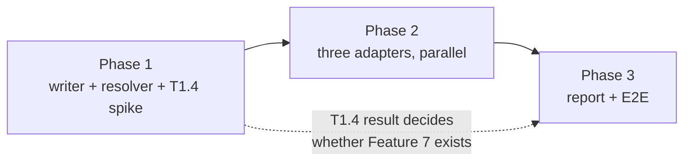

# Implementation Plan

## Validation Checklist

### CRITICAL GATES (Must Pass)

- [x] All `[NEEDS CLARIFICATION: ...]` markers have been addressed
- [x] All specification file paths are correct and exist
- [x] Each phase follows TDD: Prime → Test → Implement → Validate
- [x] Every task has verifiable success criteria
- [x] A developer could follow this plan independently

### QUALITY CHECKS (Should Pass)

- [x] Context priming section is complete
- [x] All implementation phases are defined with linked phase files
- [x] Dependencies between phases are clear (no circular dependencies)
- [x] Parallel work is properly tagged with `[parallel: true]`
- [x] Activity hints provided for specialist selection `[activity: type]`
- [x] Every phase references relevant SDD sections
- [x] Every test references PRD acceptance criteria
- [x] Integration & E2E tests defined in final phase
- [x] Project commands match actual project setup

---

## Output Schema

### PLAN Status Report

| Field | Value |
|---|---|
| specId | 018-observability-load-and-fire-log |
| title | Observability: log what actually loads and fires |
| status | IN_REVIEW |
| totalTasks | 16 |
| parallelTasks | 3 |
| specReferences | 66 |
| clarificationsRemaining | 0 |

### PhaseStatus

| Phase | Name | Status | Tasks | File |
|---|---|---|---|---|
| 1 | Writer foundation, and the attribution question | IN_PROGRESS | 5 | [phase-1.md](phase-1.md) |
| 2 | Adapters and registration | IN_PROGRESS | 5 | [phase-2.md](phase-2.md) |
| 3 | Report, self-check and end-to-end validation | IN_PROGRESS | 6 | [phase-3.md](phase-3.md) |

---

## Specification Compliance Guidelines

### How to Ensure Specification Adherence

1. **Before Each Phase**: read the phase's Specification References in full.
2. **During Implementation**: cite the SDD section in the code comment where a rule is non-obvious —
   particularly the absent-key guard and the fail-open paths, both of which look like defensive
   noise until you know what they prevent.
3. **After Each Task**: run the phase's tests plus the repo-wide suites.
4. **Phase Completion**: verify the phase's acceptance criteria against `solution.md`.

### Deviation Protocol

1. Document the deviation with rationale.
2. Obtain approval before proceeding.
3. Update the SDD when the deviation improves the design.
4. Record all deviations in this plan for traceability.

**One deviation is anticipated.** T1.4 may find that `one matcher per command` cannot produce
separate measurement groups. That is a finding, not a failure — record it in the SDD under ADR-7 and
route Feature 7 to the wrapper. The reverse finding removes the wrapper from scope entirely.

## Metadata Reference

- `[parallel: true]` — tasks that can run concurrently
- `[ref: document/section]` — link to a specification section
- `[activity: type]` — activity hint for specialist selection

### Success Criteria

**Validate** = process verification ("did we follow TDD?")
**Success** = outcome verification ("does it work correctly?")

---

## Context Priming

*GATE: Read all files in this section before starting any implementation.*

**Specification**:

- `docs/XDD/specs/018-observability-load-and-fire-log/requirements.md` — Product Requirements
- `docs/XDD/specs/018-observability-load-and-fire-log/solution.md` — Solution Design
- `docs/XDD/specs/018-observability-load-and-fire-log/README.md` — the measured harness facts every
  number in the SDD traces back to
- `plugins/tcs-git-helpers/scripts/lib/audit_log.sh` — the writer this design copies the contract of
- `plugins/tcs-git-helpers/scripts/lib/plugin_data.sh` — the resolver ADR-1 duplicates
- `plugins/tcs-git-helpers/tests/bats/cache-path-parity.bats` — the parity-test pattern

**Key Design Decisions**:

- **ADR-1**: the writer is self-contained in this repo, duplicating the plugin's resolver contract,
  because plugin env vars never reach Bash-tool subprocesses — sourcing would write nowhere, silently.
- **ADR-4**: redaction is ours. The harness's `OTEL_LOG_*` switches govern only its own export; hook
  stdin always arrives complete.
- **ADR-5**: no `jq` and no `date` in the hook path. Measured: `jq` ~21 ms per call, 25× the budget.
- **ADR-7**: per-hook attribution stays undecided until T1.4 answers whether it can be expressed in
  configuration at all.
- **ADR-8**: storage is per repo, outside the working tree, size-rotated — inherited from spec 011.

**Implementation Context**:

```bash
# Testing (discovered from .github/workflows/tests.yml)
pip install -r requirements-dev.txt   # test dependencies
pytest -q                             # collected from the repo root
bats tests/bats/observability-writer.bats
bats plugins/tcs-git-helpers/tests/bats/   # must stay green — ADR-1 touches its neighbourhood

# Local run of the whole gate
pytest -q && bats tests/bats/
```

---

## Implementation Phases

Each phase is defined in a separate file. Tasks follow red-green-refactor: **Prime** (understand
context), **Test** (red), **Implement** (green), **Validate** (refactor + verify).

> **Tracking Principle**: track logical units that produce verifiable outcomes. The TDD cycle is the
> method, not separate tracked items.

- [ ] [Phase 1: Writer foundation, and the attribution question](phase-1.md)
- [ ] [Phase 2: Adapters and registration](phase-2.md)
- [ ] [Phase 3: Report, self-check and end-to-end validation](phase-3.md)

**Phase dependencies** — strictly linear at the phase level, with parallelism inside phase 2:



---

## Plan Verification

| Criterion | Status |
|-----------|--------|
| A developer can follow this plan without additional clarification | ✅ |
| Every task produces a verifiable deliverable | ✅ |
| All PRD acceptance criteria map to specific tasks | ✅ |
| All SDD components have implementation tasks | ✅ |
| Dependencies are explicit with no circular references | ✅ |
| Parallel opportunities are marked with `[parallel: true]` | ✅ |
| Each task has specification references `[ref: ...]` | ✅ |
| Project commands in Context Priming are accurate | ✅ |
| All phase files exist and are linked from this manifest | ✅ |

### Coverage map — SDD acceptance criteria to tasks

| SDD-AC | Task |
|---|---|
| 1, 12 | T1.2 |
| 5, 6, 7 | T1.2 |
| 8, 9, 11 | T1.3 |
| 10, 19 | T1.1 |
| 2, 3, 4 | T2.1 |
| 16 | T2.2, T2.3 |
| 13, 14 | T3.1 |
| 15 | T3.2 |
| 17 | T3.4 |
| 18 | T3.3 |
| 20 | T1.4 |
