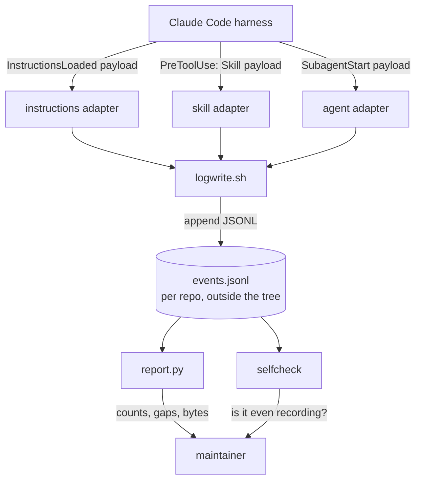
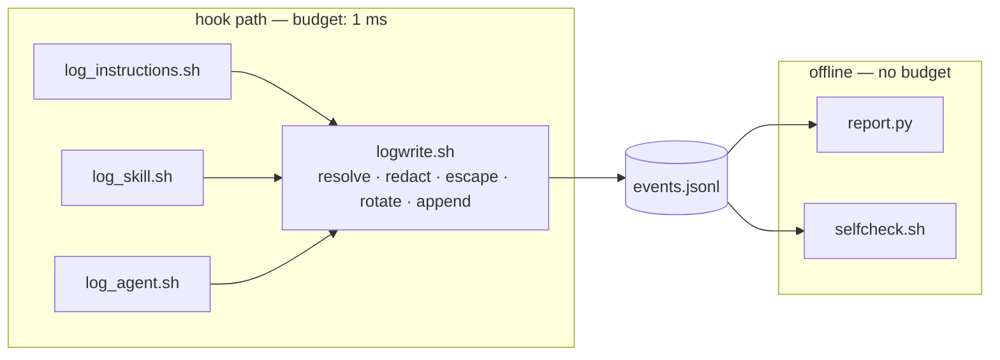

# Solution Design Document

## Validation Checklist

### CRITICAL GATES (Must Pass)

- [x] All required sections are complete
- [x] No [NEEDS CLARIFICATION] markers remain
- [x] Architecture pattern is clearly stated with rationale
- [x] **All architecture decisions confirmed by user** — ADR-1, ADR-3, ADR-6, ADR-7 confirmed at review 2026-09-06; the rest are forced by measurement and marked as such
- [x] Every interface has specification

### QUALITY CHECKS (Should Pass)

- [x] All context sources are listed with relevance ratings
- [x] Project commands are discovered from actual project files
- [x] Constraints → Strategy → Design → Implementation path is logical
- [x] Every component in diagram has directory mapping
- [x] Error handling covers all error types
- [x] Quality requirements are specific and measurable
- [x] Component names consistent across diagrams
- [x] A developer could implement from this design
- [x] Implementation examples use actual field names, verified against the shipped hook payloads
- [x] Complex logic includes a traced walkthrough with example data

---

## Output Schema

### SDD Status Report

| Field | Value |
|---|---|
| specId | 018-observability-load-and-fire-log |
| pattern | Thin adapters over one shared append-only writer, with offline analysis |
| keyComponents | `logwrite.sh`, three hook adapters, `report.py`, `selfcheck`, optional timing wrapper |
| externalIntegrations | Claude Code hook events (inbound); local filesystem (data). No network. |
| validationPassed | 15 |
| validationPending | 0 |

### ADR Status

| ID | Name | Status |
|---|---|---|
| ADR-1 | Self-contained writer in the repo, not sourced from the plugin | CONFIRMED |
| ADR-2 | Own hook for instruction loading; telemetry cannot substitute | CONFIRMED (forced by measurement) |
| ADR-3 | Phase 1 covers instructions, skills and agents | CONFIRMED |
| ADR-4 | Redaction is ours; two independent switches, both default off | CONFIRMED (PRD business rule) |
| ADR-5 | No `jq` and no `date` in the hook path | CONFIRMED (forced by measurement) |
| ADR-6 | Report in Python, covered by pytest | CONFIRMED |
| ADR-7 | Per-hook attribution deferred behind a verification task | CONFIRMED |
| ADR-8 | Storage follows spec 011 ADR-7: per-repo, out of tree, rotated | CONFIRMED |

---

## Constraints

- **CON-1 — bash 3.2 and BSD userland.** The target is macOS: no `declare -A`, no `mapfile`, no
  `${var^^}`, no `EPOCHREALTIME`, and `date` has no `%N`. Anything using `date +%s%N` for elapsed
  time produces a non-numeric value and corrupts arithmetic without erroring.
- **CON-2 — the invoking shell is not necessarily bash.** Measured in this environment: the tool
  shell is `zsh` while bash is installed. Every script declares `#!/usr/bin/env bash`.
- **CON-3 — locale affects numeric formatting.** A comma-decimal locale corrupts formatted
  durations. Every script sets `LC_ALL=C` before formatting or arithmetic.
- **CON-4 — the hook protocol is load-bearing.** Hook stdout is parsed as JSON, stderr is surfaced,
  and exit code 2 blocks the tool call. Instrumentation must be transparent to all three.
- **CON-5 — fail open, always.** A logging failure must never change a hook's exit status. This repo
  has already shipped a hook that failed closed because `jq` exited non-zero under `set -e`.
- **CON-6 — no new runtime dependency.** No collector, no daemon, no database. `jq` may be used
  offline but never in the hook path (CON-7).
- **CON-7 — hook-path overhead budget.** ≤ 1 ms added per hook invocation, and ≤ 10 % of the fastest
  real hook's own runtime. Measured basis: `jq` costs ~21 ms per invocation, `date +%s%N` ~0.37 ms
  each, the bash `time` builtin ~0.
- **CON-8 — repo-local this phase.** Nothing ships to plugin consumers (PRD Won't Have).
- **CON-9 — experimental contract.** The hook events and payload fields were read out of the shipped
  binary (2.1.252) and are absent from the documented event list. The design must degrade to
  "records nothing, says so" rather than to "records wrong things" if the contract moves.

## Implementation Context

### Required Context Sources

#### Code Context

```yaml
- file: plugins/tcs-git-helpers/scripts/lib/audit_log.sh
  relevance: CRITICAL
  why: "The append-only JSONL writer this design copies — rotation chain, printf JSON builder,
        fail-open discipline, frozen field order. Read before writing logwrite.sh."

- file: plugins/tcs-git-helpers/scripts/lib/plugin_data.sh
  relevance: CRITICAL
  why: "The per-repo data-directory resolver whose contract ADR-1 duplicates, including why the
        fallback must reproduce the harness's own shape rather than invent one."

- file: plugins/tcs-git-helpers/tests/bats/cache-path-parity.bats
  relevance: HIGH
  why: "The pattern for keeping a deliberate copy honest — the parity test ADR-1 requires."

- file: plugins/tcs-helper/hooks/hooks.json
  relevance: HIGH
  why: "Shape of hook registration, and the concrete case ADR-7 is about: two python3 commands
        share one UserPromptSubmit matcher, so a batch-level duration cannot attribute either."

- file: .gitignore
  relevance: MEDIUM
  why: "`.claude/` is already ignored wholesale; confirms the repo-local config path is safe even
        though the record itself lives outside the tree."

- file: docs/XDD/specs/011-tcs-git-helpers/solution.md
  relevance: HIGH
  why: "ADR-7 there is the storage decision this spec inherits rather than re-deriving."
```

#### Documentation Context

```yaml
- doc: docs/XDD/specs/018-observability-load-and-fire-log/README.md
  relevance: CRITICAL
  why: "Carries the measured harness facts — payload fields, load reasons, the unreachable span,
        the overhead table. Every number in this SDD traces there."

- url: https://code.claude.com/docs/en/hooks
  relevance: HIGH
  why: "Hook event contract and stdin payload shape."
```

### Implementation Boundaries

- **Must Preserve**: every existing hook's exit status, stdout and stderr; the `tcs-git-helpers`
  audit log and its data directory layout.
- **Can Modify**: this repo's own `.claude/settings.json` hook registration; new files under the
  paths in the directory map.
- **Must Not Touch**: `plugins/tcs-git-helpers/scripts/lib/*` (ADR-1 copies the contract rather than
  refactoring the plugin — that would widen scope beyond #153); any shipped plugin's `hooks.json`.

### External Interfaces

#### System Context Diagram



#### Interface Specifications

```yaml
inbound:
  - name: "InstructionsLoaded"
    type: hook event, JSON on stdin
    fields: [session_id, transcript_path, cwd, prompt_id, file_path, memory_type,
             load_reason, globs, trigger_file_path, parent_file_path]
    matcher: the load_reason — session_start | compact | nested_traversal | include | path_glob_match
    data_flow: "one invocation per instruction file loaded"
    criticality: HIGH

  - name: "PreToolUse (matcher: Skill)"
    type: hook event, JSON on stdin
    fields: [session_id, cwd, tool_name, tool_input]
    data_flow: "one invocation per skill call; the skill name is inside tool_input"
    criticality: MEDIUM

  - name: "SubagentStart"
    type: hook event, JSON on stdin
    fields: [session_id, cwd, agent_id, agent_type]
    data_flow: "one invocation per subagent dispatch"
    criticality: MEDIUM

outbound: []   # none — the design makes no network calls and starts no processes it does not own

data:
  - name: "Event record"
    type: append-only JSONL on local disk
    connection: shell append with rotation
    path: "${CLAUDE_PLUGIN_DATA-derived}/observability/events.jsonl"
    data_flow: "written by the hook adapters, read by report.py and selfcheck"
```

### Project Commands

```bash
# Discovered from .github/workflows/tests.yml and requirements-dev.txt
Install: python -m pip install --disable-pip-version-check -r requirements-dev.txt
Test:    pytest -q            # collected from the repo root; conftest.py sets collection rules
Test:    bats tests/bats/...  # shell suites, run on ubuntu and macos in CI
```

## Solution Strategy

- **Architecture Pattern:** thin adapters over one shared writer, with all analysis offline. Each
  hook adapter does the minimum — read stdin, pull two or three fields, hand them to the writer —
  and everything that costs real time (parsing, joining, counting) happens later against the file.
- **Integration Approach:** registration in this repo's own `.claude/settings.json` only. No plugin
  changes, no consumer impact (CON-8).
- **Justification:** the hook path is the one place where cost is charged to every tool call, so it
  gets the cheapest possible implementation; the report has no such constraint and can therefore be
  written for clarity and covered by tests. Splitting on that boundary is what lets both halves be
  right, instead of compromising the analysis to keep it shell-cheap.
- **Key Decisions:** ADR-1 (self-contained writer), ADR-5 (no `jq`/`date` in the hook path),
  ADR-8 (out-of-tree storage), ADR-7 (attribution deferred behind a verification task).

## Building Block View

### Components



| Component | Single responsibility | Owns |
|---|---|---|
| `logwrite.sh` | Turn a set of key=value pairs into one durable, redacted JSON line | path resolution, redaction, escaping, rotation, append, fail-open |
| `log_instructions.sh` | Adapt the `InstructionsLoaded` payload to the writer's vocabulary | which payload fields become which record fields |
| `log_skill.sh` | Adapt the `PreToolUse`/`Skill` payload | extracting the skill name from `tool_input` |
| `log_agent.sh` | Adapt the `SubagentStart` payload | agent identity and parentage |
| `report.py` | Answer the questions in PRD Feature 4 and 8 | counting, joining against the inventory, byte accounting |
| `selfcheck.sh` | Say whether recording is on and working | distinguishing "nothing happened" from "nothing recorded" |
| `timed-wrapper.sh` *(deferred, ADR-7)* | Per-hook duration for one investigation | timing only; never redaction or schema |

**Responsibility matrix (PRD requirement → owning component):**

| PRD requirement | Owner |
|---|---|
| F1 Instruction-load record | `log_instructions.sh` → `logwrite.sh` |
| F2 One record, one schema | `logwrite.sh` |
| F3 Safe by default, detailed by choice | `logwrite.sh` |
| F4 The report | `report.py` |
| F5 Skill and agent firing | `log_skill.sh`, `log_agent.sh` |
| F6 Hook duration from the harness | documented run recipe + `report.py` ingest |
| F7 Per-hook attribution | `timed-wrapper.sh` (deferred) |
| F8 Usage against inventory | `report.py` |
| "Recording state" tracking event | `selfcheck.sh` |

No requirement has two owners; no component is without one.

### Directory Map

```
.
├── .claude/
│   ├── settings.json                      # MODIFY: register the three adapters (repo-local, gitignored)
│   └── observability/                     # NEW: repo-local, not shipped
│       ├── logwrite.sh                    # NEW: the shared writer
│       ├── log_instructions.sh            # NEW: InstructionsLoaded adapter
│       ├── log_skill.sh                   # NEW: PreToolUse/Skill adapter
│       ├── log_agent.sh                   # NEW: SubagentStart adapter
│       └── selfcheck.sh                   # NEW: is it recording?
├── scripts/
│   └── observability/
│       └── report.py                      # NEW: offline analysis, pytest-covered
└── tests/
    ├── test_observability_report.py       # NEW: pytest over report.py
    └── bats/
        └── observability-writer.bats      # NEW: writer behaviour + data-dir parity with the plugin resolver
```

`.claude/` is already ignored wholesale by this repo's `.gitignore`, which suits a repo-local phase —
but note that `report.py` and its tests live under tracked paths precisely because they must be
reviewable and CI-covered. The scripts that run in the hook path stay untracked for this phase; a
later phase that ships them moves them into a plugin (out of scope, PRD Won't Have).

### Interface Specifications

#### Data Storage Changes

No database. One append-only file per repo, with a rotation chain:

```yaml
path: "<data_dir>/observability/events.jsonl"
data_dir resolution (ADR-1, mirroring plugin_data.sh):
  1. "$CLAUDE_OBSERVABILITY_DATA" if set   # tests redirect with it
  2. "$HOME/.claude/plugins/data/observability-<repo basename>"
rotation: at 1024000 bytes → .jsonl → .1 → .2 → .3; .3 is overwritten, no .4 is ever created
concurrency: append-only single-line writes; two sessions interleave lines but never lose one
```

#### Application Data Models

One record shape, discriminated by `kind`. Field order is frozen — a reader that positionally
inspects a line must not break when a later kind adds fields.

```pseudocode
ENTITY: Event (NEW)                       # one JSON object per line
  COMMON FIELDS:
    ts:            string   # UTC, RFC3339, second precision
    kind:          enum     # instruction | skill | agent | hook | state
    session:       string   # session_id from the payload — joins records across kinds
    repo:          string   # git toplevel basename, not the absolute path (redaction, R-3)

  WHEN kind = instruction:
    path:          string   # repo-relative when inside the repo, else basename only (R-3)
    scope:         enum     # User | Project | Local | Managed  (payload's memory_type)
    reason:        enum     # session_start | compact | nested_traversal | include | path_glob_match
    parent:        string?  # present only when reason = include
    trigger:       string?  # present only when reason = path_glob_match
    bytes:         number?  # size of the loaded file, for the always-loaded cost accounting

  WHEN kind = skill:
    skill:         string   # from tool_input

  WHEN kind = agent:
    agent_type:    string
    agent_id:      string
    parent_agent:  string?

  WHEN kind = hook:         # only populated by the deferred timing wrapper, or ingested from
    hook_event:    string   # the harness's own hook_execution_complete records
    matcher:       string
    ms:            number
    exit:          number
    scope_note:    enum     # batch | single — states what the number actually covers

  WHEN kind = state:        # written by selfcheck, so an empty record is self-explaining
    enabled:       bool
    detail:        bool
    note:          string

  ALWAYS, when a free-text field was shortened:
    truncated:     bool     # explicit, never silent (PRD F2)
```

#### Integration Points

The harness's own hook-duration records (`hook_execution_complete`, carrying `total_duration_ms`)
are produced by a **separate, deliberately started diagnostic run** (ADR from PRD review: not
interactive). `report.py` ingests that output as `kind: hook` records with `scope_note: batch`, so
batch figures can never be mistaken for per-hook attribution in the report.

### Implementation Examples

#### Example: the writer's hot path, and why it looks like this

```bash
#!/usr/bin/env bash
# .claude/observability/logwrite.sh — sourced by the adapters, never executed directly.
export LC_ALL=C                      # CON-3: comma locales corrupt formatted numbers

# JSON-escape without forking. audit_log.sh forks `sed` per field; at 3 hook
# invocations per tool call that is the difference between fitting CON-7 and not.
_json_escape() {                     # bash 3.2 supports ${var//x/y}
  local s="$1"
  s="${s//\\/\\\\}"
  s="${s//\"/\\\"}"
  printf '%s' "$s"
}
```

**Why not reuse `_audit_log` directly:** it forks `date` once, `git` twice and `sed` once per field
— roughly nine processes per line. That is correct for an override audit that fires rarely, and
over budget for a path that fires on every tool call. The *contract* is copied (ADR-8); the
*implementation* is leaner, and the parity test in ADR-1 pins the one thing that must not diverge:
the resolved directory.

#### Example: extracting one field without `jq`

```bash
# Measured: jq ~21 ms; this ~0 ms (no fork).
_field() {                            # _field <payload> <key>
  local body="${1#*\"$2\":\"}"        # everything after "key":"
  [ "$body" = "$1" ] && { printf ''; return; }   # key absent
  printf '%s' "${body%%\"*}"          # up to the closing quote
}
```

**Traced walkthrough.** Payload (abridged, as delivered on stdin):

```json
{"session_id":"abc123","cwd":"/Volumes/Moon/Coding/the-custom-startup",
 "file_path":"/Volumes/Moon/Coding/the-custom-startup/docs/ai/memory/active.md",
 "memory_type":"Project","load_reason":"session_start"}
```

`_field "$payload" load_reason` →
`${1#*"load_reason":"}` yields `session_start"}` → `${body%%\"*}` yields `session_start`.

`_field "$payload" globs` → the prefix removal finds no match, so `$body` equals `$1`, the guard
fires, and the result is the empty string rather than the whole payload. That guard is the
difference between an absent field and a record containing the entire payload — including, on a
Bash `PreToolUse`, the full command line. **This is the redaction-critical line of the whole
design**, and it has its own test.

#### Test Examples as Interface Documentation

```bash
# tests/bats/observability-writer.bats
@test "a missing key yields empty, never the whole payload" { ... }
@test "reduced mode drops Bash arguments but keeps the program" { ... }
@test "a write failure leaves the caller's exit status untouched" { ... }
@test "resolved data dir matches the plugin resolver for the same repo" { ... }   # ADR-1 parity
@test "rotation caps at .3 and never creates .4" { ... }
```

## Runtime View

### Primary Flow: an instruction file is loaded

1. Harness loads `docs/ai/memory/active.md` at session start.
2. Harness sees a registered `InstructionsLoaded` hook (`hasInstructionsLoadedHook`) and fires it,
   passing the payload on stdin with `load_reason: session_start`.
3. `log_instructions.sh` reads stdin once into a variable, extracts `file_path`, `memory_type`,
   `load_reason`, `session_id` by parameter expansion, and converts the path to repo-relative.
4. `logwrite.sh` checks the enable switch; if unset it exits 0 having done nothing.
5. It resolves the data directory, rotates if oversized, escapes, and appends one line.
6. Any failure in 4–5 is swallowed; the adapter exits 0 regardless (CON-5).

### Error Handling

| Error | Behaviour |
|---|---|
| Data directory not creatable | swallow, exit 0; `selfcheck` reports it later |
| Disk full / append fails | swallow, exit 0 |
| Payload malformed or field absent | record what could be extracted; never emit the raw payload as a field value |
| Not inside a git repo | fall back to `$PWD` basename, as `_audit_log` does |
| Rotation fails mid-chain | swallow; the next write appends to whatever exists |
| Enable switch unset | no file is created at all — absence is the "off" signal `selfcheck` reads |

### Complex Logic: what reduced mode keeps

```
GIVEN a record about to be written
WHEN detail mode is off (default)
THEN  keep:  event identity, timing, scope, reason, skill/agent names,
             the program name of a Bash call (argv[0] only),
             file paths made repo-relative
      drop:  Bash arguments, file contents, hook command strings,
             transcript_path, absolute cwd, any prompt or response text
```

The keep/drop split mirrors the harness's own `bash_command` (always) versus `full_command` (gated)
distinction — chosen because it is the split someone has already thought about, and because keeping
the verb is what makes a reduced record diagnostic rather than merely safe.

## Deployment View

Repo-local, no deployment. Registration lives in this repo's `.claude/settings.json`; enabling is
one environment variable in the user's own environment. Nothing is installed for anyone else, and
uninstalling is deleting the directory. No consumer of the plugins is affected (CON-8).

## Cross-Cutting Concepts

### System-Wide Patterns

- **Fail open, everywhere.** Every failure path in the hook returns 0. The precedent for why:
  `jq` under `set -e` once made a hook fail closed in this repo, which Claude Code reads as "deny
  the tool call".
- **Redaction at the boundary.** Reduction happens in the writer, before any field reaches the
  file — never in the reader. A record that was written in full cannot be un-written.
- **Copy the contract, test the copy.** ADR-1 duplicates the resolver; the bats parity test is what
  makes that duplication safe rather than a future split-brain.
- **bash 3.2 dialect only.** No associative arrays, no `mapfile`, no `${var^^}`, no process
  substitution in the hook path.

### User Interface & UX

Not applicable — there is no UI. The two human-facing surfaces are `report.py`'s text output and
`selfcheck.sh`'s status line, both specified under their components.

## Architecture Decisions

| ID | Decision | Rationale | Trade-off accepted |
|---|---|---|---|
| **ADR-1** | A self-contained writer under `.claude/observability/`, duplicating `plugin_data.sh`'s resolver contract, with a bats parity test | `CLAUDE_PLUGIN_ROOT`/`CLAUDE_PLUGIN_DATA` do not reach Bash-tool subprocesses, and the plugin cache resolves stale within a session — both already documented in this repo. Sourcing from the plugin would make the hook silently write nowhere | Two copies of one resolver. Mitigated by the parity test, which is the same mitigation spec 011 chose for the same reason |
| **ADR-2** | Our own hook for instruction loading; harness telemetry cannot substitute | Measured: the `InstructionsLoaded` payload never enters telemetry — only "a batch ran" does. The `claude_code.hook` span that would have carried more is unreachable (`vj()` is hard-coded false) | We depend on an experimental event. CON-9 covers the degradation path |
| **ADR-3** | Phase 1 registers all three adapters | They share one writer, so the marginal cost of skills and agents is one config entry each, and it delivers the "which skills ever fire" number immediately | Slightly wider first cut than the Must-Have alone |
| **ADR-4** | Redaction is implemented by us, with two independent switches, both default off | The `OTEL_LOG_*` family governs only Anthropic's own export; hook stdin arrives complete regardless. A design that assumed otherwise would record everything while looking safe | Redaction logic we must test ourselves — hence the dedicated bats cases |
| **ADR-5** | No `jq` and no `date` in the hook path | Measured: `jq` ~21 ms per call — 25× the budget, and enough to trip the harness's own slow-hook warning *because of the instrument*. `date +%s%N` is additionally broken on BSD | Hand-rolled extraction and escaping, which is why `_field`'s absent-key guard is separately tested |
| **ADR-6** | `report.py` in Python, covered by pytest | Runs offline where CON-7 does not apply; the repo already runs pytest on both OSes in CI, so the analysis becomes testable rather than merely runnable | A second language in the feature. Justified by the hot/cold split the strategy is built on |
| **ADR-7** | Per-hook attribution deferred behind a verification task | It is not yet established that "one matcher per command" produces separate measurement groups — the harness groups by `(event, matcher)`, and this repo's own `hooks.json` already puts two commands under one matcher. Deciding now risks specifying something inexpressible | Feature 7 stays open into the plan. The verification task is named in the plan's first phase |
| **ADR-8** | Storage per repo, outside the working tree, rotated — inheriting spec 011 ADR-7 | Out-of-tree is structurally safe against `git add -A`; per-repo keeps client contexts apart; size rotation needs no scheduled job | Cross-repo questions ("which skills do I use anywhere") need the report to aggregate several files later |

## Quality Requirements

| Quality | Requirement | How it is verified |
|---|---|---|
| Performance | ≤ 1 ms added per hook invocation; ≤ 10 % of the fastest real hook | Benchmark harness from the research pass, re-run on macOS before sign-off |
| Correctness | An absent payload key never yields the whole payload | Dedicated bats case — the redaction-critical path |
| Safety | Recording failure never alters a hook's exit status, stdout or stderr | bats case asserting exit status and stream contents through the wrapper |
| Privacy | Reduced mode contains no Bash arguments, file contents, hook command strings or absolute home paths | bats case scanning a produced record against a deny-list |
| Durability | The record never exceeds 4 generations; no `.4` is created | bats rotation case, mirroring the existing audit-log suite |
| Honesty | An empty record reports "not recording", never "nothing loaded" | pytest case over `report.py` with an empty and a stale input |

## Acceptance Criteria

| # | Criterion | Traces to |
|---|---|---|
| SDD-AC-1 | Given the enable switch is unset, when a session runs, then no data directory and no file are created | PRD F1, F3 |
| SDD-AC-2 | Given the switch is set, when a session starts, then one `kind: instruction` record exists per loaded file, each with `reason: session_start` | PRD F1 |
| SDD-AC-3 | Given a rule with `globs`, when a matching file is read, then a record with `reason: path_glob_match` and a populated `trigger` exists | PRD F1 |
| SDD-AC-4 | Given an imported instruction file, when it loads, then the record carries `reason: include` and a populated `parent` | PRD F1 |
| SDD-AC-5 | Given records of several kinds, when they are read, then each parses as one JSON object and carries `ts`, `kind`, `session`, `repo` | PRD F2 |
| SDD-AC-6 | Given a field over the length limit, when written, then it is shortened and `truncated: true` is set | PRD F2 |
| SDD-AC-7 | Given the file exceeds 1024000 bytes, when the next record is written, then the chain rotates and no `.4` exists | PRD F2 |
| SDD-AC-8 | Given detail mode off, when a Bash tool call is recorded, then the program name is present and no argument is | PRD F3 |
| SDD-AC-9 | Given detail mode off, when any record is written, then it contains no file content, no hook command string and no `transcript_path` | PRD F3 |
| SDD-AC-10 | Given any mode, when records are written, then their path is outside the repository working tree | PRD F3 |
| SDD-AC-11 | Given a payload missing a key, when the adapter extracts it, then the result is empty and the raw payload never appears as a field value | PRD F3 (privacy), CON-5 |
| SDD-AC-12 | Given the data directory is unwritable, when a hook fires, then the hook's exit status, stdout and stderr are unchanged | PRD F3, CON-4, CON-5 |
| SDD-AC-13 | Given a record, when the report runs, then it lists loaded files with counts and reasons, and names configured files that never loaded | PRD F4 |
| SDD-AC-14 | Given a record, when the report runs, then it states the measured byte cost of the always-loaded layer separately from conditional loads | PRD F4 |
| SDD-AC-15 | Given an empty or stale record, when the report runs, then it reports the recording state rather than presenting emptiness as a finding | PRD F4 |
| SDD-AC-16 | Given a session with skill and agent activity, when it ends, then `kind: skill` and `kind: agent` records exist naming the skill and the agent type | PRD F5 |
| SDD-AC-17 | Given ingested harness hook records, when the report shows durations, then each is labelled `batch` and is not presented as per-hook attribution | PRD F6 |
| SDD-AC-18 | Given the shipped inventory and a record, when the report runs, then it names skills and agents that exist but never fired | PRD F8 |
| SDD-AC-19 | Given the resolver, when run against the same repo as the plugin's resolver, then both produce the same directory | ADR-1 |
| SDD-AC-20 | Given the verification task from ADR-7 has run, when its result is recorded, then Feature 7's mechanism is chosen with evidence — and if `one matcher per command` cannot produce separate measurement groups, that finding is written down rather than the option quietly dropped | PRD F7, ADR-7 |

## Risks and Technical Debt

### Known Technical Issues

- The `_field` extractor is a string operation, not a JSON parser. It is correct for the flat,
  machine-generated payloads in scope and wrong for nested structures or escaped quotes inside
  values. The skill adapter reads `tool_input`, which *is* nested — so it extracts only the scalar
  it needs and must never be extended to walk that object without switching to a real parser
  offline.
- Two concurrent sessions in one repo append to one file. Single-line appends under the pipe-buffer
  size are effectively atomic on both target platforms, but this is an assumption, not a guarantee;
  the `session` field is what makes interleaving harmless.

### Technical Debt

- Deliberate duplication of the data-directory resolver (ADR-1), repaid if and when this feature
  moves into a plugin.
- The scripts in the hook path are untracked this phase (CON-8), so they carry no CI coverage of
  their own beyond the bats suite that exercises them from a tracked test file.

### Implementation Gotchas

- **`date +%s%N` is not an option** — BSD prints a literal `N` and the arithmetic silently produces
  garbage. Use the bash `time` builtin if timing is ever added here.
- **Set `LC_ALL=C`** before any numeric formatting; a comma locale corrupts durations silently.
- **Declare `#!/usr/bin/env bash`** — the invoking shell in this environment is `zsh`.
- **Never write to stdout** from a hook adapter; stdout is parsed as JSON by the harness.
- **`hasInstructionsLoadedHook`** means the harness does no eager-load work while no hook is
  registered — which is what makes "costs nothing when off" true. Do not register a no-op hook
  "just in case"; that switches the cost back on.

## Glossary

| Term | Meaning |
|---|---|
| **Adapter** | A hook script that translates one event payload into writer arguments and does nothing else |
| **Batch (of hooks)** | All hook commands sharing one `(event, matcher)` pair; the unit the harness times |
| **Detail mode** | The second, independent switch that adds sensitive fields; off by default |
| **Load reason** | Why an instruction file entered context: `session_start`, `compact`, `nested_traversal`, `include`, `path_glob_match` |
| **Reduced mode** | The default: identity, timing and verb are kept; content and arguments are not |
| **Record** | One JSON line in `events.jsonl` |
