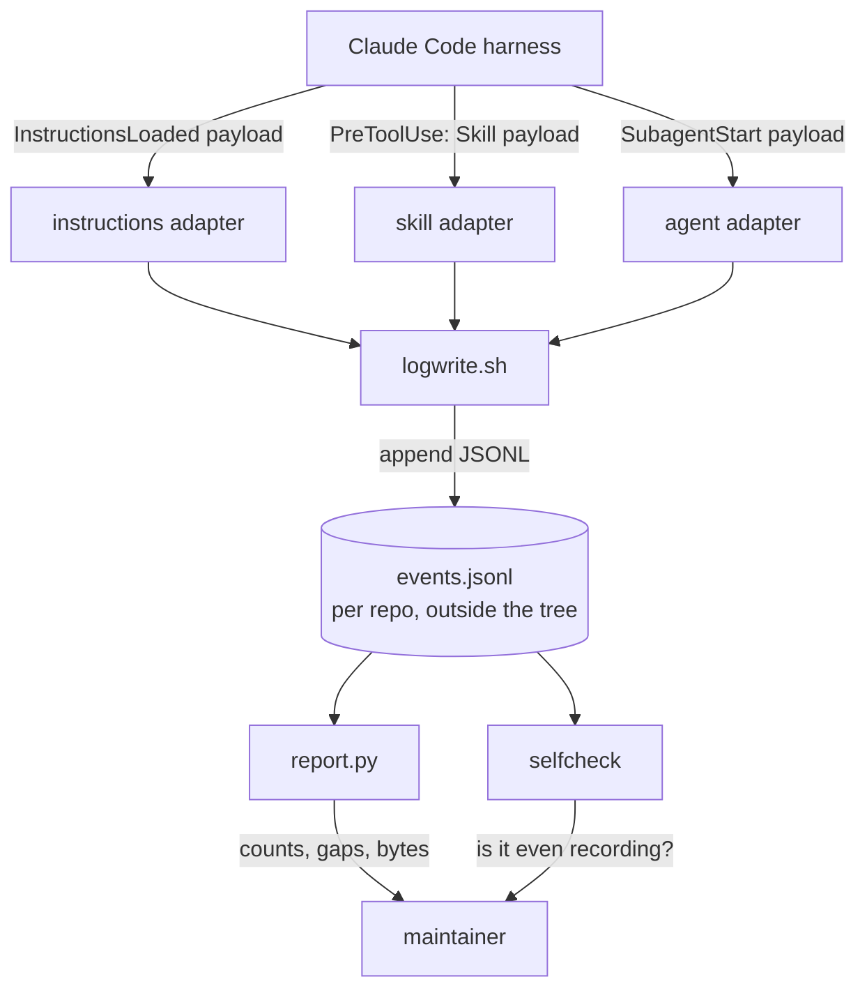
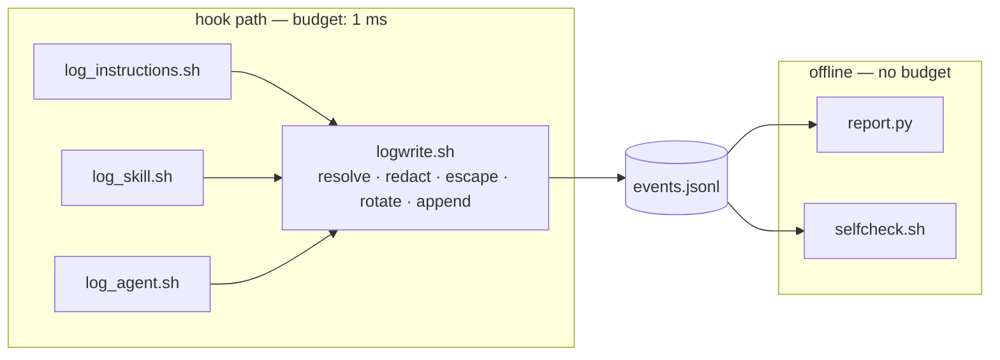

# Solution Design Document

## Validation Checklist

### CRITICAL GATES (Must Pass)

- [x] All required sections are complete
- [x] No [NEEDS CLARIFICATION] markers remain
- [x] Architecture pattern is clearly stated with rationale
- [x] **All architecture decisions confirmed by user** — ADR-1, ADR-3, ADR-6, ADR-7 confirmed at review 2026-09-06; the rest are forced by measurement and marked as such
- [x] Every interface has specification

### QUALITY CHECKS (Should Pass)

- [x] All context sources are listed with relevance ratings
- [x] Project commands are discovered from actual project files
- [x] Constraints → Strategy → Design → Implementation path is logical
- [x] Every component in diagram has directory mapping
- [x] Error handling covers all error types
- [x] Quality requirements are specific and measurable
- [x] Component names consistent across diagrams
- [x] A developer could implement from this design
- [x] Implementation examples use actual field names, verified against the shipped hook payloads
- [x] Complex logic includes a traced walkthrough with example data

---

## Output Schema

### SDD Status Report

| Field | Value |
|---|---|
| specId | 018-observability-load-and-fire-log |
| pattern | Thin adapters over one shared append-only writer, with offline analysis |
| keyComponents | `logwrite.sh`, three hook adapters, `report.py`, `selfcheck`, optional timing wrapper |
| externalIntegrations | Claude Code hook events (inbound); local filesystem (data). No network. |
| validationPassed | 15 |
| validationPending | 0 |

### ArchitectureSummary

| Field | Value |
|---|---|
| pattern | Thin adapters over one shared append-only writer, with all analysis offline |
| keyComponents | `logwrite.sh`, `log_instructions.sh`, `log_skill.sh`, `log_agent.sh`, `report.py`, `selfcheck.sh`, `timed-wrapper.sh` |
| externalIntegrations | Claude Code hook events (inbound only); local filesystem. No network, no service, no database |

### SectionStatus

| Section | Status | Detail |
|---|---|---|
| Constraints | COMPLETE | |
| Implementation Context | COMPLETE | |
| Solution Strategy | COMPLETE | |
| Building Block View | COMPLETE | |
| Interface Specifications | COMPLETE | |
| Implementation Examples | COMPLETE | |
| Runtime View | COMPLETE | |
| Deployment View | COMPLETE | Repo-local; no deployment pipeline exists to change |
| Cross-Cutting Concepts | COMPLETE | |
| Architecture Decisions | COMPLETE | 8 ADRs, 4 user-confirmed |
| Quality Requirements | COMPLETE | |
| Acceptance Criteria | COMPLETE | |
| Risks and Technical Debt | COMPLETE | |
| Glossary | COMPLETE | |

**nextSteps**: implement Phases 2 and 3 of `plan/`. T1.4 has run: configuration-only attribution is
empirically impossible, so F6 and F7 both route through `timed-wrapper.sh` (ADR-7). Phase 3's T3.4
was written around the now-dropped harness-ingest route and needs the maintainer's decision on how
to change it (see `plan/phase-3.md`).

### ADR Status

| ID | Name | Status |
|---|---|---|
| ADR-1 | Self-contained writer in the repo, not sourced from the plugin | CONFIRMED |
| ADR-2 | Own hook for instruction loading; telemetry cannot substitute | CONFIRMED (forced by measurement) |
| ADR-3 | Phase 1 covers instructions, skills and agents | CONFIRMED |
| ADR-4 | Redaction is ours; two independent switches, both default off | CONFIRMED (PRD business rule) |
| ADR-5 | No `jq` and no `date` in the hook path | CONFIRMED (forced by measurement) |
| ADR-6 | Report in Python, covered by pytest | CONFIRMED |
| ADR-7 | Per-hook attribution is not expressible as configuration; F6 and F7 both served by `timed-wrapper.sh` | CONFIRMED (measured, T1.4) |
| ADR-8 | Storage follows spec 011 ADR-7: per-repo, out of tree, rotated | CONFIRMED |

---

## Constraints

- **CON-1 — bash 3.2 and BSD userland.** The target is macOS: no `declare -A`, no `mapfile`, no
  `${var^^}`, no `EPOCHREALTIME`, and `date` has no `%N`. Anything using `date +%s%N` for elapsed
  time produces a non-numeric value and corrupts arithmetic without erroring.
- **CON-2 — the invoking shell is not necessarily bash.** Measured in this environment: the tool
  shell is `zsh` while bash is installed. Every script declares `#!/usr/bin/env bash`.
- **CON-3 — locale affects numeric formatting.** A comma-decimal locale corrupts formatted
  durations. Every script sets `LC_ALL=C` before formatting or arithmetic.
- **CON-4 — the hook protocol is load-bearing.** Hook stdout is parsed as JSON, stderr is surfaced,
  and exit code 2 blocks the tool call. Instrumentation must be transparent to all three.
- **CON-5 — fail open, always.** A logging failure must never change a hook's exit status. This repo
  has already shipped a hook that failed closed because `jq` exited non-zero under `set -e`.
- **CON-6 — no new runtime dependency.** No collector, no daemon, no database. `jq` may be used
  offline but never in the hook path (CON-7).
- **CON-7 — hook-path overhead budget.** ≤ 1 ms added per hook invocation, and ≤ 10 % of the fastest
  real hook's own runtime. Measured basis: `jq` costs ~21 ms per invocation, `date +%s%N` ~0.37 ms
  each, the bash `time` builtin ~0.
- **CON-8 — repo-local this phase.** Nothing ships to plugin consumers (PRD Won't Have).
- **CON-10 — text is bytes, not necessarily UTF-8.** POSIX paths may contain arbitrary byte
  sequences that are not valid UTF-8; JSON requires UTF-8. The writer replaces any such byte with
  `?` before it reaches a field, and `report.py` reads with `errors="replace"` and skips a line it
  cannot parse, counting the skips. A record that cannot be read is worse than one that is slightly
  lossy.
- **CON-11 — the instrument must not observe itself.** Hook execution is not itself a tool call, so
  none of the three registered events can be triggered by this feature's own scripts. This is true
  by construction rather than by guard; it is written down so a future reader does not have to
  re-derive it before adding a fourth event.
- **CON-9 — experimental contract.** The hook events and payload fields were read out of the shipped
  binary (2.1.252) and are absent from the documented event list. The design must degrade to
  "records nothing, says so" rather than to "records wrong things" if the contract moves. A concrete
  instance of exactly this drift, found rather than merely anticipated: `hook_name`'s actual format,
  `${event}:${toolName}`, differs from `${event}:${matcher}` as originally read out of the binary and
  recorded in the README (T1.4, see ADR-7).

## Implementation Context

### Required Context Sources

#### Code Context

```yaml
- file: plugins/tcs-git-helpers/scripts/lib/audit_log.sh
  relevance: CRITICAL
  why: "The append-only JSONL writer this design copies — rotation chain, printf JSON builder,
        fail-open discipline, frozen field order. Read before writing logwrite.sh."

- file: plugins/tcs-git-helpers/scripts/lib/plugin_data.sh
  relevance: CRITICAL
  why: "The per-repo data-directory resolver whose contract ADR-1 duplicates, including why the
        fallback must reproduce the harness's own shape rather than invent one."

- file: plugins/tcs-git-helpers/tests/bats/cache-path-parity.bats
  relevance: HIGH
  why: "The pattern for keeping a deliberate copy honest — the parity test ADR-1 requires."

- file: plugins/tcs-helper/hooks/hooks.json
  relevance: HIGH
  why: "Shape of hook registration, and the concrete case ADR-7 is about: two python3 commands
        share one UserPromptSubmit matcher, so a batch-level duration cannot attribute either."

- file: .gitignore
  relevance: MEDIUM
  why: "`.claude/` is already ignored wholesale; confirms the repo-local config path is safe even
        though the record itself lives outside the tree."

- file: docs/XDD/specs/011-tcs-git-helpers/solution.md
  relevance: HIGH
  why: "ADR-7 there is the storage decision this spec inherits rather than re-deriving."
```

#### Documentation Context

```yaml
- doc: docs/XDD/specs/018-observability-load-and-fire-log/README.md
  relevance: CRITICAL
  why: "Carries the measured harness facts — payload fields, load reasons, the unreachable span,
        the overhead table. Every number in this SDD traces there."

- url: https://code.claude.com/docs/en/hooks
  relevance: HIGH
  why: "Hook event contract and stdin payload shape."
```

### Implementation Boundaries

- **Must Preserve**: every existing hook's exit status, stdout and stderr; the `tcs-git-helpers`
  audit log and its data directory layout.
- **Can Modify**: this repo's own `.claude/settings.json` hook registration; new files under the
  paths in the directory map.
- **Must Not Touch**: `plugins/tcs-git-helpers/scripts/lib/*` (ADR-1 copies the contract rather than
  refactoring the plugin — that would widen scope beyond #153); any shipped plugin's `hooks.json`.

### External Interfaces

#### System Context Diagram



#### Interface Specifications

```yaml
inbound:
  - name: "InstructionsLoaded"
    type: hook event, JSON on stdin
    fields: [session_id, transcript_path, cwd, prompt_id, file_path, memory_type,
             load_reason, globs, trigger_file_path, parent_file_path]
    matcher: the load_reason — session_start | compact | nested_traversal | include | path_glob_match
    data_flow: "one invocation per instruction file loaded"
    criticality: HIGH

  - name: "PreToolUse (matcher: Skill)"
    type: hook event, JSON on stdin
    fields: [session_id, cwd, tool_name, tool_input]
    data_flow: "one invocation per skill call; the skill name is inside tool_input"
    criticality: MEDIUM

  - name: "SubagentStart"
    type: hook event, JSON on stdin
    fields: [session_id, cwd, agent_id, agent_type]
    data_flow: "one invocation per subagent dispatch"
    criticality: MEDIUM

outbound: []   # none — the design makes no network calls and starts no processes it does not own

data:
  - name: "Event record"
    type: append-only JSONL on local disk
    connection: shell append with rotation
    path: "${CLAUDE_PLUGIN_DATA-derived}/observability/events.jsonl"
    data_flow: "written by the hook adapters, read by report.py and selfcheck"
```

### Project Commands

```bash
# Discovered from .github/workflows/tests.yml and requirements-dev.txt
Install: python -m pip install --disable-pip-version-check -r requirements-dev.txt
Test:    pytest -q            # collected from the repo root; conftest.py sets collection rules
Test:    bats tests/bats/...  # shell suites, run on ubuntu and macos in CI
```

## Solution Strategy

- **Architecture Pattern:** thin adapters over one shared writer, with all analysis offline. Each
  hook adapter does the minimum — read stdin, pull two or three fields, hand them to the writer —
  and everything that costs real time (parsing, joining, counting) happens later against the file.
- **Integration Approach:** registration in this repo's own `.claude/settings.json` only. No plugin
  changes, no consumer impact (CON-8).
- **Justification:** the hook path is the one place where cost is charged to every tool call, so it
  gets the cheapest possible implementation; the report has no such constraint and can therefore be
  written for clarity and covered by tests. Splitting on that boundary is what lets both halves be
  right, instead of compromising the analysis to keep it shell-cheap.
- **Key Decisions:** ADR-1 (self-contained writer), ADR-5 (no `jq`/`date` in the hook path),
  ADR-8 (out-of-tree storage), ADR-7 (attribution is not expressible as configuration; `timed-wrapper.sh` serves both F6 and F7).

## Building Block View

### Components



| Component | Single responsibility | Owns |
|---|---|---|
| `logwrite.sh` | Turn a set of key=value pairs into one durable, redacted JSON line | path resolution, redaction, escaping, rotation, append, fail-open |
| `log_instructions.sh` | Adapt the `InstructionsLoaded` payload to the writer's vocabulary | which payload fields become which record fields |
| `log_skill.sh` | Adapt the `PreToolUse`/`Skill` payload | extracting the skill name from `tool_input` |
| `log_agent.sh` | Adapt the `SubagentStart` payload | agent identity and parentage |
| `report.py` | Answer the questions in PRD Feature 4 and 8 | counting, joining against the inventories below, byte accounting |
| `selfcheck.sh` | Say whether recording is on and working | distinguishing "nothing happened" from "nothing recorded" |
| `timed-wrapper.sh` | Per-hook duration, for both F6 and F7, installed only for an investigation | timing only; never redaction or schema |

**Responsibility matrix (PRD requirement → owning component):**

| PRD requirement | Owner |
|---|---|
| F1 Instruction-load record | `log_instructions.sh` → `logwrite.sh` |
| F2 One record, one schema | `logwrite.sh` |
| F3 Safe by default, detailed by choice | `logwrite.sh` |
| F4 The report | `report.py` |
| F5 Skill and agent firing | `log_skill.sh`, `log_agent.sh` |
| F6 Hook duration, measured directly | `timed-wrapper.sh` |
| F7 Per-hook attribution | `timed-wrapper.sh` |
| F8 Usage against inventory | `report.py` |
| "Recording state" tracking event | `selfcheck.sh` |

No requirement has two owners; no component is without one.

### Directory Map

```
.
├── .claude/
│   ├── settings.json                      # MODIFY: register the three adapters (repo-local, gitignored)
│   └── observability/                     # NEW: repo-local, not shipped
│       ├── logwrite.sh                    # NEW: the shared writer
│       ├── log_instructions.sh            # NEW: InstructionsLoaded adapter
│       ├── log_skill.sh                   # NEW: PreToolUse/Skill adapter
│       ├── log_agent.sh                   # NEW: SubagentStart adapter
│       └── selfcheck.sh                   # NEW: is it recording?
├── scripts/
│   └── observability/
│       └── report.py                      # NEW: offline analysis, pytest-covered
└── tests/
    ├── test_observability_report.py       # NEW: pytest over report.py
    └── bats/
        └── observability-writer.bats      # NEW: writer behaviour + data-dir parity with the plugin resolver
```

`.claude/` is already ignored wholesale by this repo's `.gitignore`, which suits a repo-local phase —
but note that `report.py` and its tests live under tracked paths precisely because they must be
reviewable and CI-covered. The scripts that run in the hook path stay untracked for this phase; a
later phase that ships them moves them into a plugin (out of scope, PRD Won't Have).

### Interface Specifications

#### Data Storage Changes

No database. One append-only file per repo, with a rotation chain:

```yaml
path: "<data_dir>/observability/events.jsonl"
data_dir resolution (ADR-1, mirroring plugin_data.sh):
  1. "$CLAUDE_OBSERVABILITY_DATA" if set   # tests redirect with it
  2. "$HOME/.claude/plugins/data/observability-<repo basename>"
  symlinks: the resolved directory is used as given; it is NOT realpath-resolved, matching
            plugin_data.sh. A symlinked ~/.claude therefore merges nothing that the harness
            would not already merge.
rotation: at 1024000 bytes → .jsonl → .1 → .2 → .3; .3 is overwritten, no .4 is ever created
concurrency: append-only single-line writes; two sessions interleave lines but never lose one.
             Rotation is NOT locked: if two sessions cross the threshold together, one generation
             can be lost. Accepted — this is a diagnostic record, not an audit trail, and a lock
             file would add a fork to the hot path (CON-7) to protect a rare, low-consequence case.
             Named here so it is a decision rather than a surprise.
```

**The two switches**, both read at hook-invocation time, both default off (ADR-4):

| Variable | Effect |
|---|---|
| `CLAUDE_OBSERVABILITY_ENABLED=1` | recording happens at all. Unset: the adapter exits 0 immediately and no directory or file is created |
| `CLAUDE_OBSERVABILITY_DETAIL=1` | adds the sensitive fields. Requires the first to have any effect — two affirmative steps, as the harness's own telemetry requires |

**Field length limit**: 256 BYTES, single-line, matching the precedent in `audit_log.sh`. Anything
longer is cut at 256 bytes and the record carries `truncated: true`.

**Correction**: an earlier draft of this line said "256 characters." It is bytes. `LC_ALL=C` (CON-3)
makes bash's length (`${#s}`) and slice (`${s:0:N}`) operators byte-oriented, so counting characters
instead would mean hand-decoding UTF-8 on every field of every record — a cost the hot-path budget
in CON-7 cannot absorb. `audit_log.sh`'s own 256-limit is effectively byte-counted the same way,
under the same `LC_ALL=C`, so this is the unit its precedent actually uses.

#### Application Data Models

One record shape, discriminated by `kind`. Field order is frozen — a reader that positionally
inspects a line must not break when a later kind adds fields.

```pseudocode
ENTITY: Event (NEW)                       # one JSON object per line
  COMMON FIELDS:
    ts:            string   # UTC, RFC3339, second precision
    kind:          enum     # instruction | skill | agent | hook | state
    session:       string   # session_id from the payload — joins records across kinds
    repo:          string   # git toplevel basename, not the absolute path (redaction, R-3)

  WHEN kind = instruction:
    path:          string   # repo-relative when inside the repo, else basename only (R-3)
    scope:         enum     # User | Project | Local | Managed  (payload's memory_type)
    reason:        enum     # session_start | compact | nested_traversal | include | path_glob_match
    parent:        string?  # present only when reason = include
    trigger:       string?  # present only when reason = path_glob_match
    bytes:         number?  # size of the loaded file. NOT in the harness payload — the adapter
                            # stats the path itself (one fork, see below). Kept in reduced mode:
                            # a size is not content.

  # Budget note for `bytes`: stat'ing the file costs one fork per instruction load. Instruction
  # loads happen at session start and on file reads — tens per session, not per tool call — so this
  # is outside CON-7's per-tool-call concern. It exists because the byte cost of the always-loaded
  # layer is the number #147 actually needs.
  #
  # Correction: this note used to call the `bytes` stat "the one deliberate fork in the hook path."
  # That is no longer true (see ADR-5's accepted deviation, below) — the common `ts` field above
  # already forks `date` once per record, because bash 3.2 has no fork-free wall clock. The `bytes`
  # stat is a second, independent fork, not the only one.
  #
  # Type/serialization gap, found at T2.1, flagged for phase 2 rather than resolved here: `bytes` is
  # typed `number?` here, but `logwrite.sh`'s writer is generic over key=value pairs and quotes every
  # value uniformly — there is no per-field type in the record shape. The record therefore carries
  # `"bytes":"2048"`, a quoted string, never a bare JSON number. `report.py` (ADR-6) is Python and
  # needs `int(...)` on it regardless of which side changes. Two ways to close this, deliberately not
  # chosen here: (a) T2.1 adds a numeric-field path to the writer — a change to the frozen record
  # shape this SDD pins above; or (b) `report.py` casts on read — no change to this shape at all.
  # (b) is the lower-cost option since it touches only the offline reader, but the choice is left
  # for phase 2 to make deliberately rather than have it fall out of whichever adapter is written
  # first.

  WHEN kind = skill:
    skill:         string   # from tool_input

  WHEN kind = agent:
    agent_type:    string
    agent_id:      string
    parent_agent:  string?

  WHEN kind = hook:         # populated only by timed-wrapper.sh — the harness-ingest route was
    hook_event:    string   # dropped after T1.4 found it requires a local OTLP receiver (ADR-7)
    matcher:       string
    ms:            number
    exit:          number
    scope_note:    enum     # batch | single — the wrapper always writes `single`; `batch` is kept
                            # in the enum only as a label for the harness's own aggregate warning,
                            # never written by this design

  WHEN kind = state:        # written by selfcheck, so an empty record is self-explaining
    enabled:       bool
    detail:        bool
    note:          string

  ALWAYS, when a free-text field was shortened:
    truncated:     bool     # explicit, never silent (PRD F2)
```

#### Integration Points

**Dropped, per the T1.4 finding (ADR-7).** The original design ingested the harness's own
`hook_execution_complete` records (carrying `total_duration_ms`) from a separate, deliberately
started, non-interactive diagnostic run. That route is abandoned: T1.4 found `OTEL_LOGS_EXPORTER=console`
inert in Claude Code 2.1.252 — it initializes zero log exporters and silently drops every event — so
a durable capture needs `OTEL_LOGS_EXPORTER=otlp` plus a listening receiver, i.e. a local collector
process. That collides with CON-6 ("no collector, no daemon, no database") and the PRD's Won't-Have
"no server component". `timed-wrapper.sh` now supplies hook duration directly, for both F6 and F7,
without that infrastructure.

`scope_note: batch | single` still means something even though nothing is ingested any more: with
the wrapper measuring one hook invocation at a time, every `kind: hook` record it writes carries
`scope_note: single`. `batch` remains in the enum only as a label for what the harness's own
aggregate "Slow PreToolUse hooks" warning reports — this design never writes it.

#### The two inventories — where the denominator comes from

A hook supplies only the numerator. Both "never loaded" and "never fired" need a list of what
*could* have. Neither was stated in the first draft of this SDD; both are now fixed, because two
implementers would otherwise produce different — and equally compliant — answers.

```yaml
instruction inventory:            # for PRD F4's "configured but never loaded"
  - the CLAUDE.md hierarchy from the repo root upward, plus every `@`-import reachable from it,
    resolved transitively
  - docs/ai/memory/*.md
  - .claude/rules/**/*.md and ~/.claude/rules/**/*.md
  - ~/.claude/CLAUDE.md
  method: filesystem walk at report time, not a maintained manifest — a manifest would drift, and
          the walk is exactly the set the loader itself can reach

skill and agent inventory:        # for PRD F8's "exists but never fired"
  - plugins/*/skills/*/SKILL.md            → skill name from the directory
  - plugins/*/agents/**/*.md               → agent name from frontmatter `name:`
  - .claude/agents/*.md                    → same
  method: glob at report time
```

The report states which inventory it used and how many entries it found, so a surprising coverage
figure can be traced to the denominator rather than assumed to be about usage.

**Possible future source, not designed in.** T1.4 found an undocumented `hook_registered` log event
that fires once per registered command at session start, carrying `hook_event`, `hook_matcher`,
`hook_source` and `hook_type` — a free load-time inventory of registered hooks. It carries no command
string, so it cannot by itself solve per-command attribution, but it could one day supply a hook
denominator analogous to the two inventories above. Recorded as a candidate; not implemented this
phase.

### Implementation Examples

#### Example: the writer's hot path, and why it looks like this

```bash
#!/usr/bin/env bash
# .claude/observability/logwrite.sh — sourced by the adapters, never executed directly.
export LC_ALL=C                      # CON-3: comma locales corrupt formatted numbers

# JSON-escape without forking. audit_log.sh forks `sed` per field; at 3 hook
# invocations per tool call that is the difference between fitting CON-7 and not.
_json_escape() {                     # bash 3.2 supports ${var//x/y}
  local s="$1"
  s="${s//\\/\\\\}"
  s="${s//\"/\\\"}"
  s="${s//$'\n'/\\n}"               # a literal newline in a path would split the record
  s="${s//$'\r'/\\r}"               # across two lines and break every reader
  s="${s//$'\t'/\\t}"
  printf '%s' "$s"
}
```

**Escaping goes further than this sketch, and further than `audit_log.sh`.** The shipped writer
also escapes every remaining C0 control byte (0x01–0x1F, beyond the `\n`/`\r`/`\t` shown above) as
`\u00XX`. That exceeds `audit_log.sh`'s own escaping scope, which handles only backslash and
double-quote — not even `\n`. The reason is the downstream reader, not caution for its own sake:
`report.py` (ADR-6) is Python, and `json.loads` rejects a raw control character inside a string
outright, where a more lenient tool would accept it. An unescaped control byte surviving into a
field would not just look odd on inspection — it would make `report.py` silently drop the whole
record as unparseable, which is exactly the "records wrong things" failure CON-9 says this design
must degrade away from, not into.

**Why not reuse `_audit_log` directly — corrected after tracing it.** An earlier draft of this SDD
said it forks `sed` once per field, "roughly nine processes per line". That describes its *fallback*
path only: with `jq` present, `_audit_log_build_jq` runs and there are **zero** `sed` forks. Traced
with `bash -x`, the real cost with `jq` available is `date`×1, `git`×2–3 (three when
`CLAUDE_PLUGIN_DATA` is unset, because `_plugin_data_dir` calls `git rev-parse` again — precisely
the Bash-subprocess case this feature runs in), `jq`×1, `mkdir`×1.

So the saving is **the `jq` fork (~21 ms), not the `sed` forks**, plus avoiding `date` for anything
time-related on BSD. That is still decisive against CON-7, but the reason had to be stated correctly
— an over-stated justification is one a later reader will check, disprove, and then distrust the
rest of. The *contract* is copied (ADR-8); the *implementation* is leaner; the parity test in ADR-1
pins the one thing that must not diverge: the resolved directory.

#### Example: extracting one field without `jq`

```bash
# Measured: jq ~21 ms; this ~0 ms (no fork).
_field() {                            # _field <payload> <key>
  local body="${1#*\"$2\":\"}"        # everything after "key":"
  [ "$body" = "$1" ] && { printf ''; return; }   # key absent
  printf '%s' "${body%%\"*}"          # up to the closing quote
}
```

**Traced walkthrough.** Payload (abridged, as delivered on stdin):

```json
{"session_id":"abc123","cwd":"/Volumes/Moon/Coding/the-custom-startup",
 "file_path":"/Volumes/Moon/Coding/the-custom-startup/docs/ai/memory/active.md",
 "memory_type":"Project","load_reason":"session_start"}
```

`_field "$payload" load_reason` →
`${1#*"load_reason":"}` yields `session_start"}` → `${body%%\"*}` yields `session_start`.

`_field "$payload" globs` → the prefix removal finds no match, so `$body` equals `$1`, the guard
fires, and the result is the empty string rather than the whole payload.

**Correction (the more serious of two found at T1.3) — the `_field` as specified above is
incomplete: it leaks on an empty key.** As written, `_field` has only the absent-key guard shown
above. Given `key = ""` and a payload that happens to carry a legal empty-string key —
`"":"value"`, which JSON permits and `tool_input` is free to emit — the prefix-removal pattern
becomes `*"":"`, which MATCHES: `$body` differs from `$1`, the absent-key guard never fires, and the
extractor returns that value instead of the empty string a caller asking for `""` should get.
Verified directly:

```
payload = {"tool_name":"Bash","tool_input":{"":"sk-ant-EMPTYKEYCANARY-42","command":"echo hi"},"session_id":"sess-empty"}
key     = ""
→ body != payload  (absent-key guard does NOT fire)
→ result: sk-ant-EMPTYKEYCANARY-42
```

The absent-key guard does not subsume this: it guards against a key that never appears at all, not
against an empty key name coincidentally matching unrelated structure. The required fix is a second,
independent guard placed BEFORE the prefix removal — `[ -n "$key" ] || return` (prints empty,
returns 0). No caller in this design legitimately asks for the empty key, so the guard costs
nothing real. **This empty-key guard is now part of the specified contract, not an optional
hardening** — an implementation of `_field` without it is non-compliant — and it is pinned by a
dedicated test.

**Correction (the second, smaller one) — the missing-guard consequence, as this walkthrough
originally described the absent-key guard alone, was overstated.** The text here used to say that
without that guard, the result is "a record containing the entire payload — including, on a Bash
`PreToolUse`, the full command line," and called that line "the redaction-critical line of the whole
design." Measured: with the absent-key guard removed, `_field` returns `{` for any well-formed JSON
payload, not the payload's full content — `${body%%\"*}` truncates at the first `"` byte, and a JSON
object's first quote sits immediately after the opening brace. The "entire payload" outcome is
reachable only for a payload with ZERO double-quote characters, i.e. malformed or non-JSON input.
The guard is still correct and worth keeping — it distinguishes an absent key from an empty value,
and keeps a bare `{` out of records — but its consequence is corrected here rather than left
standing overstated. (This is the same class of error the spec's own validation round already
recorded about an earlier overstated justification — see this file's `_audit_log` `sed`-forks
correction, above, and the README's Validation round entry.) Both guards — absent-key and
empty-key — now have their own tests.

The extractor is implemented under the name `_observability_field`, not `_field` as sketched above —
see Building Block View / reduction mechanism, below, for why the naming matters to phase 2.

#### Test Examples as Interface Documentation

```bash
# tests/bats/observability-writer.bats
@test "a missing key yields empty, never the whole payload" { ... }
@test "reduced mode drops Bash arguments but keeps the program" { ... }
@test "a write failure leaves the caller's exit status untouched" { ... }
@test "resolved data dir matches the plugin resolver for the same repo" { ... }   # ADR-1 parity
@test "rotation caps at .3 and never creates .4" { ... }
```

## Runtime View

### Primary Flow: an instruction file is loaded

1. Harness loads `docs/ai/memory/active.md` at session start.
2. Harness sees a registered `InstructionsLoaded` hook (`hasInstructionsLoadedHook`) and fires it,
   passing the payload on stdin with `load_reason: session_start`.
3. `log_instructions.sh` reads stdin once into a variable, extracts `file_path`, `memory_type`,
   `load_reason`, `session_id` by parameter expansion, and converts the path to repo-relative.
4. `logwrite.sh` checks `CLAUDE_OBSERVABILITY_ENABLED`; if unset it exits 0 having done nothing.
5. It resolves the data directory, rotates if oversized, escapes, and appends one line.
6. Any failure in 4–5 is swallowed; the adapter exits 0 regardless (CON-5).

### Error Handling

| Error | Behaviour |
|---|---|
| Data directory not creatable | swallow, exit 0; `selfcheck` reports it later |
| Disk full / append fails | swallow, exit 0 |
| Payload malformed or field absent | record what could be extracted; never emit the raw payload as a field value |
| Not inside a git repo | fall back to `$PWD` basename, as `_audit_log` does |
| Rotation fails mid-chain | swallow; the next write appends to whatever exists |
| Two sessions rotate simultaneously | a generation may be lost; accepted and documented rather than locked (see Data Storage) |
| A path contains non-UTF-8 bytes | the writer replaces them before the field is built (CON-10); `report.py` reads with `errors="replace"` and counts unparseable lines instead of failing |
| A pathologically large payload | extraction is a string scan over the whole payload, so cost grows with payload size. Bounded in practice by the harness's own payloads; if a hook event ever carries megabytes, the budget in CON-7 no longer holds and the adapter for that event must be reconsidered. Stated rather than guarded — a guard would cost more than the case is worth |
| Enable switch unset | no file is created at all — absence is the "off" signal `selfcheck` reads |

### Complex Logic: what reduced mode keeps

```
GIVEN a record about to be written
WHEN detail mode is off (default)
THEN  keep:  event identity, timing, scope, reason, skill/agent names,
             the program name of a Bash call (argv[0] only),
             file paths made repo-relative,
             `bytes` — a file's size is metadata, not content, and PRD F4's headline
             number cannot be produced without it in the only mode this phase enables
      drop:  Bash arguments, file contents, hook command strings,
             transcript_path, absolute cwd, any prompt or response text
```

The keep/drop split mirrors the harness's own `bash_command` (always) versus `full_command` (gated)
distinction — chosen because it is the split someone has already thought about, and because keeping
the verb is what makes a reduced record diagnostic rather than merely safe.

#### The reduction mechanism — binding on phase 2

The table above says WHAT reduced mode keeps and drops; it does not say HOW an adapter marks a field
as sensitive. That gap was found at T1.3: the SDD had specified a category table with no mechanism
underneath it, and phase 1's implementer had to invent one. It is written here now, as the interface
every phase-2 adapter must use, so the three adapters do not each invent a third, incompatible
convention.

```
GIVEN a key=value pair an adapter hands to the writer (`_observability_write`)
THE FIELD SURVIVES REDUCED MODE UNLESS EITHER LAYER BELOW MARKS IT SENSITIVE:

  1. PRIMARY — an explicit `detail:` key prefix. An adapter marks a field sensitive by naming it
     `detail:<field>` (e.g. `detail:command`). Such a field is written only when detail mode is on;
     otherwise it is dropped entirely — the prefix is stripped before the field name is even
     considered for writing, so it never reaches the record either as a name or as a value.

  2. FAIL-SAFE — a bare-name deny list, for an adapter that forgets to prefix a field it should
     have. Exact match on the bare field name, checked after the `detail:` prefix (if any) is
     stripped:
         command  full_command  hook_command  content  file_content  transcript_path
         cwd  prompt  prompt_text  response  response_text
     A name on this list is dropped in reduced mode even without the `detail:` prefix.
```

Both layers are independently load-bearing — verified by mutation: disabling either one alone (the
prefix check, or the deny-list check) leaks a field the other does not catch. Neither is redundant
with the other.

**Limitation that matters for phase 2: the deny list is an EXACT match on bare field names.** An
adapter that emits a field named `new_string` (Edit's replacement text) or a nested-looking name
such as `tool_input.command` bypasses the fail-safe entirely — neither string is in the list above,
and the list does no pattern or substring matching. Such a field would only be caught by the
`detail:` prefix.

**Recommendation binding on phase 2, carried forward from this finding:** every field the keep/drop
table forbids must be passed to `_observability_write` with the `detail:` prefix. The deny list is a
backstop against an adapter that forgets — it is not the interface, and it must not be relied on as
one. (See `plan/phase-2.md` for the same instruction placed where phase 2's implementer will read
it directly.)

The function is named `_observability_field`, not `_field` as the earlier sketch in Implementation
Examples wrote it — deliberately, to avoid a silent collision with a name a sourced phase-2 adapter
might define for itself, the same reasoning that renamed `_json_escape` to
`_observability_json_escape`. **Phase 2 adapters must call `_observability_field`, not reimplement
extraction.**

## Deployment View

### Single Application Deployment

There is no deployment pipeline to change — this phase is repo-local (CON-8). The four fields the
template asks for, stated for completeness:

- **Environment**: the maintainer's own machine only. No staging, no CI runtime, no consumer repo.
- **Configuration**: hook registration in this repo's `.claude/settings.json`; behaviour governed by
  `CLAUDE_OBSERVABILITY_ENABLED` and `CLAUDE_OBSERVABILITY_DETAIL`, both unset by default.
- **Dependencies**: bash and coreutils for the hook path; Python 3.11 and the repo's existing
  `requirements-dev.txt` for the report. Nothing new is introduced.
- **Performance**: governed by CON-7 and verified at T1.5 and T3.6 on macOS.

**Uninstalling** is two steps: remove the three entries from `.claude/settings.json`, and delete the
data directory. Both are documented for the user by the task added under Phase 2.

## Cross-Cutting Concepts

### Pattern Documentation

No existing `docs/patterns/*.md` applies to this feature, and none is created by it. The patterns it
does reuse are carried by code and by another spec rather than by a pattern document — the
append-only JSONL writer and its resolver in `plugins/tcs-git-helpers/scripts/lib/`, and spec 011's
ADR-7. Recorded explicitly so the absence reads as a decision rather than an omission.

### System-Wide Patterns

- **Fail open, everywhere.** Every failure path in the hook returns 0. The precedent for why:
  `jq` under `set -e` once made a hook fail closed in this repo, which Claude Code reads as "deny
  the tool call".
- **Redaction at the boundary.** Reduction happens in the writer, before any field reaches the
  file — never in the reader. A record that was written in full cannot be un-written.
- **Copy the contract, test the copy.** ADR-1 duplicates the resolver; the bats parity test is what
  makes that duplication safe rather than a future split-brain.
- **bash 3.2 dialect only.** No associative arrays, no `mapfile`, no `${var^^}`, no process
  substitution in the hook path.

### User Interface & UX

Not applicable — there is no UI. The two human-facing surfaces are `report.py`'s text output and
`selfcheck.sh`'s status line, both specified under their components.

## Architecture Decisions

| ID | Decision | Rationale | Trade-off accepted |
|---|---|---|---|
| **ADR-1** | A self-contained writer under `.claude/observability/`, duplicating `plugin_data.sh`'s resolver contract, with a bats parity test | `CLAUDE_PLUGIN_ROOT`/`CLAUDE_PLUGIN_DATA` do not reach Bash-tool subprocesses, and the plugin cache resolves stale within a session — both already documented in this repo. Sourcing from the plugin would make the hook silently write nowhere | Two copies of one resolver. Mitigated by the parity test, which is the same mitigation spec 011 chose for the same reason |
| **ADR-2** | Our own hook for instruction loading; harness telemetry cannot substitute | Measured: the `InstructionsLoaded` payload never enters telemetry — only "a batch ran" does. The `claude_code.hook` span that would have carried more is unreachable (`vj()` is hard-coded false) | We depend on an experimental event. CON-9 covers the degradation path |
| **ADR-3** | Phase 1 registers all three adapters | They share one writer, so the marginal cost of skills and agents is one config entry each, and it delivers the "which skills ever fire" number immediately | Slightly wider first cut than the Must-Have alone |
| **ADR-4** | Redaction is implemented by us, with two independent switches, both default off | The `OTEL_LOG_*` family governs only Anthropic's own export; hook stdin arrives complete regardless. A design that assumed otherwise would record everything while looking safe | Redaction logic we must test ourselves — hence the dedicated bats cases |
| **ADR-5** | No `jq` and no `date` in the hook path | Measured: `jq` ~21 ms per call — 25× the budget, and enough to trip the harness's own slow-hook warning *because of the instrument*. `date +%s%N` is additionally broken on BSD | Hand-rolled extraction and escaping, which is why `_field`'s absent-key guard is separately tested. **Accepted deviation, found at T1.2**: the `ts` field still costs one `date -u` fork per record. bash 3.2 has no fork-free wall clock — `printf '%()T'` needs bash 4.2, `EPOCHSECONDS` needs 5.0 — so a wall-clock timestamp string cannot be produced for free under CON-1's target shell. Measured: `date` ≈ 370 µs, `git rev-parse` ≈ 567 µs, so one record already costs ~937 µs of CON-7's 1 ms budget before script startup even runs, and T2.1's `bytes` stat adds a fourth fork on top of that. This is a deviation from ADR-5's own "no `date`" title, named here rather than left to be discovered by re-reading the code |
| **ADR-6** | `report.py` in Python, covered by pytest | Runs offline where CON-7 does not apply; the repo already runs pytest on both OSes in CI, so the analysis becomes testable rather than merely runnable | A second language in the feature. Justified by the hot/cold split the strategy is built on |
| **ADR-7** | Per-hook attribution is not expressible as configuration; F6 and F7 are both served by one `timed-wrapper.sh` | T1.4's verification spike ran six hook arrangements (A–F) through nested `claude -p` sessions against a local OTLP receiver. Decisive: arrangement B — two entries with two *distinct* matcher strings still collapse into one `hook_execution_complete` record with `num_hooks=2`. Also found: `hook_name` is `${event}:${toolName}`, not `${event}:${matcher}` (D, E: matchers `Read\|Glob` and `.*` both report `PreToolUse:Read`); hooks in a group run in parallel, so subtraction cannot recover per-hook duration either (F: two 0.40s hooks total 406 ms, not ~800). Reproducible from the artifacts referenced in the README's T1.4 section | The harness-ingest route for F6 is dropped: reliable capture now needs a local OTLP receiver, which the wrapper avoids. F6's original promise — durations "without installing anything into the hook path" — is given up; F6 and F7 collapse into one deliverable |
| **ADR-8** | Storage per repo, outside the working tree, rotated. **Ground truth is `audit_log.sh` itself, not spec 011's ADR-7 text** | Out-of-tree is structurally safe against `git add -A`; per-repo keeps client contexts apart; size rotation needs no scheduled job. Note a pre-existing drift found while validating this spec: spec 011's ADR-7 text says "1 MB → `.1`/`.2`, 2-rotation retention", while the shipped `audit_log.sh` implements a three-generation chain capped at `.3`. This spec follows the code | Cross-repo questions ("which skills do I use anywhere") need the report to aggregate several files later. The spec-011 text/code drift is reported, not fixed here — fixing it is spec 011's business |

## Quality Requirements

| Quality | Requirement | How it is verified |
|---|---|---|
| Performance | ≤ 1 ms added per hook invocation; ≤ 10 % of the fastest real hook | Benchmark harness from the research pass, re-run on macOS before sign-off |
| Correctness | An absent payload key never yields the whole payload | Dedicated bats case — the redaction-critical path |
| Safety | Recording failure never alters a hook's exit status, stdout or stderr | bats case asserting exit status and stream contents through the wrapper |
| Privacy | Reduced mode contains no Bash arguments, file contents, hook command strings or absolute home paths | bats case scanning a produced record against a deny-list |
| Durability | The record never exceeds 4 generations; no `.4` is created | bats rotation case, mirroring the existing audit-log suite |
| Honesty | An empty record reports "not recording", never "nothing loaded" | pytest case over `report.py` with an empty and a stale input |

## Acceptance Criteria

| # | Criterion | Traces to |
|---|---|---|
| SDD-AC-1 | Given `CLAUDE_OBSERVABILITY_ENABLED` is unset, when a session runs, then no data directory and no file are created | PRD F1, F3 |
| SDD-AC-2 | Given the switch is set, when a session starts, then one `kind: instruction` record exists per loaded file, each with `reason: session_start` | PRD F1 |
| SDD-AC-3 | Given a rule with `globs`, when a matching file is read, then a record with `reason: path_glob_match` and a populated `trigger` exists | PRD F1 |
| SDD-AC-4 | Given an imported instruction file, when it loads, then the record carries `reason: include` and a populated `parent` | PRD F1 |
| SDD-AC-5 | Given records of several kinds, when they are read, then each parses as one JSON object and carries `ts`, `kind`, `session`, `repo` | PRD F2 |
| SDD-AC-6 | Given a field over the length limit, when written, then it is shortened and `truncated: true` is set | PRD F2 |
| SDD-AC-7 | Given the file exceeds 1024000 bytes, when the next record is written, then the chain rotates and no `.4` exists | PRD F2 |
| SDD-AC-8 | Given detail mode off, when a Bash tool call is recorded, then the program name is present and no argument is | PRD F3 |
| SDD-AC-9 | Given detail mode off, when any record is written, then it contains no file content, no hook command string and no `transcript_path` | PRD F3 |
| SDD-AC-10 | Given any mode, when records are written, then their path is outside the repository working tree | PRD F3 |
| SDD-AC-11 | Given a payload missing a key, when the adapter extracts it, then the result is empty and the raw payload never appears as a field value | PRD F3 (privacy), CON-5 |
| SDD-AC-12 | Given the data directory is unwritable, when a hook fires, then the hook's exit status, stdout and stderr are unchanged | PRD F3, CON-4, CON-5 |
| SDD-AC-13 | Given a record, when the report runs, then it lists loaded files with counts and reasons, and names configured files that never loaded | PRD F4 |
| SDD-AC-14 | Given a record, when the report runs, then it states the measured byte cost of the always-loaded layer separately from conditional loads | PRD F4 |
| SDD-AC-15 | Given an empty or stale record, when the report runs, then it reports the recording state rather than presenting emptiness as a finding | PRD F4 |
| SDD-AC-16 | Given a session with skill and agent activity, when it ends, then `kind: skill` and `kind: agent` records exist naming the skill and the agent type | PRD F5 |
| SDD-AC-17 | Given a hook run under `timed-wrapper.sh`, when the report shows its duration, then the record is labelled `scope_note: single` and traceable to that one hook invocation | PRD F6 |
| SDD-AC-18 | Given the shipped inventory and a record, when the report runs, then it names skills and agents that exist but never fired | PRD F8 |
| SDD-AC-19 | Given the resolver, when run against the same repo as the plugin's resolver, then both produce the same directory | ADR-1 |
| SDD-AC-20 | Given the verification task from ADR-7 has run, when its result is recorded, then Feature 7's mechanism is chosen with evidence — and if `one matcher per command` cannot produce separate measurement groups, that finding is written down rather than the option quietly dropped | PRD F7, ADR-7 |

## Risks and Technical Debt

### Known Technical Issues

- The `_field` extractor is a string operation, not a JSON parser. It is correct for the flat,
  machine-generated payloads in scope and wrong for nested structures or escaped quotes inside
  values. The skill adapter reads `tool_input`, which *is* nested — so it extracts only the scalar
  it needs and must never be extended to walk that object without switching to a real parser
  offline.
- **The adversarial case, named explicitly (implicit above, but not previously spelled out):** the
  extractor matches the FIRST occurrence of `"key":"` anywhere in the payload. A payload whose VALUE
  happens to contain that exact byte sequence — for example an escaped quote inside a Bash command
  line, followed by text that reads `"load_reason":"` — matches inside the value rather than at the
  real key, and the wrong value is extracted. The redaction guarantee still holds: the result is
  always some value taken from within the payload, never the payload itself, so nothing is leaked
  that was not already present. But the record can be made to report a wrong value for a real key.
  Accepted for the same reason as the point above — a real parser belongs offline (CON-7), not in
  the hot path — but a failure mode this specific should be named, not left to be rediscovered as a
  surprise.
- Two concurrent sessions in one repo append to one file. Single-line appends under the pipe-buffer
  size are effectively atomic on both target platforms, but this is an assumption, not a guarantee;
  the `session` field is what makes interleaving harmless.

### Technical Debt

- Deliberate duplication of the data-directory resolver (ADR-1), repaid if and when this feature
  moves into a plugin.
- The scripts in the hook path are untracked this phase (CON-8), so they carry no CI coverage of
  their own beyond the bats suite that exercises them from a tracked test file.

### Implementation Gotchas

- **`date +%s%N` is not an option** — BSD prints a literal `N` and the arithmetic silently produces
  garbage. Use the bash `time` builtin if timing is ever added here.
- **Set `LC_ALL=C`** before any numeric formatting; a comma locale corrupts durations silently.
- **Declare `#!/usr/bin/env bash`** — the invoking shell in this environment is `zsh`.
- **Never write to stdout** from a hook adapter; stdout is parsed as JSON by the harness.
- **`hasInstructionsLoadedHook`** means the harness does no eager-load work while no hook is
  registered — which is what makes "costs nothing when off" true. Do not register a no-op hook
  "just in case"; that switches the cost back on.

## Glossary

### Domain Terms

| Term | Definition | Context |
|---|---|---|
| **Load reason** | Why an instruction file entered context | One of `session_start`, `compact`, `nested_traversal`, `include`, `path_glob_match` |
| **Denominator** | The set of things that *could* have loaded or fired | Supplied by the two inventories, never by a hook |
| **Reduced mode** | The default: identity, timing and verb kept; content and arguments not | `CLAUDE_OBSERVABILITY_DETAIL` unset |
| **Detail mode** | The second switch, adding sensitive fields | Off by default; requires recording to be on first |

### Technical Terms

| Term | Definition | Context |
|---|---|---|
| **Adapter** | A hook script that translates one event payload into writer arguments | Deliberately thin; anything more belongs in the report |
| **Batch (of hooks)** | All hook commands sharing one `(event, matcher)` pair | The unit the harness times; T1.4 established this cannot be split by configuration, which is why per-hook attribution needs `timed-wrapper.sh` |
| **Record** (or **entry**) | One JSON line in `events.jsonl` | The two words are interchangeable; both mean exactly one line |
| **The log** | The whole of `events.jsonl` plus its rotated generations, read as one sequence | Used wherever the collective is meant. Earlier drafts overloaded "record" for both; this settles it |
| **Fail open** | A failure leaves the caller's exit status, stdout and stderr untouched | The opposite failure once made a hook in this repo deny tool calls |

### API/Interface Terms

| Term | Definition | Context |
|---|---|---|
| `CLAUDE_OBSERVABILITY_ENABLED` | Switch that turns recording on | Unset by default; nothing is written and no directory is created |
| `CLAUDE_OBSERVABILITY_DETAIL` | Switch that adds sensitive fields | Unset by default; requires the first switch to have any effect |
| `CLAUDE_OBSERVABILITY_DATA` | Data-directory override | Set by tests to redirect the record; mirrors `CLAUDE_PLUGIN_DATA`'s role |
| `kind` | Discriminator on every record | `instruction` \| `skill` \| `agent` \| `hook` \| `state` |
| `scope_note` | States what a duration covers | `batch` \| `single` — the wrapper always writes `single`; `batch` remains only as a label for the harness's own aggregate warning, never written by this design |
