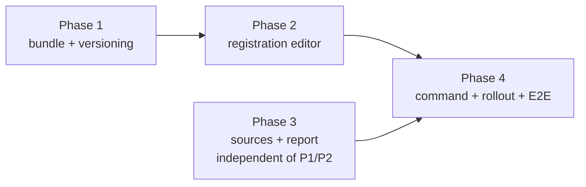

# Implementation Plan

## Validation Checklist

### CRITICAL GATES (Must Pass)

- [x] All `[NEEDS CLARIFICATION: ...]` markers have been addressed
- [x] All specification file paths are correct and exist
- [x] Each phase follows TDD: Prime → Test → Implement → Validate
- [x] Every task has verifiable success criteria
- [x] A developer could follow this plan independently

### QUALITY CHECKS (Should Pass)

- [x] Context priming section is complete
- [x] All implementation phases are defined with linked phase files
- [x] Dependencies between phases are clear (no circular dependencies)
- [x] Parallel work is properly tagged with `[parallel: true]`
- [x] Activity hints provided for specialist selection `[activity: type]`
- [x] Every phase references relevant SDD sections
- [x] Every test references PRD acceptance criteria
- [x] Integration & E2E tests defined in final phase
- [x] Project commands match actual project setup

---

## Output Schema

### PLAN Status Report

| Field | Value |
|---|---|
| specId | 019-observability-rollout-across-active-repos |
| title | Observability rollout across active repositories |
| status | COMPLETE |
| totalTasks | 20 |
| parallelTasks | 2 |
| specReferences | 75 |
| clarificationsRemaining | 0 |

### PhaseStatus

| Phase | Name | Status | Tasks | File |
|---|---|---|---|---|
| 1 | The bundle and its versioning | COMPLETE | 5 | [phase-1.md](phase-1.md) |
| 2 | The registration editor | COMPLETE | 6 | [phase-2.md](phase-2.md) |
| 3 | Reading several records | COMPLETE | 6 | [phase-3.md](phase-3.md) |
| 4 | The command, the rollout, and the gates | COMPLETE | 3 | [phase-4.md](phase-4.md) |

`COMPLETE` here means the phase is fully **defined**. Implementation status is the `status:` field in
each `phase-N.md`, which stays `pending` until that phase is executed.

---

## Specification Compliance Guidelines

### How to Ensure Specification Adherence

1. **Before each phase**: read the phase's Specification References in full.
2. **During implementation**: cite the ADR in a comment wherever a rule looks like defensive noise —
   the atomic-replace, the git-ignore refusal and the namespace ownership check all read as
   paranoia until you know which failure each one prevents.
3. **After each task**: run the phase's tests plus the repo-wide suites.
4. **Phase completion**: verify the phase's acceptance criteria against `solution.md`.

### Deviation Protocol

1. Document the deviation with rationale.
2. Obtain approval before proceeding.
3. Update the SDD when the deviation improves the design.
4. Record all deviations in this plan for traceability.

**One deviation is anticipated.** T2.2 may find that the harness rejects or strips an unknown key
inside a hook entry. That would not affect the chosen design — ADR-5 deliberately proves ownership by
path namespace rather than by an added key — but if the harness turns out to *preserve* unknown keys,
that is worth recording in the SDD as a stronger ownership option for a future spec, not adopting
mid-flight.

## Metadata Reference

- `[parallel: true]` — tasks that can run concurrently
- `[ref: document/section]` — link to a specification section
- `[activity: type]` — activity hint for specialist selection

### Success Criteria

**Validate** = process verification ("did we follow TDD?")
**Success** = outcome verification ("does it work correctly?")

---

## Context Priming

*GATE: Read all files in this section before starting any implementation.*

**Specification**:

- `docs/XDD/specs/019-observability-rollout-across-active-repos/requirements.md` — the PRD
- `docs/XDD/specs/019-observability-rollout-across-active-repos/solution.md` — the SDD, 8 ADRs
- `docs/XDD/specs/018-observability-load-and-fire-log/solution.md` — the recorder being extended
- `docs/XDD/specs/012-tcs-git-helpers-hook-runtime-contract/solution.md` — the bundle-versioning
  pattern this plan adopts, with its own 8 ADRs

**Prior art that must be read before writing the equivalent here**:

- `modules/satori/scripts/install-hooks.sh` — the settings-merge precedent. Copy its merge
  (`:70-87`), not its write (`:97-99`, truncate-then-rewrite).
- `plugins/tcs-git-helpers/skills/git-setup/SKILL.md` — the install sequence and why the lock comes
  before detection rather than before writing.
- `plugins/tcs-git-helpers/skills/git-setup/lib/{install_files,detect_conflicts,lock,with_gha}.sh`
- `plugins/tcs-git-helpers/scripts/lib/drift_check.sh` — note the different parent: this one
  really is under `scripts/lib/`, the others are not
- `plugins/tcs-git-helpers/tests/bats/install-files.bats` — the canonical target-repo test shape
- `plugins/tcs-git-helpers/tests/fixtures/repos/build.sh` — the named-scenario fixture builder

**Key Design Decisions** (full text in `solution.md`):

- **ADR-2**: the bundle lives at `$HOME/.claude/observability/` and is referenced by `$HOME` in the
  command string. Verified 2026-09-08: `$HOME` expands in a hook command, and `$0` resolves fully.
- **ADR-4**: merge like satori, write unlike it. Nine gaps found in that precedent; seven closed here, two named as accepted costs. Atomicity first.
- **ADR-5**: ownership is the path namespace, because JSON has nowhere to put a version banner.
- **ADR-7**: split by the record's `repo` field. Only firing coverage is unioned.

**Implementation Context**:

```bash
pytest -q                                  # the report and sources tests
bats plugins/*/tests/bats                  # shell suites, including the new setup suite
python3 scripts/observability/report.py    # the reader

# NOTE (spec-018, carried): `report.py` takes the data directory as `--data-dir`, NOT from
# $CLAUDE_OBSERVABILITY_DATA. Pointing the env var at it silently reports on the wrong record.
# NOTE: `selfcheck.sh` reports "cannot record" under Claude's Bash sandbox, which denies writes
# beneath ~/.claude/plugins. Run it with the sandbox disabled before believing it.
# NOTE: bats fixtures that create and exec a file pay macOS's first-exec cost (151-286 ms).
# Warm a fixture in setup() before timing anything; do not widen the bound.
```

---

## Implementation Phases

Each phase is defined in a separate file. Tasks follow red-green-refactor: **Prime**, **Test**,
**Implement**, **Validate**.

> **Tracking Principle**: track logical units that produce verifiable outcomes. The TDD cycle is the
> method, not separate tracked items.

- [ ] [Phase 1: The bundle and its versioning](phase-1.md)
- [ ] [Phase 2: The registration editor](phase-2.md)
- [ ] [Phase 3: Reading several records](phase-3.md)
- [ ] [Phase 4: The command, the rollout, and the gates](phase-4.md)

**Phase dependencies** — phases 1 and 2 build the writing side, phase 3 the reading side. They touch
disjoint files and can proceed independently; phase 4 needs all three.



**Why phase 3 is genuinely independent**, not merely nice to parallelise: it touches
`scripts/observability/*.py` and `tests/test_*.py` only, while phases 1 and 2 touch
`plugins/tcs-helper/skills/observability-setup/` and its bats suite. No file is written by both
sides, so the two can run concurrently without a merge conflict or an ordering assumption.

---

## Plan Verification

| Criterion | Status |
|-----------|--------|
| A developer can follow this plan without additional clarification | ✅ |
| Every task produces a verifiable deliverable | ✅ |
| All PRD acceptance criteria map to specific tasks | ✅ |
| All SDD components have implementation tasks | ✅ |
| Dependencies are explicit with no circular references | ✅ |
| Parallel opportunities are marked with `[parallel: true]` | ✅ |
| Each task has specification references `[ref: ...]` | ✅ |
| Project commands in Context Priming are accurate | ✅ |
| All phase files exist and are linked from this manifest | ✅ |

### Coverage map — SDD acceptance criteria to tasks

Corrected 2026-09-08 after a completeness audit found five rows naming a task whose body did not
exercise the criterion. A map is only worth having if its rows are true, so the audit's corrections
are applied here and the reasons kept, rather than the rows quietly rewritten.

| SDD-AC | Task | Note |
|---|---|---|
| 1 | T2.2, T4.1 | Was mapped to T2.3, whose tests are all JSON merge behaviour and never mention repository detection |
| 2, 3, 5 | T2.3 | |
| 4 | T2.2, T4.1 | Detection classifies; **T4.1 asserts the command's own exit 0**, which is the half nothing tested |
| 6 | T2.2 | |
| 7 | T2.4 | Now includes the "already configured" report string, not only the no-op |
| 8 | T1.2, T2.4 | T2.4 now asserts the update-versus-install wording, not only the mechanics |
| 9, 11 | T2.5 | |
| 10 | T2.3 | Was mapped to T2.5, which tests truncation, backup, interruption and the lock — no encoding case |
| 12, 13, 14 | T2.4 | |
| 15 | T1.3, T4.1 | T1.3 tests the comparator; **T4.1 asserts drift actually surfaces through `status`**, which the comparator being correct does not guarantee |
| 16, 17, 18 | T3.2 | |
| 19 | T3.1 | Was mapped to T3.3; T3.1 is the task that keys on `(repo, path)` and already cited AC-19 itself |
| 20 | T3.3 | |
| 21, 22, 23 | T3.4 | |
| 24 | T3.5 | |

### Coverage map — PRD features to phases

| PRD feature | Phases |
|---|---|
| F1 setup | 1, 2, 4 |
| F2 removal | 2 |
| F3 locations list | 3 |
| F4 cross-repository report | 3 |
| F5 liveness | 1 (drift half), 3 (record half) |
| F6 assisted discovery *(Could)* | 3, T3.5 optional scope |
